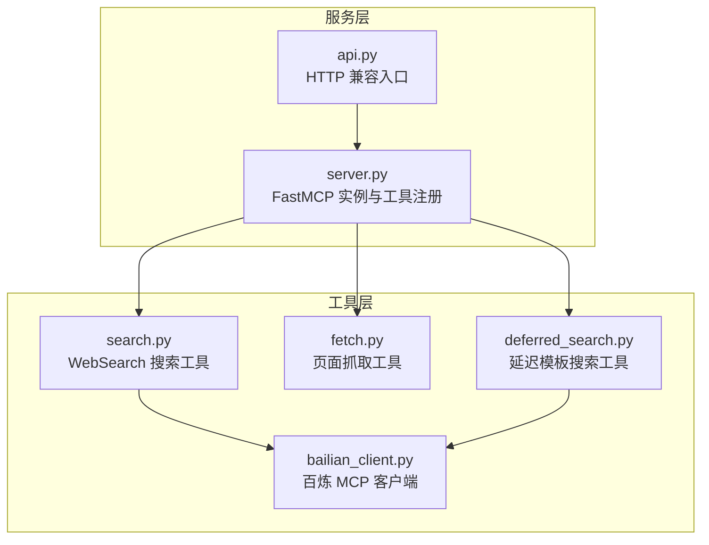
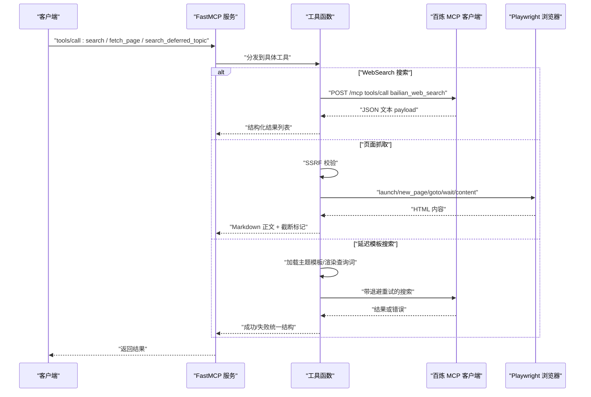
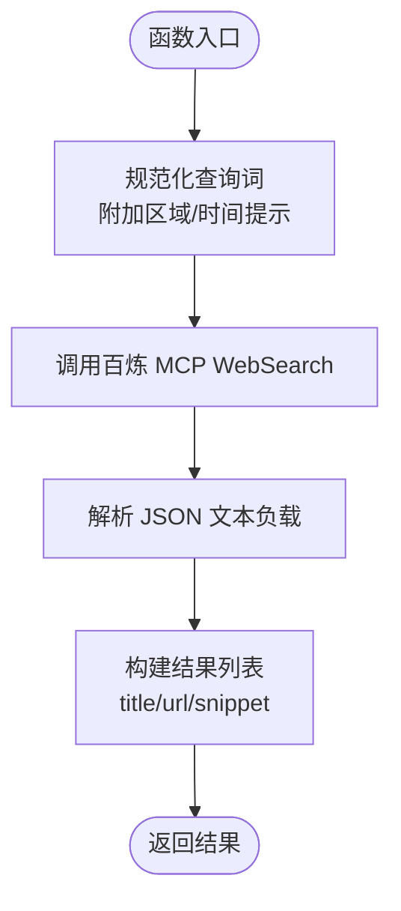
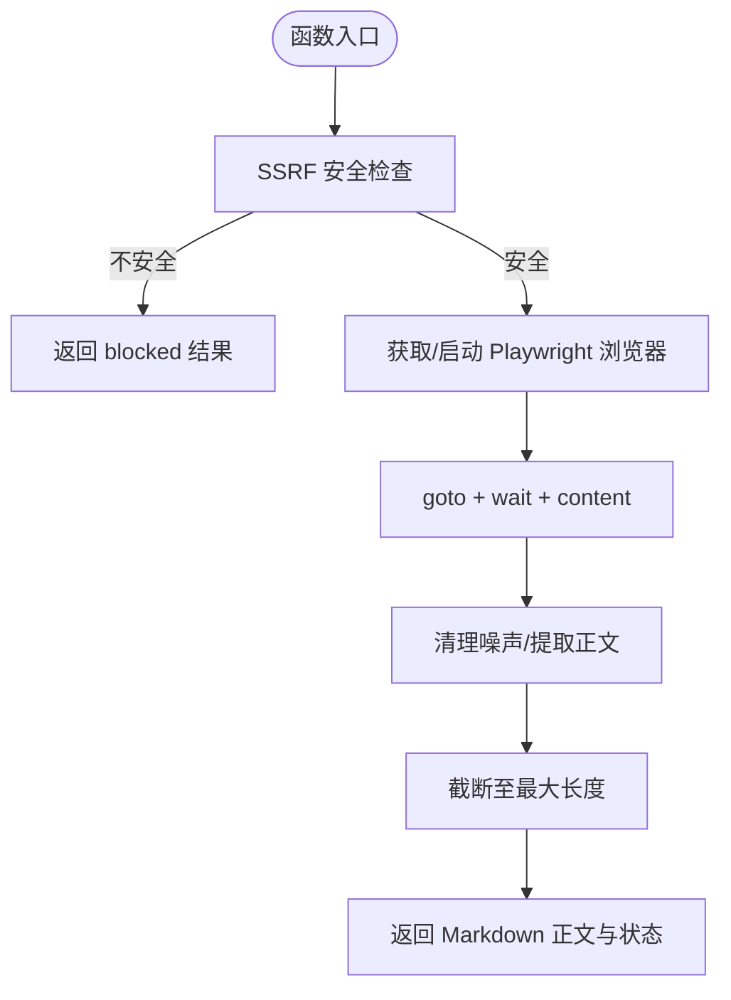
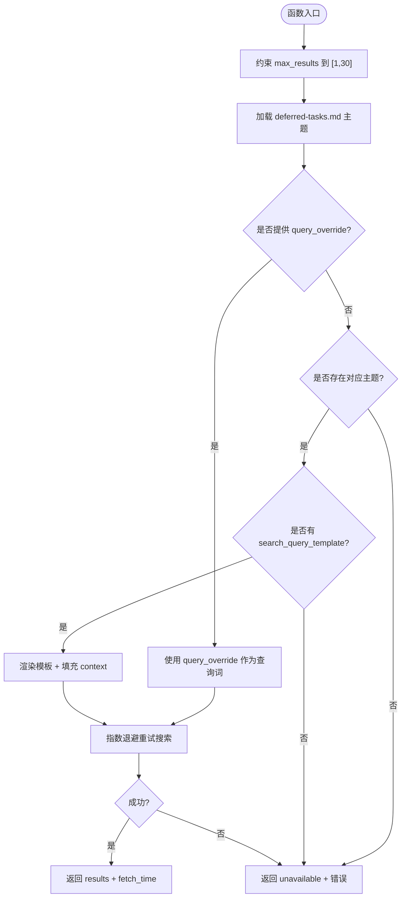
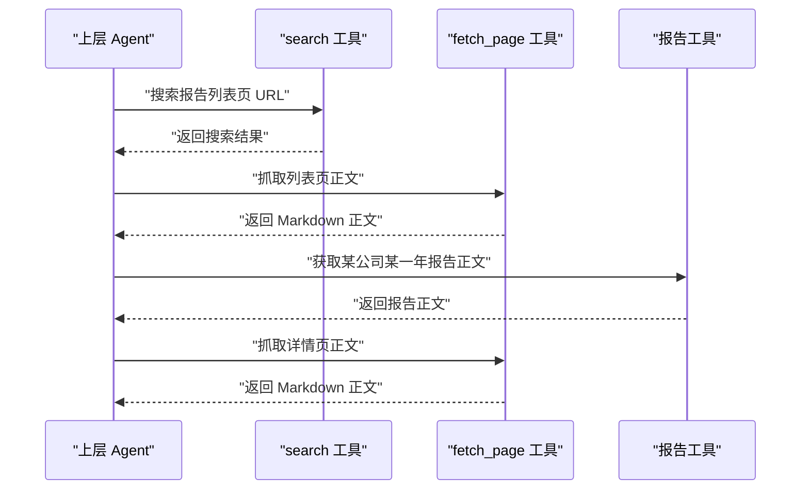
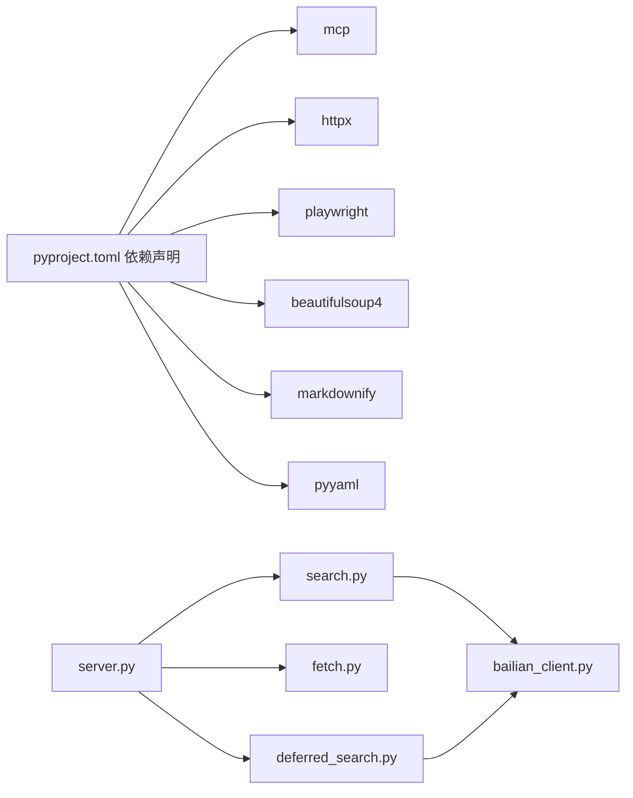

# 搜索工具模块

<cite>
**本文引用的文件**
- [search.py](file://nano-search-mcp/src/nano_search_mcp/tools/search.py)
- [fetch.py](file://nano-search-mcp/src/nano_search_mcp/tools/fetch.py)
- [deferred_search.py](file://nano-search-mcp/src/nano_search_mcp/tools/deferred_search.py)
- [bailian_client.py](file://nano-search-mcp/src/nano_search_mcp/tools/bailian_client.py)
- [server.py](file://nano-search-mcp/src/nano_search_mcp/server.py)
- [api.py](file://nano-search-mcp/src/nano_search_mcp/api.py)
- [__init__.py](file://nano-search-mcp/src/nano_search_mcp/tools/__init__.py)
- [README.md](file://nano-search-mcp/README.md)
- [pyproject.toml](file://nano-search-mcp/pyproject.toml)
- [test_deferred_search.py](file://nano-search-mcp/tests/test_deferred_search.py)
- [test_fetch.py](file://nano-search-mcp/tests/test_fetch.py)
</cite>

## 目录
1. [简介](#简介)
2. [项目结构](#项目结构)
3. [核心组件](#核心组件)
4. [架构总览](#架构总览)
5. [详细组件分析](#详细组件分析)
6. [依赖关系分析](#依赖关系分析)
7. [性能考量](#性能考量)
8. [故障排查指南](#故障排查指南)
9. [结论](#结论)
10. [附录](#附录)

## 简介
本文件为搜索工具模块的技术文档，聚焦三大核心搜索工具：WebSearch 搜索工具、页面抓取工具与延迟模板搜索工具。文档系统性阐述每个工具的功能特性、参数规范、返回值格式、错误处理机制，并给出使用示例、最佳实践、工具间协作关系与典型工作流程，以及性能优化建议与限制条件说明。该模块基于 MCP 协议提供服务，底层通过百炼 WebSearch 与 Playwright 实现网页检索与正文抽取，具备 SSRF 防护与指数退避重试等安全与可靠性保障。

## 项目结构
- 服务入口与注册：server.py 创建 FastMCP 实例并注册全部工具；api.py 提供兼容性 HTTP 入口。
- 工具模块：
  - search.py：基于百炼 WebSearch 的网页搜索工具。
  - fetch.py：基于 Playwright 的页面抓取工具，内置 SSRF 防护与正文清洗。
  - deferred_search.py：延迟模板搜索工具，支持主题模板与自由查询两种模式，带指数退避重试。
  - bailian_client.py：百炼 MCP 客户端封装，负责认证、HTTP 调用与响应解析。
- 文档与测试：README.md 提供安装、启动与使用说明；tests/ 下包含针对工具与安全性的单元测试。

图表来源
- [server.py:19-69](file://nano-search-mcp/src/nano_search_mcp/server.py#L19-L69)
- [api.py:6-11](file://nano-search-mcp/src/nano_search_mcp/api.py#L6-L11)
- [search.py:79-118](file://nano-search-mcp/src/nano_search_mcp/tools/search.py#L79-L118)
- [fetch.py:220-244](file://nano-search-mcp/src/nano_search_mcp/tools/fetch.py#L220-L244)
- [deferred_search.py:145-237](file://nano-search-mcp/src/nano_search_mcp/tools/deferred_search.py#L145-L237)
- [bailian_client.py:63-92](file://nano-search-mcp/src/nano_search_mcp/tools/bailian_client.py#L63-L92)

章节来源
- [server.py:1-91](file://nano-search-mcp/src/nano_search_mcp/server.py#L1-L91)
- [api.py:1-12](file://nano-search-mcp/src/nano_search_mcp/api.py#L1-L12)
- [README.md:1-198](file://nano-search-mcp/README.md#L1-L198)

## 核心组件
- WebSearch 搜索工具（search）：面向网页检索，返回标题、URL、摘要三项信息，支持区域与时间范围过滤提示词拼接。
- 页面抓取工具（fetch_page）：对任意 HTTP/HTTPS 页面进行 Playwright 渲染后提取正文，内置 SSRF 防护与正文清洗，返回 Markdown 正文与截断标记。
- 延迟模板搜索工具（search_deferred_topic）：支持从主题模板加载查询语句并填充上下文变量，或直接使用自定义查询词；带指数退避重试与失败兜底返回。

章节来源
- [search.py:79-118](file://nano-search-mcp/src/nano_search_mcp/tools/search.py#L79-L118)
- [fetch.py:220-244](file://nano-search-mcp/src/nano_search_mcp/tools/fetch.py#L220-L244)
- [deferred_search.py:145-237](file://nano-search-mcp/src/nano_search_mcp/tools/deferred_search.py#L145-L237)

## 架构总览
MCP 服务通过 FastMCP 实例对外暴露工具，工具调用链如下：
- WebSearch 搜索工具：接收用户查询参数，经预处理后调用百炼 MCP 接口，解析响应并返回结构化结果。
- 页面抓取工具：对 URL 进行 SSRF 校验，使用 Playwright 渲染页面，提取正文并清洗噪声，返回 Markdown 与状态信息。
- 延迟模板搜索工具：从 deferred-tasks.md 加载主题模板，渲染查询词，调用百炼 MCP 接口并进行指数退避重试，失败时返回统一兜底结构。

图表来源
- [search.py:41-70](file://nano-search-mcp/src/nano_search_mcp/tools/search.py#L41-L70)
- [fetch.py:163-175](file://nano-search-mcp/src/nano_search_mcp/tools/fetch.py#L163-L175)
- [deferred_search.py:102-139](file://nano-search-mcp/src/nano_search_mcp/tools/deferred_search.py#L102-L139)
- [bailian_client.py:63-92](file://nano-search-mcp/src/nano_search_mcp/tools/bailian_client.py#L63-L92)

## 详细组件分析

### WebSearch 搜索工具（search）
- 功能概述
  - 基于百炼 WebSearch MCP，返回网页搜索结果的标题、URL、摘要三项信息。
  - 支持区域与时间范围过滤提示词拼接，增强检索可控性。
- 参数规范
  - query: 搜索关键词（必填，非空字符串）
  - max_results: 最大返回结果数，取值范围 [1, 30]，默认 5；越界自动截断
  - region: 搜索区域代码，常用值 "zh-cn"（中文）、"us-en"、"uk-en"、"wt-wt"（全球）；默认 "zh-cn"
  - timelimit: 时间范围过滤，可选 "d"/"w"/"m"/"y"；None 表示不限
- 返回值格式
  - list[SearchItem]：每项包含 title/url/snippet 三个字符串字段；无结果时返回空列表
- 错误处理
  - 百炼 MCP 调用失败时抛出 RuntimeError
- 使用示例
  - 搜索关键词并限制结果数量与区域
  - 结合 timelimit 过滤近期内容
- 最佳实践
  - 合理设置 max_results，避免超出上限
  - 如需严格过滤，建议在 query 中显式表达区域与时间范围
  - 对于 A 股相关问题，可配合 fetch_page 抓取详情页正文

图表来源
- [search.py:17-38](file://nano-search-mcp/src/nano_search_mcp/tools/search.py#L17-L38)
- [search.py:41-70](file://nano-search-mcp/src/nano_search_mcp/tools/search.py#L41-L70)
- [search.py:79-118](file://nano-search-mcp/src/nano_search_mcp/tools/search.py#L79-L118)

章节来源
- [search.py:1-119](file://nano-search-mcp/src/nano_search_mcp/tools/search.py#L1-L119)

### 页面抓取工具（fetch_page）
- 功能概述
  - 使用 Playwright 无头浏览器渲染页面，提取正文并转换为 Markdown，同时进行噪声清理与长度截断。
  - 内置 SSRF 防护，拒绝 file://、loopback、RFC1918 私网、链路本地等潜在攻击向量。
- 参数规范
  - url: 需要抓取的绝对 URL
- 返回值格式
  - dict: 包含 url、content、method、truncated、error（失败时出现）
- 错误处理
  - URL 不安全：返回 blocked 方法与错误信息
  - 渲染/解析异常：返回空 content 与错误信息
- 使用示例
  - 抓取新闻列表页正文，提取详情页链接
  - 抓取报告列表页正文，提取 PDF 链接
- 最佳实践
  - 仅使用 http/https 协议
  - 避免访问内网/本地/保留地址
  - 注意内容长度限制，必要时分段处理

图表来源
- [fetch.py:24-74](file://nano-search-mcp/src/nano_search_mcp/tools/fetch.py#L24-L74)
- [fetch.py:133-142](file://nano-search-mcp/src/nano_search_mcp/tools/fetch.py#L133-L142)
- [fetch.py:163-175](file://nano-search-mcp/src/nano_search_mcp/tools/fetch.py#L163-L175)
- [fetch.py:186-217](file://nano-search-mcp/src/nano_search_mcp/tools/fetch.py#L186-L217)

章节来源
- [fetch.py:1-245](file://nano-search-mcp/src/nano_search_mcp/tools/fetch.py#L1-L245)

### 延迟模板搜索工具（search_deferred_topic）
- 功能概述
  - 支持两种模式：
    - 预置主题搜索：根据 topic_id 从 deferred-tasks.md 加载查询模板，结合 context 填充变量后执行搜索
    - 自由查询：直接使用 query_override 作为搜索词
  - 带指数退避重试（最多 3 次），失败时统一返回 source: "unavailable"
- 参数规范
  - topic_id: 主题标识符；自由查询模式下可传任意字符串作为结果标签
  - query_override: 非空时覆盖主题模板，直接作为搜索词使用
  - max_results: 返回结果上限，取值范围 [1, 30]，默认 10；越界自动截断
  - region: 地区提示，默认 "cn-zh"（中文简体）；其它常用值 "wt-wt"/"us-en"/"uk-en"
  - context: 模板变量字典，如 {"industry": "光伏设备", "ts_code": "600660.SH"}
- 返回值格式
  - 成功：包含 topic_id、query、source、results（title/url/snippet）、fetch_time
  - 失败：包含 topic_id、source: "unavailable"、error、fetch_time
- 错误处理
  - 未知 topic_id 或模板缺失：返回 unavailable 与错误信息
  - WebSearch 连续失败：返回 unavailable 与错误信息
- 使用示例
  - 使用行业政策主题模板，填充 industry 与 date_range
  - 直接传入 query_override 进行自由查询
- 最佳实践
  - 合理设置 max_results，避免超出上限
  - 在 query 中显式表达地区与时间范围，提高检索精度
  - 对于失败场景，利用返回的 error 字段进行诊断

图表来源
- [deferred_search.py:45-85](file://nano-search-mcp/src/nano_search_mcp/tools/deferred_search.py#L45-L85)
- [deferred_search.py:91-96](file://nano-search-mcp/src/nano_search_mcp/tools/deferred_search.py#L91-L96)
- [deferred_search.py:102-139](file://nano-search-mcp/src/nano_search_mcp/tools/deferred_search.py#L102-L139)
- [deferred_search.py:149-237](file://nano-search-mcp/src/nano_search_mcp/tools/deferred_search.py#L149-L237)

章节来源
- [deferred_search.py:1-238](file://nano-search-mcp/src/nano_search_mcp/tools/deferred_search.py#L1-L238)

### 工具间协作关系与典型工作流程
- 典型流程（以定期报告为例）
  1) 明确目标年份
  2) 使用 search 搜索报告列表页 URL
  3) 使用 fetch_page 抓取列表页正文，提取详情页或 PDF 链接
  4) 优先调用 get_company_report 获取某公司某一年的报告正文
  5) 对详情页或 PDF 链接继续调用 fetch_page，或进入 PDF 下载与解析流程
  6) 将解析结果与本地链接仓库、缓存仓库关联保存

图表来源
- [server.py:25-56](file://nano-search-mcp/src/nano_search_mcp/server.py#L25-L56)
- [README.md:149-159](file://nano-search-mcp/README.md#L149-L159)

章节来源
- [server.py:19-69](file://nano-search-mcp/src/nano_search_mcp/server.py#L19-L69)
- [README.md:126-159](file://nano-search-mcp/README.md#L126-L159)

## 依赖关系分析
- 外部依赖
  - mcp：MCP 协议与传输层
  - httpx：HTTP 客户端，用于百炼 MCP 调用
  - playwright：无头浏览器渲染，用于页面抓取
  - beautifulsoup4/markdownify：HTML 解析与 Markdown 转换
  - pyyaml：解析 deferred-tasks.md 中的 YAML 代码块
- 内部依赖
  - server.py 统一注册工具
  - api.py 提供 HTTP 兼容入口
  - tools/__init__.py 汇总导出工具

图表来源
- [pyproject.toml:6-14](file://nano-search-mcp/pyproject.toml#L6-L14)
- [server.py:8-16](file://nano-search-mcp/src/nano_search_mcp/server.py#L8-L16)
- [bailian_client.py:1-93](file://nano-search-mcp/src/nano_search_mcp/tools/bailian_client.py#L1-L93)

章节来源
- [pyproject.toml:1-44](file://nano-search-mcp/pyproject.toml#L1-L44)
- [server.py:1-91](file://nano-search-mcp/src/nano_search_mcp/server.py#L1-L91)

## 性能考量
- 搜索工具
  - max_results 越大，响应时间越长；建议按需设置，避免超过上限
  - timelimit 与 region 作为查询提示词拼接，可能影响上游模型理解；如需严格过滤，建议在 query 中显式表达
- 页面抓取工具
  - Playwright 启动成本较高，采用惰性创建与复用策略，降低冷启动开销
  - 内容长度限制为 50 万字符，超长自动截断
  - HTML 解析与 Markdown 转换存在 CPU 开销，建议在批量抓取时控制并发
- 延迟模板搜索工具
  - 指数退避重试最多 3 次，失败时统一返回 unavailable，避免长时间阻塞
  - 建议在高频场景下缓存主题模板解析结果

章节来源
- [search.py:112-118](file://nano-search-mcp/src/nano_search_mcp/tools/search.py#L112-L118)
- [fetch.py:77-78](file://nano-search-mcp/src/nano_search_mcp/tools/fetch.py#L77-L78)
- [fetch.py:133-142](file://nano-search-mcp/src/nano_search_mcp/tools/fetch.py#L133-L142)
- [deferred_search.py:38-40](file://nano-search-mcp/src/nano_search_mcp/tools/deferred_search.py#L38-L40)

## 故障排查指南
- 百炼 MCP 认证与网络
  - 缺少 DASHSCOPE_API_KEY：检查环境变量配置
  - HTTP 状态码 ≥ 400：检查 endpoint 与权限
  - MCP 返回非 JSON 或 text 非法 JSON：检查响应格式
- 页面抓取失败
  - SSRF 拒绝：确认 URL 协议为 http/https，且目标不在内网/本地/保留地址
  - Playwright 渲染异常：检查浏览器安装与版本，适当增加超时
- 延迟模板搜索失败
  - unknown topic_id：确认 deferred-tasks.md 路径与主题 ID
  - 连续重试失败：检查网络与上游服务稳定性
- 单元测试参考
  - SSRF 防护专项测试：验证协议与地址拒绝逻辑
  - 延迟模板搜索测试：验证模板解析、变量替换与重试逻辑

章节来源
- [bailian_client.py:24-92](file://nano-search-mcp/src/nano_search_mcp/tools/bailian_client.py#L24-L92)
- [test_fetch.py:1-98](file://nano-search-mcp/tests/test_fetch.py#L1-L98)
- [test_deferred_search.py:1-282](file://nano-search-mcp/tests/test_deferred_search.py#L1-L282)

## 结论
本搜索工具模块围绕 MCP 协议提供三大核心能力：网页检索、页面抓取与模板化检索。通过百炼 WebSearch 与 Playwright 的组合，既保证了检索的广泛性与正文提取的准确性，又通过 SSRF 防护与指数退避重试提升了安全性与可靠性。建议在实际应用中合理设置参数、遵循最佳实践，并结合单元测试与日志进行故障排查与性能优化。

## 附录
- 安装与启动
  - 安装依赖与 Playwright 浏览器
  - 启动 MCP 服务或通过 HTTP 兼容入口访问
- 环境变量
  - DASHSCOPE_API_KEY：百炼 MCP 认证
  - BAILIAN_WEBSEARCH_ENDPOINT：百炼 MCP 端点
  - BAILIAN_MCP_TIMEOUT：HTTP 超时（秒）

章节来源
- [README.md:55-104](file://nano-search-mcp/README.md#L55-L104)
- [bailian_client.py:12-21](file://nano-search-mcp/src/nano_search_mcp/tools/bailian_client.py#L12-L21)