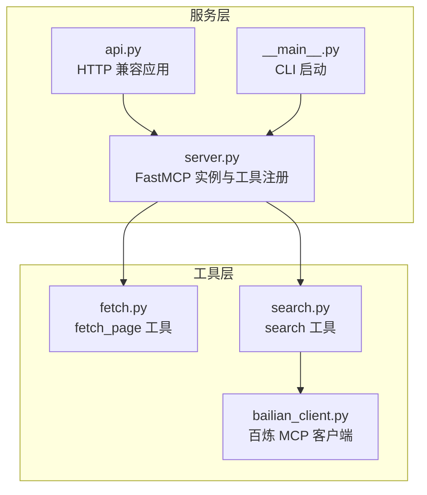
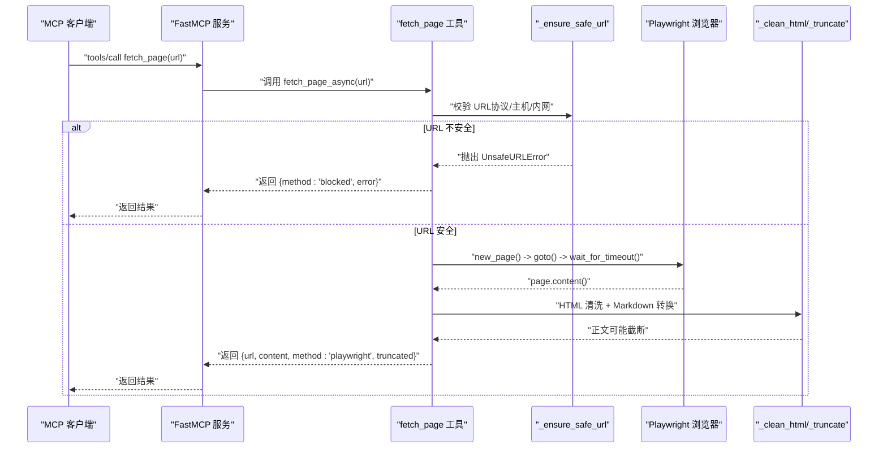
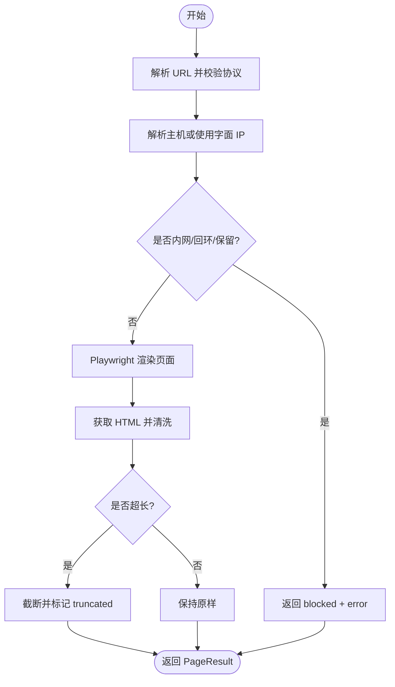
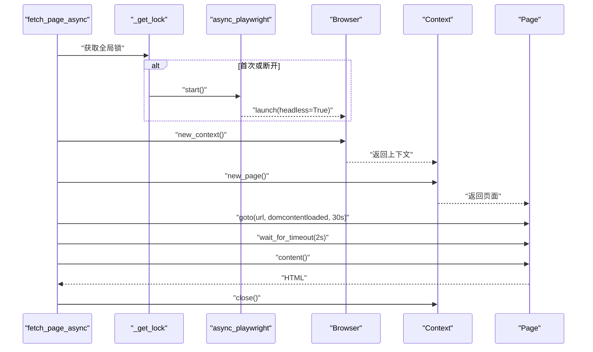
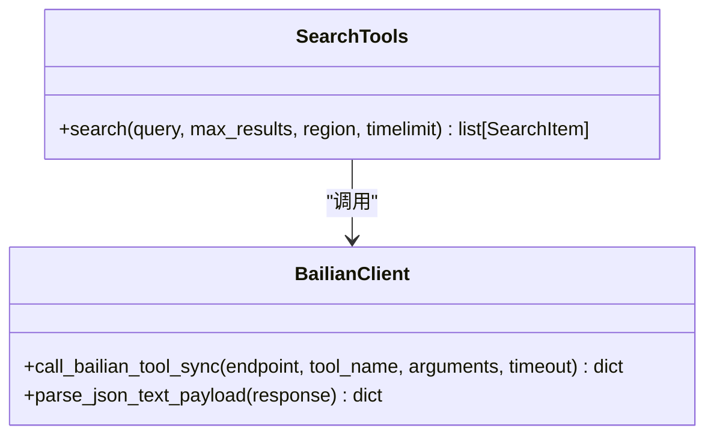
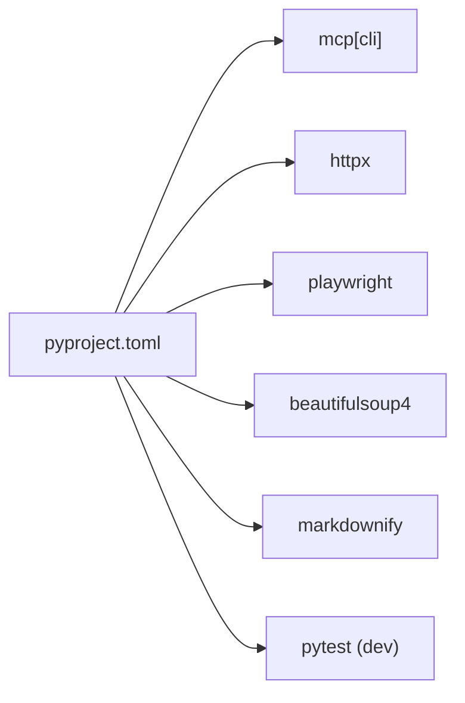

# 页面抓取工具

<cite>
**本文引用的文件**
- [fetch.py](file://nano-search-mcp/src/nano_search_mcp/tools/fetch.py)
- [search.py](file://nano-search-mcp/src/nano_search_mcp/tools/search.py)
- [bailian_client.py](file://nano-search-mcp/src/nano_search_mcp/tools/bailian_client.py)
- [server.py](file://nano-search-mcp/src/nano_search_mcp/server.py)
- [api.py](file://nano-search-mcp/src/nano_search_mcp/api.py)
- [__main__.py](file://nano-search-mcp/src/nano_search_mcp/__main__.py)
- [test_fetch.py](file://nano-search-mcp/tests/test_fetch.py)
- [pyproject.toml](file://nano-search-mcp/pyproject.toml)
- [README.md](file://nano-search-mcp/README.md)
</cite>

## 目录
1. [简介](#简介)
2. [项目结构](#项目结构)
3. [核心组件](#核心组件)
4. [架构总览](#架构总览)
5. [详细组件分析](#详细组件分析)
6. [依赖关系分析](#依赖关系分析)
7. [性能考量](#性能考量)
8. [故障排查指南](#故障排查指南)
9. [结论](#结论)
10. [附录](#附录)

## 简介
本文件为“页面抓取工具”的技术文档，聚焦于基于 Playwright 的网页内容抓取与解析实现，涵盖页面渲染、内容提取、数据格式化、安全防护（SSRF）、异常处理、与 Playwright 的集成机制、使用示例、最佳实践、性能优化与常见问题排查。该工具通过 MCP（Model Context Protocol）服务暴露为 fetch_page 工具，支持 HTTP 流式传输与 stdio 两种传输方式。

## 项目结构
- 服务入口与注册：server.py 创建 FastMCP 实例并注册多个工具，包括 fetch_page、search 等。
- 工具实现：
  - fetch.py：实现 fetch_page 工具，包含 SSRF 防护、Playwright 渲染、HTML 清洗与 Markdown 输出、长度截断与错误返回。
  - search.py：实现 search 工具，基于百炼 WebSearch 的 MCP 调用。
  - bailian_client.py：封装百炼 MCP 的 HTTP 调用、鉴权与响应解析。
- 兼容入口：api.py 提供标准 MCP HTTP 应用；__main__.py 提供 CLI 启动入口。
- 测试：test_fetch.py 验证 SSRF 防护与阻断逻辑。
- 依赖与构建：pyproject.toml 声明依赖（mcp、playwright、beautifulsoup4、markdownify、httpx 等）。

图表来源
- [server.py:19-69](file://nano-search-mcp/src/nano_search_mcp/server.py#L19-L69)
- [api.py:6](file://nano-search-mcp/src/nano_search_mcp/api.py#L6)
- [__main__.py:9-11](file://nano-search_mcp/src/nano_search_mcp/__main__.py#L9-L11)
- [fetch.py:220-244](file://nano-search-mcp/src/nano_search_mcp/tools/fetch.py#L220-L244)
- [search.py:79-118](file://nano-search-mcp/src/nano_search_mcp/tools/search.py#L79-L118)
- [bailian_client.py:63-92](file://nano-search-mcp/src/nano_search_mcp/tools/bailian_client.py#L63-L92)

章节来源
- [server.py:19-69](file://nano-search-mcp/src/nano_search_mcp/server.py#L19-L69)
- [pyproject.toml:6-14](file://nano-search-mcp/pyproject.toml#L6-L14)

## 核心组件
- fetch_page 工具：对任意 HTTP/HTTPS URL 进行 Playwright 无头渲染，提取正文并清洗噪声，输出 Markdown 文本，支持长度截断与错误返回。
- search 工具：基于百炼 WebSearch 的 MCP 调用，返回标题、URL、摘要列表。
- 百炼 MCP 客户端：封装 HTTP 调用、鉴权头、超时控制、响应解析与错误包装。
- 服务注册与传输：FastMCP 实例负责工具注册与传输（默认 streamable HTTP，可切换 stdio）。

章节来源
- [fetch.py:186-217](file://nano-search-mcp/src/nano_search_mcp/tools/fetch.py#L186-L217)
- [search.py:79-118](file://nano-search-mcp/src/nano_search_mcp/tools/search.py#L79-L118)
- [bailian_client.py:24-92](file://nano-search-mcp/src/nano_search_mcp/tools/bailian_client.py#L24-L92)
- [server.py:19-69](file://nano-search-mcp/src/nano_search_mcp/server.py#L19-L69)

## 架构总览
页面抓取工具通过 MCP 服务对外提供 fetch_page 工具。其内部流程如下：
- 输入 URL 经 SSRF 校验（协议白名单、主机解析、内网/回环/保留地址拒绝）。
- 通过 Playwright 无头浏览器打开页面，等待 DOMContentLoaded 并额外等待固定时长，获取 HTML。
- 使用 BeautifulSoup 清理 header/footer/nav/aside 等噪声标签，以及基于类名/ID 的精确 token 匹配规则，再将主体转换为 Markdown。
- 对正文进行长度截断（默认 50 万字符），返回 PageResult 结构。

图表来源
- [fetch.py:186-217](file://nano-search-mcp/src/nano_search_mcp/tools/fetch.py#L186-L217)
- [fetch.py:24-74](file://nano-search-mcp/src/nano_search_mcp/tools/fetch.py#L24-L74)
- [fetch.py:163-175](file://nano-search-mcp/src/nano_search_mcp/tools/fetch.py#L163-L175)
- [fetch.py:100-117](file://nano-search-mcp/src/nano_search_mcp/tools/fetch.py#L100-L117)

## 详细组件分析

### fetch_page 工具与实现
- 参数与返回
  - 参数：url（字符串，绝对 URL）
  - 返回：PageResult（包含 url、content、method、truncated、error）
- 安全性
  - 协议白名单：仅允许 http/https
  - 主机解析：支持字面 IP 与 DNS 解析
  - 内网/回环/保留地址拒绝：阻止 RFC1918、链路本地、多播、未指定等
- 渲染与内容提取
  - Playwright 无头浏览器：new_page -> goto(wait_until="domcontentloaded") -> wait_for_timeout -> content()
  - HTML 清洗：移除 header/footer/nav/aside，以及基于 token 的 class/id 选择器
  - Markdown 转换：ATX 风格标题，剥离 script/style
- 数据格式化与截断
  - 最大长度：默认 50 万字符，超长截断并标记 truncated
- 异常处理
  - SSRF 校验失败：返回 method='blocked'，error 包含 unsafe_url
  - 其他异常：返回 method='playwright'，content 空字符串，error 为异常字符串

图表来源
- [fetch.py:24-74](file://nano-search-mcp/src/nano_search_mcp/tools/fetch.py#L24-L74)
- [fetch.py:163-175](file://nano-search-mcp/src/nano_search_mcp/tools/fetch.py#L163-L175)
- [fetch.py:100-117](file://nano-search-mcp/src/nano_search_mcp/tools/fetch.py#L100-L117)
- [fetch.py:186-217](file://nano-search-mcp/src/nano_search_mcp/tools/fetch.py#L186-L217)

章节来源
- [fetch.py:178-184](file://nano-search-mcp/src/nano_search_mcp/tools/fetch.py#L178-L184)
- [fetch.py:186-217](file://nano-search-mcp/src/nano_search_mcp/tools/fetch.py#L186-L217)
- [fetch.py:100-117](file://nano-search-mcp/src/nano_search_mcp/tools/fetch.py#L100-L117)
- [fetch.py:163-175](file://nano-search-mcp/src/nano_search_mcp/tools/fetch.py#L163-L175)
- [fetch.py:24-74](file://nano-search-mcp/src/nano_search_mcp/tools/fetch.py#L24-L74)

### Playwright 集成与浏览器自动化
- 浏览器复用
  - 惰性创建：首次使用时启动 async_playwright 并 launch headless Chromium
  - 全局锁保护：确保并发安全
  - 关闭资源：shutdown_browser 用于测试或进程退出时释放
- 页面渲染
  - new_context -> new_page -> goto(url, wait_until="domcontentloaded", timeout=30s) -> wait_for_timeout(2s)
  - content() 获取 HTML
- 性能与稳定性
  - 无头模式减少资源消耗
  - wait_for_timeout 保证动态内容加载完成
  - 超时与异常捕获避免阻塞

图表来源
- [fetch.py:126-142](file://nano-search-mcp/src/nano_search_mcp/tools/fetch.py#L126-L142)
- [fetch.py:163-175](file://nano-search-mcp/src/nano_search_mcp/tools/fetch.py#L163-L175)

章节来源
- [fetch.py:126-142](file://nano-search-mcp/src/nano_search_mcp/tools/fetch.py#L126-L142)
- [fetch.py:163-175](file://nano-search-mcp/src/nano_search_mcp/tools/fetch.py#L163-L175)

### SSRF 防护机制
- 协议白名单：仅允许 http/https
- 主机解析：支持字面 IP 与 DNS 解析
- 地址拒绝：回环、私网、链路本地、多播、保留、未指定等
- 错误类型：UnsafeURLError，触发 method='blocked' 的返回

章节来源
- [fetch.py:24-74](file://nano-search-mcp/src/nano_search_mcp/tools/fetch.py#L24-L74)
- [test_fetch.py:19-80](file://nano-search-mcp/tests/test_fetch.py#L19-L80)

### search 工具与百炼 MCP 客户端
- search 工具
  - 参数：query（必填）、max_results（1-30）、region（默认 zh-cn）、timelimit（d/w/m/y 或 None）
  - 返回：SearchItem 列表（title/url/snippet）
  - 内部预处理：将 region/timelimit 转换为查询提示词附加到 query
- 百炼 MCP 客户端
  - 端点与鉴权：从环境变量读取 BAILIAN_WEBSEARCH_ENDPOINT 与 DASHSCOPE_API_KEY
  - 超时：默认 30s，可通过 BAILIAN_MCP_TIMEOUT 覆盖
  - 错误：BailianMCPError，包含 HTTP 状态码、响应片段、JSON 解析失败等

图表来源
- [search.py:79-118](file://nano-search-mcp/src/nano_search_mcp/tools/search.py#L79-L118)
- [bailian_client.py:63-92](file://nano-search-mcp/src/nano_search_mcp/tools/bailian_client.py#L63-L92)

章节来源
- [search.py:79-118](file://nano-search-mcp/src/nano_search_mcp/tools/search.py#L79-L118)
- [bailian_client.py:24-92](file://nano-search-mcp/src/nano_search_mcp/tools/bailian_client.py#L24-L92)

## 依赖关系分析
- 运行时依赖
  - mcp[cli]：MCP 协议与传输
  - httpx：HTTP 客户端（百炼 MCP）
  - playwright：无头浏览器渲染
  - beautifulsoup4：HTML 解析与清洗
  - markdownify：HTML 到 Markdown 转换
- 构建与开发
  - pytest：测试框架
  - ruff：代码风格与静态检查

图表来源
- [pyproject.toml:6-19](file://nano-search-mcp/pyproject.toml#L6-L19)

章节来源
- [pyproject.toml:6-19](file://nano-search-mcp/pyproject.toml#L6-L19)

## 性能考量
- 浏览器复用
  - 通过全局锁与惰性初始化避免重复启动，降低冷启动开销
- 渲染策略
  - wait_until="domcontentloaded" + 2s 额外等待，平衡速度与稳定性
- 内容提取
  - BeautifulSoup 清洗 + markdownify 转换，复杂度与 HTML 大小线性相关
- 截断策略
  - 50 万字符上限，避免内存膨胀与下游处理压力
- 并发与锁
  - 全局锁保护浏览器生命周期，避免竞态；建议在高并发场景下合理控制请求速率

章节来源
- [fetch.py:126-142](file://nano-search-mcp/src/nano_search_mcp/tools/fetch.py#L126-L142)
- [fetch.py:77-78](file://nano-search-mcp/src/nano_search_mcp/tools/fetch.py#L77-L78)
- [fetch.py:163-175](file://nano-search-mcp/src/nano_search_mcp/tools/fetch.py#L163-L175)

## 故障排查指南
- SSRF 拒绝
  - 现象：返回 method='blocked'，error 包含 unsafe_url
  - 排查：确认 URL 协议为 http/https，目标主机不在内网/回环/保留地址
- Playwright 渲染失败
  - 现象：返回 method='playwright'，content 空字符串，error 为异常字符串
  - 排查：检查网络连通性、目标站点可访问性、超时设置（默认 30s）
- 百炼 MCP 失败
  - 现象：search 工具抛出 RuntimeError 或返回 unavailable
  - 排查：确认 DASHSCOPE_API_KEY、BAILIAN_WEBSEARCH_ENDPOINT、网络可达性、超时设置
- 测试验证
  - 使用 test_fetch.py 验证 SSRF 防护与阻断逻辑

章节来源
- [fetch.py:186-217](file://nano-search-mcp/src/nano_search_mcp/tools/fetch.py#L186-L217)
- [bailian_client.py:24-92](file://nano-search-mcp/src/nano_search_mcp/tools/bailian_client.py#L24-L92)
- [test_fetch.py:85-98](file://nano-search-mcp/tests/test_fetch.py#L85-L98)

## 结论
页面抓取工具通过严格的 SSRF 防护、Playwright 无头渲染与 HTML 清洗，提供了稳定可靠的网页正文提取能力。配合 MCP 服务与多种传输方式，便于在不同环境中集成与扩展。建议在生产环境中关注超时、重试、并发与资源管理，以获得更优的稳定性与性能。

## 附录

### 使用示例与最佳实践
- 启动 MCP 服务
  - 默认 streamable HTTP：监听 http://127.0.0.1:8000/mcp
  - 切换 stdio：用于本地直连或受支持的 MCP 客户端
- 调用 fetch_page
  - 输入：url（http/https）
  - 输出：PageResult（包含 content 为 Markdown，truncated 标记是否截断）
- 调用 search
  - 输入：query（必填）、max_results（1-30）、region（如 zh-cn/us-en）、timelimit（d/w/m/y 或 None）
  - 输出：SearchItem 列表
- 最佳实践
  - 明确超时：根据业务场景调整客户端超时，避免被反向代理或网关提前中断
  - 控制并发：合理限制并发数，避免浏览器资源争用
  - 结果截断：注意 truncated 标记，必要时进行二次处理或扩大窗口
  - 日志与监控：利用日志记录失败原因与耗时，便于定位问题

章节来源
- [README.md:81-104](file://nano-search-mcp/README.md#L81-L104)
- [server.py:72-86](file://nano-search-mcp/src/nano_search_mcp/server.py#L72-L86)
- [search.py:79-118](file://nano-search-mcp/src/nano_search_mcp/tools/search.py#L79-L118)
- [fetch.py:186-217](file://nano-search-mcp/src/nano_search_mcp/tools/fetch.py#L186-L217)