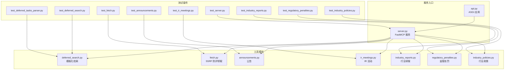
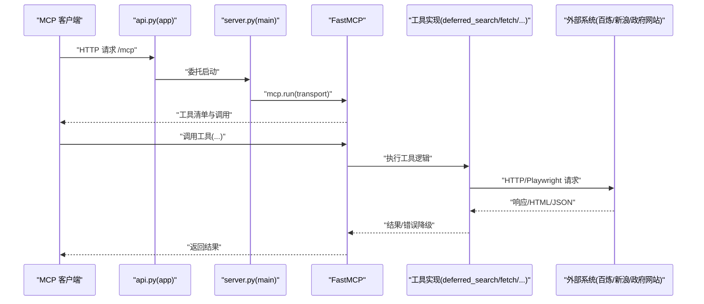
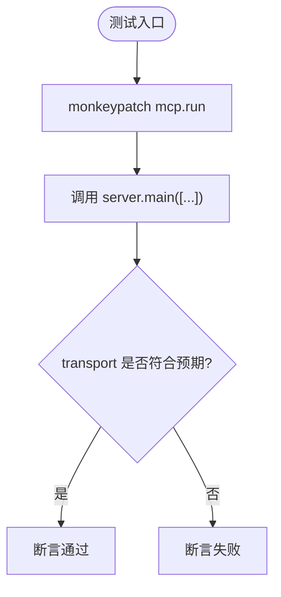
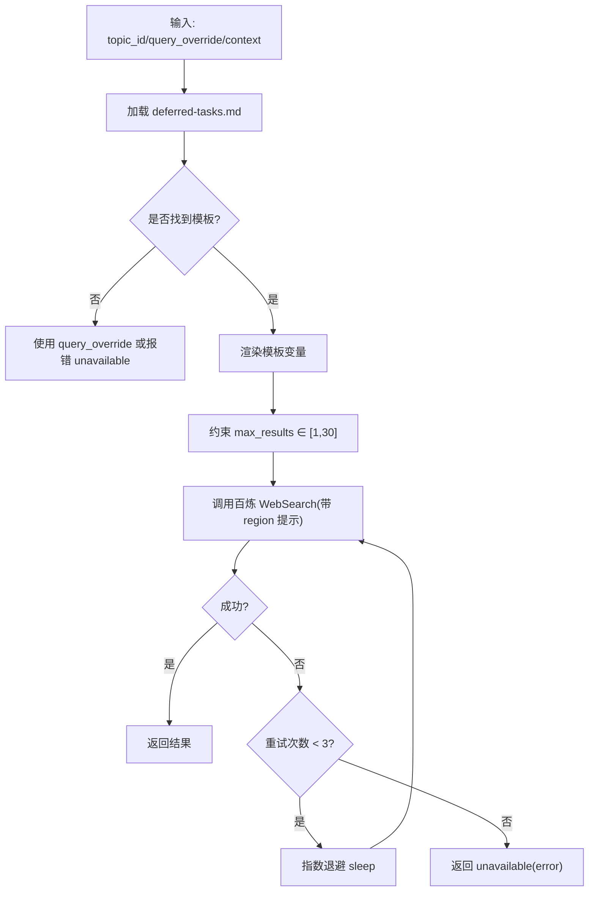
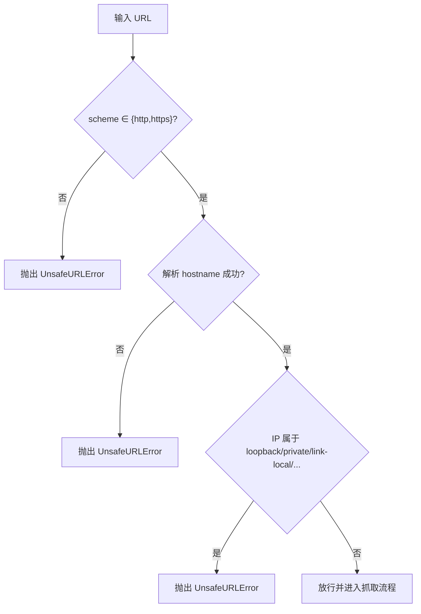
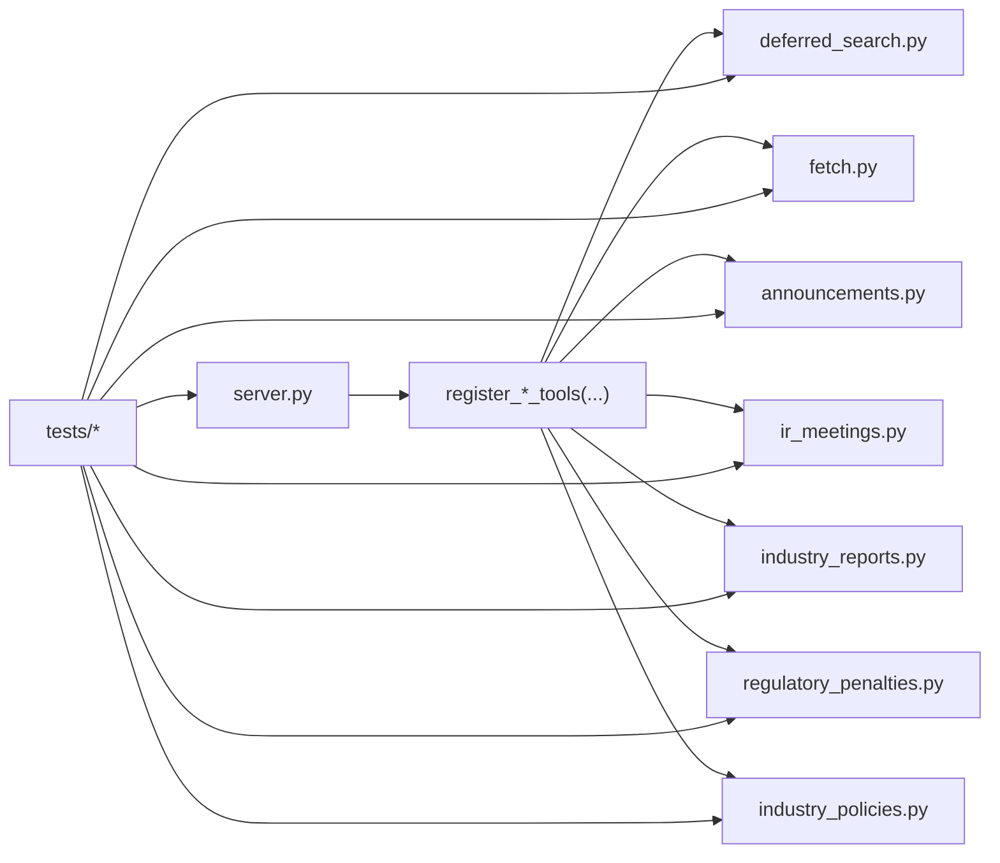

# 测试与监控

<cite>
**本文引用的文件**
- [README.md](file://nano-search-mcp/README.md)
- [pyproject.toml](file://nano-search-mcp/pyproject.toml)
- [server.py](file://nano-search-mcp/src/nano_search_mcp/server.py)
- [api.py](file://nano-search-mcp/src/nano_search_mcp/api.py)
- [deferred_search.py](file://nano-search-mcp/src/nano_search_mcp/tools/deferred_search.py)
- [fetch.py](file://nano-search-mcp/src/nano_search_mcp/tools/fetch.py)
- [test_server.py](file://nano-search-mcp/tests/test_server.py)
- [test_deferred_search.py](file://nano-search-mcp/tests/test_deferred_search.py)
- [test_deferred_tasks_parser.py](file://nano-search-mcp/tests/test_deferred_tasks_parser.py)
- [test_fetch.py](file://nano-search-mcp/tests/test_fetch.py)
- [test_announcements.py](file://nano-search-mcp/tests/test_announcements.py)
- [test_industry_policies.py](file://nano-search-mcp/tests/test_industry_policies.py)
- [test_industry_reports.py](file://nano-search-mcp/tests/test_industry_reports.py)
- [test_ir_meetings.py](file://nano-search-mcp/tests/test_ir_meetings.py)
- [test_regulatory_penalties.py](file://nano-search-mcp/tests/test_regulatory_penalties.py)
</cite>

## 目录
1. [简介](#简介)
2. [项目结构](#项目结构)
3. [核心组件](#核心组件)
4. [架构总览](#架构总览)
5. [详细组件分析](#详细组件分析)
6. [依赖分析](#依赖分析)
7. [性能考虑](#性能考虑)
8. [故障排查指南](#故障排查指南)
9. [结论](#结论)
10. [附录](#附录)

## 简介
本文件面向“测试与监控”的工程实践，围绕 nano-search-mcp 服务的测试策略、测试用例设计原则、测试环境与数据准备、性能与负载测试指导、监控指标与告警配置、调试与故障排查流程，以及持续集成与自动化测试最佳实践展开。文档同时给出与代码实现一一对应的图示与来源标注，便于读者快速定位到具体实现。

## 项目结构
nano-search-mcp 是一个基于 MCP 协议的搜索与抓取服务，提供 12 个工具，覆盖网页搜索、页面抓取、定期报告、公告、行业研报、监管处罚、IR 活动、行业政策等能力域。测试覆盖 MCP 服务启动、工具注册契约、关键抓取路径与安全防护、各数据源接入等。

图表来源
- [api.py:1-12](file://nano-search-mcp/src/nano_search_mcp/api.py#L1-L12)
- [server.py:1-91](file://nano-search-mcp/src/nano_search_mcp/server.py#L1-L91)
- [deferred_search.py:1-200](file://nano-search-mcp/src/nano_search_mcp/tools/deferred_search.py#L1-L200)
- [fetch.py:1-200](file://nano-search-mcp/src/nano_search_mcp/tools/fetch.py#L1-L200)
- [test_server.py:1-84](file://nano-search-mcp/tests/test_server.py#L1-L84)
- [test_deferred_search.py:1-282](file://nano-search-mcp/tests/test_deferred_search.py#L1-L282)
- [test_deferred_tasks_parser.py:1-186](file://nano-search-mcp/tests/test_deferred_tasks_parser.py#L1-L186)
- [test_fetch.py:1-98](file://nano-search-mcp/tests/test_fetch.py#L1-L98)
- [test_announcements.py:1-321](file://nano-search-mcp/tests/test_announcements.py#L1-L321)
- [test_industry_policies.py:1-217](file://nano-search-mcp/tests/test_industry_policies.py#L1-L217)
- [test_industry_reports.py:1-213](file://nano-search-mcp/tests/test_industry_reports.py#L1-L213)
- [test_ir_meetings.py:1-294](file://nano-search-mcp/tests/test_ir_meetings.py#L1-L294)
- [test_regulatory_penalties.py:1-280](file://nano-search-mcp/tests/test_regulatory_penalties.py#L1-L280)

章节来源
- [README.md:1-198](file://nano-search-mcp/README.md#L1-L198)
- [pyproject.toml:1-44](file://nano-search-mcp/pyproject.toml#L1-L44)

## 核心组件
- 服务入口与工具注册
  - server.py 创建 FastMCP 实例，注册 12 个工具域，并暴露 main 与参数解析。
  - api.py 复用 streamable HTTP 应用，委托给 server.main。
- 工具域
  - deferred_search：模板化检索与兜底搜索，带重试与结果裁剪。
  - fetch：Playwright 渲染 + SSRF 防护 + 内容清洗与截断。
  - 公告/行业研报/IR/监管/行业政策：各自解析、缓存、错误降级。
- 测试覆盖
  - 服务启动与工具注册契约断言
  - SSRF 防护专项
  - 各数据源解析与缓存、网络错误降级
  - 模板解析与查询渲染、重试与边界条件

章节来源
- [server.py:1-91](file://nano-search-mcp/src/nano_search_mcp/server.py#L1-L91)
- [api.py:1-12](file://nano-search-mcp/src/nano_search_mcp/api.py#L1-L12)
- [deferred_search.py:1-200](file://nano-search-mcp/src/nano_search_mcp/tools/deferred_search.py#L1-L200)
- [fetch.py:1-200](file://nano-search-mcp/src/nano_search_mcp/tools/fetch.py#L1-L200)
- [test_server.py:1-84](file://nano-search-mcp/tests/test_server.py#L1-L84)
- [test_fetch.py:1-98](file://nano-search-mcp/tests/test_fetch.py#L1-L98)
- [test_deferred_search.py:1-282](file://nano-search-mcp/tests/test_deferred_search.py#L1-L282)
- [test_deferred_tasks_parser.py:1-186](file://nano-search-mcp/tests/test_deferred_tasks_parser.py#L1-L186)
- [test_announcements.py:1-321](file://nano-search-mcp/tests/test_announcements.py#L1-L321)
- [test_industry_policies.py:1-217](file://nano-search-mcp/tests/test_industry_policies.py#L1-L217)
- [test_industry_reports.py:1-213](file://nano-search-mcp/tests/test_industry_reports.py#L1-L213)
- [test_ir_meetings.py:1-294](file://nano-search-mcp/tests/test_ir_meetings.py#L1-L294)
- [test_regulatory_penalties.py:1-280](file://nano-search-mcp/tests/test_regulatory_penalties.py#L1-L280)

## 架构总览
MCP 服务通过 FastMCP 注册工具，客户端通过 streamable-http 或 stdio 传输与服务交互。测试通过 pytest 驱动，使用 monkeypatch、patch、tmp_path 等机制隔离外部依赖，确保可重复性与稳定性。

图表来源
- [api.py:1-12](file://nano-search-mcp/src/nano_search_mcp/api.py#L1-L12)
- [server.py:72-91](file://nano-search-mcp/src/nano_search_mcp/server.py#L72-L91)
- [deferred_search.py:145-200](file://nano-search-mcp/src/nano_search_mcp/tools/deferred_search.py#L145-L200)
- [fetch.py:186-200](file://nano-search-mcp/src/nano_search_mcp/tools/fetch.py#L186-L200)

## 详细组件分析

### 服务启动与工具注册契约测试
- 目标
  - 验证默认 transport、参数解析、路由暴露、工具清单一致性。
- 方法
  - 使用 monkeypatch 注入 Fake mcp.run，断言 transport 参数。
  - 断言 /mcp 路由存在。
  - 断言工具清单包含 12 个工具，覆盖通用检索、定期报告、公告、行业研报、监管、IR、行业政策。
- 关键断言
  - transport: streamable-http vs stdio
  - 路由路径 /mcp
  - 工具集合期望与实际差异

图表来源
- [test_server.py:4-27](file://nano-search-mcp/tests/test_server.py#L4-L27)

章节来源
- [test_server.py:1-84](file://nano-search-mcp/tests/test_server.py#L1-L84)
- [server.py:72-91](file://nano-search-mcp/src/nano_search_mcp/server.py#L72-L91)
- [api.py:1-12](file://nano-search-mcp/src/nano_search_mcp/api.py#L1-L12)

### 模板化检索与延迟任务解析
- 目标
  - 验证 deferred-tasks.md 解析、模板变量渲染、重试策略、查询覆盖、边界裁剪。
- 方法
  - 生成临时 deferred-tasks.md，解析 YAML 块，过滤 resolved 与占位符。
  - 渲染模板变量，覆盖查询词，限制 max_results。
  - 使用 patch 模拟百炼工具调用与解析，验证错误路径与重试次数。
- 关键断言
  - 解析器跳过 resolved 与无 id 条目
  - 查询模板变量替换
  - 重试 3 次后抛出聚合错误
  - max_results 裁剪到 [1, 30]

图表来源
- [test_deferred_tasks_parser.py:1-186](file://nano-search-mcp/tests/test_deferred_tasks_parser.py#L1-L186)
- [test_deferred_search.py:1-282](file://nano-search-mcp/tests/test_deferred_search.py#L1-L282)
- [deferred_search.py:45-140](file://nano-search-mcp/src/nano_search_mcp/tools/deferred_search.py#L45-L140)

章节来源
- [test_deferred_tasks_parser.py:1-186](file://nano-search-mcp/tests/test_deferred_tasks_parser.py#L1-L186)
- [test_deferred_search.py:1-282](file://nano-search-mcp/tests/test_deferred_search.py#L1-L282)
- [deferred_search.py:1-200](file://nano-search-mcp/src/nano_search_mcp/tools/deferred_search.py#L1-L200)

### SSRF 防护专项测试
- 目标
  - 验证 fetch_page 对 URL 的协议、主机、私网/回环/元数据地址的拒绝策略。
- 方法
  - 参数化测试常见非法 URL，断言抛出 UnsafeURLError。
  - 异步调用 fetch_page_async，断言 blocked 结果与 error 字段包含 unsafe_url。
- 关键断言
  - file://、ftp://、gopher:// 等协议被拒绝
  - loopback、RFC1918、云元数据等被拒绝
  - 空 host、空字符串等异常输入被拒绝
  - blocked 返回空内容与错误标记

图表来源
- [test_fetch.py:1-98](file://nano-search-mcp/tests/test_fetch.py#L1-L98)
- [fetch.py:24-74](file://nano-search-mcp/src/nano_search_mcp/tools/fetch.py#L24-L74)

章节来源
- [test_fetch.py:1-98](file://nano-search-mcp/tests/test_fetch.py#L1-L98)
- [fetch.py:1-200](file://nano-search-mcp/src/nano_search_mcp/tools/fetch.py#L1-L200)

### 数据源工具测试（公告/行业研报/IR/监管/行业政策）
- 目标
  - 验证输入校验、HTML 解析、日期过滤、缓存命中、网络错误降级、MCP 工具包装。
- 方法
  - 使用 tmp_path 注入缓存目录，patch HTTP 请求，断言解析与过滤逻辑。
  - 验证非法输入返回 unavailable/error。
  - 验证 MCP 工具通过 FastMCP 注册后可调用。
- 关键断言
  - 公告：ann_types 过滤、列表/详情缓存命中、非法 URL 返回空文本+error
  - 行业研报：日期范围过滤、limit 限制、缓存命中
  - IR：标题过滤与 meeting_type 分类、参与者去重
  - 监管：issuer/reason 提取、日期过滤、缓存命中
  - 行业政策：查询构建、去重、region 提示、topN 截断

章节来源
- [test_announcements.py:1-321](file://nano-search-mcp/tests/test_announcements.py#L1-L321)
- [test_industry_reports.py:1-213](file://nano-search-mcp/tests/test_industry_reports.py#L1-L213)
- [test_ir_meetings.py:1-294](file://nano-search-mcp/tests/test_ir_meetings.py#L1-L294)
- [test_regulatory_penalties.py:1-280](file://nano-search-mcp/tests/test_regulatory_penalties.py#L1-L280)
- [test_industry_policies.py:1-217](file://nano-search-mcp/tests/test_industry_policies.py#L1-L217)

## 依赖分析
- 组件耦合
  - server.py 依赖各工具模块的 register_*_tools，集中注册 12 个工具域。
  - api.py 仅复用 mcp.streamable_http_app()，解耦应用与服务。
  - 工具模块依赖外部服务（百炼 WebSearch、新浪、gov.cn 等），通过 patch 在测试中隔离。
- 外部依赖
  - mcp.server.fastmcp 提供工具注册与运行时。
  - playwright 用于页面渲染。
  - httpx/beautifulsoup4/markdownify 用于网络与内容处理。
- 测试依赖
  - pytest、unittest.mock、anyio（list_tools）、pathlib.Path（临时文件）。

图表来源
- [server.py:8-69](file://nano-search-mcp/src/nano_search_mcp/server.py#L8-L69)
- [test_server.py:49-83](file://nano-search-mcp/tests/test_server.py#L49-L83)

章节来源
- [server.py:1-91](file://nano-search-mcp/src/nano_search_mcp/server.py#L1-L91)
- [pyproject.toml:1-44](file://nano-search-mcp/pyproject.toml#L1-L44)

## 性能考虑
- 并发与资源复用
  - Playwright 浏览器惰性创建与复用，减少冷启动开销。
  - 工具内部使用 asyncio.Lock 保护浏览器实例。
- 限流与退避
  - deferred_search 使用指数退避重试，避免雪崩。
  - fetch 限制返回正文最大长度，防止内存膨胀。
- 缓存策略
  - 各数据源工具内置缓存目录与新鲜度判断，显著降低重复请求。
- 超时与可观测性
  - README 明确 MCP 调用超时需覆盖最慢一次 fetch/get_company_report。
  - 建议在 CI 中设置 pytest 超时，避免长时间挂起。

章节来源
- [fetch.py:126-161](file://nano-search-mcp/src/nano_search_mcp/tools/fetch.py#L126-L161)
- [deferred_search.py:102-140](file://nano-search-mcp/src/nano_search_mcp/tools/deferred_search.py#L102-L140)
- [README.md:104-104](file://nano-search-mcp/README.md#L104-L104)

## 故障排查指南
- 常见问题与定位
  - 工具未注册：运行 anyio.run(server.mcp.list_tools)，核对期望集合。
  - SSRF 拒绝：检查 URL 协议与目标 IP 是否在私网/回环/元数据范围。
  - 缓存未生效：确认缓存目录路径与文件命名规则，检查新鲜度判断。
  - 网络错误降级：确认工具返回 source="unavailable" 且包含 error 字段。
- 调试技巧
  - 使用 pytest -v -s 查看详细输出。
  - 在测试中 patch 外部调用，逐步缩小问题范围。
  - 通过 tmp_path 生成最小化测试数据，复现问题。
- 日志与可观测性
  - 工具模块使用 logging 输出重试与异常信息，便于定位。
  - 建议在 CI 中收集测试日志并上传 artifacts。

章节来源
- [test_server.py:49-83](file://nano-search-mcp/tests/test_server.py#L49-L83)
- [test_fetch.py:85-98](file://nano-search-mcp/tests/test_fetch.py#L85-L98)
- [fetch.py:186-200](file://nano-search-mcp/src/nano_search_mcp/tools/fetch.py#L186-L200)
- [deferred_search.py:102-140](file://nano-search-mcp/src/nano_search_mcp/tools/deferred_search.py#L102-L140)

## 结论
本项目以 pytest 为核心，结合 monkeypatch、patch、tmp_path 等手段，实现了对 MCP 服务启动、工具注册、安全防护与各数据源接入的全面测试覆盖。通过缓存、退避与资源复用，服务具备良好的性能与稳定性。建议在 CI 中引入超时控制、日志收集与覆盖率统计，进一步完善自动化测试与监控闭环。

## 附录

### 测试策略与用例设计原则
- 单元测试
  - 隔离外部依赖：使用 patch/monkeypatch 替换网络与文件系统。
  - 参数化测试：覆盖边界值与异常输入。
  - 契约断言：工具清单、路由路径、错误返回格式。
- 集成测试
  - 通过 FastMCP 注册工具，模拟真实调用链路。
  - 验证缓存命中、日期过滤、类型分类等业务逻辑。
- 端到端测试
  - 以 README 的启动方式为基准，验证 streamable-http 与 stdio 两种传输。
  - 使用真实或 mock 的外部数据源，验证完整流程。

章节来源
- [test_server.py:1-84](file://nano-search-mcp/tests/test_server.py#L1-L84)
- [test_fetch.py:1-98](file://nano-search-mcp/tests/test_fetch.py#L1-L98)
- [test_deferred_search.py:1-282](file://nano-search-mcp/tests/test_deferred_search.py#L1-L282)
- [README.md:169-176](file://nano-search-mcp/README.md#L169-L176)

### 测试环境配置与测试数据准备
- 环境
  - Python 3.10+，安装开发依赖与 Playwright 浏览器。
  - 使用 pytest 运行 tests/ 目录。
- 数据准备
  - 使用 tmp_path 生成临时文件，如 deferred-tasks.md。
  - 使用 mock HTML 片段构造解析器输入。
- 运行
  - conda activate legonanobot && pytest

章节来源
- [README.md:17-103](file://nano-search-mcp/README.md#L17-L103)
- [pyproject.toml:1-44](file://nano-search-mcp/pyproject.toml#L1-L44)
- [test_deferred_tasks_parser.py:16-36](file://nano-search-mcp/tests/test_deferred_tasks_parser.py#L16-L36)
- [test_announcements.py:26-67](file://nano-search-mcp/tests/test_announcements.py#L26-L67)

### 性能测试与负载测试指导
- 指标建议
  - 响应时间：P50/P95/P99（含网络与渲染）
  - 错误率：unavailable 比例、重试失败比例
  - 资源占用：CPU、内存、Playwright 进程数
- 方法
  - 使用 pytest-benchmark 或 locust 进行压力测试。
  - 控制并发与队列长度，观察缓存命中率与退避触发频率。
  - 记录 fetch 与百炼工具调用耗时分布。

[本节为通用指导，无需特定文件来源]

### 监控指标与告警配置
- 指标
  - 工具调用次数与成功率
  - 失败降级比例（source="unavailable"）
  - 重试次数与退避耗时
  - Playwright 资源状态（连接数、重启次数）
- 告警
  - 失败率突增、P95 响应时间超阈、重试失败比例异常
  - 建议在 CI/CD 中集成覆盖率与失败率阈值

[本节为通用指导，无需特定文件来源]

### 持续集成与自动化测试最佳实践
- 触发策略
  - PR/MR 自动运行 pytest，限制超时时间。
  - 主分支推送运行全量测试与覆盖率检查。
- 资源与缓存
  - 缓存 Playwright 二进制与依赖安装。
  - 使用 tmp_path 与临时目录，避免状态污染。
- 报告与归档
  - 上传测试日志与截图（如失败）。
  - 生成覆盖率报告并设置阈值。

章节来源
- [pyproject.toml:31-33](file://nano-search-mcp/pyproject.toml#L31-L33)