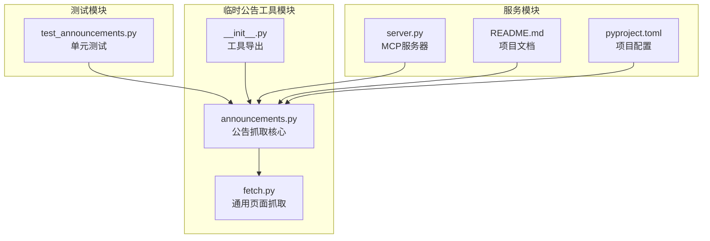
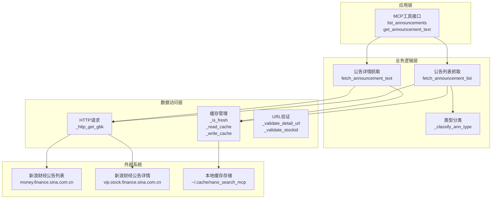
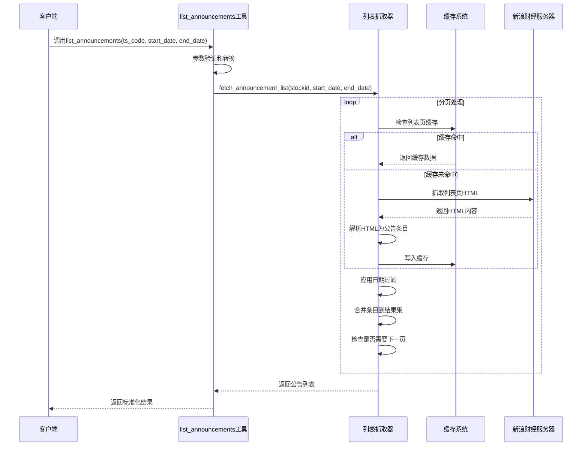
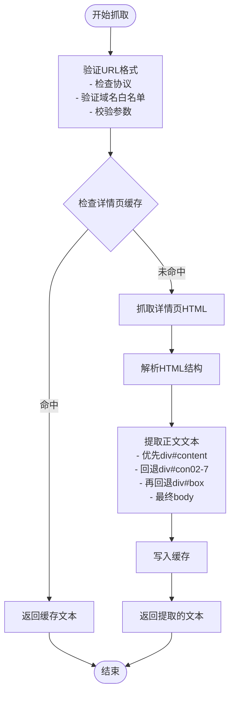
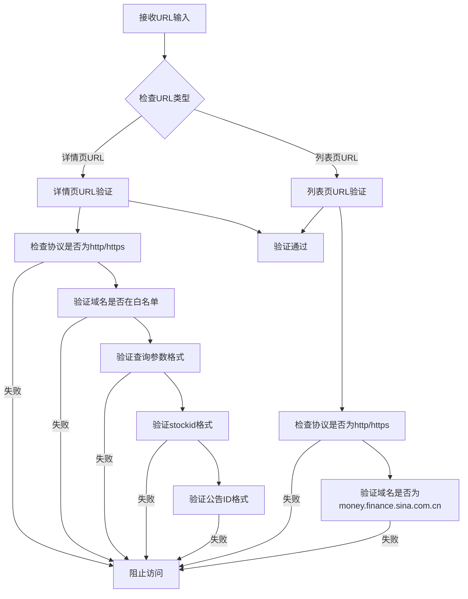
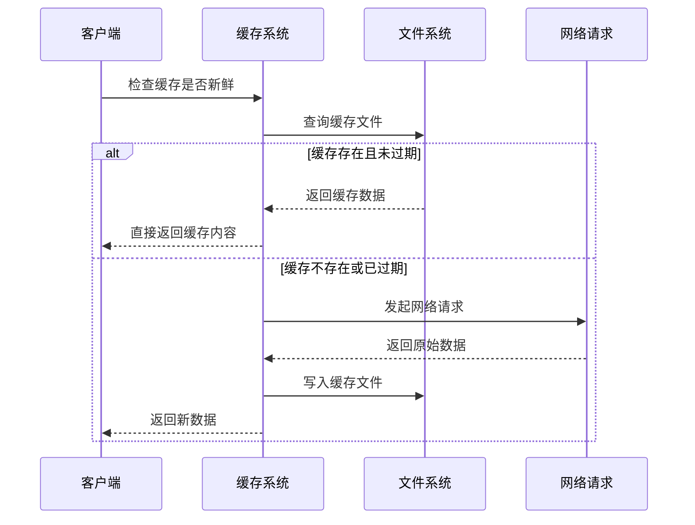
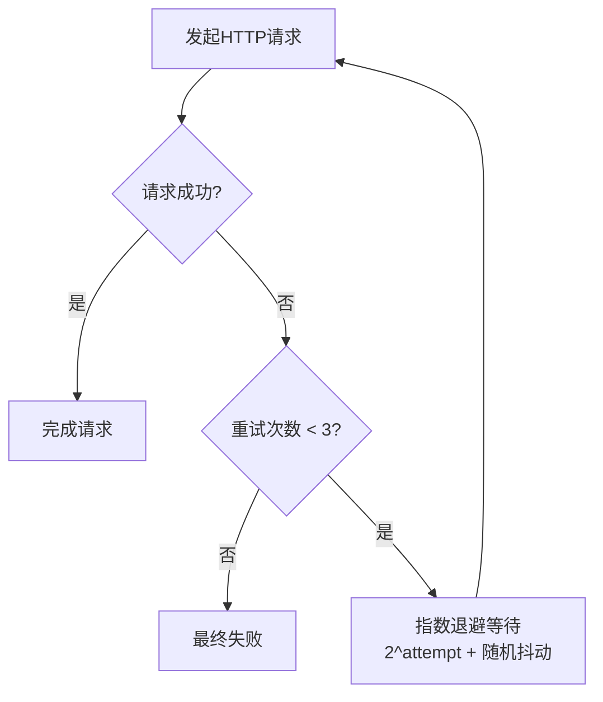
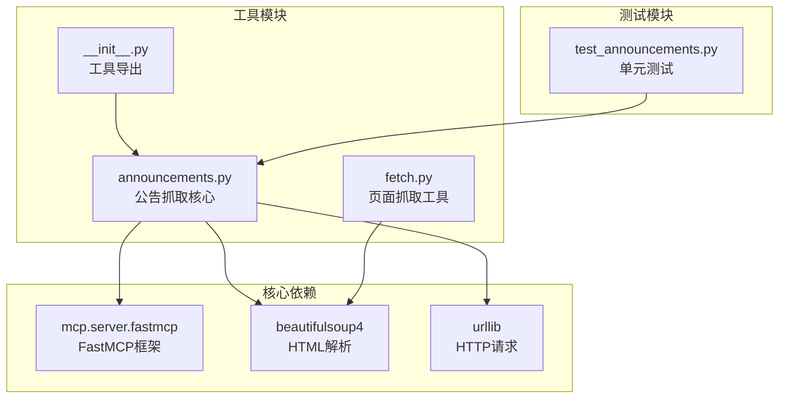

# 临时公告工具

<cite>
**本文引用的文件**
- [announcements.py](file://nano-search-mcp/src/nano_search_mcp/tools/announcements.py)
- [fetch.py](file://nano-search-mcp/src/nano_search_mcp/tools/fetch.py)
- [__init__.py](file://nano-search-mcp/src/nano_search_mcp/tools/__init__.py)
- [test_announcements.py](file://nano-search-mcp/tests/test_announcements.py)
- [README.md](file://nano-search-mcp/README.md)
- [server.py](file://nano-search-mcp/src/nano_search_mcp/server.py)
- [pyproject.toml](file://nano-search-mcp/pyproject.toml)
</cite>

## 目录
1. [简介](#简介)
2. [项目结构](#项目结构)
3. [核心组件](#核心组件)
4. [架构概览](#架构概览)
5. [详细组件分析](#详细组件分析)
6. [依赖关系分析](#依赖关系分析)
7. [性能考虑](#性能考虑)
8. [故障排除指南](#故障排除指南)
9. [结论](#结论)
10. [附录](#附录)

## 简介
临时公告工具是新浪财经临时公告抓取工具，专门用于获取A股上市公司临时公告的列表和详情内容。该工具提供了完整的公告抓取、解析、分类和过滤功能，支持多种安全防护机制和缓存策略。

## 项目结构
该项目采用模块化设计，主要包含以下核心模块：



**图表来源**
- [announcements.py:1-535](file://nano-search-mcp/src/nano_search_mcp/tools/announcements.py#L1-L535)
- [fetch.py:1-245](file://nano-search-mcp/src/nano_search_mcp/tools/fetch.py#L1-L245)
- [__init__.py:1-48](file://nano-search-mcp/src/nano_search_mcp/tools/__init__.py#L1-L48)

**章节来源**
- [announcements.py:1-535](file://nano-search-mcp/src/nano_search_mcp/tools/announcements.py#L1-L535)
- [README.md:178-198](file://nano-search-mcp/README.md#L178-L198)

## 核心组件
临时公告工具包含以下核心组件：

### 1. 公告列表抓取组件
- **功能**：抓取指定股票代码的临时公告列表
- **支持**：日期范围过滤、自动翻页、缓存机制
- **输出**：标准化的公告条目列表

### 2. 公告详情解析组件
- **功能**：抓取并解析单条公告的正文内容
- **支持**：多级容器解析、正文提取
- **输出**：纯文本格式的公告正文

### 3. 类型分类组件
- **功能**：基于关键词规则对公告进行分类
- **支持**：7种公告类型分类
- **输出**：标准化的公告类型标识

### 4. 安全防护组件
- **功能**：防止SSRF攻击、URL注入等安全威胁
- **支持**：域名白名单、URL验证、协议限制
- **输出**：安全的访问控制

**章节来源**
- [announcements.py:312-535](file://nano-search-mcp/src/nano_search_mcp/tools/announcements.py#L312-L535)

## 架构概览
临时公告工具采用分层架构设计，确保功能模块的清晰分离和良好的可维护性：



**图表来源**
- [announcements.py:312-535](file://nano-search-mcp/src/nano_search_mcp/tools/announcements.py#L312-L535)
- [announcements.py:137-178](file://nano-search-mcp/src/nano_search_mcp/tools/announcements.py#L137-L178)

## 详细组件分析

### 公告列表抓取组件
该组件负责获取指定股票代码的临时公告列表，支持完整的数据抓取和处理流程。

#### 核心功能流程


**图表来源**
- [announcements.py:312-376](file://nano-search-mcp/src/nano_search_mcp/tools/announcements.py#L312-L376)

#### 输入参数规范
- **ts_code**：Tushare格式股票代码（如"688270.SH"）
- **start_date**：起始日期（YYYY-MM-DD），默认当年1月1日
- **end_date**：结束日期（YYYY-MM-DD），默认当天
- **ann_types**：公告类型过滤列表（可选）

#### 输出数据结构
```json
{
  "ts_code": "688270.SH",
  "source": "sina",
  "announcements": [
    {
      "ann_date": "2025-04-15",
      "title": "关于收到行政处罚事先告知书的公告",
      "ann_type": "penalty",
      "source_url": "http://vip.stock.finance.sina.com.cn/corp/view/vCB_AllBulletinDetail.php?stockid=688270&id=9001",
      "pdf_url": null
    }
  ]
}
```

**章节来源**
- [announcements.py:404-490](file://nano-search-mcp/src/nano_search_mcp/tools/announcements.py#L404-L490)

### 公告详情抓取组件
该组件负责获取单条公告的完整正文内容，提供高质量的文本提取功能。

#### 文本提取算法


**图表来源**
- [announcements.py:290-306](file://nano-search-mcp/src/nano_search_mcp/tools/announcements.py#L290-L306)

#### 支持的公告类型分类
工具支持以下7种公告类型的自动分类：

| 分类代码 | 语义描述 | 关键词示例 |
|---------|----------|-----------|
| inquiry | 问询函 | 问询函、监管工作函、关注函、问询回复 |
| audit | 审计报告 | 审计报告、审计意见、关键审计事项、非标准审计 |
| accountant_change | 会计师事务所变更 | 会计师事务所变更、更换会计师、续聘会计师、聘请会计师 |
| litigation | 诉讼仲裁 | 诉讼、仲裁、法律纠纷 |
| penalty | 行政处罚 | 行政处罚、纪律处分、监管处罚、监管措施、立案调查、警示函 |
| restatement | 差错更正 | 差错更正、财报重述、追溯调整、前期会计差错 |
| other | 其他公告 | 未归入以上分类的公告 |

**章节来源**
- [announcements.py:58-71](file://nano-search-mcp/src/nano_search_mcp/tools/announcements.py#L58-L71)

### 安全防护机制
工具实现了多层次的安全防护机制，确保系统的安全性和稳定性。

#### SSRF防护机制


**图表来源**
- [announcements.py:99-118](file://nano-search-mcp/src/nano_search_mcp/tools/announcements.py#L99-L118)
- [announcements.py:151-153](file://nano-search-mcp/src/nano_search_mcp/tools/announcements.py#L151-L153)

#### URL验证规则
- **stockid验证**：必须为6位纯数字字符串
- **公告ID验证**：必须为纯数字字符串
- **日期格式验证**：必须符合YYYY-MM-DD格式
- **域名白名单**：仅允许新浪财经相关域名

**章节来源**
- [announcements.py:85-124](file://nano-search-mcp/src/nano_search_mcp/tools/announcements.py#L85-L124)

### 缓存策略
工具实现了智能的缓存策略，平衡数据新鲜度和系统性能。

#### 缓存配置
| 缓存类型 | TTL时长 | 缓存位置 | 缓存键生成 |
|---------|---------|---------|-----------|
| 列表页缓存 | 1小时 | ~/.cache/nano_search_mcp/announcements/{stockid}_p{page}.json | 股票代码+页码 |
| 详情页缓存 | 7天 | ~/.cache/nano_search_mcp/announcements/detail/{id}.txt | 公告ID |

#### 缓存工作流程


**图表来源**
- [announcements.py:193-207](file://nano-search-mcp/src/nano_search_mcp/tools/announcements.py#L193-L207)

**章节来源**
- [announcements.py:73-76](file://nano-search-mcp/src/nano_search_mcp/tools/announcements.py#L73-L76)
- [announcements.py:185-207](file://nano-search-mcp/src/nano_search_mcp/tools/announcements.py#L185-L207)

### 重试机制
工具实现了指数退避重试机制，提高网络请求的可靠性。

#### 重试配置
- **最大重试次数**：3次
- **基础退避因子**：2.0秒
- **随机抖动**：0.2-0.8秒
- **请求间隔**：至少1秒

#### 重试流程


**图表来源**
- [announcements.py:155-178](file://nano-search-mcp/src/nano_search_mcp/tools/announcements.py#L155-L178)

**章节来源**
- [announcements.py:48-51](file://nano-search-mcp/src/nano_search_mcp/tools/announcements.py#L48-L51)
- [announcements.py:155-178](file://nano-search-mcp/src/nano_search_mcp/tools/announcements.py#L155-L178)

## 依赖关系分析
临时公告工具的依赖关系清晰明确，遵循单一职责原则。



**图表来源**
- [announcements.py:28](file://nano-search-mcp/src/nano_search_mcp/tools/announcements.py#L28)
- [fetch.py:10](file://nano-search-mcp/src/nano_search_mcp/tools/fetch.py#L10)

**章节来源**
- [pyproject.toml:6-14](file://nano-search-mcp/pyproject.toml#L6-L14)

## 性能考虑
临时公告工具在设计时充分考虑了性能优化和资源管理。

### 请求限流机制
- **请求间隔**：至少1秒间隔，避免过度请求
- **并发控制**：单线程顺序执行，确保稳定性
- **超时设置**：15秒超时，平衡响应速度和成功率

### 内存管理
- **增量处理**：逐页处理公告列表，避免内存溢出
- **文本截断**：详情页文本长度限制，防止大文件占用
- **缓存清理**：过期缓存自动失效，定期清理

### 网络优化
- **智能缓存**：减少重复网络请求
- **指数退避**：在网络不稳定时自动重试
- **域名白名单**：避免无效请求和DNS解析

## 故障排除指南

### 常见错误类型及解决方案

#### 1. 参数验证错误
**错误表现**：`ValueError: stockid必须是6位纯数字字符串`
**解决方法**：
- 确保传入正确的股票代码格式
- 使用Tushare格式（如"688270.SH"）
- 检查日期格式是否为YYYY-MM-DD

#### 2. 网络请求失败
**错误表现**：`RuntimeError: 抓取新浪公告页失败`
**解决方法**：
- 检查网络连接状态
- 等待一段时间后重试
- 确认新浪财经服务器可访问

#### 3. 缓存相关问题
**错误表现**：缓存文件读取失败或权限不足
**解决方法**：
- 检查用户主目录写入权限
- 确认缓存目录存在且可访问
- 清理损坏的缓存文件

#### 4. URL验证失败
**错误表现**：`ValueError: source_url必须是新浪财经公告详情页`
**解决方法**：
- 确保使用list_announcements返回的source_url
- 避免手动构造URL
- 检查URL是否包含必需的stockid和id参数

**章节来源**
- [announcements.py:453-470](file://nano-search-mcp/src/nano_search_mcp/tools/announcements.py#L453-L470)
- [announcements.py:511-527](file://nano-search-mcp/src/nano_search_mcp/tools/announcements.py#L511-L527)

### 调试建议
1. **启用详细日志**：查看工具输出的调试信息
2. **检查缓存状态**：确认缓存文件是否正常
3. **验证网络连接**：测试直接访问新浪财经网站
4. **参数验证**：使用单元测试验证输入参数

## 结论
临时公告工具是一个功能完整、安全可靠的A股公告抓取解决方案。其特点包括：

### 核心优势
- **安全性高**：多重SSRF防护和URL验证机制
- **性能优秀**：智能缓存和指数退避重试
- **易用性强**：标准化的API接口和错误处理
- **扩展性好**：模块化设计便于功能扩展

### 技术特色
- 支持7种公告类型自动分类
- 提供完整的日期范围过滤功能
- 实现智能缓存策略
- 具备完善的错误处理机制

该工具为量化分析和投资决策提供了重要的数据支撑，是A股市场信息获取的重要工具。

## 附录

### 使用示例

#### 基本使用
```python
# 获取指定公司的公告列表
result = list_announcements(
    ts_code="688270.SH",
    start_date="2025-01-01",
    end_date="2025-12-31"
)
```

#### 类型过滤
```python
# 只获取处罚类公告
result = list_announcements(
    ts_code="688270.SH",
    ann_types=["penalty"]
)
```

#### 获取公告正文
```python
# 获取单条公告的正文
announcement_text = get_announcement_text(
    source_url="http://vip.stock.finance.sina.com.cn/..."
)
```

### 错误处理最佳实践
1. **参数验证**：始终验证输入参数的有效性
2. **异常捕获**：妥善处理网络和解析异常
3. **缓存监控**：定期检查缓存状态和容量
4. **日志记录**：详细记录操作过程和错误信息

### 维护建议
1. **定期更新**：关注新浪财经页面结构变化
2. **性能监控**：监控请求成功率和响应时间
3. **安全审计**：定期审查安全防护机制有效性
4. **文档维护**：保持API文档和使用示例的准确性