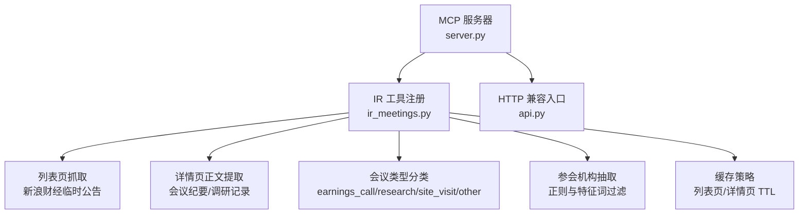
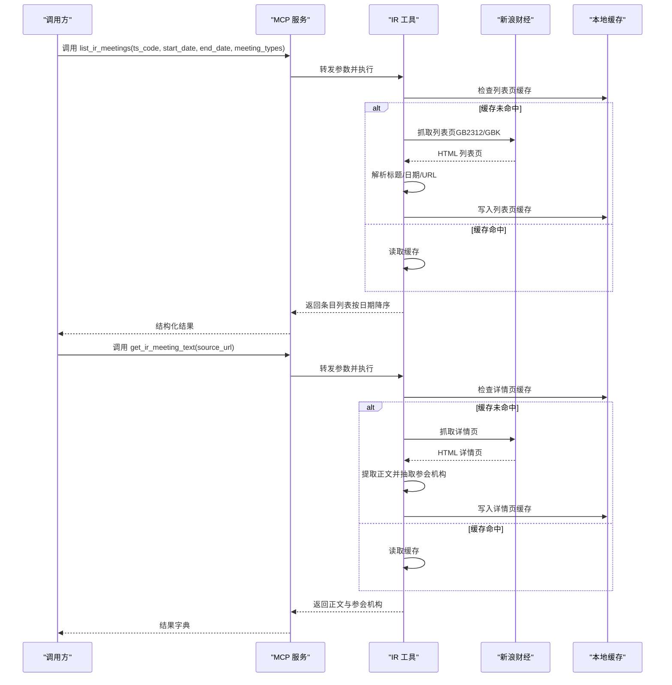
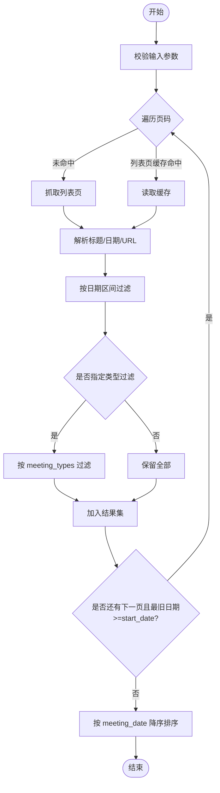
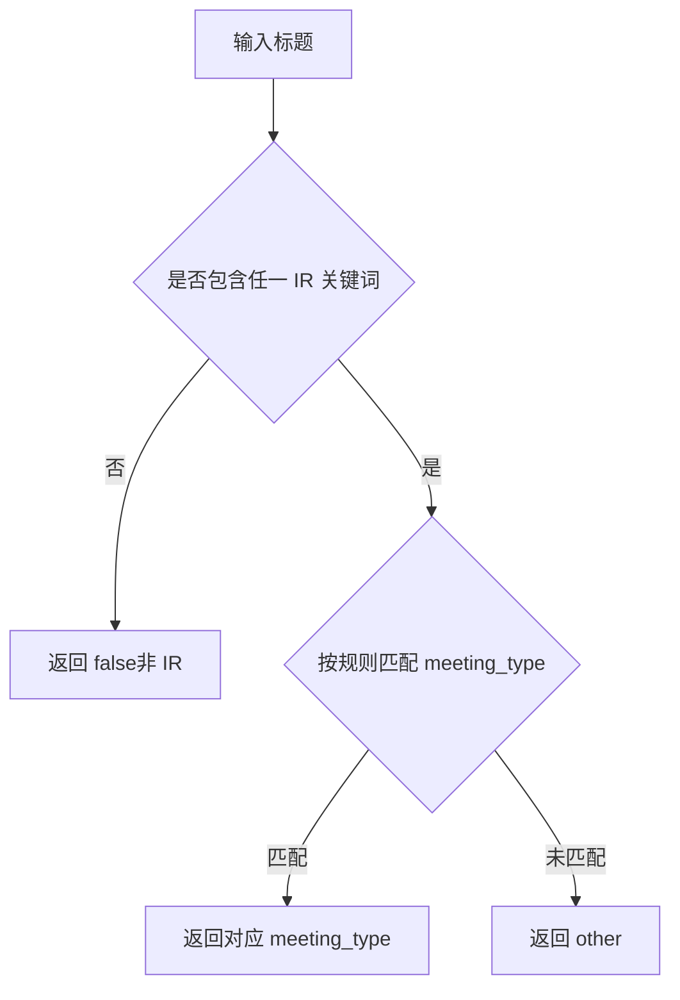
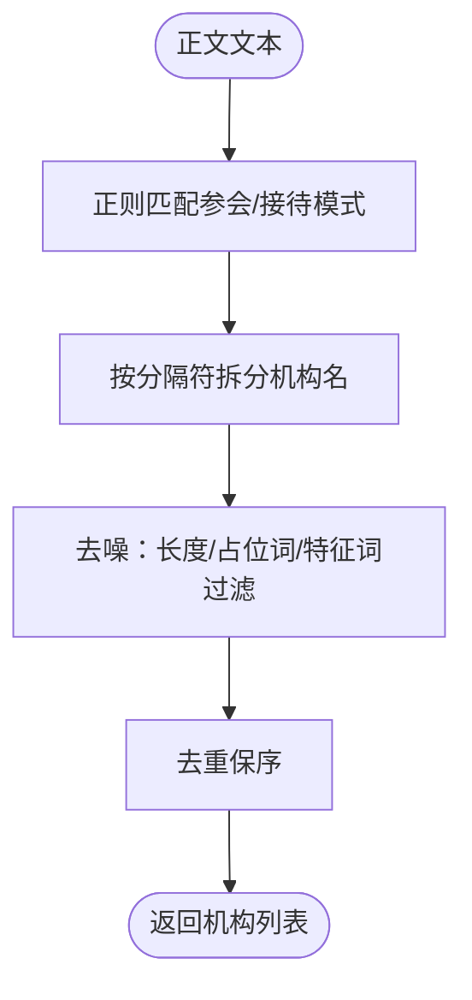
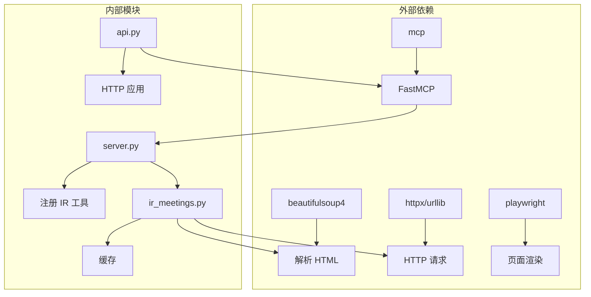

# 投资者关系活动工具

<cite>
**本文引用的文件**
- [ir_meetings.py](file://nano-search-mcp/src/nano_search_mcp/tools/ir_meetings.py)
- [server.py](file://nano-search-mcp/src/nano_search_mcp/server.py)
- [api.py](file://nano-search-mcp/src/nano_search_mcp/api.py)
- [README.md](file://nano-search-mcp/README.md)
- [pyproject.toml](file://nano-search-mcp/pyproject.toml)
- [test_ir_meetings.py](file://nano-search-mcp/tests/test_ir_meetings.py)
- [announcements.py](file://nano-search-mcp/src/nano_search_mcp/tools/announcements.py)
- [fetch.py](file://nano-search-mcp/src/nano_search_mcp/tools/fetch.py)
</cite>

## 目录
1. [简介](#简介)
2. [项目结构](#项目结构)
3. [核心组件](#核心组件)
4. [架构总览](#架构总览)
5. [详细组件分析](#详细组件分析)
6. [依赖关系分析](#依赖关系分析)
7. [性能考量](#性能考量)
8. [故障排查指南](#故障排查指南)
9. [结论](#结论)
10. [附录](#附录)

## 简介
本工具为“投资者关系活动工具”，基于 MCP 协议提供 A 股上市公司投资者关系活动数据的采集与整理能力，涵盖路演活动、业绩说明会、调研接待等 IR 类公告的抓取、分类、筛选与结构化输出。系统以“新浪财经临时公告”为数据源，通过列表页与详情页抓取、标题关键词识别、会议类型分类、参会机构抽取与缓存策略，形成可查询、可导出的数据集。同时，工具遵循严格的安全基线与错误契约，保证在复杂网络环境下的稳定性与可维护性。

## 项目结构
- 顶层模块：nano-search-mcp
  - src/nano_search_mcp/server.py：MCP 服务入口，注册 12 个工具（含 IR 工具）
  - src/nano_search_mcp/api.py：兼容性 HTTP 入口，暴露 streamable HTTP 应用
  - src/nano_search_mcp/tools/ir_meetings.py：IR 活动抓取与解析的核心实现
  - tests/test_ir_meetings.py：IR 工具的单元测试
  - README.md：项目说明与使用指南
  - pyproject.toml：项目依赖与构建配置

图表来源
- [server.py:18-69](file://nano-search-mcp/src/nano_search_mcp/server.py#L18-L69)
- [ir_meetings.py:394-618](file://nano-search-mcp/src/nano_search_mcp/tools/ir_meetings.py#L394-L618)

章节来源
- [README.md:178-198](file://nano-search-mcp/README.md#L178-L198)
- [pyproject.toml:1-44](file://nano-search-mcp/pyproject.toml#L1-L44)

## 核心组件
- IR 活动列表抓取与筛选
  - 支持按股票代码、起止日期进行筛选，自动翻页并早停
  - 使用标题关键词识别 IR 条目，避免非 IR 公告干扰
- 会议类型分类
  - 基于标题关键词规则，将活动归类为业绩说明会、实地调研、机构调研或其他
- 参会机构抽取
  - 从正文提取“参会/接待：机构A、机构B”等模式，结合特征词与噪声词过滤
- 数据源与缓存
  - 列表页缓存 1 小时，详情页缓存 7 天，降低重复抓取成本
- 错误契约与安全基线
  - 统一返回失败结构，不抛异常；域名白名单与 SSRF 防护；指数退避重试与请求限频

章节来源
- [ir_meetings.py:394-463](file://nano-search-mcp/src/nano_search_mcp/tools/ir_meetings.py#L394-L463)
- [ir_meetings.py:489-618](file://nano-search-mcp/src/nano_search_mcp/tools/ir_meetings.py#L489-L618)
- [ir_meetings.py:266-308](file://nano-search-mcp/src/nano_search_mcp/tools/ir_meetings.py#L266-L308)
- [ir_meetings.py:237-260](file://nano-search-mcp/src/nano_search_mcp/tools/ir_meetings.py#L237-L260)

## 架构总览
IR 工具通过 MCP 服务对外提供两个核心工具：
- list_ir_meetings：列出指定股票的 IR 活动条目，支持日期区间与会议类型过滤
- get_ir_meeting_text：抓取单条 IR 纪要正文并抽取参会机构

图表来源
- [ir_meetings.py:394-463](file://nano-search-mcp/src/nano_search_mcp/tools/ir_meetings.py#L394-L463)
- [ir_meetings.py:465-482](file://nano-search-mcp/src/nano_search_mcp/tools/ir_meetings.py#L465-L482)
- [ir_meetings.py:489-618](file://nano-search-mcp/src/nano_search_mcp/tools/ir_meetings.py#L489-L618)

## 详细组件分析

### 组件 A：IR 活动列表抓取与筛选
- 功能要点
  - 输入校验：股票代码、日期格式、URL 合法性
  - 列表页抓取：支持第 1 页与后续翻页，最多翻页上限
  - 早停机制：当页面最旧日期早于起始日期时提前停止
  - 日期过滤：仅保留起止日期之间的条目
  - 会议类型过滤：可按 meeting_types 过滤
  - 排序：按 meeting_date 降序排列
- 数据结构
  - 返回条目包含：meeting_date、title、meeting_type、source_url、participants、summary
- 错误处理
  - 参数非法返回统一失败结构；网络失败抛出运行时错误（MCP 包装层捕获并转换）

图表来源
- [ir_meetings.py:394-463](file://nano-search-mcp/src/nano_search_mcp/tools/ir_meetings.py#L394-L463)

章节来源
- [ir_meetings.py:394-463](file://nano-search-mcp/src/nano_search_mcp/tools/ir_meetings.py#L394-L463)
- [test_ir_meetings.py:176-202](file://nano-search-mcp/tests/test_ir_meetings.py#L176-L202)

### 组件 B：会议类型分类与标题过滤
- 标题关键词识别
  - 通过固定关键词集合识别 IR 类公告，避免非 IR 条目混入
- 会议类型规则
  - 业绩说明会：包含“业绩说明会”“电话会议”“网上业绩”等关键词
  - 实地调研：包含“实地调研”“现场参观”等关键词
  - 机构调研：包含“调研”“机构投资者”“投资者关系活动记录”等关键词
  - 兜底：未匹配归类为 other
- 规则优先级
  - 先匹配先胜，确保分类一致性

图表来源
- [ir_meetings.py:266-277](file://nano-search-mcp/src/nano_search_mcp/tools/ir_meetings.py#L266-L277)
- [ir_meetings.py:92-106](file://nano-search-mcp/src/nano_search_mcp/tools/ir_meetings.py#L92-L106)

章节来源
- [ir_meetings.py:266-277](file://nano-search-mcp/src/nano_search_mcp/tools/ir_meetings.py#L266-L277)
- [test_ir_meetings.py:116-133](file://nano-search-mcp/tests/test_ir_meetings.py#L116-L133)

### 组件 C：参会机构抽取与清洗
- 抽取策略
  - 正则匹配“参会/接待：机构A、机构B”等模式
  - 按多种分隔符拆分机构名
  - 去重与保序
- 机构名特征过滤
  - 必须包含“证券/资本/基金/银行/资产/投资/保险/信托/公司/研究所/研究院/财富/期货/私募/家族办公室”等关键词
  - 过滤占位词/噪声词（如“其他”“详见”“附件”“见下”“等机构”等）
- 输出
  - 返回去噪后的机构名称列表

图表来源
- [ir_meetings.py:279-308](file://nano-search-mcp/src/nano_search_mcp/tools/ir_meetings.py#L279-L308)

章节来源
- [ir_meetings.py:279-308](file://nano-search-mcp/src/nano_search_mcp/tools/ir_meetings.py#L279-L308)
- [test_ir_meetings.py:139-158](file://nano-search-mcp/tests/test_ir_meetings.py#L139-L158)

### 组件 D：数据源整合与内容标准化
- 数据源
  - 新浪财经临时公告列表页与详情页
- 内容标准化
  - 列表页：提取 meeting_date、title、meeting_type、source_url
  - 详情页：提取正文文本，用于全文检索与机构抽取
- 结构化输出
  - list_ir_meetings 返回包含条目数组的字典
  - get_ir_meeting_text 返回包含 full_text、participants、extracted_at 的字典

章节来源
- [ir_meetings.py:324-388](file://nano-search-mcp/src/nano_search_mcp/tools/ir_meetings.py#L324-L388)
- [ir_meetings.py:489-618](file://nano-search-mcp/src/nano_search_mcp/tools/ir_meetings.py#L489-L618)

### 组件 E：缓存与性能优化
- 缓存策略
  - 列表页缓存：TTL 1 小时，避免频繁抓取
  - 详情页缓存：TTL 7 天，适合重复查询同一公告
- 请求节流与重试
  - 相邻请求最小间隔 1 秒
  - 指数退避重试，最多 3 次
- 性能影响
  - 缓存命中率高时显著降低网络与解析开销
  - 早停机制减少无效翻页

章节来源
- [ir_meetings.py:125-129](file://nano-search-mcp/src/nano_search_mcp/tools/ir_meetings.py#L125-L129)
- [ir_meetings.py:193-231](file://nano-search-mcp/src/nano_search_mcp/tools/ir_meetings.py#L193-L231)
- [test_ir_meetings.py:208-236](file://nano-search-mcp/tests/test_ir_meetings.py#L208-L236)

### 组件 F：MCP 工具注册与服务集成
- 工具注册
  - list_ir_meetings：支持 ts_code、start_date、end_date、meeting_types
  - get_ir_meeting_text：支持 source_url
- 服务集成
  - server.py 统一注册 12 个工具，包含 IR 工具
  - api.py 暴露 streamable HTTP 应用，便于外部调用

章节来源
- [ir_meetings.py:489-618](file://nano-search-mcp/src/nano_search_mcp/tools/ir_meetings.py#L489-L618)
- [server.py:18-69](file://nano-search-mcp/src/nano_search_mcp/server.py#L18-L69)
- [api.py:1-12](file://nano-search-mcp/src/nano_search_mcp/api.py#L1-L12)

## 依赖关系分析
- 外部依赖
  - mcp：MCP 协议与服务框架
  - beautifulsoup4：HTML 解析
  - httpx/urllib：HTTP 请求
  - playwright：页面渲染（用于 fetch_page，IR 工具使用 urllib 抓取）
- 内部依赖
  - server.py 依赖 tools.ir_meetings.register_ir_meeting_tools
  - api.py 依赖 server.mcp.streamable_http_app

图表来源
- [pyproject.toml:6-14](file://nano-search-mcp/pyproject.toml#L6-L14)
- [server.py:18-69](file://nano-search-mcp/src/nano_search_mcp/server.py#L18-L69)
- [api.py:1-12](file://nano-search-mcp/src/nano_search_mcp/api.py#L1-L12)

章节来源
- [pyproject.toml:6-14](file://nano-search-mcp/pyproject.toml#L6-L14)
- [server.py:18-69](file://nano-search-mcp/src/nano_search_mcp/server.py#L18-L69)

## 性能考量
- 抓取频率控制
  - 请求间隔 1 秒，避免触发目标站点限流
- 指数退避重试
  - 失败时按 2^attempt 递增等待，提升成功率
- 缓存命中
  - 列表页 1 小时、详情页 7 天，显著降低重复抓取成本
- 早停机制
  - 当页面最旧日期早于起始日期时提前停止翻页，减少无效请求
- HTML 解析与正文提取
  - 使用 BeautifulSoup 精确定位正文容器，避免噪声内容影响

[本节为通用性能讨论，无需特定文件来源]

## 故障排查指南
- 常见问题与定位
  - 参数非法：stockid 必须为 6 位数字；日期格式必须为 YYYY-MM-DD；meeting_types 必须在合法集合内
  - URL 不合法：详情页 URL 必须来自新浪财经公告详情页，且包含合法 stockid 与 id
  - 网络失败：抓取失败会抛出运行时错误，MCP 包装层捕获并返回失败结构
  - 缓存未命中：检查缓存目录权限与磁盘空间
- 单元测试覆盖
  - 输入校验、标题过滤、类型分类、机构抽取、HTML 解析、缓存命中、网络错误、MCP 工具包装等
- 安全基线
  - 域名白名单与 SSRF 防护，拒绝非允许协议与内网地址

章节来源
- [test_ir_meetings.py:29-84](file://nano-search-mcp/tests/test_ir_meetings.py#L29-L84)
- [test_ir_meetings.py:208-251](file://nano-search-mcp/tests/test_ir_meetings.py#L208-L251)
- [test_ir_meetings.py:266-294](file://nano-search-mcp/tests/test_ir_meetings.py#L266-L294)
- [ir_meetings.py:149-167](file://nano-search-mcp/src/nano_search_mcp/tools/ir_meetings.py#L149-L167)

## 结论
本工具以“新浪财经临时公告”为核心数据源，提供了从列表页抓取、标题识别、会议类型分类、正文提取与参会机构抽取的完整链路。通过严格的输入校验、域名白名单与指数退避重试，以及列表页与详情页缓存策略，系统在复杂网络环境下仍能保持稳定与高效。MCP 工具接口统一、错误契约清晰，便于在上层应用中集成与扩展。

[本节为总结性内容，无需特定文件来源]

## 附录

### A. 活动类型分类与关键词
- 业绩说明会：包含“业绩说明会”“电话会议”“网上业绩”等关键词
- 实地调研：包含“实地调研”“现场参观”等关键词
- 机构调研：包含“调研”“机构投资者”“投资者关系活动记录”等关键词
- 兜底：other

章节来源
- [ir_meetings.py:17-22](file://nano-search-mcp/src/nano_search_mcp/tools/ir_meetings.py#L17-L22)
- [ir_meetings.py:92-106](file://nano-search-mcp/src/nano_search_mcp/tools/ir_meetings.py#L92-L106)

### B. 时间筛选与地点过滤机制
- 时间筛选
  - 支持 start_date 与 end_date 参数，按 meeting_date 过滤
  - 早停机制：当页面最旧日期早于起始日期时提前停止
- 地点过滤
  - 当前版本未提供地点过滤字段；如需地点信息，可在正文抽取后二次处理

章节来源
- [ir_meetings.py:394-463](file://nano-search-mcp/src/nano_search_mcp/tools/ir_meetings.py#L394-L463)
- [ir_meetings.py:373-377](file://nano-search-mcp/src/nano_search_mcp/tools/ir_meetings.py#L373-L377)

### C. 数据源整合与内容标准化流程
- 数据源
  - 新浪财经临时公告列表页与详情页
- 标准化流程
  - 列表页：提取 meeting_date、title、meeting_type、source_url
  - 详情页：提取正文文本，用于全文检索与机构抽取
  - 结构化输出：list_ir_meetings 返回条目数组；get_ir_meeting_text 返回正文与参会机构

章节来源
- [ir_meetings.py:324-388](file://nano-search-mcp/src/nano_search_mcp/tools/ir_meetings.py#L324-L388)
- [ir_meetings.py:489-618](file://nano-search-mcp/src/nano_search_mcp/tools/ir_meetings.py#L489-L618)

### D. 活动提醒与通知机制
- 当前实现
  - 未提供活动提醒与通知机制
- 建议方案
  - 在上层应用中基于 list_ir_meetings 的结果进行增量检测与订阅推送
  - 可结合定时任务与消息队列实现通知

[本节为概念性建议，无需特定文件来源]

### E. 活动查询示例与数据导出方案
- 查询示例
  - 获取某股票近期 IR 活动：list_ir_meetings(ts_code="000001.SZ", start_date="2026-01-01", end_date="2026-12-31")
  - 按类型过滤：list_ir_meetings(ts_code="000001.SZ", meeting_types=["earnings_call","site_visit"])
  - 获取单条公告全文与参会机构：get_ir_meeting_text(source_url="...")
- 数据导出
  - JSON：直接使用 MCP 返回的字典结构
  - CSV：在上层应用中将条目数组转换为 CSV（包含 meeting_date、title、meeting_type、source_url、participants 等字段）

章节来源
- [ir_meetings.py:489-618](file://nano-search-mcp/src/nano_search_mcp/tools/ir_meetings.py#L489-L618)
- [README.md:126-148](file://nano-search-mcp/README.md#L126-L148)