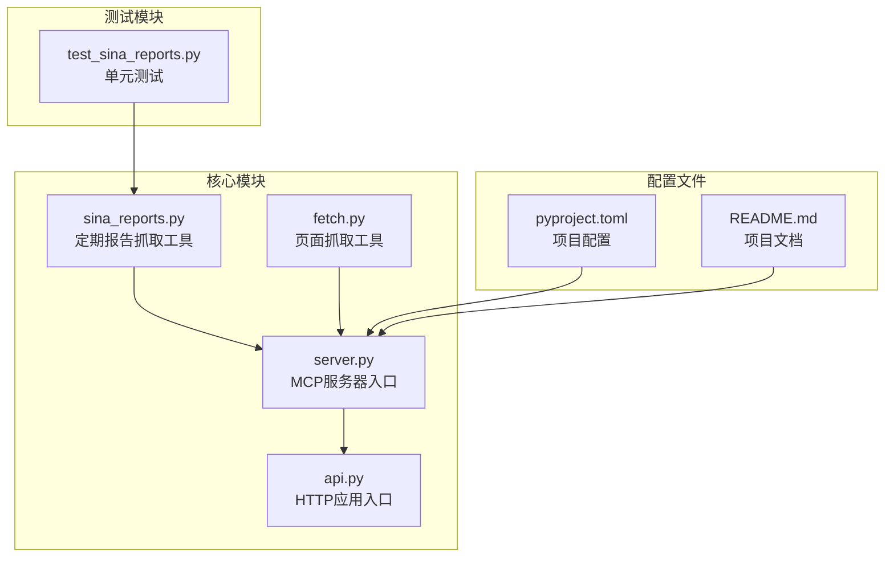
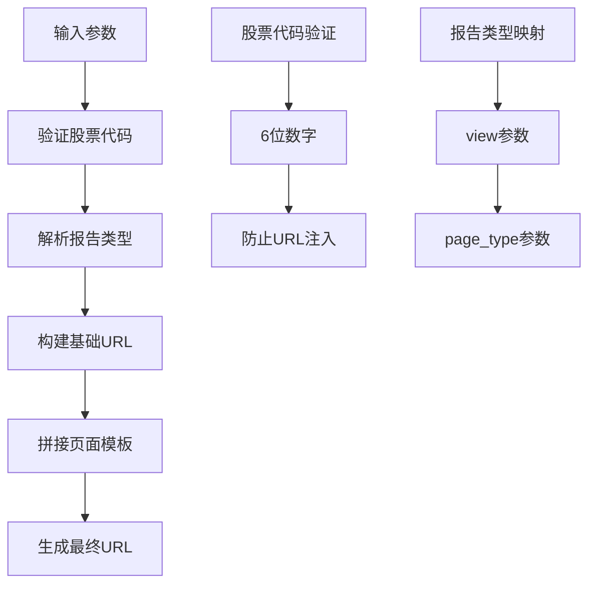
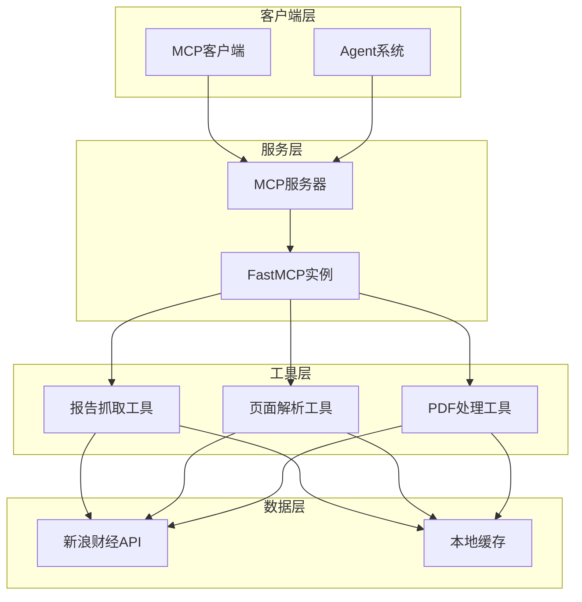
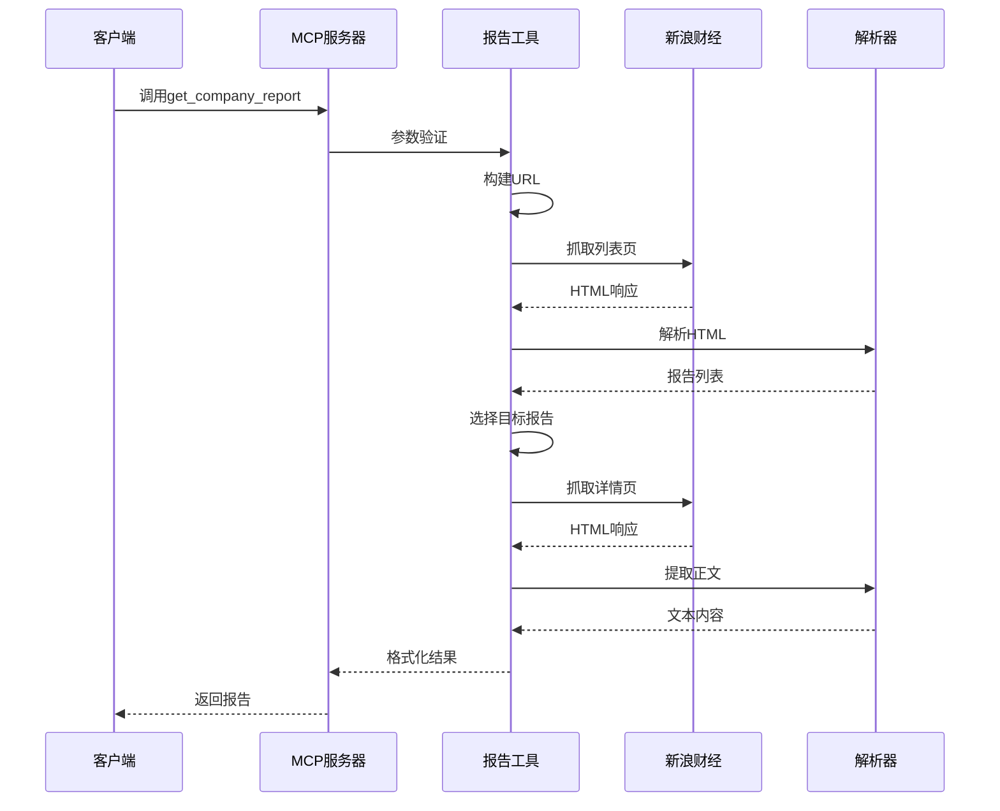
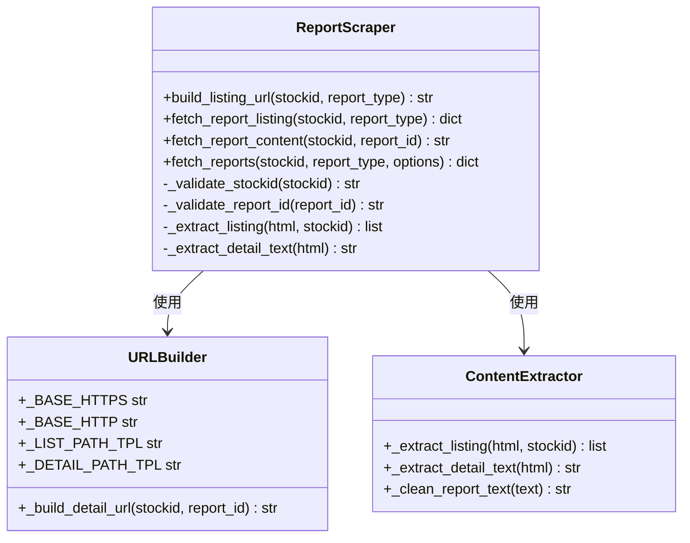
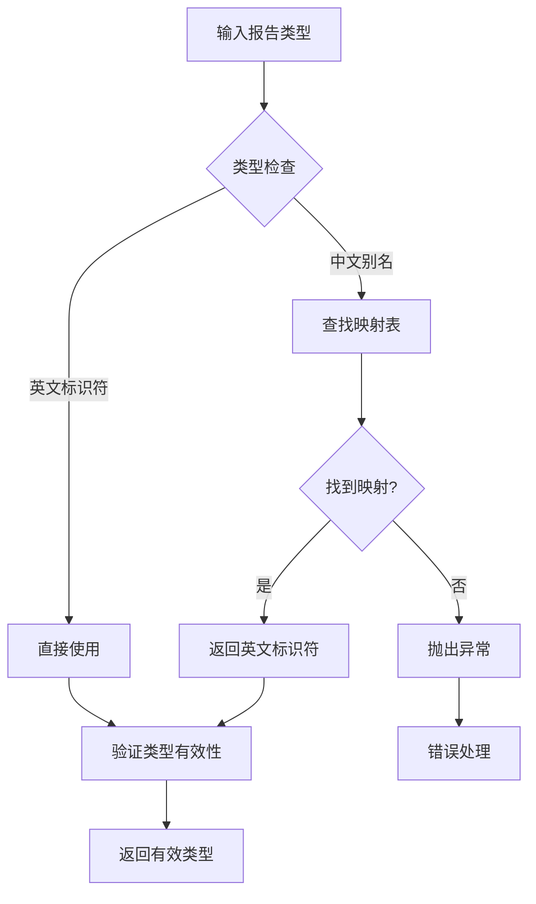
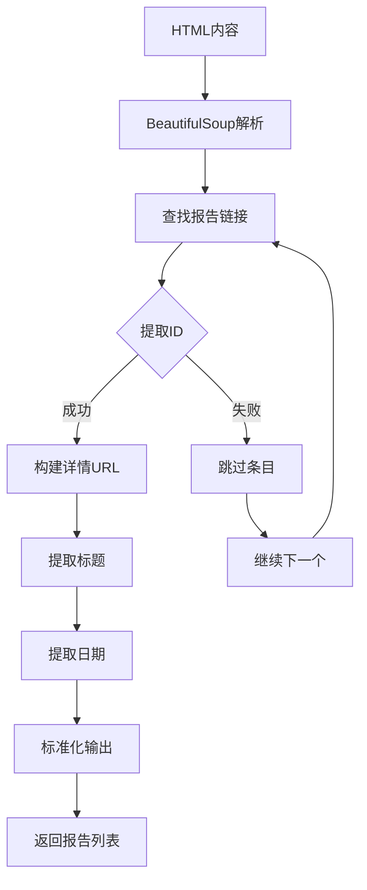
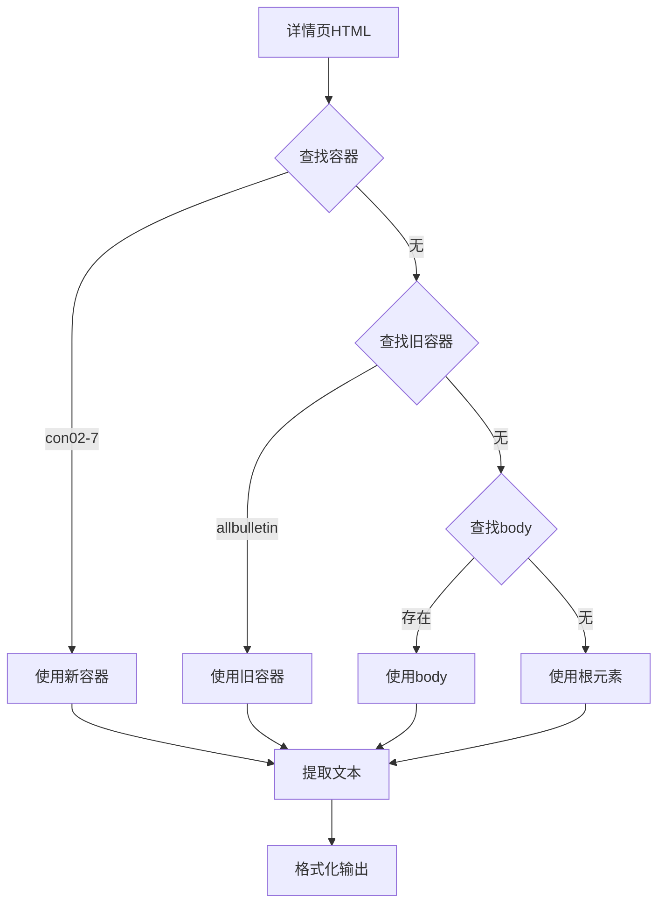
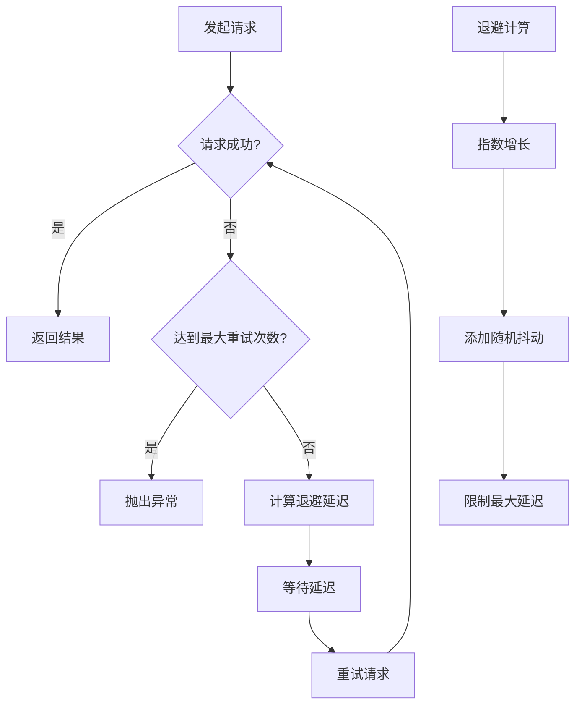
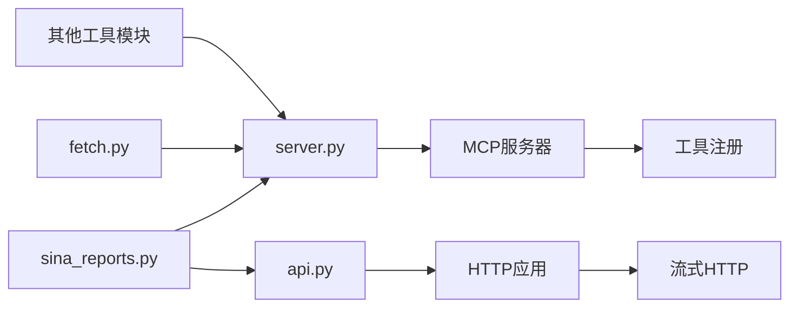

# 新浪财经报告工具

<cite>
**本文档引用的文件**
- [sina_reports.py](file://nano-search-mcp/src/nano_search_mcp/tools/sina_reports.py)
- [test_sina_reports.py](file://nano-search-mcp/tests/test_sina_reports.py)
- [server.py](file://nano-search-mcp/src/nano_search_mcp/server.py)
- [api.py](file://nano-search-mcp/src/nano_search_mcp/api.py)
- [fetch.py](file://nano-search-mcp/src/nano_search_mcp/tools/fetch.py)
- [README.md](file://nano-search-mcp/README.md)
- [pyproject.toml](file://nano-search-mcp/pyproject.toml)
</cite>

## 目录
1. [简介](#简介)
2. [项目结构](#项目结构)
3. [核心组件](#核心组件)
4. [架构概览](#架构概览)
5. [详细组件分析](#详细组件分析)
6. [依赖关系分析](#依赖关系分析)
7. [性能考虑](#性能考虑)
8. [故障排除指南](#故障排除指南)
9. [结论](#结论)
10. [附录](#附录)

## 简介

新浪财经报告工具是一个基于MCP协议的A股定期报告获取工具，专门用于从新浪财经网站抓取和解析上市公司定期报告数据。该工具支持季度报告、年度报告、业绩预告等多种报告类型的抓取和解析，为量化分析和投资决策提供可靠的数据基础。

该工具的核心功能包括：
- 定期报告列表页抓取和解析
- 报告详情页正文提取
- 报告类型识别和过滤
- 数据验证和错误处理
- PDF下载和内容提取机制

## 项目结构

项目采用模块化设计，主要包含以下核心模块：



**图表来源**
- [sina_reports.py:1-369](file://nano-search-mcp/src/nano_search_mcp/tools/sina_reports.py#L1-L369)
- [server.py:1-91](file://nano-search-mcp/src/nano_search_mcp/server.py#L1-L91)
- [api.py:1-12](file://nano-search-mcp/src/nano_search_mcp/api.py#L1-L12)

**章节来源**
- [sina_reports.py:1-369](file://nano-search-mcp/src/nano_search_mcp/tools/sina_reports.py#L1-L369)
- [server.py:1-91](file://nano-search-mcp/src/nano_search_mcp/server.py#L1-L91)
- [pyproject.toml:1-44](file://nano-search-mcp/pyproject.toml#L1-L44)

## 核心组件

### 报告类型系统

工具支持四种主要的定期报告类型，每种类型都有对应的英文标识符和中文别名：

| 报告类型 | 英文标识符 | 中文别名 | 页面类型 |
|---------|-----------|----------|----------|
| 年度报告 | annual | 年报、年度报告 | ndbg |
| 半年度报告 | semi | 半年报、中报、中期报告 | zqbg |
| 第一季度报告 | q1 | 一季报、一季度报告 | yjdbg |
| 第三季度报告 | q3 | 三季报、三季度报告 | sjdbg |

### URL构建机制

工具采用固定的URL模式来访问新浪财经的报告页面：



**图表来源**
- [sina_reports.py:103-108](file://nano-search-mcp/src/nano_search_mcp/tools/sina_reports.py#L103-L108)
- [sina_reports.py:46-54](file://nano-search-mcp/src/nano_search_mcp/tools/sina_reports.py#L46-L54)

**章节来源**
- [sina_reports.py:46-68](file://nano-search-mcp/src/nano_search_mcp/tools/sina_reports.py#L46-L68)
- [sina_reports.py:103-108](file://nano-search-mcp/src/nano_search_mcp/tools/sina_reports.py#L103-L108)

## 架构概览

### 整体架构设计



**图表来源**
- [server.py:19-58](file://nano-search-mcp/src/nano_search_mcp/server.py#L19-L58)
- [sina_reports.py:314-369](file://nano-search-mcp/src/nano_search_mcp/tools/sina_reports.py#L314-L369)

### 数据流处理



**图表来源**
- [sina_reports.py:249-304](file://nano-search-mcp/src/nano_search_mcp/tools/sina_reports.py#L249-L304)
- [sina_reports.py:156-209](file://nano-search-mcp/src/nano_search_mcp/tools/sina_reports.py#L156-L209)

**章节来源**
- [server.py:19-70](file://nano-search-mcp/src/nano_search_mcp/server.py#L19-L70)
- [sina_reports.py:249-304](file://nano-search-mcp/src/nano_search_mcp/tools/sina_reports.py#L249-L304)

## 详细组件分析

### 报告抓取工具

#### 核心功能实现



**图表来源**
- [sina_reports.py:103-153](file://nano-search-mcp/src/nano_search_mcp/tools/sina_reports.py#L103-L153)
- [sina_reports.py:156-209](file://nano-search-mcp/src/nano_search_mcp/tools/sina_reports.py#L156-L209)

#### 报告类型识别机制



**图表来源**
- [sina_reports.py:91-100](file://nano-search-mcp/src/nano_search_mcp/tools/sina_reports.py#L91-L100)
- [sina_reports.py:46-61](file://nano-search-mcp/src/nano_search_mcp/tools/sina_reports.py#L46-L61)

**章节来源**
- [sina_reports.py:78-100](file://nano-search-mcp/src/nano_search_mcp/tools/sina_reports.py#L78-L100)
- [sina_reports.py:46-61](file://nano-search-mcp/src/nano_search_mcp/tools/sina_reports.py#L46-L61)

### 数据解析组件

#### HTML解析流程



**图表来源**
- [sina_reports.py:156-191](file://nano-search-mcp/src/nano_search_mcp/tools/sina_reports.py#L156-L191)

#### 正文提取算法

正文提取采用多级选择器策略，确保能够适应不同版本的页面结构：



**图表来源**
- [sina_reports.py:194-208](file://nano-search-mcp/src/nano_search_mcp/tools/sina_reports.py#L194-L208)

**章节来源**
- [sina_reports.py:156-209](file://nano-search-mcp/src/nano_search_mcp/tools/sina_reports.py#L156-L209)

### 错误处理和重试机制

#### 网络请求重试策略



**图表来源**
- [sina_reports.py:127-153](file://nano-search-mcp/src/nano_search_mcp/tools/sina_reports.py#L127-L153)

#### 安全防护机制

工具实现了多层次的安全防护措施：

1. **URL验证**：防止URL注入和SSRF攻击
2. **域名白名单**：仅允许访问指定域名
3. **输入验证**：严格验证股票代码和报告ID格式
4. **内容清理**：移除潜在的恶意内容

**章节来源**
- [sina_reports.py:117-153](file://nano-search-mcp/src/nano_search_mcp/tools/sina_reports.py#L117-L153)
- [sina_reports.py:78-88](file://nano-search-mcp/src/nano_search_mcp/tools/sina_reports.py#L78-L88)

## 依赖关系分析

### 外部依赖

```mermaid
graph TB
subgraph "核心依赖"
A[mcp[cli]>=1.0.0<br/>MCP协议支持]
B[beautifulsoup4>=4.12.0<br/>HTML解析]
C[httpx>=0.27.0<br/>HTTP客户端]
end
subgraph "开发依赖"
D[pytest>=8.3.0<br/>测试框架]
E[ruff>=0.1.0<br/>代码质量]
end
subgraph "运行时依赖"
F[playwright>=1.40.0<br/>页面渲染]
G[markdownify>=0.13.0<br/>HTML转Markdown]
H[uvicorn>=0.30.0<br/>ASGI服务器]
end
A --> I[主应用]
B --> I
C --> I
F --> I
G --> I
H --> I
```

**图表来源**
- [pyproject.toml:6-14](file://nano-search-mcp/pyproject.toml#L6-L14)

### 内部模块依赖



**图表来源**
- [server.py:8-16](file://nano-search-mcp/src/nano_search_mcp/server.py#L8-L16)
- [sina_reports.py:314-316](file://nano-search-mcp/src/nano_search_mcp/tools/sina_reports.py#L314-L316)

**章节来源**
- [pyproject.toml:6-19](file://nano-search-mcp/pyproject.toml#L6-L19)
- [server.py:8-16](file://nano-search-mcp/src/nano_search_mcp/server.py#L8-L16)

## 性能考虑

### 抓取性能优化

1. **连接复用**：使用HTTP客户端连接池减少建立连接的开销
2. **异步处理**：支持异步请求提高并发性能
3. **缓存策略**：合理利用浏览器缓存和CDN加速
4. **超时控制**：设置合理的超时时间避免长时间阻塞

### 内存管理

1. **流式处理**：大文件采用流式下载避免内存溢出
2. **内容截断**：对过长内容进行截断处理
3. **垃圾回收**：及时释放不需要的对象引用

### 网络优化

1. **指数退避**：网络不稳定时采用指数退避策略
2. **重试机制**：对临时性错误进行自动重试
3. **负载均衡**：合理分配请求到不同的服务器

## 故障排除指南

### 常见问题诊断

#### 参数验证错误

当遇到参数验证错误时，通常是因为：
- 股票代码格式不正确（必须是6位数字）
- 报告类型不在支持范围内
- 年份参数超出有效范围

#### 网络连接问题

网络连接失败可能由以下原因造成：
- 网络环境不稳定
- 新浪财经服务器暂时不可用
- 防火墙或代理设置阻止访问

#### 解析错误

HTML解析失败通常由于：
- 页面结构发生变化
- 网络请求返回了错误内容
- 编码格式不正确

### 调试方法

1. **启用详细日志**：查看详细的请求和响应信息
2. **检查网络状态**：验证网络连接和DNS解析
3. **验证URL格式**：确保构建的URL符合预期
4. **测试页面访问**：手动访问目标页面确认可用性

**章节来源**
- [test_sina_reports.py:164-212](file://nano-search-mcp/tests/test_sina_reports.py#L164-L212)

## 结论

新浪财经报告工具是一个功能完整、设计合理的A股定期报告获取解决方案。该工具具有以下特点：

1. **功能完备**：支持多种报告类型的抓取和解析
2. **安全可靠**：实现了多层次的安全防护机制
3. **易于使用**：提供简洁的API接口和清晰的错误信息
4. **性能优秀**：采用异步处理和连接复用技术
5. **可扩展性强**：模块化设计便于功能扩展

该工具为量化分析和投资决策提供了高质量的数据基础，是构建金融分析系统的理想选择。

## 附录

### 接口规范

#### get_company_report 工具参数

| 参数名 | 类型 | 必填 | 默认值 | 说明 |
|--------|------|------|--------|------|
| stockid | str | 是 | 无 | 股票代码，6位数字 |
| year | int | 是 | 无 | 报告所属年份 |
| report_type | str | 否 | "annual" | 报告类型标识符 |

#### 返回值格式

工具返回包含以下字段的字典：
- `stockid`: 股票代码
- `report_type`: 报告类型
- `listing_url`: 报告列表页URL
- `reports`: 报告列表，每个报告包含title、date、id、url、content等字段

### 使用示例

#### 基本使用

```python
# 获取指定年份的年报
result = get_company_report(
    stockid="600519",
    year=2023,
    report_type="annual"
)

# 获取一季报
result = get_company_report(
    stockid="600519", 
    year=2023,
    report_type="q1"
)
```

#### 高级使用

```python
# 获取多个报告
result = fetch_reports(
    stockid="600519",
    report_type="annual",
    limit=5,
    fetch_content=True,
    exclude_english=True,
    exclude_summary=True
)
```

### 最佳实践

1. **参数验证**：始终验证输入参数的有效性
2. **错误处理**：妥善处理网络和解析错误
3. **性能优化**：合理设置超时和重试参数
4. **安全防护**：遵循安全编程最佳实践
5. **监控告警**：建立完善的监控和告警机制