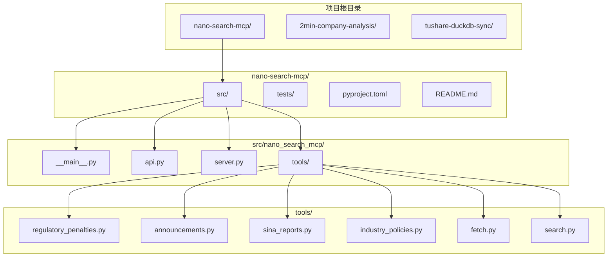
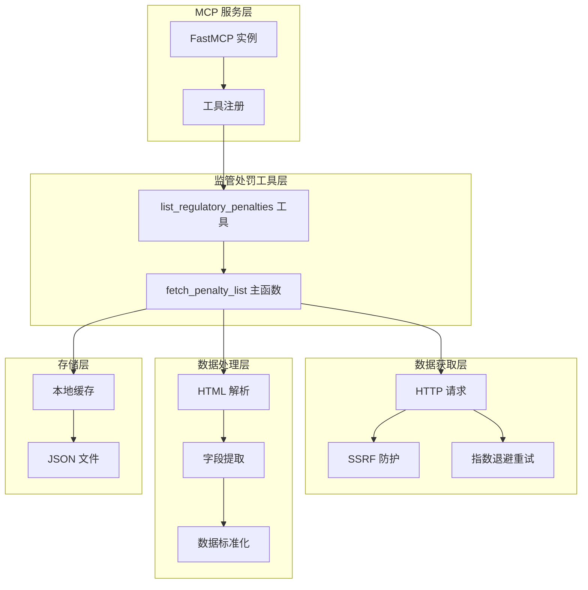
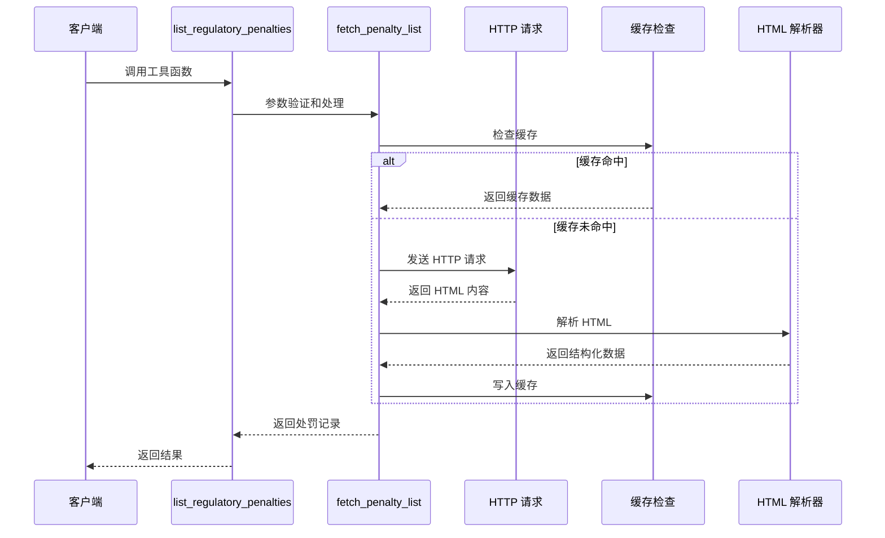
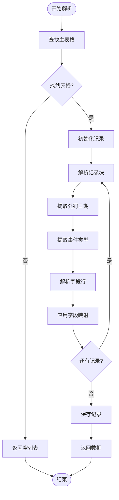
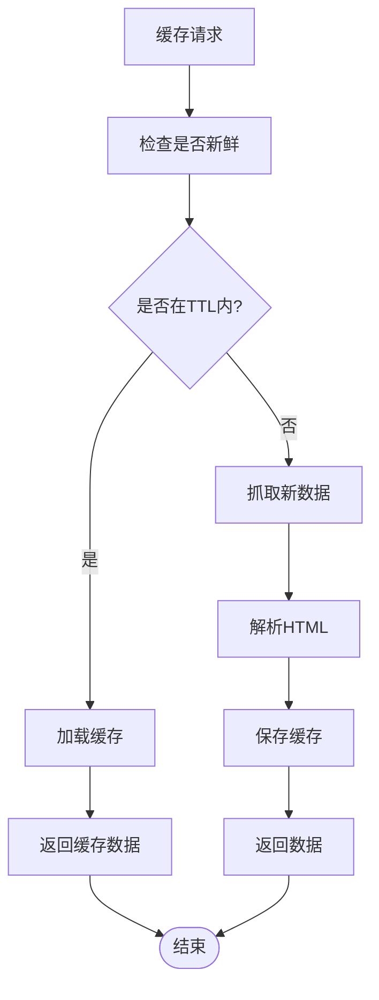
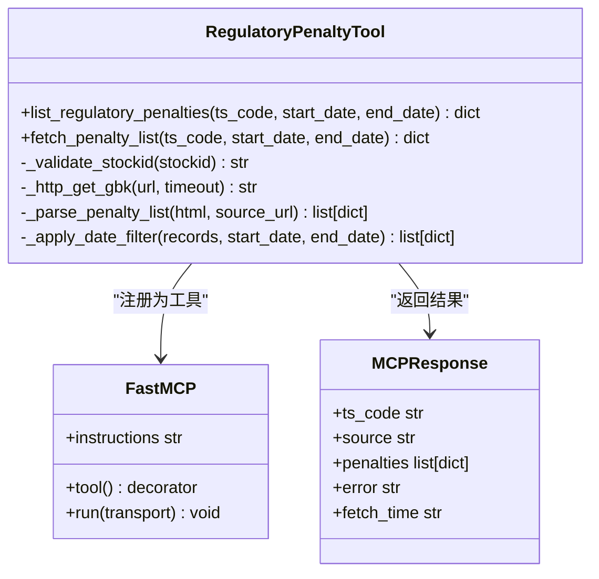

# 监管处罚工具

<cite>
**本文引用的文件**
- [regulatory_penalties.py](file://nano-search-mcp/src/nano_search_mcp/tools/regulatory_penalties.py)
- [test_regulatory_penalties.py](file://nano-search-mcp/tests/test_regulatory_penalties.py)
- [server.py](file://nano-search-mcp/src/nano_search_mcp/server.py)
- [api.py](file://nano-search-mcp/src/nano_search_mcp/api.py)
- [__main__.py](file://nano-search-mcp/src/nano_search_mcp/__main__.py)
- [pyproject.toml](file://nano-search-mcp/pyproject.toml)
- [README.md](file://nano-search-mcp/README.md)
- [industry_policies.py](file://nano-search-mcp/src/nano_search_mcp/tools/industry_policies.py)
</cite>

## 目录
1. [简介](#简介)
2. [项目结构](#项目结构)
3. [核心组件](#核心组件)
4. [架构概览](#架构概览)
5. [详细组件分析](#详细组件分析)
6. [依赖分析](#依赖分析)
7. [性能考虑](#性能考虑)
8. [故障排除指南](#故障排除指南)
9. [结论](#结论)
10. [附录](#附录)

## 简介

监管处罚工具是 NanoSearchMCP 项目中的一个专门模块，负责从新浪财经违规处理页面抓取和处理监管处罚信息。该工具能够自动获取上市公司受到的行政处罚、监管措施、纪律处分等数据，并提供结构化的数据输出。

### 主要功能特性
- **数据抓取**：从新浪财经违规处理页面自动抓取处罚记录
- **数据分类**：识别处罚类型、处理机构、违规原因等关键信息
- **时效性判断**：支持按日期范围过滤处罚记录
- **结构化处理**：将非结构化网页数据转换为标准化 JSON 格式
- **历史追踪**：提供缓存机制，避免重复抓取相同数据
- **合规检查**：内置安全防护机制，防止 SSRF 攻击

## 项目结构

NanoSearchMCP 项目采用模块化设计，监管处罚工具位于 `nano-search-mcp/src/nano_search_mcp/tools/` 目录下，作为 MCP 服务的一个工具模块存在。



**图表来源**
- [server.py:18-69](file://nano-search-mcp/src/nano_search_mcp/server.py#L18-L69)
- [pyproject.toml:1-44](file://nano-search-mcp/pyproject.toml#L1-L44)

**章节来源**
- [README.md:178-198](file://nano-search-mcp/README.md#L178-L198)
- [server.py:18-69](file://nano-search-mcp/src/nano_search_mcp/server.py#L18-L69)

## 核心组件

监管处罚工具的核心组件包括数据抓取层、解析层、缓存层和工具注册层。每个组件都有明确的职责分工和清晰的接口定义。

### 数据抓取层
负责与新浪财经违规处理页面进行 HTTP 通信，实现数据获取和错误处理。

### 解析层  
负责解析 HTML 内容，提取结构化数据，包括处罚日期、类型、标题、原因、内容和处理机构等信息。

### 缓存层
提供本地缓存机制，避免重复抓取相同数据，提高系统性能和响应速度。

### 工具注册层
将监管处罚功能注册为 MCP 工具，提供统一的接口供其他组件调用。

**章节来源**
- [regulatory_penalties.py:85-133](file://nano-search-mcp/src/nano_search_mcp/tools/regulatory_penalties.py#L85-L133)
- [regulatory_penalties.py:135-163](file://nano-search-mcp/src/nano_search_mcp/tools/regulatory_penalties.py#L135-L163)
- [regulatory_penalties.py:295-366](file://nano-search-mcp/src/nano_search_mcp/tools/regulatory_penalties.py#L295-L366)

## 架构概览

监管处罚工具采用分层架构设计，各层之间职责清晰，耦合度低，便于维护和扩展。



**图表来源**
- [server.py:18-69](file://nano-search-mcp/src/nano_search_mcp/server.py#L18-L69)
- [regulatory_penalties.py:295-366](file://nano-search-mcp/src/nano_search_mcp/tools/regulatory_penalties.py#L295-L366)

## 详细组件分析

### 数据抓取组件

数据抓取组件负责与新浪财经违规处理页面进行通信，实现安全的数据获取。

#### HTTP 请求配置
- **用户代理**：模拟真实浏览器请求
- **Referer**：设置正确的来源页面
- **超时控制**：15秒超时限制
- **重试机制**：指数退避重试，最多3次

#### 安全防护机制
- **域名白名单**：仅允许访问 `vip.stock.finance.sina.com.cn`
- **URL 注入防护**：防止恶意 URL 构造
- **SSRF 防护**：防止服务器端请求伪造攻击



**图表来源**
- [regulatory_penalties.py:295-366](file://nano-search-mcp/src/nano_search_mcp/tools/regulatory_penalties.py#L295-L366)
- [regulatory_penalties.py:98-133](file://nano-search-mcp/src/nano_search_mcp/tools/regulatory_penalties.py#L98-L133)

**章节来源**
- [regulatory_penalties.py:41-50](file://nano-search-mcp/src/nano_search_mcp/tools/regulatory_penalties.py#L41-L50)
- [regulatory_penalties.py:89-133](file://nano-search-mcp/src/nano_search_mcp/tools/regulatory_penalties.py#L89-L133)

### 数据解析组件

数据解析组件负责将 HTML 内容转换为结构化的 JSON 数据。

#### HTML 结构解析
根据新浪财经违规处理页面的实际结构进行解析：
- 主表格 ID：`collectFund_1`
- 记录块标识：`<th colspan="2">` 包含日期和类型
- 字段行格式：`<tr>` 包含 `<strong>` 标签的字段名和对应的值

#### 字段提取规则
- **处罚日期**：从标题文本中提取 `公告日期:YYYY-MM-DD` 格式
- **事件类型**：从标题文本中提取冒号前的部分
- **处理机构**：支持交易所和证监会系统的标准化
- **违规原因**：基于关键词匹配的标准化处理



**图表来源**
- [regulatory_penalties.py:169-207](file://nano-search-mcp/src/nano_search_mcp/tools/regulatory_penalties.py#L169-L207)
- [regulatory_penalties.py:210-234](file://nano-search-mcp/src/nano_search_mcp/tools/regulatory_penalties.py#L210-L234)

**章节来源**
- [regulatory_penalties.py:169-207](file://nano-search-mcp/src/nano_search_mcp/tools/regulatory_penalties.py#L169-L207)
- [regulatory_penalties.py:236-289](file://nano-search-mcp/src/nano_search_mcp/tools/regulatory_penalties.py#L236-L289)

### 缓存管理组件

缓存管理组件提供本地缓存机制，避免重复抓取相同数据。

#### 缓存策略
- **缓存目录**：`~/.cache/nano_search_mcp/penalties/`
- **TTL 设置**：1小时（3600秒）
- **文件格式**：JSON 格式存储
- **自动清理**：过期自动失效

#### 缓存流程


**图表来源**
- [regulatory_penalties.py:139-163](file://nano-search-mcp/src/nano_search_mcp/tools/regulatory_penalties.py#L139-L163)
- [regulatory_penalties.py:334-366](file://nano-search-mcp/src/nano_search_mcp/tools/regulatory_penalties.py#L334-L366)

**章节来源**
- [regulatory_penalties.py:139-163](file://nano-search-mcp/src/nano_search_mcp/tools/regulatory_penalties.py#L139-L163)
- [regulatory_penalties.py:334-366](file://nano-search-mcp/src/nano_search_mcp/tools/regulatory_penalties.py#L334-L366)

### 工具注册组件

工具注册组件将监管处罚功能注册为 MCP 工具，提供统一的接口。

#### 工具注册流程
- **注册函数**：`register_regulatory_penalty_tools()`
- **工具名称**：`list_regulatory_penalties`
- **参数验证**：自动进行参数校验
- **错误处理**：统一的错误返回格式

#### MCP 工具接口


**图表来源**
- [regulatory_penalties.py:393-447](file://nano-search-mcp/src/nano_search_mcp/tools/regulatory_penalties.py#L393-L447)
- [server.py:60-69](file://nano-search-mcp/src/nano_search_mcp/server.py#L60-L69)

**章节来源**
- [regulatory_penalties.py:393-447](file://nano-search-mcp/src/nano_search_mcp/tools/regulatory_penalties.py#L393-L447)
- [server.py:60-69](file://nano-search-mcp/src/nano_search_mcp/server.py#L60-L69)

## 依赖分析

监管处罚工具的依赖关系相对简单，主要依赖于第三方库和 MCP 框架。

### 外部依赖
- **mcp[cli]**：MCP 协议实现
- **beautifulsoup4**：HTML 解析
- **httpx**：HTTP 客户端
- **playwright**：页面渲染（用于其他工具）

### 内部依赖
- **server.py**：MCP 服务注册
- **__main__.py**：命令行入口
- **api.py**：HTTP 应用程序

```mermaid
graph LR
subgraph "外部依赖"
A[mcp[cli]]
B[beautifulsoup4]
C[httpx]
D[playwright]
end
subgraph "内部模块"
E[server.py]
F[__main__.py]
G[api.py]
H[regulatory_penalties.py]
end
A --> E
B --> H
C --> H
D --> E
E --> F
E --> G
E --> H
```

**图表来源**
- [pyproject.toml:6-14](file://nano-search-mcp/pyproject.toml#L6-L14)
- [server.py:6-16](file://nano-search-mcp/src/nano_search_mcp/server.py#L6-L16)

**章节来源**
- [pyproject.toml:6-14](file://nano-search-mcp/pyproject.toml#L6-L14)
- [server.py:6-16](file://nano-search-mcp/src/nano_search_mcp/server.py#L6-L16)

## 性能考虑

监管处罚工具在设计时充分考虑了性能优化，采用了多种策略来提高响应速度和资源利用率。

### 缓存优化
- **TTL 设置**：1小时缓存周期平衡数据新鲜度和性能
- **本地存储**：使用 JSON 文件存储，读写效率高
- **智能命中**：避免重复抓取相同数据

### 网络优化
- **请求节流**：至少1秒间隔，避免过度请求
- **指数退避**：失败时等待更长时间，减少服务器压力
- **超时控制**：15秒超时，防止长时间阻塞

### 内存优化
- **增量解析**：边解析边处理，避免大内存占用
- **条件过滤**：支持日期范围过滤，减少数据传输
- **字段精简**：只保留必要字段，减少数据体积

## 故障排除指南

### 常见问题及解决方案

#### 1. 网络连接问题
**症状**：工具返回 `{"source": "unavailable", "error": "..."}`
**原因**：网络超时或服务器不可达
**解决方案**：
- 检查网络连接状态
- 稍后重试请求
- 确认新浪财经页面可正常访问

#### 2. 参数验证错误
**症状**：返回参数错误信息
**原因**：股票代码格式不正确或日期格式错误
**解决方案**：
- 确保股票代码为6位数字
- 使用 `YYYY-MM-DD` 格式提供日期
- 检查日期范围的有效性

#### 3. 缓存问题
**症状**：数据更新不及时
**原因**：缓存仍然有效
**解决方案**：
- 等待缓存过期（1小时）
- 手动删除缓存文件
- 使用不同的日期范围查询

#### 4. SSRF 防护错误
**症状**：访问被拒绝
**原因**：尝试访问不允许的域名
**解决方案**：
- 确保只访问 `vip.stock.finance.sina.com.cn` 域名
- 不要修改工具的 URL 构造逻辑

**章节来源**
- [regulatory_penalties.py:344-353](file://nano-search-mcp/src/nano_search_mcp/tools/regulatory_penalties.py#L344-L353)
- [regulatory_penalties.py:66-82](file://nano-search-mcp/src/nano_search_mcp/tools/regulatory_penalties.py#L66-L82)

## 结论

监管处罚工具是一个设计良好的数据抓取和处理模块，具有以下特点：

### 优势
- **模块化设计**：清晰的分层架构，职责分离明确
- **安全性强**：完善的 SSRF 防护和参数验证
- **性能优化**：智能缓存和网络优化策略
- **易于集成**：符合 MCP 协议标准，便于与其他工具组合使用

### 功能完整性
- 支持多种处罚类型的识别和分类
- 提供结构化的数据输出格式
- 具备基本的历史数据追踪能力
- 内置错误处理和降级机制

### 改进建议
- 可以增加更细粒度的处罚严重程度分级
- 可以扩展处罚类型识别的准确性
- 可以增加实时监控和预警功能
- 可以提供更丰富的数据导出格式

该工具为 A 股公司的合规监控和风险评估提供了重要的数据支撑，是构建企业风险管理体系的重要组成部分。

## 附录

### API 使用示例

#### 基本使用
```python
# 基本查询
result = list_regulatory_penalties(
    ts_code="688270.SH",
    start_date="2024-01-01",
    end_date="2024-12-31"
)
```

#### 错误处理
```python
try:
    result = list_regulatory_penalties(ts_code="INVALID")
    if result["source"] == "unavailable":
        print(f"查询失败: {result['error']}")
except Exception as e:
    print(f"发生异常: {e}")
```

### 数据结构说明

#### 返回数据格式
```json
{
  "ts_code": "688270.SH",
  "source": "sina",
  "penalties": [
    {
      "punish_date": "2026-04-18",
      "event_type": "处罚决定",
      "title": "关于收到行政处罚事先告知书的公告",
      "reason": "信息披露违规",
      "content": "责令改正，警告并处罚款50万元",
      "issuer": "浙江证监局",
      "source_url": "https://vip.stock.finance.sina.com.cn/..."
    }
  ]
}
```

### 配置选项

#### 环境要求
- Python 3.10+
- Playwright Chromium 浏览器
- 稳定的网络连接

#### 安装步骤
```bash
conda activate legonanobot
cd nano-search-mcp
pip install -e ".[dev]"
playwright install chromium
```