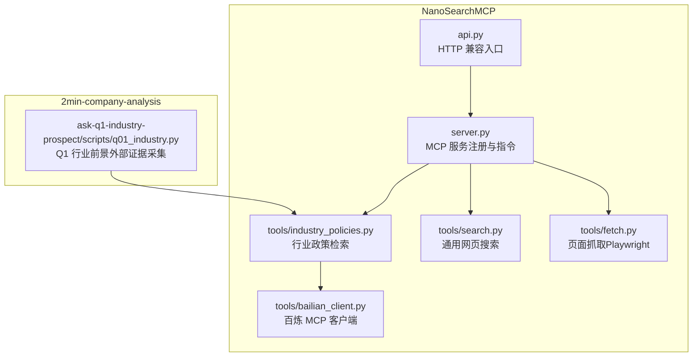
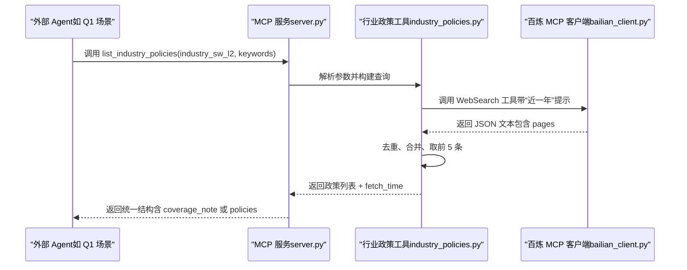
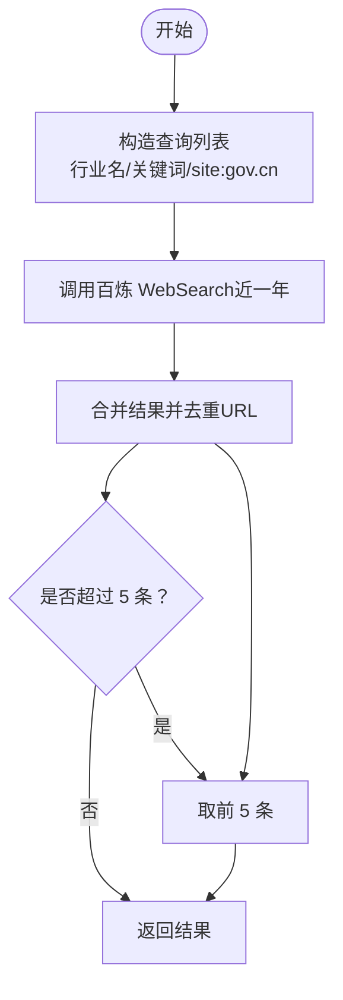
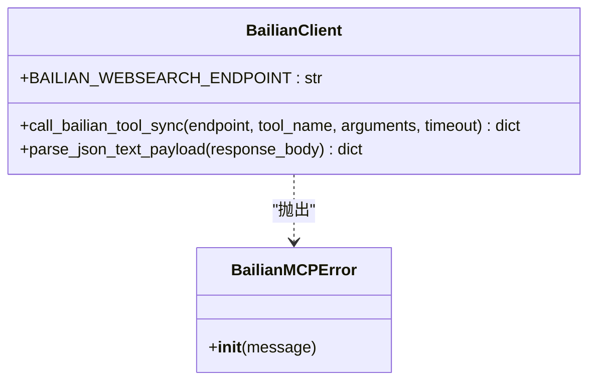
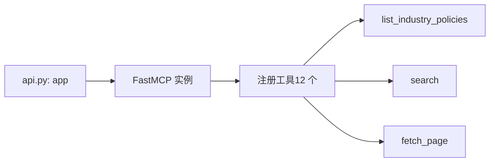
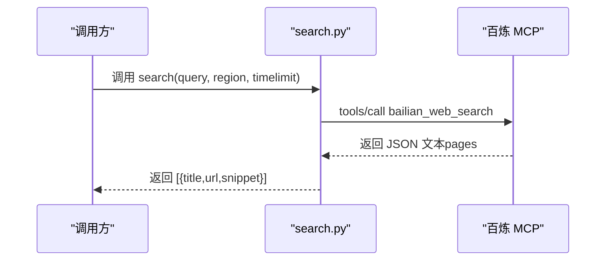
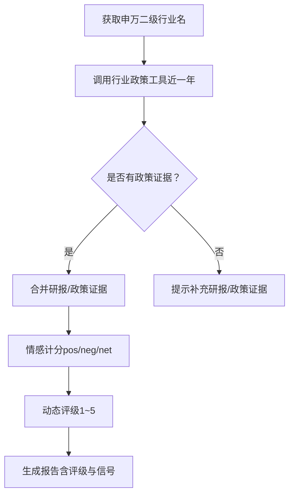
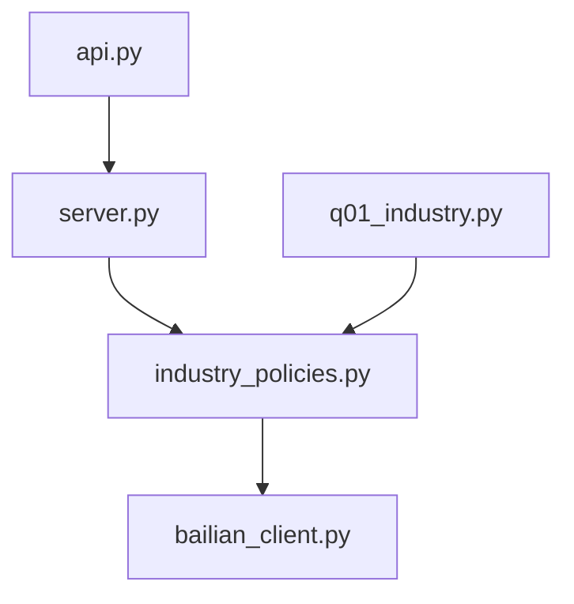

# 行业政策工具

<cite>
**本文引用的文件**
- [industry_policies.py](file://nano-search-mcp/src/nano_search_mcp/tools/industry_policies.py)
- [bailian_client.py](file://nano-search-mcp/src/nano_search_mcp/tools/bailian_client.py)
- [server.py](file://nano-search-mcp/src/nano_search_mcp/server.py)
- [api.py](file://nano-search-mcp/src/nano_search_mcp/api.py)
- [search.py](file://nano-search-mcp/src/nano_search_mcp/tools/search.py)
- [fetch.py](file://nano-search-mcp/src/nano_search_mcp/tools/fetch.py)
- [test_industry_policies.py](file://nano-search-mcp/tests/test_industry_policies.py)
- [README.md（NanoSearchMCP）](file://nano-search-mcp/README.md)
- [q01_industry.py](file://2min-company-analysis/ask-q1-industry-prospect/scripts/q01_industry.py)
</cite>

## 目录
1. [简介](#简介)
2. [项目结构](#项目结构)
3. [核心组件](#核心组件)
4. [架构总览](#架构总览)
5. [详细组件分析](#详细组件分析)
6. [依赖关系分析](#依赖关系分析)
7. [性能考量](#性能考量)
8. [故障排查指南](#故障排查指南)
9. [结论](#结论)
10. [附录](#附录)

## 简介
本文件为“行业政策工具”的技术文档，聚焦于行业政策信息检索与分析能力，涵盖政策法规、行业标准、监管指引等数据的获取与整合。系统基于 MCP 协议提供标准化工具接口，结合百炼 WebSearch 对中国政府机构网站（*.gov.cn）进行近一年内的政策检索，支持按申万二级行业名称与关键词组合构造查询，返回去重后的最新政策条目，并标注发布机构层级（中央/部委/地方）。文档还说明了政策分类体系、关键词提取与影响评估机制、时效性管理与版本控制策略、政策解读与合规建议的落地方式，以及查询示例与影响分析报告生成方案。

## 项目结构
本项目由两部分组成：
- NanoSearchMCP：提供 MCP 服务与工具集，包含行业政策检索、网页搜索、页面抓取、行业研报、公告、监管处罚、IR 活动等工具。
- 2min-company-analysis：以“七看八问”为核心的公司分析模块，其中 Q1 行业前景问题会调用行业政策工具作为外部证据之一。

图表来源
- [server.py:18-70](file://nano-search-mcp/src/nano_search_mcp/server.py#L18-L70)
- [industry_policies.py:185-246](file://nano-search-mcp/src/nano_search_mcp/tools/industry_policies.py#L185-L246)
- [bailian_client.py:63-93](file://nano-search-mcp/src/nano_search_mcp/tools/bailian_client.py#L63-L93)
- [search.py:79-119](file://nano-search-mcp/src/nano_search_mcp/tools/search.py#L79-L119)
- [fetch.py:220-245](file://nano-search-mcp/src/nano_search_mcp/tools/fetch.py#L220-L245)
- [api.py:1-12](file://nano-search-mcp/src/nano_search_mcp/api.py#L1-L12)
- [q01_industry.py:96-105](file://2min-company-analysis/ask-q1-industry-prospect/scripts/q01_industry.py#L96-L105)

章节来源
- [README.md（NanoSearchMCP）:178-198](file://nano-search-mcp/README.md#L178-L198)
- [server.py:18-70](file://nano-search-mcp/src/nano_search_mcp/server.py#L18-L70)

## 核心组件
- 行业政策检索工具（list_industry_policies）
  - 输入：申万二级行业名、关键词列表
  - 输出：最多 5 条去重后的政策条目，包含标题、来源 URL、摘要、发布机构、层级、抓取时间等
  - 特性：近一年时效限定、多查询合并去重、异常时返回统一错误结构
- 百炼 MCP 客户端
  - 封装百炼 WebSearch 工具调用，支持超时控制、错误解析与重试策略
- 通用搜索与页面抓取
  - search：网页搜索，支持区域与时效过滤提示词
  - fetch_page：Playwright 渲染 + HTML 清洗，输出 Markdown 正文，内置 SSRF 防护
- MCP 服务与 HTTP 兼容入口
  - server：注册 12 个工具，提供服务说明与运行参数
  - api：暴露 streamable HTTP ASGI 应用，便于外部集成

章节来源
- [industry_policies.py:170-246](file://nano-search-mcp/src/nano_search_mcp/tools/industry_policies.py#L170-L246)
- [bailian_client.py:24-93](file://nano-search-mcp/src/nano_search_mcp/tools/bailian_client.py#L24-L93)
- [search.py:79-119](file://nano-search-mcp/src/nano_search_mcp/tools/search.py#L79-L119)
- [fetch.py:220-245](file://nano-search-mcp/src/nano_search_mcp/tools/fetch.py#L220-L245)
- [server.py:18-70](file://nano-search-mcp/src/nano_search_mcp/server.py#L18-L70)
- [api.py:1-12](file://nano-search-mcp/src/nano_search_mcp/api.py#L1-L12)

## 架构总览
系统采用“MCP 工具服务 + 外部证据采集”的架构。MCP 服务统一注册工具，外部 Agent（如 2min-company-analysis）通过工具调用获取政策、研报、公告等证据，再进行评分与报告生成。

图表来源
- [server.py:60-69](file://nano-search-mcp/src/nano_search_mcp/server.py#L60-L69)
- [industry_policies.py:170-246](file://nano-search-mcp/src/nano_search_mcp/tools/industry_policies.py#L170-L246)
- [bailian_client.py:63-93](file://nano-search-mcp/src/nano_search_mcp/tools/bailian_client.py#L63-L93)

## 详细组件分析

### 行业政策检索组件（industry_policies.py）
- 查询构造策略
  - 以“申万二级行业名 + 产业政策/行业规范”构造 site:gov.cn 查询
  - 支持传入关键词，生成“关键词 + 政策”查询
  - 若无输入，则回退到通用“产业政策 通知 site:gov.cn”
- 检索与去重
  - 对每条查询调用百炼 WebSearch，合并 pages，按 URL 去重
  - 失败时指数退避重试，全部失败则抛出 RuntimeError
- 结果处理
  - 截取前 5 条
  - 推断发布机构与层级（中央/部委/地方）
  - 返回统一结构，包含 fetch_time；无结果时附带 coverage_note

图表来源
- [industry_policies.py:72-183](file://nano-search-mcp/src/nano_search_mcp/tools/industry_policies.py#L72-L183)

章节来源
- [industry_policies.py:72-183](file://nano-search-mcp/src/nano_search_mcp/tools/industry_policies.py#L72-L183)
- [test_industry_policies.py:48-72](file://nano-search-mcp/tests/test_industry_policies.py#L48-L72)
- [test_industry_policies.py:102-117](file://nano-search-mcp/tests/test_industry_policies.py#L102-L117)
- [test_industry_policies.py:148-159](file://nano-search-mcp/tests/test_industry_policies.py#L148-L159)

### 百炼 MCP 客户端（bailian_client.py）
- 功能要点
  - 读取 DASHSCOPE_API_KEY 作为鉴权头
  - 将工具调用封装为 JSON-RPC 请求，支持自定义超时
  - 解析返回的 text 字段为 JSON，处理错误码与非 JSON 响应
- 错误处理
  - 缺失 API Key、HTTP 错误、MCP error、JSON 解析失败均抛出 BailianMCPError

图表来源
- [bailian_client.py:24-93](file://nano-search-mcp/src/nano_search_mcp/tools/bailian_client.py#L24-L93)

章节来源
- [bailian_client.py:24-93](file://nano-search-mcp/src/nano_search_mcp/tools/bailian_client.py#L24-L93)

### MCP 服务与工具注册（server.py, api.py）
- 服务注册
  - 创建 FastMCP 实例，提供服务说明与工具清单
  - 注册 12 个工具，包括行业政策、搜索、抓取、研报、公告、监管处罚、IR 活动等
- HTTP 兼容入口
  - api.py 暴露 streamable HTTP ASGI 应用，便于外部系统对接

图表来源
- [server.py:18-70](file://nano-search-mcp/src/nano_search_mcp/server.py#L18-L70)
- [api.py:1-12](file://nano-search-mcp/src/nano_search_mcp/api.py#L1-L12)

章节来源
- [server.py:18-70](file://nano-search-mcp/src/nano_search_mcp/server.py#L18-L70)
- [api.py:1-12](file://nano-search-mcp/src/nano_search_mcp/api.py#L1-L12)

### 通用搜索与页面抓取（search.py, fetch.py）
- 通用搜索（search）
  - 支持 region 与 timelimit 提示词拼接到查询中，提升检索可控性
  - 返回标题、URL、摘要三项
- 页面抓取（fetch_page）
  - Playwright 渲染 + BeautifulSoup 清洗，输出 Markdown 正文
  - 内置 SSRF 防护，拒绝 file://、loopback、RFC1918、云元数据端点等
  - 最大内容长度截断，返回 truncated 标记

图表来源
- [search.py:41-71](file://nano-search-mcp/src/nano_search_mcp/tools/search.py#L41-L71)
- [bailian_client.py:63-93](file://nano-search-mcp/src/nano_search_mcp/tools/bailian_client.py#L63-L93)

章节来源
- [search.py:79-119](file://nano-search-mcp/src/nano_search_mcp/tools/search.py#L79-L119)
- [fetch.py:220-245](file://nano-search-mcp/src/nano_search_mcp/tools/fetch.py#L220-L245)

### 外部证据采集与影响评估（2min-company-analysis/Q1）
- 证据采集流程
  - 从数据库获取申万二级行业名
  - 调用行业政策工具（list_industry_policies）采集近一年政策
  - 合并研报与政策证据，进行情感计分与评级
- 影响评估机制
  - 情感信号：正向/负向情绪计数，计算净分
  - 评级规则：在满足“DB 事实 + 至少 1 条研报或政策”的前提下，依据情感净分与政策数量动态调整
  - 无政策证据时给出置信度提示

图表来源
- [q01_industry.py:96-147](file://2min-company-analysis/ask-q1-industry-prospect/scripts/q01_industry.py#L96-L147)

章节来源
- [q01_industry.py:96-147](file://2min-company-analysis/ask-q1-industry-prospect/scripts/q01_industry.py#L96-L147)

## 依赖关系分析
- 组件耦合
  - industry_policies 依赖 bailian_client 进行百炼工具调用
  - server 统一注册工具，api 提供 HTTP 入口
  - 2min-company-analysis 的 Q1 场景依赖 industry_policies 的工具输出
- 外部依赖
  - 百炼 MCP 服务（WebSearch）
  - Playwright（fetch_page）
  - httpx、BeautifulSoup、markdownify 等

图表来源
- [server.py:18-70](file://nano-search-mcp/src/nano_search_mcp/server.py#L18-L70)
- [industry_policies.py:185-246](file://nano-search-mcp/src/nano_search_mcp/tools/industry_policies.py#L185-L246)
- [bailian_client.py:63-93](file://nano-search-mcp/src/nano_search_mcp/tools/bailian_client.py#L63-L93)
- [api.py:1-12](file://nano-search-mcp/src/nano_search_mcp/api.py#L1-L12)
- [q01_industry.py:96-105](file://2min-company-analysis/ask-q1-industry-prospect/scripts/q01_industry.py#L96-L105)

章节来源
- [server.py:18-70](file://nano-search-mcp/src/nano_search_mcp/server.py#L18-L70)
- [api.py:1-12](file://nano-search-mcp/src/nano_search_mcp/api.py#L1-L12)
- [bailian_client.py:63-93](file://nano-search-mcp/src/nano_search_mcp/tools/bailian_client.py#L63-L93)
- [industry_policies.py:185-246](file://nano-search-mcp/src/nano_search_mcp/tools/industry_policies.py#L185-L246)
- [q01_industry.py:96-105](file://2min-company-analysis/ask-q1-industry-prospect/scripts/q01_industry.py#L96-L105)

## 性能考量
- 检索性能
  - 每条查询最多返回 10 条，最终取前 5 条，减少下游处理压力
  - 对失败查询采用指数退避重试，避免雪崩
- 抓取性能
  - Playwright 浏览器惰性创建并复用，降低冷启动开销
  - 内容最大长度限制与截断，避免内存膨胀
- 网络与安全
  - HTTP 超时可配置，百炼 MCP 超时默认 30 秒
  - SSRF 防护严格，拒绝内网/本地/保留地址访问

## 故障排查指南
- 常见问题与定位
  - 百炼 API Key 缺失：检查 DASHSCOPE_API_KEY 环境变量
  - MCP 调用失败：查看 HTTP 状态码与错误消息，确认网络可达
  - 无政策结果：确认行业名与关键词是否合理；系统会返回 coverage_note 提示放宽条件
  - 抓取失败：检查 URL 是否符合 SSRF 防护规则；查看 error 字段
- 单元测试参考
  - 行业政策工具：查询构造、去重、重试失败、返回条数上限、MCP 工具包装
  - 搜索与抓取：URL 安全校验、内容截断、错误路径

章节来源
- [bailian_client.py:28-36](file://nano-search-mcp/src/nano_search_mcp/tools/bailian_client.py#L28-L36)
- [bailian_client.py:82-92](file://nano-search-mcp/src/nano_search_mcp/tools/bailian_client.py#L82-L92)
- [test_industry_policies.py:119-129](file://nano-search-mcp/tests/test_industry_policies.py#L119-L129)
- [fetch.py:19-75](file://nano-search-mcp/src/nano_search_mcp/tools/fetch.py#L19-L75)

## 结论
本行业政策工具通过 MCP 服务提供标准化接口，结合百炼 WebSearch 对 *.gov.cn 近一年政策进行检索与整合，具备明确的时效性约束与去重策略。配合 2min-company-analysis 的外部证据采集流程，可实现政策证据的自动获取与影响评估，辅助生成行业前景与景气度判断报告。系统在安全（SSRF 防护）、可靠性（指数退避重试）、性能（浏览器复用、内容截断）等方面具备良好工程实践，适合在企业级 Agent 场景中复用。

## 附录

### 政策分类体系
- 发布机构层级
  - 中央：中国人民银行、国家外汇管理局等
  - 部委：国家发展改革委、工业和信息化部、财政部、生态环境部、市场监管总局、证监会、国家金融监督管理总局等
  - 地方：地方政府网站（.gov.cn）

章节来源
- [industry_policies.py:33-52](file://nano-search-mcp/src/nano_search_mcp/tools/industry_policies.py#L33-L52)

### 关键词提取与影响评估机制
- 关键词提取
  - 由调用方提供关键词列表，系统将其与行业名组合构造查询
- 影响评估
  - 基于研报与政策证据的情感计分（正/负计数），结合政策数量动态调整评级
  - 无政策证据时提示置信度下降

章节来源
- [q01_industry.py:113-131](file://2min-company-analysis/ask-q1-industry-prospect/scripts/q01_industry.py#L113-L131)

### 时效性管理与版本控制策略
- 时效性
  - 检索时强制附加“近一年”提示词，确保结果时效性
- 版本控制
  - 工具返回 fetch_time，便于上层进行缓存与版本比对
  - 无结果时返回 coverage_note，指导调用方放宽条件或人工补充

章节来源
- [industry_policies.py:121-121](file://nano-search-mcp/src/nano_search_mcp/tools/industry_policies.py#L121-L121)
- [industry_policies.py:220-245](file://nano-search-mcp/src/nano_search_mcp/tools/industry_policies.py#L220-L245)

### 政策解读与合规建议
- 政策解读
  - 通过 fetch_page 抓取政策原文正文，结合情感分析与证据合并进行解读
- 合规建议
  - 建议人工复核政策原文，结合公司业务与行业趋势制定应对策略

章节来源
- [fetch.py:220-245](file://nano-search-mcp/src/nano_search_mcp/tools/fetch.py#L220-L245)
- [q01_industry.py:136-137](file://2min-company-analysis/ask-q1-industry-prospect/scripts/q01_industry.py#L136-L137)

### 政策查询示例与影响分析报告生成方案
- 查询示例
  - 申万二级行业名：汽车零部件
  - 关键词：锂电池、新能源
  - 查询构造：行业名 + “产业政策/行业规范”；关键词 + “政策”
- 影响分析报告
  - 输入：DB 事实、研报证据、政策证据
  - 输出：评级（1~5）、情感信号、缺失输入提示、最终状态（ready/partial/insufficient-evidence）

章节来源
- [test_industry_policies.py:49-72](file://nano-search-mcp/tests/test_industry_policies.py#L49-L72)
- [q01_industry.py:113-147](file://2min-company-analysis/ask-q1-industry-prospect/scripts/q01_industry.py#L113-L147)