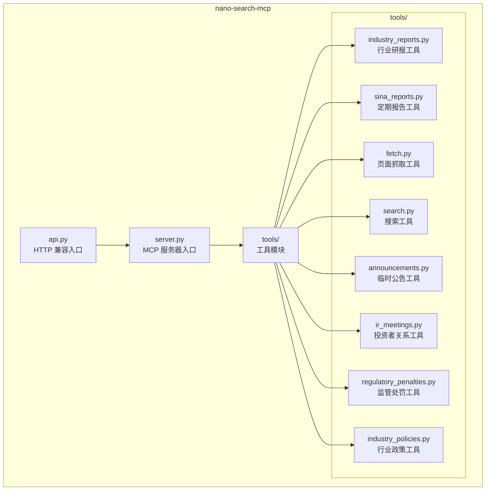
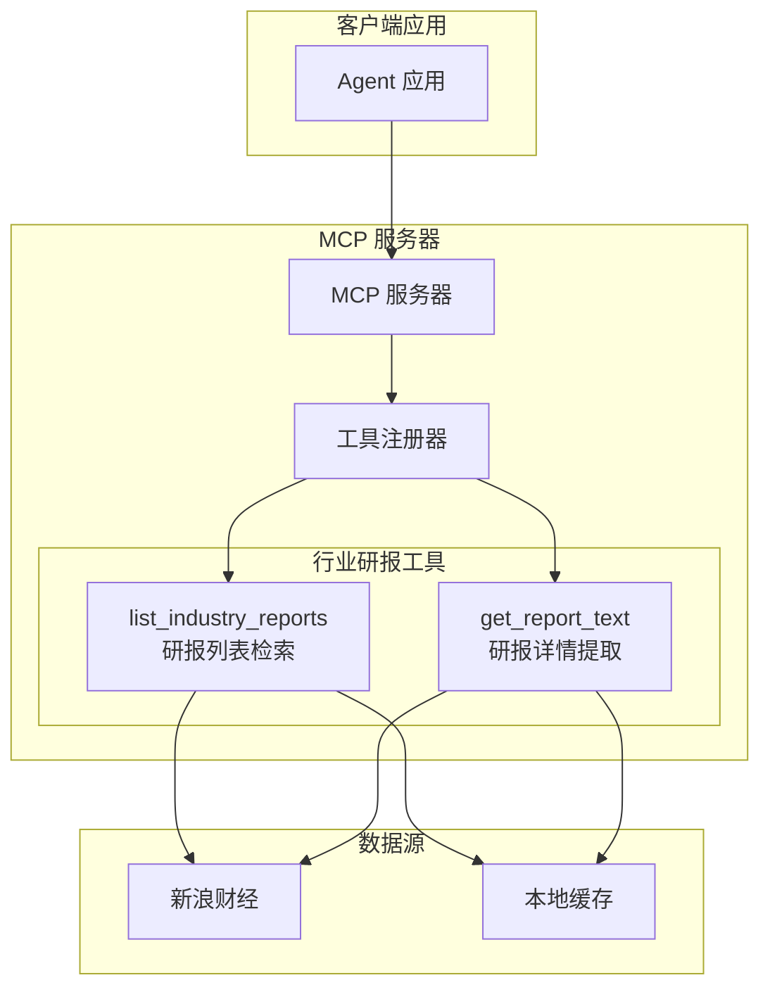
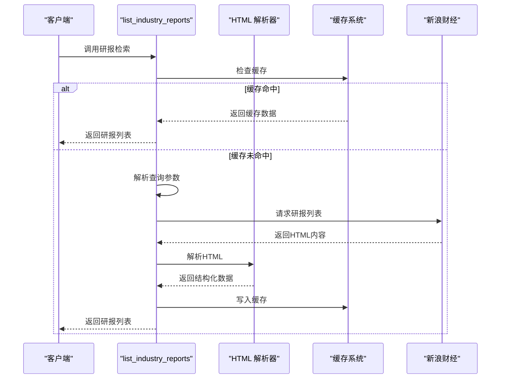
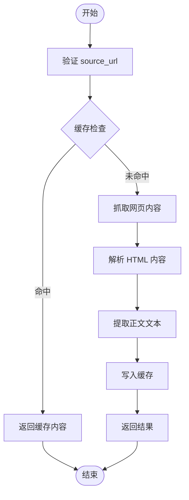
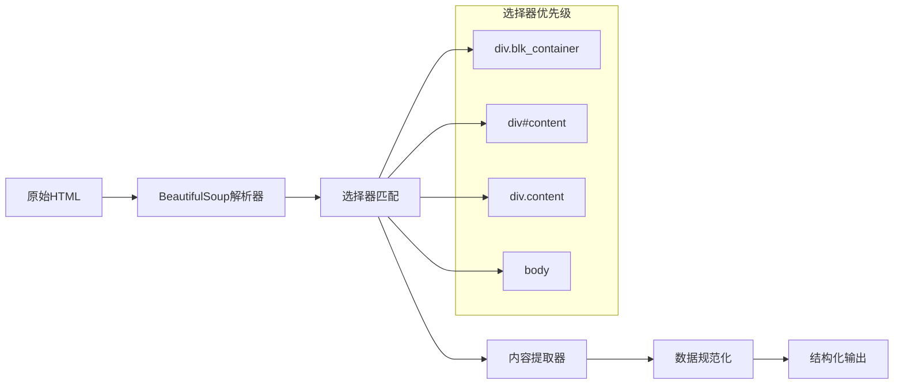
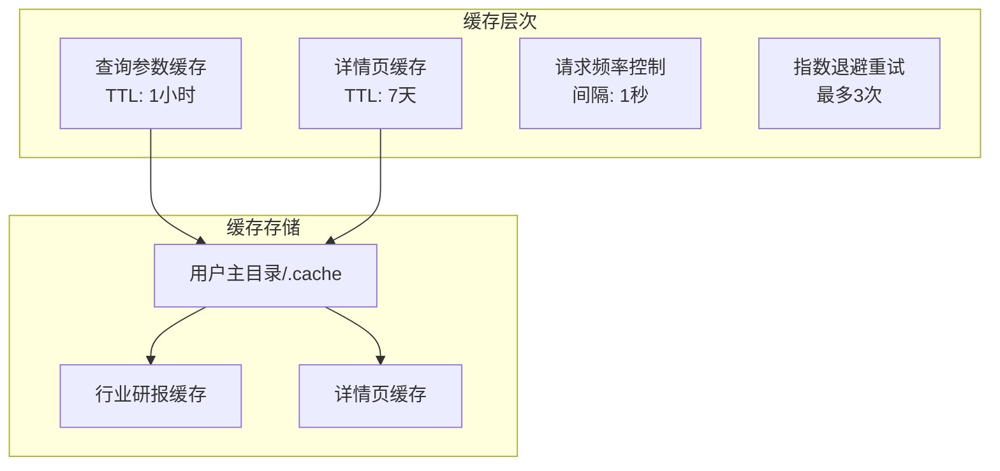

# 行业研究报告工具

<cite>
**本文引用的文件**
- [industry_reports.py](file://nano-search-mcp/src/nano_search_mcp/tools/industry_reports.py)
- [server.py](file://nano-search-mcp/src/nano_search_mcp/server.py)
- [api.py](file://nano-search-mcp/src/nano_search_mcp/api.py)
- [README.md](file://nano-search-mcp/README.md)
- [pyproject.toml](file://nano-search-mcp/pyproject.toml)
- [test_industry_reports.py](file://nano-search-mcp/tests/test_industry_reports.py)
- [sina_reports.py](file://nano-search-mcp/src/nano_search_mcp/tools/sina_reports.py)
- [fetch.py](file://nano-search-mcp/src/nano_search_mcp/tools/fetch.py)
</cite>

## 目录
1. [简介](#简介)
2. [项目结构](#项目结构)
3. [核心组件](#核心组件)
4. [架构概览](#架构概览)
5. [详细组件分析](#详细组件分析)
6. [依赖分析](#依赖分析)
7. [性能考虑](#性能考虑)
8. [故障排除指南](#故障排除指南)
9. [结论](#结论)
10. [附录](#附录)

## 简介
本文件为行业研究报告工具的技术文档，全面介绍基于 MCP 协议的行业研究报告检索系统。该系统专注于中国 A 股市场，提供行业研究报告的索引、摘要提取、关键词筛选和分类管理功能。文档涵盖搜索接口、过滤条件、排序机制、数据源、内容解析、存储策略、缓存机制以及性能优化方案，并提供搜索示例和结果处理指导。

## 项目结构
该项目是一个基于 MCP（Model Context Protocol）的服务包，提供多种金融数据检索工具。核心结构如下：



**图表来源**
- [server.py:1-91](file://nano-search-mcp/src/nano_search_mcp/server.py#L1-L91)
- [api.py:1-12](file://nano-search-mcp/src/nano_search_mcp/api.py#L1-L12)

**章节来源**
- [server.py:1-91](file://nano-search-mcp/src/nano_search_mcp/server.py#L1-L91)
- [README.md:178-198](file://nano-search-mcp/README.md#L178-L198)

## 核心组件
行业研究报告工具的核心组件包括：

### 1. 行业研报检索引擎
- **功能特性**：支持按申万二级行业、关键词、时间范围和股票代码进行检索
- **数据源**：新浪财经行业研报页面
- **过滤机制**：日期过滤、关键词过滤、行业标签过滤
- **排序机制**：按发布时间倒序排列

### 2. 内容解析器
- **HTML 解析**：使用 BeautifulSoup 解析研报列表和详情页面
- **文本提取**：从 HTML 中提取纯文本内容
- **结构化输出**：标准化研报信息格式

### 3. 缓存系统
- **列表缓存**：研报列表结果缓存，TTL 1小时
- **详情缓存**：研报详情内容缓存，TTL 7天
- **缓存策略**：基于查询参数和 URL 的哈希值存储

**章节来源**
- [industry_reports.py:273-369](file://nano-search-mcp/src/nano_search_mcp/tools/industry_reports.py#L273-L369)
- [industry_reports.py:161-184](file://nano-search-mcp/src/nano_search_mcp/tools/industry_reports.py#L161-L184)

## 架构概览
系统采用 MCP 服务器架构，提供标准化的工具接口：



**图表来源**
- [server.py:19-69](file://nano-search-mcp/src/nano_search_mcp/server.py#L19-L69)
- [industry_reports.py:384-495](file://nano-search-mcp/src/nano_search_mcp/tools/industry_reports.py#L384-L495)

## 详细组件分析

### 行业研报检索工具
行业研报检索工具提供两个核心功能：

#### 1. 研报列表检索 (list_industry_reports)
支持多种检索模式：
- **股票代码自动路由**：通过 ts_code 自动解析所属申万二级行业
- **手动行业指定**：直接指定 industry_sw_l2 和关键词
- **时间范围过滤**：支持 start_date 和 end_date 参数
- **数量限制**：limit 参数控制返回数量（1-200）



**图表来源**
- [industry_reports.py:273-369](file://nano-search-mcp/src/nano_search_mcp/tools/industry_reports.py#L273-L369)
- [industry_reports.py:384-458](file://nano-search-mcp/src/nano_search_mcp/tools/industry_reports.py#L384-L458)

#### 2. 研报详情提取 (get_report_text)
提供单条研报的全文提取功能：
- **URL 验证**：确保只处理新浪财经详情页
- **内容解析**：从 HTML 中提取正文文本
- **缓存机制**：详情页内容缓存 7 天



**图表来源**
- [industry_reports.py:372-382](file://nano-search-mcp/src/nano_search_mcp/tools/industry_reports.py#L372-L382)
- [industry_reports.py:460-495](file://nano-search-mcp/src/nano_search_mcp/tools/industry_reports.py#L460-L495)

**章节来源**
- [industry_reports.py:384-495](file://nano-search-mcp/src/nano_search_mcp/tools/industry_reports.py#L384-L495)

### 数据解析与处理
系统采用多层解析策略：

#### HTML 解析流程


**图表来源**
- [industry_reports.py:256-271](file://nano-search-mcp/src/nano_search_mcp/tools/industry_reports.py#L256-L271)

#### 关键词筛选机制
系统实现智能关键词匹配：
- **去重处理**：自动去除重复关键词
- **大小写不敏感**：统一转换为小写进行匹配
- **精确匹配**：使用正则表达式进行精确匹配
- **行业标签**：自动生成行业相关的标签

**章节来源**
- [industry_reports.py:99-110](file://nano-search-mcp/src/nano_search_mcp/tools/industry_reports.py#L99-L110)
- [industry_reports.py:195-206](file://nano-search-mcp/src/nano_search_mcp/tools/industry_reports.py#L195-L206)

### 缓存与性能优化
系统采用多层次缓存策略：

#### 缓存层次结构


**图表来源**
- [industry_reports.py:43-45](file://nano-search-mcp/src/nano_search_mcp/tools/industry_reports.py#L43-L45)
- [industry_reports.py:121-127](file://nano-search-mcp/src/nano_search_mcp/tools/industry_reports.py#L121-L127)

#### 性能优化策略
- **请求限流**：每请求间隔至少 1 秒
- **指数退避**：失败时采用 2^n 的退避策略
- **并发控制**：避免过度并发导致目标网站封禁
- **智能重试**：针对网络异常进行自动重试

**章节来源**
- [industry_reports.py:121-158](file://nano-search-mcp/src/nano_search_mcp/tools/industry_reports.py#L121-L158)

## 依赖分析
系统依赖关系如下：

```mermaid
graph TB
subgraph "核心依赖"
A[mcp[cli]>=1.0.0<br/>MCP 协议实现]
B[beautifulsoup4>=4.12.0<br/>HTML 解析]
C[httpx>=0.27.0<br/>HTTP 客户端]
D[playwright>=1.40.0<br/>浏览器自动化]
end
subgraph "可选依赖"
E[pytest>=8.3.0<br/>测试框架]
F[uvicorn>=0.30.0<br/>ASGI 服务器]
G[pyyaml>=6.0<br/>YAML 处理]
H[markdownify>=0.13.0<br/>Markdown 转换]
end
subgraph "系统要求"
I[Python 3.10+]
J[conda 环境]
K[Playwright Chromium]
end
```

**图表来源**
- [pyproject.toml:6-14](file://nano-search-mcp/pyproject.toml#L6-L14)
- [pyproject.toml:16-19](file://nano-search-mcp/pyproject.toml#L16-L19)

**章节来源**
- [pyproject.toml:1-44](file://nano-search-mcp/pyproject.toml#L1-L44)

## 性能考虑
系统在设计时充分考虑了性能和可靠性：

### 网络性能优化
- **请求合并**：合理设置请求间隔，避免触发目标网站的速率限制
- **缓存策略**：利用 TTL 机制减少重复请求
- **错误处理**：实现指数退避重试，提高成功率

### 内存管理
- **流式处理**：对大型响应进行流式处理
- **内存限制**：设置最大内容长度限制，防止内存溢出
- **资源清理**：及时释放网络连接和浏览器资源

### 可扩展性
- **模块化设计**：每个工具独立封装，便于扩展新功能
- **配置灵活**：支持通过环境变量和参数调整行为
- **监控友好**：提供详细的日志记录和错误报告

## 故障排除指南
常见问题及解决方案：

### 1. 网络连接问题
**症状**：工具调用失败，返回 unavailable
**原因**：网络不稳定或目标网站不可达
**解决方法**：
- 检查网络连接状态
- 查看防火墙设置
- 调整超时参数

### 2. 缓存失效问题
**症状**：缓存数据过期或损坏
**原因**：缓存文件被意外修改或删除
**解决方法**：
- 删除缓存目录重新生成
- 检查磁盘空间
- 验证文件权限

### 3. 解析错误
**症状**：HTML 解析失败或结果不完整
**原因**：目标网站结构调整
**解决方法**：
- 更新解析规则
- 检查 BeautifulSoup 选择器
- 增加容错处理

**章节来源**
- [test_industry_reports.py:163-213](file://nano-search-mcp/tests/test_industry_reports.py#L163-L213)

## 结论
行业研究报告工具提供了一个完整、可靠的行业研报检索解决方案。系统具有以下优势：

1. **功能完整**：支持多种检索模式和过滤条件
2. **性能优秀**：采用多层缓存和智能重试机制
3. **安全可靠**：内置 SSRF 防护和错误处理
4. **易于扩展**：模块化设计便于功能扩展
5. **文档完善**：提供详细的 API 文档和使用示例

该工具特别适用于需要进行行业研究和投资决策的场景，能够有效提升研报检索和分析的效率。

## 附录

### API 接口规范
系统提供标准化的 MCP 工具接口：

#### list_industry_reports 参数
- **industry_sw_l2**：申万二级行业名
- **keywords**：关键词列表
- **start_date**：开始日期 (YYYY-MM-DD)
- **end_date**：结束日期 (YYYY-MM-DD)
- **limit**：返回数量限制 (1-200)
- **ts_code**：股票代码 (可选)

#### get_report_text 参数
- **source_url**：研报详情页 URL

### 安装和部署
```bash
# 创建虚拟环境
conda create -n legonanobot python=3.10
conda activate legonanobot

# 安装依赖
pip install -e ".[dev]"
playwright install chromium

# 启动服务
nano-search-mcp
```

### 使用示例
系统支持多种调用方式：
- 命令行方式：`nano-search-mcp`
- Python 导入：`from nano_search_mcp.server import mcp`
- HTTP 接口：访问 `http://127.0.0.1:8000/mcp`