# 金融数据检索工具

<cite>
**本文引用的文件**
- [announcements.py](file://nano-search-mcp/src/nano_search_mcp/tools/announcements.py)
- [industry_reports.py](file://nano-search-mcp/src/nano_search_mcp/tools/industry_reports.py)
- [industry_policies.py](file://nano-search-mcp/src/nano_search_mcp/tools/industry_policies.py)
- [ir_meetings.py](file://nano-search-mcp/src/nano_search_mcp/tools/ir_meetings.py)
- [regulatory_penalties.py](file://nano-search-mcp/src/nano_search_mcp/tools/regulatory_penalties.py)
- [sina_reports.py](file://nano-search-mcp/src/nano_search_mcp/tools/sina_reports.py)
- [bailian_client.py](file://nano-search-mcp/src/nano_search_mcp/tools/bailian_client.py)
- [server.py](file://nano-search-mcp/src/nano_search_mcp/server.py)
- [api.py](file://nano-search-mcp/src/nano_search_mcp/api.py)
- [README.md](file://nano-search-mcp/README.md)
- [test_announcements.py](file://nano-search-mcp/tests/test_announcements.py)
- [test_industry_reports.py](file://nano-search-mcp/tests/test_industry_reports.py)
- [test_industry_policies.py](file://nano-search-mcp/tests/test_industry_policies.py)
</cite>

## 目录
1. [简介](#简介)
2. [项目结构](#项目结构)
3. [核心组件](#核心组件)
4. [架构概览](#架构概览)
5. [详细组件分析](#详细组件分析)
6. [依赖分析](#依赖分析)
7. [性能考虑](#性能考虑)
8. [故障排除指南](#故障排除指南)
9. [结论](#结论)
10. [附录](#附录)

## 简介
本项目是一个面向中国A股市场的专业金融数据检索工具集，基于MCP（Model Context Protocol）协议构建。系统提供了六大核心功能域，涵盖临时公告、定期报告、行业研报、投资者关系活动、监管处罚和行业政策的全方位数据获取能力。

该工具集采用模块化设计，每个功能域都实现了独立的数据源接入、API接口定义和数据格式标准化，确保了系统的可维护性和扩展性。所有工具都遵循统一的错误契约，失败时返回结构化的错误信息而非抛出异常，便于上层应用进行统一处理。

## 项目结构
项目采用清晰的模块化架构，主要包含以下层次：

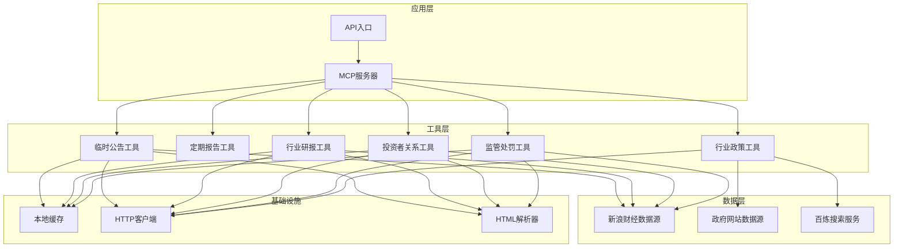

**图表来源**
- [server.py:18-69](file://nano-search-mcp/src/nano_search_mcp/server.py#L18-L69)
- [api.py:1-12](file://nano-search-mcp/src/nano_search_mcp/api.py#L1-L12)

**章节来源**
- [README.md:17-54](file://nano-search-mcp/README.md#L17-L54)
- [server.py:18-69](file://nano-search-mcp/src/nano_search_mcp/server.py#L18-L69)

## 核心组件
系统包含六大核心数据工具，每个工具都针对特定的金融信息类型提供专业的数据获取能力：

### 临时公告工具
- **数据源**: 新浪财经 vCB_AllBulletin
- **功能**: 获取A股上市公司临时公告列表和详细内容
- **特色**: 支持公告类型分类、日期过滤、全文提取
- **缓存策略**: 列表页1小时缓存，详情页7天缓存

### 定期报告工具  
- **数据源**: 新浪财经定期报告页面
- **功能**: 获取年报、半年报、一季报、三季报全文
- **特色**: 支持年份精确匹配、报告类型识别、正文提取
- **缓存策略**: 列表页1小时缓存，详情页7天缓存

### 行业研报工具
- **数据源**: 新浪财经行业研报
- **功能**: 获取券商发布的行业研究报告
- **特色**: 支持申万二级行业自动路由、关键词过滤、机构标签
- **缓存策略**: 列表页1小时缓存，详情页7天缓存

### 投资者关系工具
- **数据源**: 新浪财经临时公告（ftype=lsgg）
- **功能**: 获取投资者关系活动记录、调研纪要
- **特色**: 支持会议类型分类、参会机构提取、日期过滤
- **缓存策略**: 列表页1小时缓存，详情页7天缓存

### 监管处罚工具
- **数据源**: 新浪财经违规处理页面
- **功能**: 获取监管处罚和违规处理记录
- **特色**: 支持处罚类型标准化、机构识别、原因关键词提取
- **缓存策略**: 列表页1小时缓存

### 行业政策工具
- **数据源**: 政府网站gov.cn + 百炼WebSearch
- **功能**: 检索行业政策文件
- **特色**: 支持多机构识别、层级判断、去重合并
- **缓存策略**: 无本地缓存（依赖百炼服务）

**章节来源**
- [announcements.py:404-535](file://nano-search-mcp/src/nano_search_mcp/tools/announcements.py#L404-L535)
- [sina_reports.py:314-369](file://nano-search-mcp/src/nano_search_mcp/tools/sina_reports.py#L314-L369)
- [industry_reports.py:384-495](file://nano-search-mcp/src/nano_search_mcp/tools/industry_reports.py#L384-L495)
- [ir_meetings.py:489-618](file://nano-search-mcp/src/nano_search_mcp/tools/ir_meetings.py#L489-L618)
- [regulatory_penalties.py:393-447](file://nano-search-mcp/src/nano_search_mcp/tools/regulatory_penalties.py#L393-L447)
- [industry_policies.py:185-246](file://nano-search-mcp/src/nano_search_mcp/tools/industry_policies.py#L185-L246)

## 架构概览
系统采用分层架构设计，确保了良好的可扩展性和安全性：

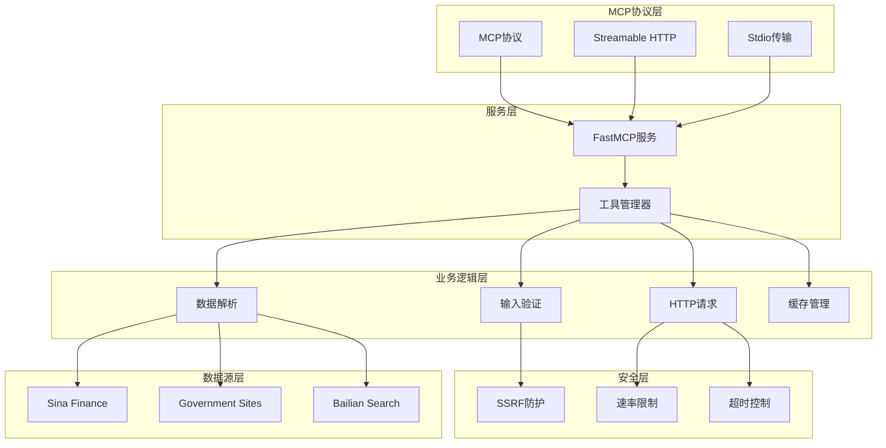

**图表来源**
- [server.py:19-58](file://nano-search-mcp/src/nano_search_mcp/server.py#L19-L58)
- [bailian_client.py:24-93](file://nano-search-mcp/src/nano_search_mcp/tools/bailian_client.py#L24-L93)

系统的核心特点包括：
- **统一协议**: 基于MCP协议，支持多种传输方式
- **模块化设计**: 每个工具独立实现，便于维护和扩展
- **安全防护**: 多层SSRF防护、速率限制和超时控制
- **错误处理**: 统一的错误契约，失败时返回结构化错误信息

**章节来源**
- [server.py:19-58](file://nano-search-mcp/src/nano_search_mcp/server.py#L19-L58)
- [README.md:47-54](file://nano-search-mcp/README.md#L47-L54)

## 详细组件分析

### 临时公告工具分析

#### 功能特性
临时公告工具专门用于获取A股上市公司的临时公告信息，具有以下核心功能：

- **公告类型分类**: 自动识别和分类公告类型，包括问询函、审计报告、会计师变更、诉讼、监管处罚、财报重述等
- **日期过滤**: 支持按日期区间过滤公告，提高查询效率
- **全文提取**: 从公告详情页提取纯文本内容，便于后续分析
- **智能缓存**: 采用分级缓存策略，平衡数据新鲜度和性能

#### 数据流图
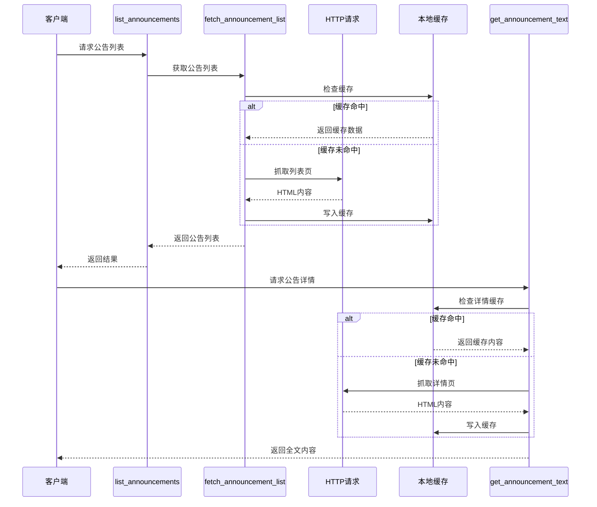

**图表来源**
- [announcements.py:312-377](file://nano-search-mcp/src/nano_search_mcp/tools/announcements.py#L312-L377)
- [announcements.py:379-398](file://nano-search-mcp/src/nano_search_mcp/tools/announcements.py#L379-L398)

#### API接口定义
临时公告工具提供两个核心API接口：

**list_announcements接口**
- **参数**:
  - `ts_code`: Tushare格式股票代码（必填）
  - `start_date`: 起始日期（YYYY-MM-DD，可选）
  - `end_date`: 结束日期（YYYY-MM-DD，可选）
  - `ann_types`: 公告类型过滤列表（可选）

- **返回值**:
  - `ts_code`: 股票代码
  - `source`: 数据源标识
  - `announcements`: 公告条目数组

**get_announcement_text接口**
- **参数**:
  - `source_url`: 公告详情页URL

- **返回值**:
  - `source_url`: 原始URL
  - `full_text`: 公告全文
  - `extracted_at`: 提取时间戳

#### 缓存策略
系统采用两级缓存策略：
- **列表页缓存**: TTL=3600秒（1小时），适合频繁查询的场景
- **详情页缓存**: TTL=604800秒（7天），适合相对稳定的公告内容

缓存文件存储在用户主目录下的`.cache`目录中，结构如下：
```
~/.cache/nano_search_mcp/announcements/
├── {stockid}_p{page}.json    # 列表页缓存
└── detail/{bulletin_id}.txt  # 详情页缓存
```

**章节来源**
- [announcements.py:404-535](file://nano-search-mcp/src/nano_search_mcp/tools/announcements.py#L404-L535)
- [announcements.py:73-77](file://nano-search-mcp/src/nano_search_mcp/tools/announcements.py#L73-L77)

### 定期报告工具分析

#### 功能特性
定期报告工具专注于获取A股上市公司的定期财务报告，提供精确的年份匹配和报告类型识别：

- **报告类型支持**: 年报、半年报、一季报、三季报
- **年份精确匹配**: 必须明确指定报告年份，避免模糊查询
- **报告类型识别**: 通过正则表达式识别不同类型的报告
- **正文提取**: 从报告详情页提取纯文本内容

#### 数据模型
定期报告工具的数据结构设计简洁明了：

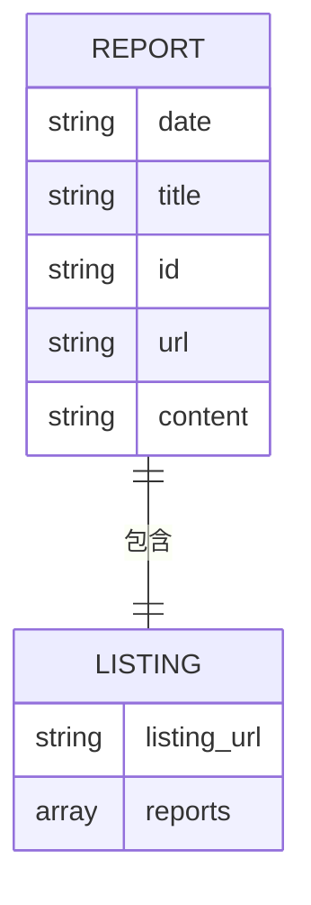

**图表来源**
- [sina_reports.py:249-304](file://nano-search-mcp/src/nano_search_mcp/tools/sina_reports.py#L249-L304)

#### 查询流程
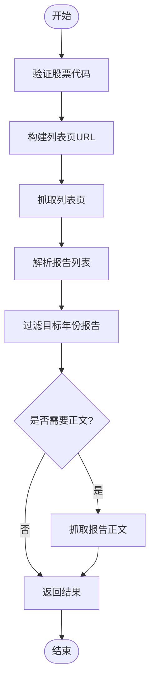

**图表来源**
- [sina_reports.py:267-304](file://nano-search-mcp/src/nano_search_mcp/tools/sina_reports.py#L267-L304)

#### API接口定义
**get_company_report接口**
- **参数**:
  - `stockid`: 股票代码（6位数字）
  - `year`: 报告年份（必须）
  - `report_type`: 报告类型（默认annual）

- **返回值**: 格式化的报告正文内容

#### 错误处理
定期报告工具采用严格的参数验证：
- 股票代码必须为6位数字
- 年份必须在合理范围内（1900-2100）
- 报告类型必须为支持的类型之一
- 如果找不到目标年份的报告，会抛出明确的错误信息

**章节来源**
- [sina_reports.py:314-369](file://nano-search-mcp/src/nano_search_mcp/tools/sina_reports.py#L314-L369)
- [sina_reports.py:211-247](file://nano-search-mcp/src/nano_search_mcp/tools/sina_reports.py#L211-L247)

### 行业研报工具分析

#### 功能特性
行业研报工具提供专业的券商研究报告检索能力，具有以下特色功能：

- **申万行业自动路由**: 通过股票代码自动识别所属申万二级行业
- **关键词过滤**: 支持标题关键词白名单过滤
- **日期范围控制**: 默认返回近1年的研报
- **机构标签**: 自动提取并标注行业标签

#### 数据获取流程
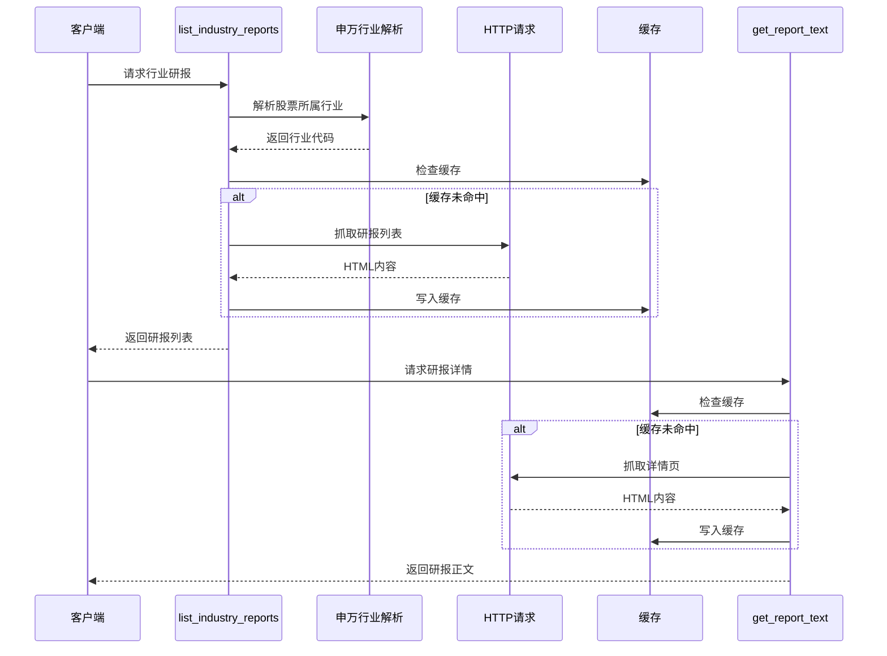

**图表来源**
- [industry_reports.py:273-370](file://nano-search-mcp/src/nano_search_mcp/tools/industry_reports.py#L273-L370)
- [industry_reports.py:372-382](file://nano-search-mcp/src/nano_search_mcp/tools/industry_reports.py#L372-L382)

#### 申万行业自动路由机制
系统通过解析股票详情页来获取申万二级行业信息：

1. **股票页面解析**: 访问股票详情页，提取行业相关信息
2. **正则匹配**: 使用正则表达式匹配行业代码和t1参数
3. **降级处理**: 当页面结构变化时，提供宽松的降级方案

#### 缓存策略
- **列表页缓存**: 使用查询参数的SHA1哈希作为缓存键
- **详情页缓存**: 使用URL的SHA1哈希作为缓存键
- **TTL设置**: 列表页1小时，详情页7天

**章节来源**
- [industry_reports.py:384-495](file://nano-search-mcp/src/nano_search_mcp/tools/industry_reports.py#L384-L495)
- [industry_reports.py:43-46](file://nano-search-mcp/src/nano_search_mcp/tools/industry_reports.py#L43-L46)

### 投资者关系工具分析

#### 功能特性
投资者关系工具专门处理机构调研记录、业绩说明会等IR活动信息：

- **IR活动识别**: 通过关键词识别IR相关公告
- **会议类型分类**: 自动分类为业绩说明会、实地调研、机构调研等
- **参会机构提取**: 从公告正文中提取参会机构名称
- **日期过滤**: 支持近6个月的默认时间范围

#### 会议类型分类体系
系统建立了完整的IR活动分类体系：

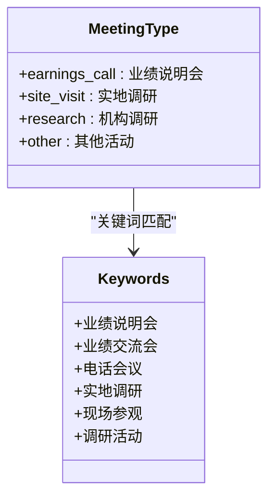

**图表来源**
- [ir_meetings.py:92-106](file://nano-search-mcp/src/nano_search_mcp/tools/ir_meetings.py#L92-L106)

#### 参会机构提取算法
系统使用正则表达式从公告正文中提取参会机构信息：

1. **模式匹配**: 查找"参会/参加/与会"等关键词
2. **文本分割**: 使用多种分隔符分割机构名称
3. **特征过滤**: 筛选符合机构特征的名称
4. **去重处理**: 保持顺序的同时去除重复项

#### 数据获取优化
系统实现了智能的早停机制：
- **最旧日期检测**: 从页面中提取最旧公告日期
- **提前终止**: 当页面最旧日期早于查询起始日期时提前停止
- **翻页控制**: 基于"下一页"链接的存在与否控制翻页

**章节来源**
- [ir_meetings.py:489-618](file://nano-search-mcp/src/nano_search_mcp/tools/ir_meetings.py#L489-L618)
- [ir_meetings.py:373-377](file://nano-search-mcp/src/nano_search_mcp/tools/ir_meetings.py#L373-L377)

### 监管处罚工具分析

#### 功能特性
监管处罚工具提供全面的上市公司违规处理信息检索：

- **处罚类型标准化**: 将原始处罚类型标准化为统一格式
- **机构识别**: 自动识别处理机构（交易所、证监局等）
- **原因关键词提取**: 从处罚原因中提取标准化关键词
- **日期过滤**: 支持按公告日期过滤

#### 数据解析机制
系统采用结构化的HTML解析方法：

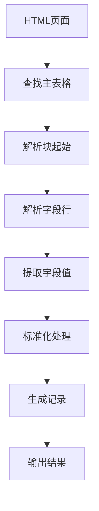

**图表来源**
- [regulatory_penalties.py:169-208](file://nano-search-mcp/src/nano_search_mcp/tools/regulatory_penalties.py#L169-L208)

#### 标准化处理流程
系统实现了多层次的数据标准化：

1. **处理机构标准化**: 将长名称转换为标准简称
2. **处罚原因标准化**: 提取关键词作为标准化原因
3. **日期格式统一**: 确保日期格式的一致性

#### API接口设计
监管处罚工具提供简洁的API接口：
- **list_regulatory_penalties**: 列出处罚记录
- **参数**: 股票代码、起始日期、结束日期
- **返回**: 标准化的处罚记录列表

**章节来源**
- [regulatory_penalties.py:393-447](file://nano-search-mcp/src/nano_search_mcp/tools/regulatory_penalties.py#L393-L447)

### 行业政策工具分析

#### 功能特性
行业政策工具结合政府网站和搜索引擎技术，提供全面的行业政策信息检索：

- **多源数据融合**: 结合gov.cn政府网站和百炼WebSearch
- **智能查询构建**: 自动生成site:gov.cn查询语句
- **去重合并**: 去除重复结果并合并相似内容
- **机构层级识别**: 自动识别中央部委、地方政府等层级

#### 百炼搜索集成
系统通过百炼MCP服务实现搜索功能：

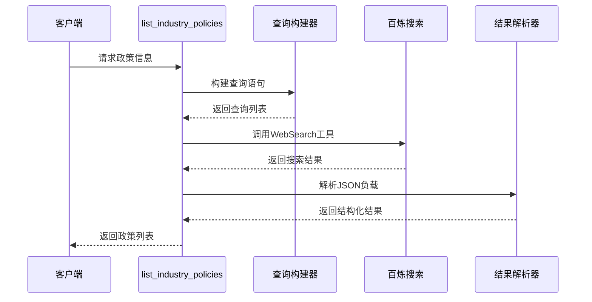

**图表来源**
- [industry_policies.py:94-168](file://nano-search-mcp/src/nano_search_mcp/tools/industry_policies.py#L94-L168)

#### 查询构建策略
系统采用智能的查询构建策略：

1. **行业关键词**: 基于申万二级行业名构建查询
2. **业务关键词**: 结合主营业务关键词增强相关性
3. **默认查询**: 当两者都为空时使用通用政策查询
4. **地域限定**: 添加region参数限定中国地区

#### 结果处理机制
系统实现了完整的搜索结果处理流程：

1. **去重处理**: 基于URL去重，避免重复结果
2. **机构识别**: 从URL推断发布机构和层级
3. **结果排序**: 按时间或其他标准排序
4. **数量限制**: 最多返回5条最新结果

**章节来源**
- [industry_policies.py:185-246](file://nano-search-mcp/src/nano_search_mcp/tools/industry_policies.py#L185-L246)
- [bailian_client.py:63-93](file://nano-search-mcp/src/nano_search_mcp/tools/bailian_client.py#L63-L93)

## 依赖分析

### 外部依赖关系
系统的主要外部依赖包括：

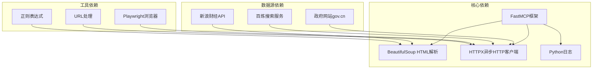

**图表来源**
- [server.py:6-16](file://nano-search-mcp/src/nano_search_mcp/server.py#L6-L16)
- [bailian_client.py:10-11](file://nano-search-mcp/src/nano_search_mcp/tools/bailian_client.py#L10-L11)

### 内部模块依赖
系统内部模块之间的依赖关系清晰有序：

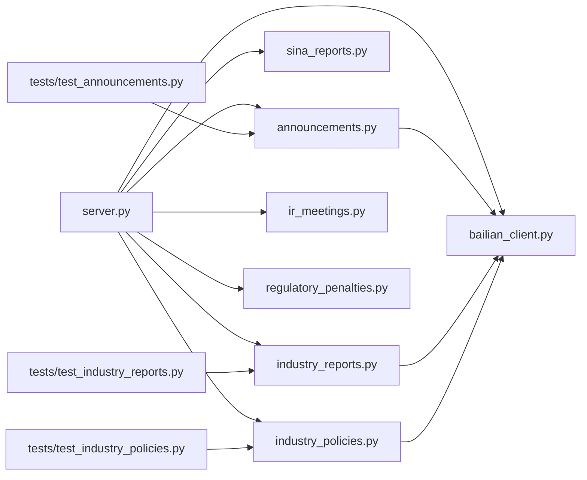

**图表来源**
- [server.py:8-16](file://nano-search-mcp/src/nano_search_mcp/server.py#L8-L16)

### 错误处理依赖
系统实现了完善的错误处理机制，依赖关系如下：

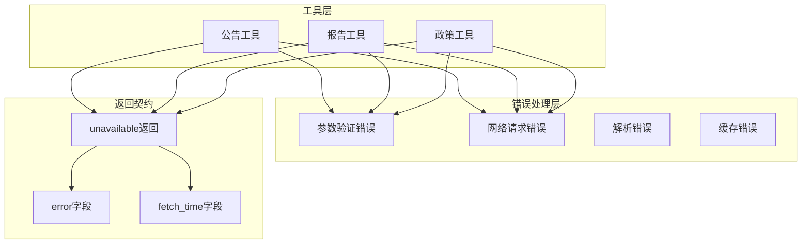

**图表来源**
- [README.md:47-48](file://nano-search-mcp/README.md#L47-L48)

**章节来源**
- [server.py:6-16](file://nano-search-mcp/src/nano_search_mcp/server.py#L6-L16)
- [README.md:47-54](file://nano-search-mcp/README.md#L47-L54)

## 性能考虑

### 缓存策略优化
系统采用了多层次的缓存策略来提升性能：

1. **短期缓存**: 列表页1小时缓存，适合频繁查询场景
2. **长期缓存**: 详情页7天缓存，适合相对稳定的静态内容
3. **智能缓存键**: 使用查询参数或URL的哈希值作为缓存键
4. **缓存失效**: 基于TTL和文件修改时间判断缓存有效性

### 网络请求优化
系统实现了多项网络请求优化技术：

1. **请求限速**: 通过_throttle()函数控制请求频率
2. **指数退避**: 失败时采用指数退避重试策略
3. **域名白名单**: 严格限制可访问的域名范围
4. **超时控制**: 合理设置HTTP请求超时时间

### 内存使用优化
系统在内存使用方面也进行了优化：

1. **增量处理**: 大多数工具支持增量处理，避免一次性加载大量数据
2. **生成器模式**: 在可能的情况下使用生成器减少内存占用
3. **及时释放**: 及时释放不需要的中间结果和临时变量

### 并发处理
系统支持并发处理多个数据源：

1. **异步HTTP**: 使用HTTPX库支持异步HTTP请求
2. **多线程**: 在某些情况下支持多线程处理
3. **资源池**: 管理HTTP连接池，避免频繁建立连接

## 故障排除指南

### 常见问题诊断

#### 网络连接问题
**症状**: 工具调用返回unavailable，包含网络错误信息

**排查步骤**:
1. 检查网络连接状态
2. 验证目标域名可达性
3. 检查防火墙和代理设置
4. 确认超时时间设置合理

**解决方案**:
- 增加超时时间
- 配置代理服务器
- 检查DNS解析
- 验证SSL证书

#### 数据解析失败
**症状**: HTML解析错误或数据格式异常

**排查步骤**:
1. 检查目标网页结构是否发生变化
2. 验证CSS选择器是否仍然有效
3. 确认编码格式正确
4. 检查网络请求是否成功

**解决方案**:
- 更新HTML解析规则
- 增加重试机制
- 添加降级处理逻辑
- 实施更严格的错误检查

#### 缓存问题
**症状**: 缓存数据过期或损坏

**排查步骤**:
1. 检查缓存文件权限
2. 验证缓存目录空间
3. 确认缓存文件完整性
4. 检查TTL设置是否合理

**解决方案**:
- 清理损坏的缓存文件
- 调整缓存TTL设置
- 增加缓存健康检查
- 实施缓存清理策略

### 错误处理最佳实践

#### 统一错误处理
系统遵循统一的错误处理契约：

```python
# 失败时的标准返回格式
{
    "source": "unavailable",
    "error": "错误描述",
    "fetch_time": "ISO8601时间戳"
}
```

#### 参数验证
所有工具都实现了严格的参数验证：

1. **类型检查**: 确保参数类型正确
2. **格式验证**: 验证日期、URL等格式
3. **范围检查**: 检查数值范围的有效性
4. **必需参数**: 确保必需参数存在

#### 日志记录
系统实现了完整的日志记录机制：

1. **调试日志**: 详细的调试信息
2. **警告日志**: 可能的问题提示
3. **错误日志**: 错误信息和堆栈跟踪
4. **性能日志**: 关键操作的性能指标

**章节来源**
- [README.md:47-54](file://nano-search-mcp/README.md#L47-L54)
- [announcements.py:456-470](file://nano-search-mcp/src/nano_search_mcp/tools/announcements.py#L456-L470)
- [industry_reports.py:445-451](file://nano-search-mcp/src/nano_search_mcp/tools/industry_reports.py#L445-L451)

## 结论
本金融数据检索工具集为A股市场提供了全面、专业的数据获取能力。通过六大核心工具域的协同工作，系统能够满足从临时公告到行业政策的全方位数据需求。

系统的主要优势包括：
- **模块化设计**: 每个工具独立实现，便于维护和扩展
- **安全可靠**: 多层安全防护和错误处理机制
- **性能优化**: 智能缓存和网络优化策略
- **标准化输出**: 统一的数据格式和API接口

未来的发展方向包括：
- 扩展更多数据源和工具域
- 增强AI辅助的数据分析能力
- 优化移动端和云端部署体验
- 加强与其他金融数据平台的集成

## 附录

### API使用示例

#### 临时公告查询
```python
# 查询特定股票的公告
result = await mcp._tool_manager.call_tool(
    "list_announcements",
    {
        "ts_code": "688270.SH",
        "start_date": "2026-01-01",
        "end_date": "2026-12-31",
        "ann_types": ["penalty", "inquiry"]
    }
)
```

#### 定期报告获取
```python
# 获取指定年份的年报
report = await mcp._tool_manager.call_tool(
    "get_company_report",
    {
        "stockid": "600519",
        "year": 2023,
        "report_type": "annual"
    }
)
```

#### 行业研报检索
```python
# 基于股票代码自动路由查询
result = await mcp._tool_manager.call_tool(
    "list_industry_reports",
    {
        "ts_code": "300750.SZ",
        "start_date": "2026-01-01",
        "end_date": "2026-12-31",
        "limit": 20
    }
)
```

#### 投资者关系活动
```python
# 查询IR活动
result = await mcp._tool_manager.call_tool(
    "list_ir_meetings",
    {
        "ts_code": "000001.SZ",
        "start_date": "2026-01-01",
        "end_date": "2026-06-30",
        "meeting_types": ["earnings_call", "site_visit"]
    }
)
```

#### 监管处罚查询
```python
# 查询监管处罚记录
result = await mcp._tool_manager.call_tool(
    "list_regulatory_penalties",
    {
        "ts_code": "600036.SH",
        "start_date": "2025-01-01",
        "end_date": "2026-12-31"
    }
)
```

#### 行业政策检索
```python
# 检索行业政策
result = await mcp._tool_manager.call_tool(
    "list_industry_policies",
    {
        "industry_sw_l2": "汽车零部件",
        "keywords": ["新能源", "电池"]
    }
)
```

### 配置选项

#### 环境变量
- `BAILIAN_WEBSEARCH_ENDPOINT`: 百炼WebSearch服务端点
- `DASHSCOPE_API_KEY`: 百炼API密钥
- `BAILIAN_MCP_TIMEOUT`: MCP请求超时时间（秒）

#### 缓存配置
- 缓存目录: `~/.cache/nano_search_mcp/`
- 列表页TTL: 3600秒（1小时）
- 详情页TTL: 604800秒（7天）

#### 安全配置
- 域名白名单: 仅允许新浪、政府网站等可信域名
- 请求限速: 至少1秒间隔
- 超时控制: 合理的HTTP超时设置

**章节来源**
- [api.py:1-12](file://nano-search-mcp/src/nano_search_mcp/api.py#L1-L12)
- [server.py:72-87](file://nano-search-mcp/src/nano_search_mcp/server.py#L72-L87)
- [README.md:55-76](file://nano-search-mcp/README.md#L55-L76)