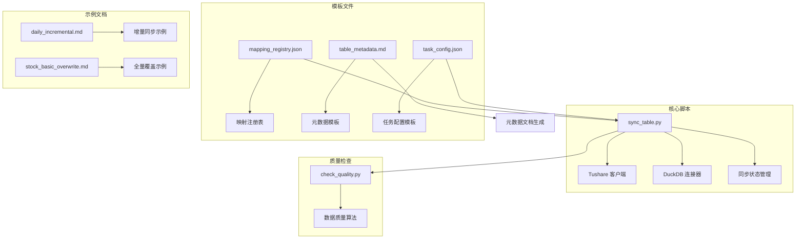
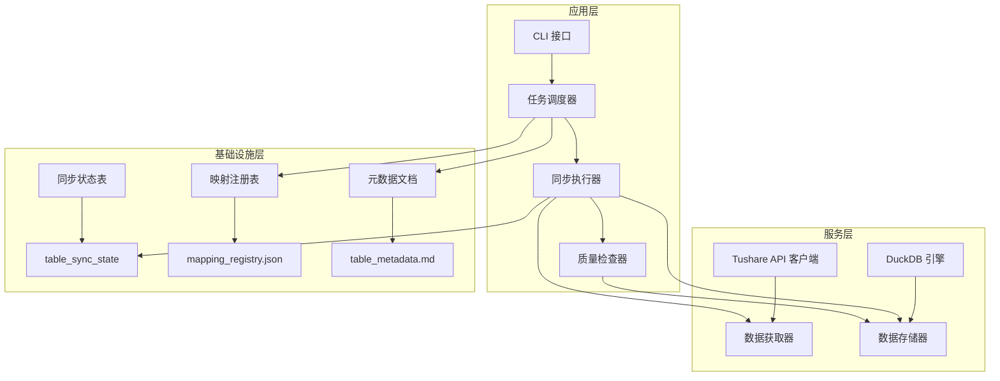
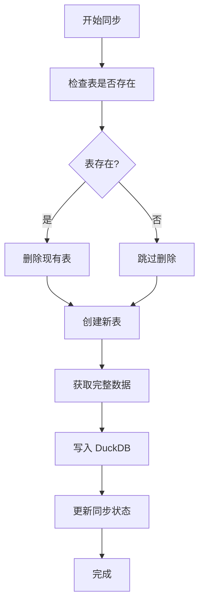
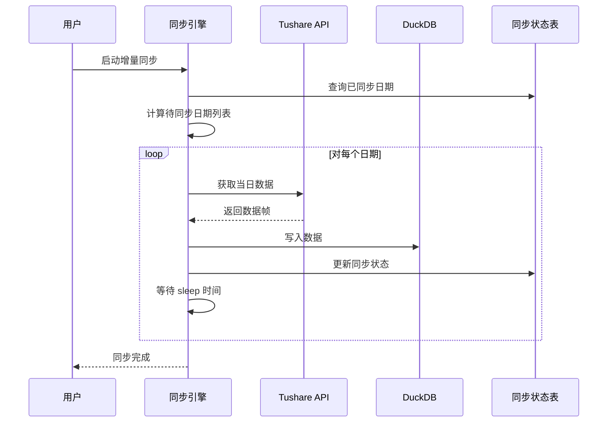
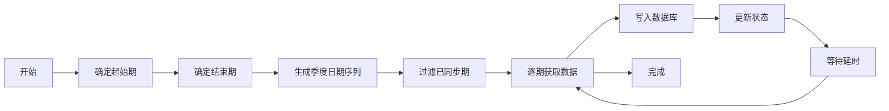
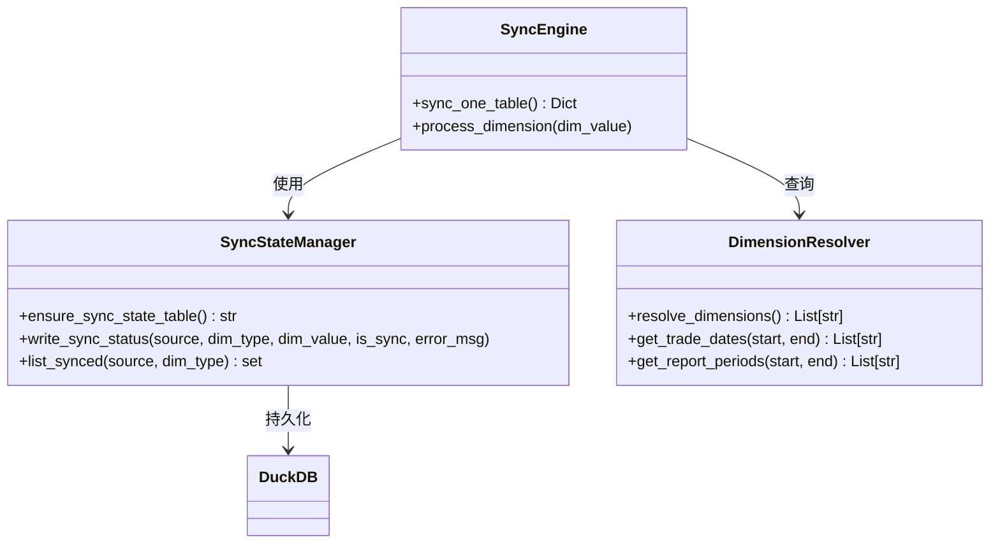
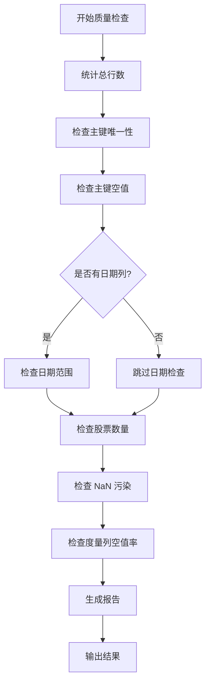
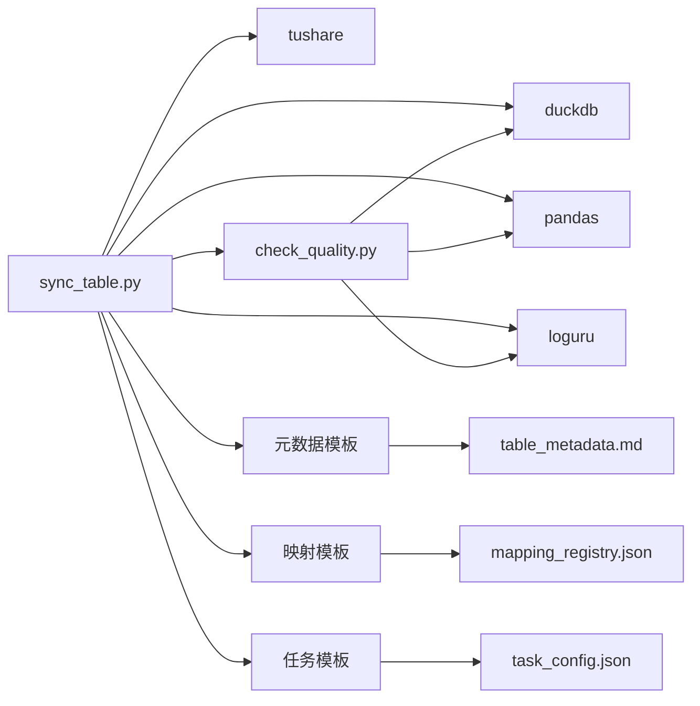

# Tushare-DuckDB 数据同步

<cite>
**本文引用的文件**
- [README.md](file://tushare-duckdb-sync/README.md)
- [SKILL.md](file://tushare-duckdb-sync/SKILL.md)
- [sync_table.py](file://tushare-duckdb-sync/scripts/sync_table.py)
- [check_quality.py](file://tushare-duckdb-sync/scripts/check_quality.py)
- [task_config.json](file://tushare-duckdb-sync/templates/task_config.json)
- [mapping_registry.json](file://tushare-duckdb-sync/templates/mapping_registry.json)
- [table_metadata.md](file://tushare-duckdb-sync/templates/table_metadata.md)
- [daily_incremental.md](file://tushare-duckdb-sync/examples/daily_incremental.md)
- [stock_basic_overwrite.md](file://tushare-duckdb-sync/examples/stock_basic_overwrite.md)
</cite>

## 目录
1. [简介](#简介)
2. [项目结构](#项目结构)
3. [核心组件](#核心组件)
4. [架构概览](#架构概览)
5. [详细组件分析](#详细组件分析)
6. [依赖关系分析](#依赖关系分析)
7. [性能考虑](#性能考虑)
8. [故障排除指南](#故障排除指南)
9. [结论](#结论)
10. [附录](#附录)

## 简介

Tushare-DuckDB 数据同步系统是一个完整的数据管道解决方案，专门设计用于将 Tushare Pro 的金融数据同步到本地 DuckDB 数据库中。该系统提供了三种不同的同步维度策略，支持断点续传机制、批量处理逻辑和完善的错误恢复策略。

该系统的核心设计理念是"三资产并重"：数据本身、数据元数据和运维记录。每个同步任务都必须同时产出这三份同等重要的资产，确保数据的可使用性、可理解性和可维护性。

## 项目结构

系统采用模块化设计，主要包含以下组件：



**图表来源**
- [sync_table.py:1-618](file://tushare-duckdb-sync/scripts/sync_table.py#L1-L618)
- [check_quality.py:1-231](file://tushare-duckdb-sync/scripts/check_quality.py#L1-L231)
- [mapping_registry.json:1-16](file://tushare-duckdb-sync/templates/mapping_registry.json#L1-L16)

**章节来源**
- [README.md:1-173](file://tushare-duckdb-sync/README.md#L1-L173)
- [SKILL.md:23-47](file://tushare-duckdb-sync/SKILL.md#L23-L47)

## 核心组件

### 同步引擎 (sync_table.py)

同步引擎是整个系统的核心，实现了完整的 ETL 工作流。它支持三种同步模式：

1. **全量覆盖模式** (`overwrite`)：适用于无维度表（如股票基本信息）
2. **增量追加模式** (`append`)：适用于按交易日或报告期的维度表
3. **断点续传机制**：自动跳过已同步的维度值

### 数据质量检查器 (check_quality.py)

独立的质量检查工具，提供标准化的数据质量评估，包括：
- 行数完整性检查
- 主键唯一性验证
- 空值率分析
- 日期范围验证
- NaN 字符串污染检测

### 元数据管理系统

通过模板化的元数据文档，确保每张表都有完整的文档说明，包括字段定义、数据角色、取值范围等。

**章节来源**
- [sync_table.py:451-517](file://tushare-duckdb-sync/scripts/sync_table.py#L451-L517)
- [check_quality.py:58-173](file://tushare-duckdb-sync/scripts/check_quality.py#L58-L173)

## 架构概览

系统采用分层架构设计，确保各组件职责清晰、耦合度低：



**图表来源**
- [sync_table.py:156-207](file://tushare-duckdb-sync/scripts/sync_table.py#L156-L207)
- [check_quality.py:58-173](file://tushare-duckdb-sync/scripts/check_quality.py#L58-L173)

## 详细组件分析

### 三种同步维度策略

#### 1. 无维度表同步 (stock_basic)

无维度表采用全量覆盖模式，适用于静态数据表：



**图表来源**
- [sync_table.py:422-444](file://tushare-duckdb-sync/scripts/sync_table.py#L422-L444)

#### 2. 交易日维度同步 (daily)

交易日维度采用增量模式，支持断点续传：



**图表来源**
- [sync_table.py:265-287](file://tushare-duckdb-sync/scripts/sync_table.py#L265-L287)
- [sync_table.py:483-510](file://tushare-duckdb-sync/scripts/sync_table.py#L483-L510)

#### 3. 报告期维度同步 (financial statements)

报告期维度按季度末进行同步：



**图表来源**
- [sync_table.py:228-231](file://tushare-duckdb-sync/scripts/sync_table.py#L228-L231)
- [sync_table.py:277-279](file://tushare-duckdb-sync/scripts/sync_table.py#L277-L279)

### 断点续传机制

系统实现了智能的断点续传功能：



**图表来源**
- [sync_table.py:156-215](file://tushare-duckdb-sync/scripts/sync_table.py#L156-L215)
- [sync_table.py:265-287](file://tushare-duckdb-sync/scripts/sync_table.py#L265-L287)

### 错误恢复策略

系统采用多层次的错误处理机制：

1. **网络异常重试**：自动重试失败的 API 调用
2. **维度级错误隔离**：单个维度失败不影响整体同步
3. **状态持久化**：失败状态记录在同步状态表中
4. **空结果保护**：增量维度的空结果默认标记为失败

**章节来源**
- [sync_table.py:300-337](file://tushare-duckdb-sync/scripts/sync_table.py#L300-L337)
- [sync_table.py:503-509](file://tushare-duckdb-sync/scripts/sync_table.py#L503-L509)

### 数据质量检查算法

数据质量检查器实现了标准化的质量评估：



**图表来源**
- [check_quality.py:58-173](file://tushare-duckdb-sync/scripts/check_quality.py#L58-L173)

**章节来源**
- [check_quality.py:176-201](file://tushare-duckdb-sync/scripts/check_quality.py#L176-L201)

### 配置文件格式

#### 任务配置模板

```json
{
  "endpoint": "接口名（如 stock_basic / daily）",
  "source_table": "Tushare 表名（通常同 endpoint）",
  "target_table": "DuckDB 目标表名（如 stk_info / stk_daily）",
  "mode": "overwrite | append",
  "dimension_type": "none | trade_date | period",
  "method": "query（默认）",
  "start_date": "起始日期 YYYYMMDD（增量/period 模式需要）",
  "end_date": "结束日期 YYYYMMDD（可选；默认到今天）",
  "sync_all": false,
  "sleep_seconds": 0.3,
  "publish_cutoff_hour": 18,
  "allow_empty_result": false,
  "params": {
    "_comment": "透传给 Tushare API 的额外参数（如 list_status=L）"
  }
}
```

#### 映射注册表结构

映射注册表记录了每张已同步表的完整映射关系，支持跨会话的知识共享。

**章节来源**
- [task_config.json:1-22](file://tushare-duckdb-sync/templates/task_config.json#L1-L22)
- [mapping_registry.json:1-16](file://tushare-duckdb-sync/templates/mapping_registry.json#L1-L16)

## 依赖关系分析

系统采用松耦合设计，主要依赖关系如下：



**图表来源**
- [sync_table.py:51-53](file://tushare-duckdb-sync/scripts/sync_table.py#L51-L53)
- [check_quality.py:32-33](file://tushare-duckdb-sync/scripts/check_quality.py#L32-L33)

**章节来源**
- [sync_table.py:12-12](file://tushare-duckdb-sync/scripts/sync_table.py#L12-L12)
- [check_quality.py:6-6](file://tushare-duckdb-sync/scripts/check_quality.py#L6-L6)

## 性能考虑

### 并发控制

系统通过以下机制控制并发：

1. **API 限频防护**：默认 0.3 秒间隔，可配置
2. **批量写入优化**：DataFrame 批量插入 DuckDB
3. **内存管理**：逐批处理数据，避免内存溢出

### 数据库优化

1. **索引策略**：建议为日期列创建独立索引
2. **主键约束**：确保数据完整性
3. **分区策略**：按时间维度进行物理分区

### 监控指标

建议监控以下关键指标：
- 同步成功率
- 平均处理时间
- 数据量增长趋势
- 错误率分布

## 故障排除指南

### 常见问题及解决方案

#### 1. Token 验证失败

**症状**：运行时报错提示缺少 TUSHARE_TOKEN
**解决**：确保正确设置环境变量或使用固定位置方案

#### 2. API 限频错误

**症状**：频繁出现连接超时或限频错误
**解决**：增加 `--sleep` 参数值，降低请求频率

#### 3. 数据类型转换问题

**症状**：日期列显示为字符串而非 DATE 类型
**解决**：系统会自动转换，检查目标表定义

#### 4. 断点续传失效

**症状**：重复同步已处理的维度
**解决**：检查 `table_sync_state` 表状态，清理异常记录

**章节来源**
- [sync_table.py:72-78](file://tushare-duckdb-sync/scripts/sync_table.py#L72-L78)
- [sync_table.py:313-319](file://tushare-duckdb-sync/scripts/sync_table.py#L313-L319)

## 结论

Tushare-DuckDB 数据同步系统提供了一个完整、可靠的数据管道解决方案。通过三种同步维度策略、智能断点续传机制和完善的错误恢复策略，系统能够高效地处理大规模金融数据的同步需求。

系统的核心优势在于：
1. **自动化程度高**：从元数据采集到数据同步的完整自动化流程
2. **可靠性强**：多重错误处理和状态管理机制
3. **可扩展性好**：模块化设计支持功能扩展
4. **可维护性强**：完整的元数据和运维记录体系

该系统特别适合需要长期维护的金融数据仓库建设，为量化分析和金融研究提供了坚实的数据基础。

## 附录

### 使用示例

#### 全量同步股票基本信息
```bash
python sync_table.py \
  --endpoint stock_basic \
  --duckdb-path ./ashare.duckdb \
  --target-table stk_info \
  --mode overwrite \
  --dimension-type none
```

#### 增量同步日线数据
```bash
python sync_table.py \
  --endpoint daily \
  --duckdb-path ./ashare.duckdb \
  --target-table stk_daily \
  --mode append \
  --dimension-type trade_date \
  --start-date 20240101 \
  --sync-all \
  --sleep 0.3
```

#### 批量同步任务
```bash
python sync_table.py --tasks-file tasks.json --duckdb-path ./ashare.duckdb
```

### 数据质量检查
```bash
python check_quality.py \
  --duckdb-path ./ashare.duckdb \
  --table stk_daily \
  --pk ts_code,trade_date \
  --date-col trade_date \
  --format markdown
```