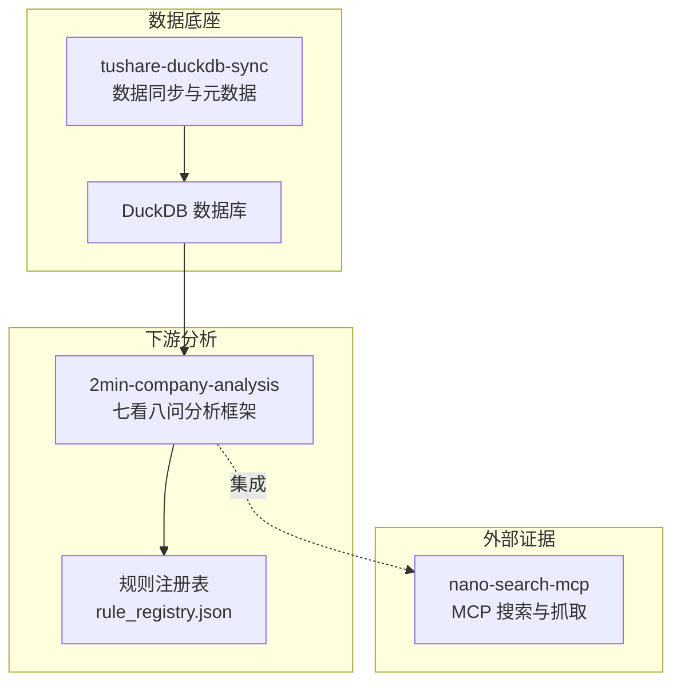
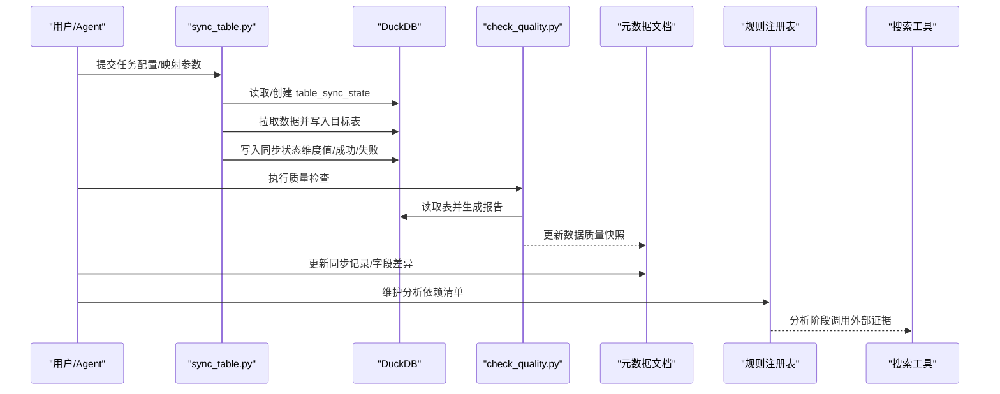
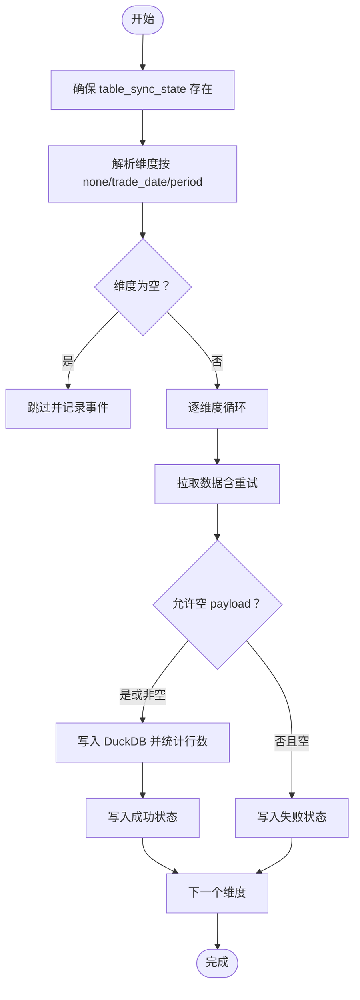
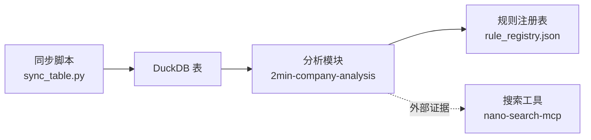
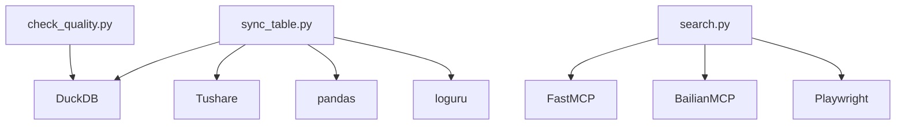

# 元数据管理

<cite>
**本文引用的文件**
- [mapping_registry.json](file://tushare-duckdb-sync/templates/mapping_registry.json)
- [task_config.json](file://tushare-duckdb-sync/templates/task_config.json)
- [table_metadata.md](file://tushare-duckdb-sync/templates/table_metadata.md)
- [sync_table.py](file://tushare-duckdb-sync/scripts/sync_table.py)
- [check_quality.py](file://tushare-duckdb-sync/scripts/check_quality.py)
- [README.md](file://tushare-duckdb-sync/README.md)
- [SKILL.md](file://tushare-duckdb-sync/SKILL.md)
- [daily_incremental.md](file://tushare-duckdb-sync/examples/daily_incremental.md)
- [stock_basic_overwrite.md](file://tushare-duckdb-sync/examples/stock_basic_overwrite.md)
- [rule_registry.json](file://2min-company-analysis/seven-look-eight-question/assets/rule_registry.json)
- [search.py](file://nano-search-mcp/src/nano_search_mcp/tools/search.py)
- [README.md](file://nano-search-mcp/README.md)
</cite>

## 目录
1. [简介](#简介)
2. [项目结构](#项目结构)
3. [核心组件](#核心组件)
4. [架构总览](#架构总览)
5. [详细组件分析](#详细组件分析)
6. [依赖关系分析](#依赖关系分析)
7. [性能考量](#性能考量)
8. [故障排查指南](#故障排查指南)
9. [结论](#结论)
10. [附录](#附录)

## 简介
本文件为元数据管理系统的技术文档，围绕 Tushare → DuckDB 数据同步工作流，系统阐述以下主题：
- 表结构文档的编写规范与维护策略
- 映射关系注册表的作用与配置方法
- 任务配置模板的格式与参数含义
- 同步状态跟踪表（table_sync_state）的设计与查询方法
- 元数据版本管理与变更追踪机制
- 元数据与下游分析模块的集成方式
- 元数据在数据治理中的作用与最佳实践

## 项目结构
本仓库包含三个主要子模块：
- tushare-duckdb-sync：数据同步与元数据文档生成的主工作流
- 2min-company-analysis：基于结构化数据的财务分析与证据抽取
- nano-search-mcp：外部非结构化证据（公告、研报、政策等）的搜索与抓取

图表来源
- [SKILL.md:1-173](file://tushare-duckdb-sync/SKILL.md#L1-L173)
- [README.md:1-198](file://nano-search-mcp/README.md#L1-L198)
- [rule_registry.json:1-410](file://2min-company-analysis/seven-look-eight-question/assets/rule_registry.json#L1-L410)

章节来源
- [SKILL.md:1-173](file://tushare-duckdb-sync/SKILL.md#L1-L173)
- [README.md:1-198](file://nano-search-mcp/README.md#L1-L198)

## 核心组件
- 同步脚本：负责从 Tushare 拉取数据、写入 DuckDB，并维护 table_sync_state 同步状态
- 质检脚本：对 DuckDB 表进行标准化质量检查，输出结构化报告
- 元数据模板：标准化的表结构文档模板，覆盖字段详情、数据质量快照、同步记录等
- 映射注册表：记录每张表的 Tushare → DuckDB 映射关系，支撑断点续传与参数复用
- 规则注册表：下游分析模块对表与派生指标的依赖清单
- 搜索工具：为分析模块提供外部证据（公告、研报、政策等）

章节来源
- [sync_table.py:1-618](file://tushare-duckdb-sync/scripts/sync_table.py#L1-L618)
- [check_quality.py:1-231](file://tushare-duckdb-sync/scripts/check_quality.py#L1-L231)
- [table_metadata.md:1-73](file://tushare-duckdb-sync/templates/table_metadata.md#L1-L73)
- [mapping_registry.json:1-16](file://tushare-duckdb-sync/templates/mapping_registry.json#L1-L16)
- [rule_registry.json:1-410](file://2min-company-analysis/seven-look-eight-question/assets/rule_registry.json#L1-L410)
- [search.py:1-119](file://nano-search-mcp/src/nano_search_mcp/tools/search.py#L1-L119)

## 架构总览
元数据管理贯穿“采集 → 同步 → 质检 → 文档 → 分析”的闭环：
- 采集：从 Tushare 文档提取字段与维度信息，形成元数据文档
- 同步：依据映射注册表与任务配置，将数据写入 DuckDB，并记录同步状态
- 质检：对新同步表执行标准化检查，更新元数据文档的质量快照
- 文档：维护每张表的完整元数据文档，包含字段详情、质量快照、同步记录
- 分析：下游分析模块读取 DuckDB 数据与规则注册表，结合外部证据完成分析

图表来源
- [sync_table.py:451-517](file://tushare-duckdb-sync/scripts/sync_table.py#L451-L517)
- [check_quality.py:58-173](file://tushare-duckdb-sync/scripts/check_quality.py#L58-L173)
- [SKILL.md:313-374](file://tushare-duckdb-sync/SKILL.md#L313-L374)
- [rule_registry.json:1-410](file://2min-company-analysis/seven-look-eight-question/assets/rule_registry.json#L1-L410)
- [search.py:79-119](file://nano-search-mcp/src/nano_search_mcp/tools/search.py#L79-L119)

## 详细组件分析

### 表结构文档编写规范与维护策略
- 模板结构：以模板为蓝本，必须包含“基本信息、字段详情、特殊取值说明、Tushare↔DuckDB 差异、数据质量快照、同步记录”等章节
- 字段详情规范：
  - DuckDB 类型：以实际 DuckDB 表的 information_schema 为准，若表未建则标注待确认
  - Tushare 原始类型：来自官方文档
  - 数据角色：标识/维度/度量/辅助
  - 量化用途：唯一标识、时间维度、OHLC 行情、成交量价、资金流向、财务指标、技术因子、持仓明细、状态标记、分类维度、辅助信息
  - 取值范围/格式：日期格式、枚举值、常见数值范围
  - 注意事项：类型转换、特殊取值、精度问题等
- 质量快照：每次质检后覆盖写入，记录行数、日期范围、PK 唯一性、NaN 污染、度量列空值率等
- 同步记录：每次同步追加一行，记录时间、操作、新增行数、数据截止、备注
- 维护策略：
  - 字段差异：当 Tushare 字段与本地表字段不一致时，在“差异”章节记录
  - 版本追踪：每次更新在“同步记录”中留痕，便于回溯
  - 归档：超过一定数量的历史记录迁移至 archive 目录

章节来源
- [table_metadata.md:1-73](file://tushare-duckdb-sync/templates/table_metadata.md#L1-L73)
- [stock_basic_overwrite.md:67-146](file://tushare-duckdb-sync/examples/stock_basic_overwrite.md#L67-L146)
- [daily_incremental.md:91-163](file://tushare-duckdb-sync/examples/daily_incremental.md#L91-L163)
- [SKILL.md:142-320](file://tushare-duckdb-sync/SKILL.md#L142-L320)

### 映射关系注册表的作用与配置方法
- 作用：
  - 记录每张已同步表的 Tushare 接口名、目标表名、维度类型、方法调用、主键、doc_id 等
  - 支持断点续传与参数复用，避免每次从头推断
  - 作为跨会话的本地知识库，逐步积累用户映射经验
- 配置方法：
  - 初始化：将模板复制到文档根目录，初始为空数组
  - 追加：每次同步完成后，将新表的映射条目追加到 tables 数组
  - 查阅顺序：优先使用本地注册表，其次参考种子映射，最后从官方文档推断
- 字段说明：
  - source_table：逻辑名（通常与 endpoint 一致）
  - target_table：DuckDB 目标表名
  - endpoint：Tushare 接口名
  - dimension_type：none/trade_date/period
  - method：query 或具体方法名
  - pk：主键列，逗号分隔
  - doc_id：Tushare 文档 doc_id
  - note：备注（如 _vip 后缀、特殊调用方式等）

章节来源
- [mapping_registry.json:1-16](file://tushare-duckdb-sync/templates/mapping_registry.json#L1-L16)
- [SKILL.md:399-442](file://tushare-duckdb-sync/SKILL.md#L399-L442)

### 任务配置模板的格式与参数含义
- 模板结构：数组元素为任务对象，支持单表与批量模式
- 关键参数：
  - endpoint：Tushare 接口名
  - source_table：逻辑名（默认与 endpoint 一致）
  - target_table：DuckDB 目标表名
  - mode：overwrite 或 append
  - dimension_type：none/trade_date/period
  - method：默认 query，也可为具体方法名
  - start_date/end_date：YYYYMMDD，增量/period 模式需要
  - sync_all：启用断点续传（跳过已同步维度）
  - sleep_seconds：每次调用间隔（秒）
  - publish_cutoff_hour：交易日安全截止小时（默认 18）
  - allow_empty_result：允许空 payload 记成功（仅在 0 行合法时使用）
  - params：透传给 Tushare API 的额外参数（JSON 对象）
- 批量模式：通过 tasks-file 读取任务数组，逐项执行

章节来源
- [task_config.json:1-22](file://tushare-duckdb-sync/templates/task_config.json#L1-L22)
- [sync_table.py:524-586](file://tushare-duckdb-sync/scripts/sync_table.py#L524-L586)
- [README.md:131-152](file://tushare-duckdb-sync/README.md#L131-L152)

### 同步状态跟踪表（table_sync_state）的设计与查询方法
- 设计目标：支持断点续传、失败追踪、空 payload 保护
- 表结构：
  - source_table：Tushare 接口名/历史表名
  - dimension_type：trade_date/period/none
  - dimension_value：具体日期值（如 20260416）
  - is_sync：1=成功, 0=失败
  - error_message：失败原因（成功时为空）
  - updated_at：写入时间
- 查询方法：
  - 断点续传：查询已同步维度集合，跳过已成功维度
  - 失败重试：筛选 is_sync=0 的记录，定位错误维度
  - 空 payload 保护：增量维度默认将空返回记为失败
- 写入时机：维度推进时写入成功/失败状态

图表来源
- [sync_table.py:156-215](file://tushare-duckdb-sync/scripts/sync_table.py#L156-L215)
- [sync_table.py:265-287](file://tushare-duckdb-sync/scripts/sync_table.py#L265-L287)
- [sync_table.py:451-517](file://tushare-duckdb-sync/scripts/sync_table.py#L451-L517)

章节来源
- [sync_table.py:156-215](file://tushare-duckdb-sync/scripts/sync_table.py#L156-L215)
- [SKILL.md:253-277](file://tushare-duckdb-sync/SKILL.md#L253-L277)

### 元数据版本管理与变更追踪机制
- 版本与变更：
  - 同步记录：每次同步追加一行，记录时间、操作、新增行数、数据截止、备注
  - 质量快照：每次质检覆盖写入，记录最新检查结果
  - 字段差异：当 Tushare 字段与本地表字段不一致时，在“差异”章节记录
- 追踪策略：
  - 同步记录只保留最近若干条，超出数量的旧记录迁移至 archive 目录
  - 数据质量快照只保留最新一份
  - 字段详情与差异随同步过程动态更新
- 回溯能力：通过同步记录与 table_sync_state 可快速定位某次同步的维度、状态与错误信息

章节来源
- [SKILL.md:390-396](file://tushare-duckdb-sync/SKILL.md#L390-L396)
- [table_metadata.md:50-73](file://tushare-duckdb-sync/templates/table_metadata.md#L50-L73)
- [daily_incremental.md:158-163](file://tushare-duckdb-sync/examples/daily_incremental.md#L158-L163)

### 元数据与下游分析模块的集成方式
- 数据底座：tushare-duckdb-sync 为下游分析提供结构化数据（DuckDB）
- 规则注册表：下游分析模块通过 rule_registry.json 明确每条规则/问题所需的表与派生指标
- 外部证据：nano-search-mcp 提供公告、年报、研报、政策等非结构化证据，与分析模块协同
- 集成流程：
  - 先同步结构化数据，再安装并启动搜索服务
  - 分析模块按规则注册表读取所需表，结合外部证据完成分析

图表来源
- [SKILL.md:1-12](file://tushare-duckdb-sync/SKILL.md#L1-L12)
- [rule_registry.json:1-410](file://2min-company-analysis/seven-look-eight-question/assets/rule_registry.json#L1-L410)
- [README.md:1-198](file://nano-search-mcp/README.md#L1-L198)

章节来源
- [SKILL.md:1-12](file://tushare-duckdb-sync/SKILL.md#L1-L12)
- [rule_registry.json:1-410](file://2min-company-analysis/seven-look-eight-question/assets/rule_registry.json#L1-L410)
- [README.md:1-198](file://nano-search-mcp/README.md#L1-L198)

## 依赖关系分析
- 同步脚本依赖：
  - DuckDB：建表、插入、查询
  - Tushare：接口调用与数据拉取
  - pandas：数据清洗与类型转换
  - loguru：结构化日志
- 质检脚本依赖：
  - DuckDB：只读查询与统计
  - pandas：辅助统计（在本脚本中未使用）
- 搜索工具依赖：
  - MCP 服务框架：FastMCP
  - 百炼客户端：BailianMCP
  - Playwright：页面抓取渲染

图表来源
- [sync_table.py:51-54](file://tushare-duckdb-sync/scripts/sync_table.py#L51-L54)
- [check_quality.py:32-34](file://tushare-duckdb-sync/scripts/check_quality.py#L32-L34)
- [search.py:6-13](file://nano-search-mcp/src/nano_search_mcp/tools/search.py#L6-L13)

章节来源
- [sync_table.py:51-54](file://tushare-duckdb-sync/scripts/sync_table.py#L51-L54)
- [check_quality.py:32-34](file://tushare-duckdb-sync/scripts/check_quality.py#L32-L34)
- [search.py:6-13](file://nano-search-mcp/src/nano_search_mcp/tools/search.py#L6-L13)

## 性能考量
- 限频与重试：默认 sleep 与 max_retries 降低 API 限频风险，失败维度可定向重试
- 类型转换：自动将 YYYYMMDD 字符串转换为 DATE 类型，减少后续处理开销
- 断点续传：通过 table_sync_state 跳过已同步维度，显著缩短增量同步时间
- 空 payload 保护：避免把“上游未发布”误记成功，减少无效重跑
- 批量模式：通过 tasks-file 一次性提交多个任务，提高吞吐

章节来源
- [sync_table.py:300-320](file://tushare-duckdb-sync/scripts/sync_table.py#L300-L320)
- [sync_table.py:390-402](file://tushare-duckdb-sync/scripts/sync_table.py#L390-L402)
- [README.md:116-129](file://tushare-duckdb-sync/README.md#L116-L129)

## 故障排查指南
- 网络超时/限频：增加 sleep 或降低并发；必要时延长 max_retries
- 字段不匹配：脚本会丢弃目标表不存在的列并记录警告；在元数据文档“差异”章节记录
- VARCHAR→DATE 类型冲突：脚本内置自动转换；若失败，检查数据格式一致性
- 空 payload：对增量维度默认记失败；确认是否早于发布截止时间或是否需要调整 end_date
- Token 问题：确保 TUSHARE_TOKEN 环境变量有效；支持一次性提供或固定位置授权
- 同步状态异常：查询 table_sync_state 定位失败维度，针对性重试

章节来源
- [sync_table.py:322-338](file://tushare-duckdb-sync/scripts/sync_table.py#L322-L338)
- [sync_table.py:492-509](file://tushare-duckdb-sync/scripts/sync_table.py#L492-L509)
- [check_quality.py:176-202](file://tushare-duckdb-sync/scripts/check_quality.py#L176-L202)
- [SKILL.md:246-252](file://tushare-duckdb-sync/SKILL.md#L246-L252)

## 结论
本元数据管理系统通过“模板化文档 + 映射注册表 + 同步状态表 + 质检报告”的组合，实现了从采集到分析的全链路可追溯与可维护。借助断点续传、空 payload 保护与结构化日志，系统在保证数据质量的同时提升了运维效率。下游分析模块与外部证据工具的集成进一步完善了数据治理闭环。

## 附录
- 示例文档：
  - [daily_incremental.md:1-163](file://tushare-duckdb-sync/examples/daily_incremental.md#L1-L163)
  - [stock_basic_overwrite.md:1-146](file://tushare-duckdb-sync/examples/stock_basic_overwrite.md#L1-L146)
- 模板文件：
  - [mapping_registry.json:1-16](file://tushare-duckdb-sync/templates/mapping_registry.json#L1-L16)
  - [task_config.json:1-22](file://tushare-duckdb-sync/templates/task_config.json#L1-L22)
  - [table_metadata.md:1-73](file://tushare-duckdb-sync/templates/table_metadata.md#L1-L73)
- 工具脚本：
  - [sync_table.py:1-618](file://tushare-duckdb-sync/scripts/sync_table.py#L1-L618)
  - [check_quality.py:1-231](file://tushare-duckdb-sync/scripts/check_quality.py#L1-L231)
- 集成参考：
  - [rule_registry.json:1-410](file://2min-company-analysis/seven-look-eight-question/assets/rule_registry.json#L1-L410)
  - [search.py:1-119](file://nano-search-mcp/src/nano_search_mcp/tools/search.py#L1-L119)