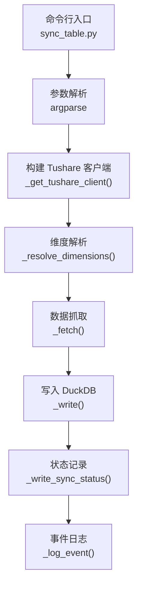
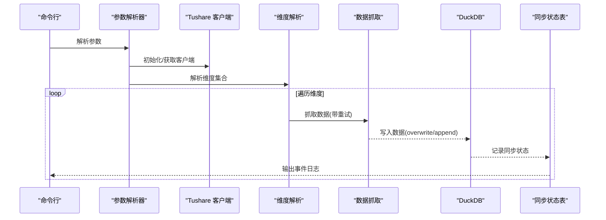
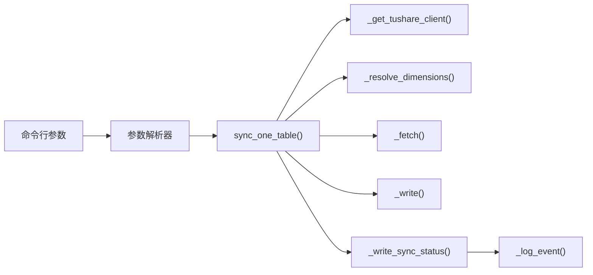

# 同步实现细节

<cite>
**本文引用的文件**
- [sync_table.py](file://tushare-duckdb-sync/scripts/sync_table.py)
- [README.md](file://tushare-duckdb-sync/README.md)
- [daily_incremental.md](file://tushare-duckdb-sync/examples/daily_incremental.md)
- [stock_basic_overwrite.md](file://tushare-duckdb-sync/examples/stock_basic_overwrite.md)
- [task_config.json](file://tushare-duckdb-sync/templates/task_config.json)
- [table_metadata.md](file://tushare-duckdb-sync/templates/table_metadata.md)
- [mapping_registry.json](file://tushare-duckdb-sync/templates/mapping_registry.json)
- [check_quality.py](file://tushare-duckdb-sync/scripts/check_quality.py)
</cite>

## 目录
1. [简介](#简介)
2. [项目结构](#项目结构)
3. [核心组件](#核心组件)
4. [架构总览](#架构总览)
5. [详细组件分析](#详细组件分析)
6. [依赖关系分析](#依赖关系分析)
7. [性能考虑](#性能考虑)
8. [故障排查指南](#故障排查指南)
9. [结论](#结论)
10. [附录](#附录)

## 简介
本文件面向“同步脚本实现”，聚焦于 tushare-duckdb-sync 中的单表同步脚本，系统性解析其核心算法、三种同步模式（全量覆盖 overwrite、增量追加 append）的工作原理、参数配置与最佳实践、断点续传机制与状态跟踪、错误处理策略、性能调优与并发控制，并提供具体使用示例与命令行参数组合。

## 项目结构
- 同步脚本位于 tushare-duckdb-sync/scripts/sync_table.py，提供命令行入口与核心同步流程。
- README.md 提供快速开始、参数说明、同步状态与三种维度类型的说明。
- examples 目录包含典型表的使用示例，如 stock_basic（全量覆盖）与 daily（交易日增量）。
- templates 目录包含任务配置模板、表元数据模板与映射注册模板。
- scripts/check_quality.py 提供下游数据质量检查工具，便于验证同步结果。

图表来源
- [sync_table.py:524-562](file://tushare-duckdb-sync/scripts/sync_table.py#L524-L562)
- [sync_table.py:67-79](file://tushare-duckdb-sync/scripts/sync_table.py#L67-L79)
- [sync_table.py:265-288](file://tushare-duckdb-sync/scripts/sync_table.py#L265-L288)
- [sync_table.py:294-320](file://tushare-duckdb-sync/scripts/sync_table.py#L294-L320)
- [sync_table.py:405-444](file://tushare-duckdb-sync/scripts/sync_table.py#L405-L444)
- [sync_table.py:189-207](file://tushare-duckdb-sync/scripts/sync_table.py#L189-L207)
- [sync_table.py:98-99](file://tushare-duckdb-sync/scripts/sync_table.py#L98-L99)

章节来源
- [README.md:131-152](file://tushare-duckdb-sync/README.md#L131-L152)
- [sync_table.py:524-562](file://tushare-duckdb-sync/scripts/sync_table.py#L524-L562)

## 核心组件
- Tushare 客户端缓存与初始化：通过环境变量获取 token 并缓存客户端实例，避免重复初始化。
- 维度解析：根据维度类型（none/trade_date/period）生成待同步的维度值集合。
- 数据抓取：支持两种调用方式（query 与具体方法名），带重试与退避策略。
- DuckDB 写入：支持 overwrite 与 append 两种模式，自动对齐列、规范化日期列、插入数据。
- 同步状态管理：在 DuckDB 内部维护 table_sync_state 表，记录每个维度值的同步状态，支持断点续传。
- 事件日志：统一输出结构化事件日志，便于观测与审计。

章节来源
- [sync_table.py:67-79](file://tushare-duckdb-sync/scripts/sync_table.py#L67-L79)
- [sync_table.py:265-288](file://tushare-duckdb-sync/scripts/sync_table.py#L265-L288)
- [sync_table.py:294-320](file://tushare-duckdb-sync/scripts/sync_table.py#L294-L320)
- [sync_table.py:405-444](file://tushare-duckdb-sync/scripts/sync_table.py#L405-L444)
- [sync_table.py:156-186](file://tushare-duckdb-sync/scripts/sync_table.py#L156-L186)
- [sync_table.py:98-99](file://tushare-duckdb-sync/scripts/sync_table.py#L98-L99)

## 架构总览
整体流程从命令行参数解析开始，构造 Tushare 客户端，解析维度，抓取数据，写入 DuckDB，并记录同步状态与事件日志。断点续传通过查询已同步维度集合实现。

图表来源
- [sync_table.py:588-617](file://tushare-duckdb-sync/scripts/sync_table.py#L588-L617)
- [sync_table.py:451-517](file://tushare-duckdb-sync/scripts/sync_table.py#L451-L517)
- [sync_table.py:265-288](file://tushare-duckdb-sync/scripts/sync_table.py#L265-L288)
- [sync_table.py:294-320](file://tushare-duckdb-sync/scripts/sync_table.py#L294-L320)
- [sync_table.py:405-444](file://tushare-duckdb-sync/scripts/sync_table.py#L405-L444)
- [sync_table.py:189-207](file://tushare-duckdb-sync/scripts/sync_table.py#L189-L207)
- [sync_table.py:98-99](file://tushare-duckdb-sync/scripts/sync_table.py#L98-L99)

## 详细组件分析

### 1) 三种同步模式与工作原理
- 全量覆盖（overwrite）
  - 适用：无维度表（如 stock_basic）或需要完全替换目标表的场景。
  - 行为：首次写入时若目标表不存在则创建；存在则在首次批次删除旧表后重建，确保目标表与源数据一致。
  - 列对齐：若源数据列多于目标表，会丢弃多余列；若少于目标表，按目标表列顺序补齐并填充空值。
  - 日期列处理：对 DuckDB 中 DATE 类型列，自动将 YYYYMMDD 字符串转换为日期类型。
- 增量追加（append）
  - 适用：按交易日（trade_date）或报告期（period）维度的表（如 daily、income 等）。
  - 行为：每次写入均以 INSERT 方式追加，不删除已有数据；通过同步状态表记录已成功的维度值，避免重复。
  - 断点续传：结合 --sync-all 使用，自动跳过已同步维度；遇到失败维度时可继续处理其他维度。
  - 空 payload 保护：默认将空返回视为失败，避免把“上游尚未发布”误记为成功；可通过 --allow-empty-result 允许 0 行作为成功。

章节来源
- [sync_table.py:405-444](file://tushare-duckdb-sync/scripts/sync_table.py#L405-L444)
- [sync_table.py:322-337](file://tushare-duckdb-sync/scripts/sync_table.py#L322-L337)
- [README.md:47-87](file://tushare-duckdb-sync/README.md#L47-L87)

### 2) 维度解析与安全截止规则
- 维度类型
  - none：仅一次维度，常用于无维度表。
  - trade_date：基于交易日历，按开放交易日逐日拉取；默认采用 Asia/Shanghai 18:00 安全截止规则。
  - period：按季度末报告期（Q4）生成维度序列。
- 安全截止规则
  - 若未显式传入 --end-date，且当前时间早于 18:00，则将截止日收敛到上一个开放交易日，避免把当天空 payload 误记成功。
  - 可通过 --disable-safe-trade-date 关闭此规则；也可通过 --publish-cutoff-hour 调整截止小时。
- 维度集合生成
  - 对 trade_date：先获取回溯窗口内的开放交易日，再与 start/end 过滤得到最终集合。
  - 对 period：基于起止日期生成季度末序列。
  - 若开启 --sync-all，会排除已同步的维度值，仅处理未完成的维度。

章节来源
- [sync_table.py:221-288](file://tushare-duckdb-sync/scripts/sync_table.py#L221-L288)
- [sync_table.py:234-262](file://tushare-duckdb-sync/scripts/sync_table.py#L234-L262)
- [sync_table.py:265-288](file://tushare-duckdb-sync/scripts/sync_table.py#L265-L288)
- [README.md:40-46](file://tushare-duckdb-sync/README.md#L40-L46)

### 3) 数据抓取与重试策略
- 方法选择：支持 method=query 或具体方法名（如 suspend_d）。若方法名不在客户端上，将报错。
- 参数解析：--params 以 JSON 字符串形式传递额外参数，最终拼接到 API 调用中。
- 重试与退避：最大重试次数可配置；每次重试等待时间为 base_sleep × attempt 秒，避免触发限频。
- 空 payload 保护：对增量维度，空 DataFrame 将被判定为失败，除非显式允许 --allow-empty-result。

章节来源
- [sync_table.py:294-320](file://tushare-duckdb-sync/scripts/sync_table.py#L294-L320)
- [sync_table.py:135-146](file://tushare-duckdb-sync/scripts/sync_table.py#L135-L146)
- [sync_table.py:322-337](file://tushare-duckdb-sync/scripts/sync_table.py#L322-L337)
- [sync_table.py:531](file://tushare-duckdb-sync/scripts/sync_table.py#L531)
- [sync_table.py:542-549](file://tushare-duckdb-sync/scripts/sync_table.py#L542-L549)

### 4) DuckDB 写入与列对齐
- 表存在性检测：若目标表不存在则创建；存在则进行列对齐与日期列规范化。
- 列对齐：丢弃源数据中目标表不存在的列；对齐列顺序，缺失列补空值。
- 日期列处理：对 DuckDB 中 DATE 类型列，自动将 YYYYMMDD 字符串转换为日期类型，提升存储与查询效率。
- 插入策略：append 模式使用 INSERT；overwrite 模式在首次批次删除旧表后重建。
- 行数统计：写入后查询表总行数，返回本次加载行数与累计总行数。

章节来源
- [sync_table.py:344-444](file://tushare-duckdb-sync/scripts/sync_table.py#L344-L444)
- [sync_table.py:374-402](file://tushare-duckdb-sync/scripts/sync_table.py#L374-L402)

### 5) 断点续传与状态跟踪
- 状态表：在 DuckDB 内部维护 table_sync_state 表，记录 source_table、dimension_type、dimension_value、is_sync、error_message、updated_at。
- 查询与去重：通过 _list_synced 获取已成功维度集合，结合 --sync-all 跳过已完成维度。
- 失败记录：任一维度写入失败都会记录错误信息，便于后续定向重试。
- 事件日志：统一输出结构化事件，包括 sync_started、dimension_done、sync_completed、sync_skipped 等。

章节来源
- [sync_table.py:156-186](file://tushare-duckdb-sync/scripts/sync_table.py#L156-L186)
- [sync_table.py:189-207](file://tushare-duckdb-sync/scripts/sync_table.py#L189-L207)
- [sync_table.py:209-214](file://tushare-duckdb-sync/scripts/sync_table.py#L209-L214)
- [sync_table.py:472-476](file://tushare-duckdb-sync/scripts/sync_table.py#L472-L476)
- [sync_table.py:495-498](file://tushare-duckdb-sync/scripts/sync_table.py#L495-L498)
- [sync_table.py:511-517](file://tushare-duckdb-sync/scripts/sync_table.py#L511-L517)
- [sync_table.py:98-99](file://tushare-duckdb-sync/scripts/sync_table.py#L98-L99)

### 6) 错误处理策略与异常情况
- 结构化错误：定义 SyncError，携带上下文字典，便于定位问题。
- 空 payload 保护：对增量维度默认失败，避免误判；仅在明确业务语义允许时使用 --allow-empty-result。
- 重试与退避：失败自动重试，指数退避等待，降低限频风险。
- 维度级容错：--sync-all 下遇到失败维度会继续处理其他维度，提升整体吞吐。
- 事件日志：失败维度会写入错误信息，便于后续重试与审计。

章节来源
- [sync_table.py:90-96](file://tushare-duckdb-sync/scripts/sync_table.py#L90-L96)
- [sync_table.py:322-337](file://tushare-duckdb-sync/scripts/sync_table.py#L322-L337)
- [sync_table.py:300-319](file://tushare-duckdb-sync/scripts/sync_table.py#L300-L319)
- [sync_table.py:503-509](file://tushare-duckdb-sync/scripts/sync_table.py#L503-L509)

### 7) 参数配置与最佳实践
- 基础参数
  - --endpoint：Tushare 接口名（如 daily、stock_basic）
  - --duckdb-path：DuckDB 文件路径
  - --target-table/--source-table：目标表名与状态跟踪逻辑名
  - --mode：overwrite 或 append
  - --dimension-type：none/trade_date/period
  - --dimension-field：API 调用时维度参数名（默认与维度类型相同）
  - --method：调用方式（默认 query）
  - --start-date/--end-date：起止日期（YYYYMMDD）
  - --params：JSON 字符串，透传给 Tushare API
- 控制与安全
  - --sync-all：启用断点续传（跳过已同步维度，失败时继续）
  - --allow-empty-result：允许空 payload 记成功（仅在 0 行为合法业务结果时使用）
  - --disable-safe-trade-date：关闭交易日安全截止规则
  - --publish-cutoff-hour：调整 Asia/Shanghai 发布截止小时（默认 18）
- 性能与并发
  - --sleep：每次调用间隔（秒），防限频
  - --max-retries/base-sleep：重试次数与退避基数
  - --tasks-file：批量任务文件，支持多表并行调度（由外部调度器控制）

章节来源
- [sync_table.py:524-562](file://tushare-duckdb-sync/scripts/sync_table.py#L524-L562)
- [README.md:131-152](file://tushare-duckdb-sync/README.md#L131-L152)

### 8) 使用示例与命令行参数组合
- 全量覆盖（stock_basic）
  - 命令：见示例文件与 README 快速开始。
  - 关键点：overwrite 模式，dimension-type none，首次写入创建表并建立主键与索引。
- 增量追加（daily）
  - 命令：见示例文件与 README 快速开始。
  - 关键点：append 模式，dimension-type trade_date，建议使用 --sync-all 与 --sleep 防限频。
- 按报告期（income 等）
  - 命令：见 README 快速开始。
  - 关键点：append 模式，dimension-type period，start_date 指定起始报告期。
- 批量同步
  - 命令：--tasks-file 指向 JSON 文件，每条任务对象包含 endpoint、target_table、mode、dimension_type 等。
  - 关键点：支持覆盖全局参数，每条任务独立执行。

章节来源
- [stock_basic_overwrite.md:15-39](file://tushare-duckdb-sync/examples/stock_basic_overwrite.md#L15-L39)
- [daily_incremental.md:16-62](file://tushare-duckdb-sync/examples/daily_incremental.md#L16-L62)
- [README.md:47-87](file://tushare-duckdb-sync/README.md#L47-L87)
- [task_config.json:1-22](file://tushare-duckdb-sync/templates/task_config.json#L1-L22)

### 9) 数据质量检查与下游集成
- check_quality.py：对指定表执行行数、主键唯一性、主键空值、日期范围、ts_code 与日期去重、NaN 字符串污染、度量列空值率等检查。
- 输出格式：text/json/markdown，便于嵌入元数据文档。
- 与同步流程衔接：建议在同步完成后运行质量检查，核验数据完整性与一致性。

章节来源
- [check_quality.py:58-173](file://tushare-duckdb-sync/scripts/check_quality.py#L58-L173)
- [check_quality.py:204-231](file://tushare-duckdb-sync/scripts/check_quality.py#L204-L231)
- [README.md:116-129](file://tushare-duckdb-sync/README.md#L116-L129)

## 依赖关系分析
- 外部依赖：tushare、duckdb、pandas、loguru。
- 内部耦合：同步流程高度内聚，围绕 sync_one_table 组织；状态表与写入逻辑解耦，便于扩展。
- 参数映射：命令行参数与任务文件字段映射，支持覆盖全局参数。

图表来源
- [sync_table.py:524-562](file://tushare-duckdb-sync/scripts/sync_table.py#L524-L562)
- [sync_table.py:451-517](file://tushare-duckdb-sync/scripts/sync_table.py#L451-L517)
- [sync_table.py:67-79](file://tushare-duckdb-sync/scripts/sync_table.py#L67-L79)
- [sync_table.py:265-288](file://tushare-duckdb-sync/scripts/sync_table.py#L265-L288)
- [sync_table.py:294-320](file://tushare-duckdb-sync/scripts/sync_table.py#L294-L320)
- [sync_table.py:405-444](file://tushare-duckdb-sync/scripts/sync_table.py#L405-L444)
- [sync_table.py:189-207](file://tushare-duckdb-sync/scripts/sync_table.py#L189-L207)
- [sync_table.py:98-99](file://tushare-duckdb-sync/scripts/sync_table.py#L98-L99)

章节来源
- [sync_table.py:565-585](file://tushare-duckdb-sync/scripts/sync_table.py#L565-L585)

## 性能考虑
- 重试与退避：合理设置 --max-retries 与 --base-sleep，平衡成功率与速率。
- 防限频：通过 --sleep 控制调用间隔，避免触发上游限频。
- 断点续传：--sync-all 减少重复工作，提高整体吞吐。
- 列对齐与日期规范化：减少后续查询与聚合的类型转换成本。
- 批量任务：通过 --tasks-file 与外部调度器并行化，但需注意 DuckDB 的并发写入限制与磁盘 IO。

章节来源
- [sync_table.py:542-549](file://tushare-duckdb-sync/scripts/sync_table.py#L542-L549)
- [sync_table.py:544](file://tushare-duckdb-sync/scripts/sync_table.py#L544)
- [sync_table.py:561](file://tushare-duckdb-sync/scripts/sync_table.py#L561)

## 故障排查指南
- 缺少 TUSHARE_TOKEN：启动即报错，需设置环境变量。
- 维度窗口无效：当 start > end（如交易日安全截止导致），抛出结构化错误，提示调整截止或显式传入 --end-date。
- 空 payload 导致失败：对增量维度默认失败，除非使用 --allow-empty-result。
- 维度级失败：--sync-all 下会记录错误并继续处理其他维度；可单独重试失败维度。
- 事件日志：关注 sync_started、dimension_done、sync_completed、sync_skipped 等事件，定位问题阶段。

章节来源
- [sync_table.py:72-78](file://tushare-duckdb-sync/scripts/sync_table.py#L72-L78)
- [sync_table.py:272-275](file://tushare-duckdb-sync/scripts/sync_table.py#L272-L275)
- [sync_table.py:326-337](file://tushare-duckdb-sync/scripts/sync_table.py#L326-L337)
- [sync_table.py:503-509](file://tushare-duckdb-sync/scripts/sync_table.py#L503-L509)
- [sync_table.py:472-476](file://tushare-duckdb-sync/scripts/sync_table.py#L472-L476)
- [sync_table.py:495-498](file://tushare-duckdb-sync/scripts/sync_table.py#L495-L498)
- [sync_table.py:511-517](file://tushare-duckdb-sync/scripts/sync_table.py#L511-L517)

## 结论
该同步脚本通过清晰的模式分离（overwrite/append）、严谨的维度解析与安全截止规则、完善的断点续传与状态跟踪、以及结构化的错误处理与事件日志，实现了稳定可靠的 Tushare → DuckDB 数据同步。配合下游质量检查工具，可形成从采集到验证的闭环。建议在生产环境中结合 --sync-all、--sleep、--max-retries 等参数进行调优，并在首次同步后完善主键与索引以提升查询性能。

## 附录
- 元数据模板：table_metadata.md 提供标准化的表元数据文档模板，便于沉淀同步成果。
- 映射注册：mapping_registry.json 记录 Tushare→DuckDB 的映射关系，便于版本演进与追溯。
- 任务配置：task_config.json 提供批量任务的 JSON 结构参考，支持覆盖全局参数。

章节来源
- [table_metadata.md:1-73](file://tushare-duckdb-sync/templates/table_metadata.md#L1-L73)
- [mapping_registry.json:1-16](file://tushare-duckdb-sync/templates/mapping_registry.json#L1-L16)
- [task_config.json:1-22](file://tushare-duckdb-sync/templates/task_config.json#L1-L22)