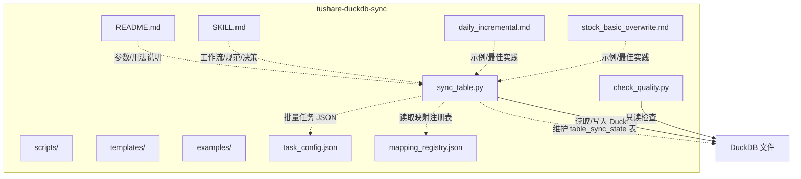
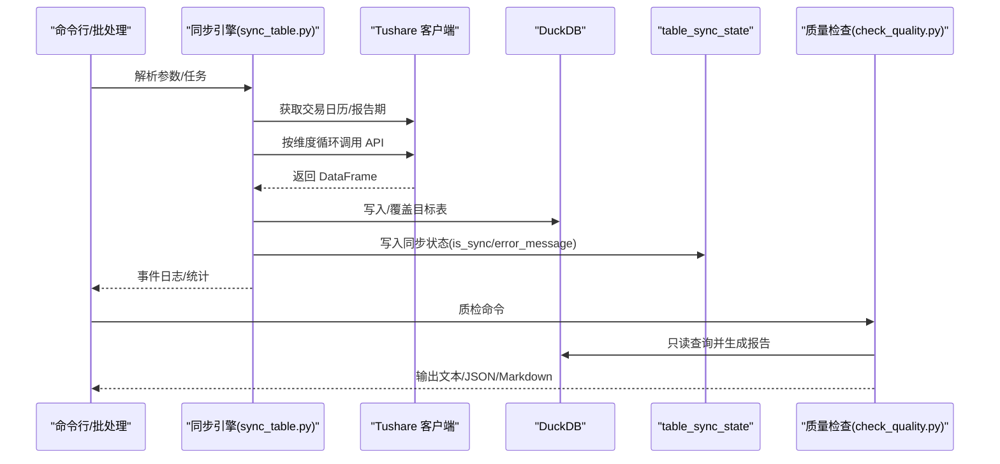
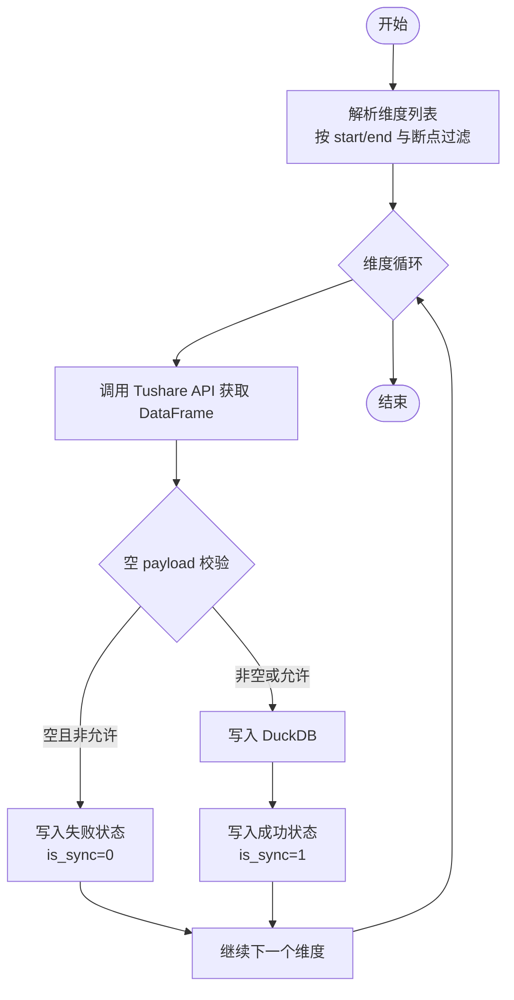
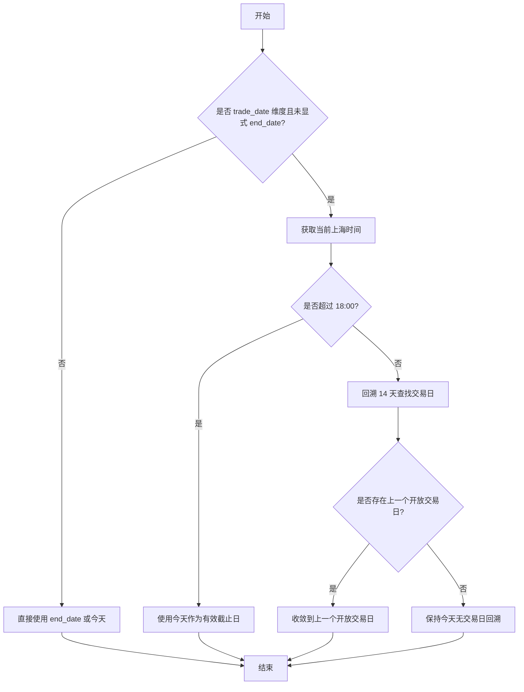
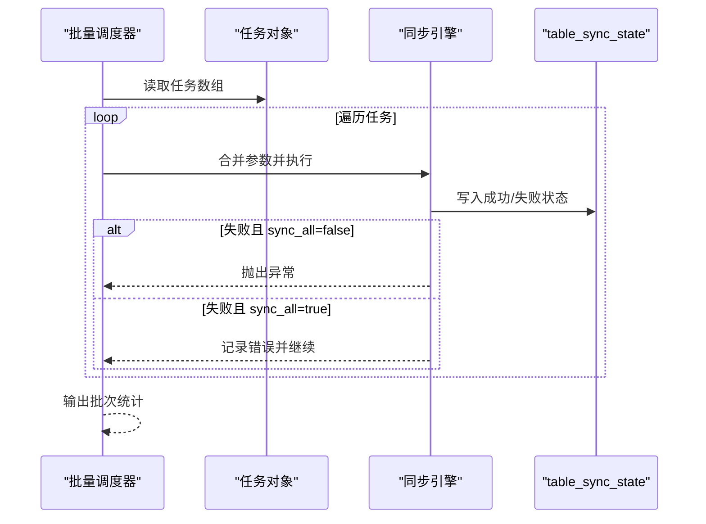
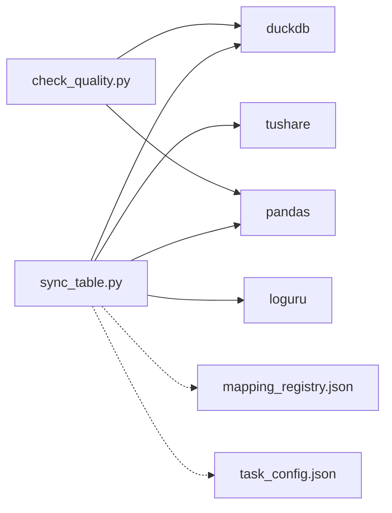

# 同步架构设计

<cite>
**本文引用的文件**
- [README.md](file://tushare-duckdb-sync/README.md)
- [SKILL.md](file://tushare-duckdb-sync/SKILL.md)
- [sync_table.py](file://tushare-duckdb-sync/scripts/sync_table.py)
- [check_quality.py](file://tushare-duckdb-sync/scripts/check_quality.py)
- [mapping_registry.json](file://tushare-duckdb-sync/templates/mapping_registry.json)
- [task_config.json](file://tushare-duckdb-sync/templates/task_config.json)
- [daily_incremental.md](file://tushare-duckdb-sync/examples/daily_incremental.md)
- [stock_basic_overwrite.md](file://tushare-duckdb-sync/examples/stock_basic_overwrite.md)
</cite>

## 目录
1. [简介](#简介)
2. [项目结构](#项目结构)
3. [核心组件](#核心组件)
4. [架构总览](#架构总览)
5. [详细组件分析](#详细组件分析)
6. [依赖关系分析](#依赖关系分析)
7. [性能考虑](#性能考虑)
8. [故障排查指南](#故障排查指南)
9. [结论](#结论)
10. [附录](#附录)

## 简介
本文件面向 Tushare → DuckDB 数据同步架构，系统性阐述 ETL 工作流的设计理念、系统边界、三种同步维度类型（none、trade_date、period）的设计原理与适用场景、断点续传机制与状态管理策略、交易日安全窗口的业务逻辑、批量任务调度与错误恢复机制，并提供系统架构图与数据流向图，最后给出性能优化建议与资源使用指导。该架构强调“数据、元数据、运维记录”三资产齐备，确保可审计、可增量、可恢复、可扩展。

## 项目结构
- scripts：核心同步与质量检查脚本（自包含，无项目内部依赖）
  - sync_table.py：单表/批量同步主程序，支持三种维度类型、断点续传、安全截止、错误恢复与事件日志
  - check_quality.py：标准化数据质量检查，输出结构化报告
- templates：模板与配置
  - mapping_registry.json：映射注册表种子（空数组），记录每张已同步表的 Tushare→DuckDB 映射关系
  - task_config.json：批量任务配置模板
- examples：使用示例
  - daily_incremental.md：按交易日增量示例（日线行情）
  - stock_basic_overwrite.md：无维度全量覆盖示例（股票列表）
- README.md：快速开始、参数说明、同步状态与三种维度类型说明
- SKILL.md：工作流编排、三项资产、Schema 规范、映射注册表机制、决策分支等

图表来源
- [sync_table.py:451-517](file://tushare-duckdb-sync/scripts/sync_table.py#L451-L517)
- [check_quality.py:58-173](file://tushare-duckdb-sync/scripts/check_quality.py#L58-L173)
- [mapping_registry.json:1-16](file://tushare-duckdb-sync/templates/mapping_registry.json#L1-L16)
- [task_config.json:1-22](file://tushare-duckdb-sync/templates/task_config.json#L1-L22)

章节来源
- [README.md:1-173](file://tushare-duckdb-sync/README.md#L1-L173)
- [SKILL.md:23-449](file://tushare-duckdb-sync/SKILL.md#L23-L449)

## 核心组件
- 同步引擎（sync_table.py）
  - Tushare 客户端缓存单例、参数解析、维度解析、数据抓取、写入 DuckDB、同步状态写入、事件日志
  - 支持三种维度类型：none（全量覆盖）、trade_date（按交易日增量）、period（按报告期增量）
  - 断点续传：基于 table_sync_state 表记录已同步维度值
  - 错误恢复：重试、失败状态写入、批量模式下继续下一个任务
- 质检引擎（check_quality.py）
  - 标准化检查项：行数、PK 唯一性/非空、日期范围、NaN 字符串污染、度量列空值率
  - 输出文本/JSON/Markdown 三种格式，便于嵌入元数据文档
- 映射注册表（mapping_registry.json）
  - 记录每张已同步表的 source_table/target_table/endpoint/dimension_type/method/pk/doc_id 等
  - 作为跨会话本地知识库，支撑参数推断与一致性
- 批量任务配置（task_config.json）
  - 任务数组模板，支持多表并发/串行控制、参数透传、安全截止与空结果处理策略

章节来源
- [sync_table.py:451-517](file://tushare-duckdb-sync/scripts/sync_table.py#L451-L517)
- [check_quality.py:58-173](file://tushare-duckdb-sync/scripts/check_quality.py#L58-L173)
- [mapping_registry.json:1-16](file://tushare-duckdb-sync/templates/mapping_registry.json#L1-L16)
- [task_config.json:1-22](file://tushare-duckdb-sync/templates/task_config.json#L1-L22)

## 架构总览
整体 ETL 流程分为四层：
- 输入层：CLI 参数/任务文件、Tushare Token 环境变量、DuckDB 文件路径
- 解析与调度层：参数解析、维度解析、断点过滤、批量任务合并
- 执行层：Tushare API 调用、DataFrame 处理、DuckDB 写入、状态写入
- 输出层：结构化事件日志、table_sync_state、质量报告、元数据文档

图表来源
- [sync_table.py:265-287](file://tushare-duckdb-sync/scripts/sync_table.py#L265-L287)
- [sync_table.py:294-337](file://tushare-duckdb-sync/scripts/sync_table.py#L294-L337)
- [sync_table.py:405-444](file://tushare-duckdb-sync/scripts/sync_table.py#L405-L444)
- [sync_table.py:189-206](file://tushare-duckdb-sync/scripts/sync_table.py#L189-L206)
- [check_quality.py:58-173](file://tushare-duckdb-sync/scripts/check_quality.py#L58-L173)

## 详细组件分析

### 三种同步维度类型
- none（无维度）
  - 典型表：stock_basic（股票列表）
  - 同步方式：全量覆盖（overwrite），每次拉取完整数据后覆盖本地表
  - 适用场景：静态基础信息、清单类数据
- trade_date（按交易日）
  - 典型表：daily（日线）、moneyflow（资金流）、stk_factor_pro、idx_factor_pro 等盘后更新表
  - 同步方式：按交易日逐日拉取，支持断点续传
  - 适用场景：行情、资金流、因子类数据
- period（按报告期）
  - 典型表：income（利润表）、balancesheet（资产负债表）、cashflow（现金流量表）、fina_indicator（财务指标）
  - 同步方式：按季末报告期拉取（季度频率）
  - 适用场景：财务报表类数据

设计原则与业务考量
- 与上游数据发布时间匹配：对盘后更新表采用交易日安全截止规则，避免把“尚未发布”的空 payload 误记成功
- 增量维度默认把空 payload 记为失败，等待后续重试
- 允许显式放行空结果的接口需谨慎评估“0 行本身就是合法业务语义”的前提

章节来源
- [README.md:162-168](file://tushare-duckdb-sync/README.md#L162-L168)
- [SKILL.md:182-187](file://tushare-duckdb-sync/SKILL.md#L182-L187)

### 断点续传机制与状态管理
- 状态表：table_sync_state
  - 字段：source_table、dimension_type、dimension_value、is_sync、error_message、updated_at
  - 作用：记录每个维度值的同步状态，支持断点续传、失败追踪、空 payload 保护
- 续传逻辑
  - 当 dimension_type != "none" 且启用 --sync-all 时，脚本会查询已成功维度集合，跳过已同步值
  - 失败维度写入 is_sync=0 与错误信息，便于定向重试
- 状态写入时机
  - 成功：维度完成后写入 is_sync=1
  - 失败：维度完成后写入 is_sync=0 与错误信息（除非是 none 维度）

图表来源
- [sync_table.py:265-287](file://tushare-duckdb-sync/scripts/sync_table.py#L265-L287)
- [sync_table.py:294-337](file://tushare-duckdb-sync/scripts/sync_table.py#L294-L337)
- [sync_table.py:189-206](file://tushare-duckdb-sync/scripts/sync_table.py#L189-L206)

章节来源
- [README.md:154-161](file://tushare-duckdb-sync/README.md#L154-L161)
- [sync_table.py:156-206](file://tushare-duckdb-sync/scripts/sync_table.py#L156-L206)

### 交易日安全窗口设计与业务逻辑
- 安全截止规则
  - 默认以 Asia/Shanghai 18:00 为当天数据安全发布时间
  - 未显式传入 --end-date 且当前时间早于 18:00 时，自动收敛截止日到上一个开放交易日
- 空 payload 处理
  - 增量维度返回空 payload 时不记成功，避免把“上游未发布”误写成“成功同步”
  - 仅在“0 行结果本来就是正确业务语义”的接口上，显式使用 --allow-empty-result
- 例外与禁用
  - 可通过 --disable-safe-trade-date 关闭安全截止规则
  - 可通过 --publish-cutoff-hour 调整发布截止小时

图表来源
- [sync_table.py:234-262](file://tushare-duckdb-sync/scripts/sync_table.py#L234-L262)
- [sync_table.py:221-225](file://tushare-duckdb-sync/scripts/sync_table.py#L221-L225)
- [README.md:40-45](file://tushare-duckdb-sync/README.md#L40-L45)

章节来源
- [README.md:40-45](file://tushare-duckdb-sync/README.md#L40-L45)
- [SKILL.md:182-187](file://tushare-duckdb-sync/SKILL.md#L182-L187)

### 批量任务调度与错误恢复
- 批量模式
  - 通过 --tasks-file 指定任务数组 JSON，逐个任务执行
  - 支持参数透传（如 start_date、end_date、sleep、allow_empty_result 等）
- 错误恢复
  - 单任务失败不影响其他任务（批量模式）
  - 失败维度写入状态表，支持后续定向重试
  - 支持重试与退避（max_retries/base_sleep）
- 事件日志
  - 统一以结构化 JSON 事件输出，便于审计与监控

图表来源
- [sync_table.py:588-614](file://tushare-duckdb-sync/scripts/sync_table.py#L588-L614)
- [sync_table.py:565-585](file://tushare-duckdb-sync/scripts/sync_table.py#L565-L585)
- [task_config.json:1-22](file://tushare-duckdb-sync/templates/task_config.json#L1-L22)

章节来源
- [sync_table.py:588-614](file://tushare-duckdb-sync/scripts/sync_table.py#L588-L614)
- [task_config.json:1-22](file://tushare-duckdb-sync/templates/task_config.json#L1-L22)

### 数据写入与类型转换
- DuckDB 写入策略
  - overwrite 模式：首次写入 DROP 表并重建
  - append 模式：若表不存在则 CREATE TABLE AS SELECT，否则 INSERT
  - 自动丢弃目标表不存在的列（警告日志）
- 类型转换
  - 自动将 YYYYMMDD 字符串转换为 DATE 类型（针对 DATE 列）
  - NaN → None（SQL NULL）
- 主键与索引
  - 建议在首次同步后添加 PK 与索引（如 idx_{table}_trade_date），提升查询性能

章节来源
- [sync_table.py:405-444](file://tushare-duckdb-sync/scripts/sync_table.py#L405-L444)
- [SKILL.md:378-386](file://tushare-duckdb-sync/SKILL.md#L378-L386)

### 数据质量检查
- 检查项
  - 行数 > 0（除已知空表）
  - PK 唯一性、PK 非空
  - 日期范围（若提供 date-col）
  - NaN 字符串污染（VARCHAR 列）
  - 度量列空值率 > 50% 标记
- 输出格式
  - text（默认）、json、markdown（可直接嵌入文档）

章节来源
- [check_quality.py:58-173](file://tushare-duckdb-sync/scripts/check_quality.py#L58-L173)
- [README.md:116-129](file://tushare-duckdb-sync/README.md#L116-L129)

## 依赖关系分析
- 同步引擎依赖
  - Tushare SDK：pro.query 或特定方法调用
  - DuckDB：连接、建表/插入、信息架构查询
  - pandas：DataFrame 处理与类型转换
  - loguru：结构化事件日志
- 质检引擎依赖
  - DuckDB 只读连接与信息架构查询
  - pandas：统计与采样
- 映射注册表与任务配置
  - 作为参数来源与知识库，驱动参数推断与一致性

图表来源
- [sync_table.py:51-53](file://tushare-duckdb-sync/scripts/sync_table.py#L51-L53)
- [check_quality.py:32-33](file://tushare-duckdb-sync/scripts/check_quality.py#L32-L33)
- [mapping_registry.json:1-16](file://tushare-duckdb-sync/templates/mapping_registry.json#L1-L16)
- [task_config.json:1-22](file://tushare-duckdb-sync/templates/task_config.json#L1-L22)

章节来源
- [sync_table.py:51-53](file://tushare-duckdb-sync/scripts/sync_table.py#L51-L53)
- [check_quality.py:32-33](file://tushare-duckdb-sync/scripts/check_quality.py#L32-L33)

## 性能考虑
- API 调用节流
  - 使用 --sleep 控制每次调用间隔，默认 0.3s；对高积分接口可适当降低
  - 对受限接口使用 --max-retries 与 --base-sleep 实施退避重试
- DuckDB 写入优化
  - 建议在首次同步后添加 PK 与索引（如 idx_{table}_trade_date），加速查询与去重
  - 对高频查询列使用 DATE 类型而非字符串，减少隐式转换
- 批量与并发
  - 批量任务 JSON 中可为不同表设置不同的 sleep，平衡吞吐与限频
  - 对无维度表（none）可并行执行，避免相互阻塞
- 内存与磁盘
  - 大表写入建议使用 append 模式并分批处理，避免一次性加载过多数据
  - DuckDB 文件建议放在高性能存储介质上

[本节为通用性能建议，不直接分析具体文件]

## 故障排查指南
- Token 无效或缺失
  - 确保 TUSHARE_TOKEN 环境变量已设置；脚本会抛出明确错误提示
- 空 payload 导致失败
  - trade_date 维度默认把空 payload 记为失败；若确需接受 0 行，请显式使用 --allow-empty-result
  - 若在 18:00 前执行，检查是否收敛到上一个开放交易日
- 字段不匹配
  - 目标表不存在的列会被自动丢弃（警告日志），请在元数据文档中记录差异
- 类型冲突
  - VARCHAR→DATE 类型冲突由脚本自动转换；若仍失败，请检查数据格式
- 重试与恢复
  - 单任务失败不影响批量其他任务；失败维度已在状态表中标记，可定向重试
  - 对网络超时与限频，适当提高 --sleep 或 --max-retries

章节来源
- [sync_table.py:72-78](file://tushare-duckdb-sync/scripts/sync_table.py#L72-L78)
- [sync_table.py:322-337](file://tushare-duckdb-sync/scripts/sync_table.py#L322-L337)
- [README.md:21-38](file://tushare-duckdb-sync/README.md#L21-L38)
- [SKILL.md:246-251](file://tushare-duckdb-sync/SKILL.md#L246-L251)

## 结论
该同步架构以“数据、元数据、运维记录”三资产为核心，围绕三种维度类型构建了可审计、可增量、可恢复、可扩展的 ETL 工作流。通过 table_sync_state 状态表实现断点续传，通过交易日安全窗口避免误判，通过结构化事件日志与质量检查保障数据可信。配合映射注册表与批量任务配置，形成从参数推断到执行落地再到质量闭环的完整体系。

[本节为总结性内容，不直接分析具体文件]

## 附录

### 参数与用法速查
- 常用参数
  - --endpoint：Tushare 接口名
  - --mode：overwrite/append
  - --dimension-type：none/trade_date/period
  - --start-date/--end-date：起止日期
  - --sync-all：启用断点续传
  - --sleep/--max-retries：限频与重试
  - --allow-empty-result：允许空 payload 成功
  - --disable-safe-trade-date/--publish-cutoff-hour：交易日安全截止规则
  - --tasks-file：批量任务 JSON
- 示例
  - 全量覆盖（stock_basic）
  - 增量同步（daily）
  - 按报告期（income_vip）

章节来源
- [README.md:131-152](file://tushare-duckdb-sync/README.md#L131-L152)
- [daily_incremental.md:16-62](file://tushare-duckdb-sync/examples/daily_incremental.md#L16-L62)
- [stock_basic_overwrite.md:15-39](file://tushare-duckdb-sync/examples/stock_basic_overwrite.md#L15-L39)