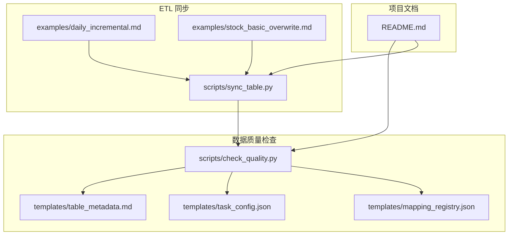
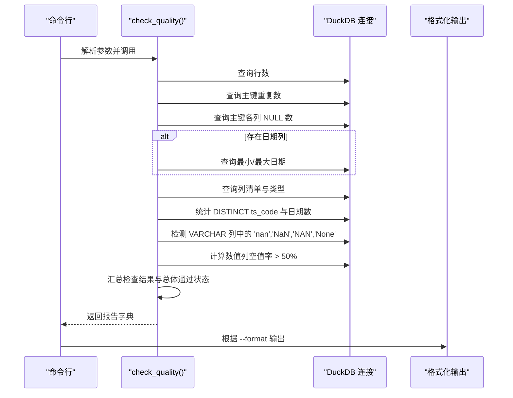
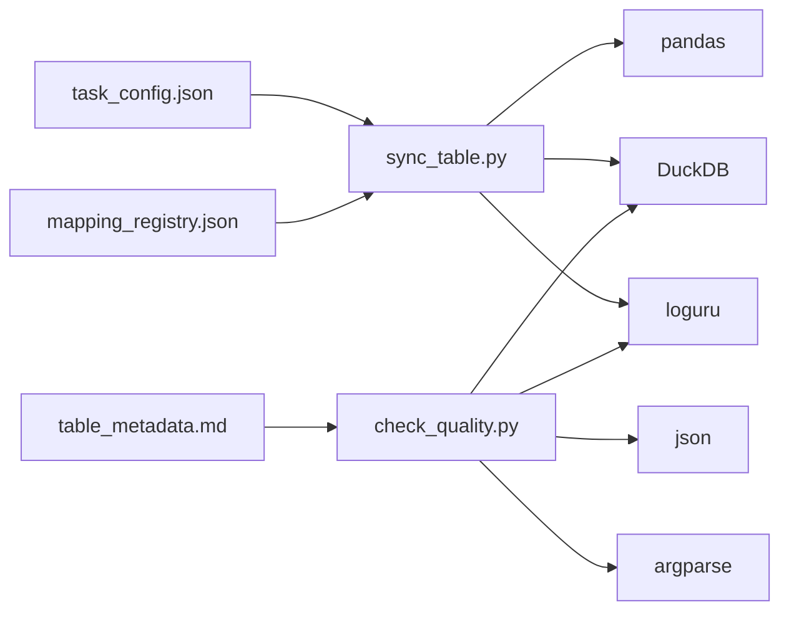

# 数据质量检查

<cite>
**本文引用的文件**
- [check_quality.py](file://tushare-duckdb-sync/scripts/check_quality.py)
- [README.md](file://tushare-duckdb-sync/README.md)
- [sync_table.py](file://tushare-duckdb-sync/scripts/sync_table.py)
- [mapping_registry.json](file://tushare-duckdb-sync/templates/mapping_registry.json)
- [table_metadata.md](file://tushare-duckdb-sync/templates/table_metadata.md)
- [task_config.json](file://tushare-duckdb-sync/templates/task_config.json)
- [daily_incremental.md](file://tushare-duckdb-sync/examples/daily_incremental.md)
- [stock_basic_overwrite.md](file://tushare-duckdb-sync/examples/stock_basic_overwrite.md)
</cite>

## 目录
1. [简介](#简介)
2. [项目结构](#项目结构)
3. [核心组件](#核心组件)
4. [架构总览](#架构总览)
5. [详细组件分析](#详细组件分析)
6. [依赖关系分析](#依赖关系分析)
7. [性能考量](#性能考量)
8. [故障排查指南](#故障排查指南)
9. [结论](#结论)
10. [附录](#附录)

## 简介
本文件面向数据质量检查系统，聚焦于 DuckDB 表的质量评估与报告生成。系统通过独立脚本对指定表执行标准化检查，涵盖行数统计、主键唯一性与非空校验、日期范围、去重统计、NaN字符串污染、度量列空值率等关键指标，并支持文本、JSON、Markdown 三种输出格式。文档同时提供质量报告解读、问题诊断方法、常见数据质量问题的识别与修复建议，以及在 ETL 流程中的集成方式。

## 项目结构
围绕数据质量检查的核心文件位于 tushare-duckdb-sync/scripts 目录，配套模板与示例位于 templates 与 examples 目录。整体结构如下图所示：

图表来源
- [check_quality.py:1-231](file://tushare-duckdb-sync/scripts/check_quality.py#L1-L231)
- [sync_table.py:1-618](file://tushare-duckdb-sync/scripts/sync_table.py#L1-L618)
- [README.md:1-173](file://tushare-duckdb-sync/README.md#L1-L173)
- [table_metadata.md:1-73](file://tushare-duckdb-sync/templates/table_metadata.md#L1-L73)
- [mapping_registry.json:1-16](file://tushare-duckdb-sync/templates/mapping_registry.json#L1-L16)
- [task_config.json:1-22](file://tushare-duckdb-sync/templates/task_config.json#L1-L22)
- [daily_incremental.md:1-163](file://tushare-duckdb-sync/examples/daily_incremental.md#L1-L163)
- [stock_basic_overwrite.md:1-146](file://tushare-duckdb-sync/examples/stock_basic_overwrite.md#L1-L146)

章节来源
- [README.md:116-129](file://tushare-duckdb-sync/README.md#L116-L129)

## 核心组件
- 质量检查函数：对 DuckDB 表执行多项检查，返回结构化报告字典。
- 格式化输出：支持 text、json、markdown 三种输出格式，便于不同下游使用。
- 命令行入口：解析参数，调用检查函数并输出结果。

章节来源
- [check_quality.py:58-173](file://tushare-duckdb-sync/scripts/check_quality.py#L58-L173)
- [check_quality.py:176-201](file://tushare-duckdb-sync/scripts/check_quality.py#L176-L201)
- [check_quality.py:204-231](file://tushare-duckdb-sync/scripts/check_quality.py#L204-L231)

## 架构总览
质量检查流程从 DuckDB 连接开始，依次执行多项 SQL 查询以收集指标，最终汇总为统一报告。下图展示了关键步骤与数据流向：

图表来源
- [check_quality.py:58-173](file://tushare-duckdb-sync/scripts/check_quality.py#L58-L173)
- [check_quality.py:176-231](file://tushare-duckdb-sync/scripts/check_quality.py#L176-L231)

## 详细组件分析

### 算法原理与评估指标体系
- 输入：DuckDB 路径、表名、主键列集合、可选日期列。
- 输出：结构化报告，包含各检查项的值与通过状态，以及总体通过标志。
- 关键指标：
  - 行数统计：COUNT(*)，用于验证数据规模是否合理。
  - 主键唯一性：GROUP BY 主键列并 HAVING COUNT(*) > 1，限制返回样本数量，避免大表全扫描。
  - 主键非空：逐列统计 IS NULL 数量，要求所有主键列均无空值。
  - 日期范围：MIN/MAX 日期字符串，作为信息性指标供人工校验。
  - 去重统计：若存在 ts_code/date 列，分别统计 DISTINCT 数量。
  - NaN 字符串污染：仅对 VARCHAR 列检测特定字符串污染，避免误伤数值列。
  - 高空值度量列：对数值列计算空值比例，阈值 50%，用于发现潜在数据采集问题。
- 总体通过：任一检查项的 pass=false，则整体 passed=false。

章节来源
- [check_quality.py:58-173](file://tushare-duckdb-sync/scripts/check_quality.py#L58-L173)

### 检查规则详解
- 行数统计
  - 作用：验证表是否为空或异常过大。
  - SQL：COUNT(*)。
  - 通过条件：> 0。
- 主键唯一性验证
  - 作用：确保主键组合唯一，避免重复记录。
  - SQL：GROUP BY 主键列，HAVING COUNT(*) > 1，LIMIT 5 返回示例。
  - 通过条件：重复数为 0。
- 主键非空检测
  - 作用：确保主键列不可为空，保证记录可唯一识别。
  - SQL：逐列 COUNT(*) WHERE 列 IS NULL。
  - 通过条件：所有主键列的空值数均为 0。
- 日期范围验证
  - 作用：提供数据起止日期，便于与上游发布节奏核对。
  - SQL：MIN/MAX 日期列，作为信息性指标。
  - 通过条件：信息性，不参与总体通过判断。
- NaN 字符串污染检测
  - 作用：识别将 NaN 以字符串形式写入的问题。
  - SQL：仅对 VARCHAR 列，WHERE 列 IN ('nan','NaN','NAN','None')。
  - 通过条件：污染列数为 0。
- 高空值度量列检测
  - 作用：发现数值列空值过多，可能反映上游缺失或 ETL 异常。
  - SQL：对数值列计算空值比例，阈值 > 50%。
  - 通过条件：无列超过阈值。

章节来源
- [check_quality.py:74-165](file://tushare-duckdb-sync/scripts/check_quality.py#L74-L165)

### 输出格式与使用场景
- text（默认）
  - 适合终端直视，快速概览通过状态与关键指标。
- json
  - 适合自动化处理与二次加工，便于程序解析。
- markdown
  - 适合嵌入文档，表格化展示，便于知识库沉淀与审阅。

章节来源
- [check_quality.py:204-231](file://tushare-duckdb-sync/scripts/check_quality.py#L204-L231)
- [check_quality.py:176-201](file://tushare-duckdb-sync/scripts/check_quality.py#L176-L201)
- [README.md:116-129](file://tushare-duckdb-sync/README.md#L116-L129)

### 报告解读与问题诊断
- 总体通过状态
  - 若 passed=false，需逐项查看具体检查项的值与样本，定位问题根因。
- 行数异常
  - 为 0：检查同步是否成功、维度是否正确、是否被过滤。
  - 过大：检查是否存在重复插入或维度范围扩大。
- 主键重复
  - 重复数 > 0：核查主键定义是否正确、是否存在重复写入。
- 主键空值
  - 任一列空值数 > 0：核查上游数据质量或 ETL 逻辑。
- 日期范围
  - 与预期不符：核对上游发布节奏与安全截止策略。
- NaN 字符串污染
  - 发现污染列：检查上游清洗逻辑与 ETL 类型转换。
- 高空值度量列
  - 比例 > 50%：核查上游是否缺失或 ETL 未正确映射。

章节来源
- [check_quality.py:167-173](file://tushare-duckdb-sync/scripts/check_quality.py#L167-L173)
- [README.md:40-46](file://tushare-duckdb-sync/README.md#L40-L46)

### 常见数据质量问题与修复建议
- 主键重复
  - 建议：在写入前进行去重或在主键上建立约束；修复后重新导入。
- 主键空值
  - 建议：在上游清洗阶段补齐主键，或在 ETL 中拒绝空主键记录。
- NaN 字符串污染
  - 建议：上游统一使用 NULL，ETL 中避免将数值转为字符串；对现有数据进行替换或删除。
- 高空值度量列
  - 建议：核查上游接口返回与字段映射，必要时补充默认值或调整业务口径。
- 日期范围异常
  - 建议：检查安全截止规则与维度解析逻辑，确保与上游发布节奏一致。

章节来源
- [README.md:40-46](file://tushare-duckdb-sync/README.md#L40-L46)

### 在 ETL 流程中的集成方式
- 同步后立即检查
  - 在 sync_table.py 完成写入后，调用 check_quality.py 生成质量快照，写入元数据文档。
- 批量任务集成
  - 在批量同步任务中，为每个任务增加质量检查步骤，失败即阻断后续依赖。
- CI/CD 集成
  - 将 check_quality.py 作为流水线中的质量门禁，若 passed=false 则阻断发布。
- 文档化
  - 使用 Markdown 格式将报告嵌入表元数据文档，形成持续的质量快照。

章节来源
- [sync_table.py:451-517](file://tushare-duckdb-sync/scripts/sync_table.py#L451-L517)
- [README.md:116-129](file://tushare-duckdb-sync/README.md#L116-L129)
- [table_metadata.md:50-64](file://tushare-duckdb-sync/templates/table_metadata.md#L50-L64)

## 依赖关系分析
- 脚本依赖
  - duckdb：连接与查询 DuckDB。
  - pandas：用于数据处理（在同步脚本中使用，质量脚本无需 pandas）。
  - loguru：日志记录。
- 模板与配置
  - mapping_registry.json：表映射注册，记录源表、目标表、主键、维度等元信息。
  - table_metadata.md：表元数据模板，包含质量快照区域，便于嵌入 check_quality.py 的 Markdown 报告。
  - task_config.json：任务配置模板，指导批量同步参数。
- 示例文档
  - daily_incremental.md 与 stock_basic_overwrite.md：展示同步与质量检查的完整工作流。

图表来源
- [check_quality.py:26-34](file://tushare-duckdb-sync/scripts/check_quality.py#L26-L34)
- [sync_table.py:51-53](file://tushare-duckdb-sync/scripts/sync_table.py#L51-L53)
- [mapping_registry.json:1-16](file://tushare-duckdb-sync/templates/mapping_registry.json#L1-L16)
- [task_config.json:1-22](file://tushare-duckdb-sync/templates/task_config.json#L1-L22)
- [table_metadata.md:1-73](file://tushare-duckdb-sync/templates/table_metadata.md#L1-L73)

章节来源
- [check_quality.py:26-34](file://tushare-duckdb-sync/scripts/check_quality.py#L26-L34)
- [sync_table.py:51-53](file://tushare-duckdb-sync/scripts/sync_table.py#L51-L53)

## 性能考量
- 查询优化
  - 主键重复检查使用 LIMIT 5，避免大表全扫描。
  - 仅对 VARCHAR 列进行 NaN 字符串检测，减少不必要的全表扫描。
  - 数值列空值率计算基于行数，避免对每行逐一扫描。
- I/O 与并发
  - 采用单连接只读模式，避免写入竞争。
  - 建议在大规模表上结合索引与分区策略，缩短查询时间。
- 输出开销
  - JSON 与 Markdown 输出为纯内存序列化，开销较低。

章节来源
- [check_quality.py:78-88](file://tushare-duckdb-sync/scripts/check_quality.py#L78-L88)
- [check_quality.py:127-144](file://tushare-duckdb-sync/scripts/check_quality.py#L127-L144)
- [check_quality.py:146-165](file://tushare-duckdb-sync/scripts/check_quality.py#L146-L165)

## 故障排查指南
- 无法连接 DuckDB
  - 检查路径是否正确、文件是否存在、权限是否足够。
- 参数错误
  - 确认 --duckdb-path、--table、--pk、--date-col（可选）是否正确传入。
- 主键重复或空值
  - 检查上游数据质量与 ETL 逻辑，必要时回溯到最近一次成功的同步。
- NaN 字符串污染
  - 检查上游清洗与类型转换逻辑，避免将数值转为字符串。
- 日期范围异常
  - 核对安全截止规则与维度解析逻辑，确保与上游发布节奏一致。

章节来源
- [check_quality.py:204-231](file://tushare-duckdb-sync/scripts/check_quality.py#L204-L231)
- [README.md:40-46](file://tushare-duckdb-sync/README.md#L40-L46)

## 结论
本数据质量检查系统通过标准化的检查项与多格式输出，为 DuckDB 表提供了可靠的“健康度”评估能力。结合 ETL 流程中的自动化集成与文档化质量快照，能够有效提升数据质量的可观测性与可追溯性。建议在生产环境中将 check_quality.py 作为质量门禁，并持续完善模板与规则以适配更复杂的业务场景。

## 附录
- 常用命令参考
  - 质量检查（Markdown）：参见 README 中的示例命令。
  - 日线增量同步与质量检查：参见 daily_incremental.md。
  - 股票基本信息全量覆盖与质量检查：参见 stock_basic_overwrite.md。
- 模板与配置
  - 表元数据模板：table_metadata.md。
  - 映射注册模板：mapping_registry.json。
  - 任务配置模板：task_config.json。

章节来源
- [README.md:116-129](file://tushare-duckdb-sync/README.md#L116-L129)
- [daily_incremental.md:80-89](file://tushare-duckdb-sync/examples/daily_incremental.md#L80-L89)
- [stock_basic_overwrite.md:57-65](file://tushare-duckdb-sync/examples/stock_basic_overwrite.md#L57-L65)
- [table_metadata.md:50-64](file://tushare-duckdb-sync/templates/table_metadata.md#L50-L64)
- [mapping_registry.json:1-16](file://tushare-duckdb-sync/templates/mapping_registry.json#L1-L16)
- [task_config.json:1-22](file://tushare-duckdb-sync/templates/task_config.json#L1-L22)