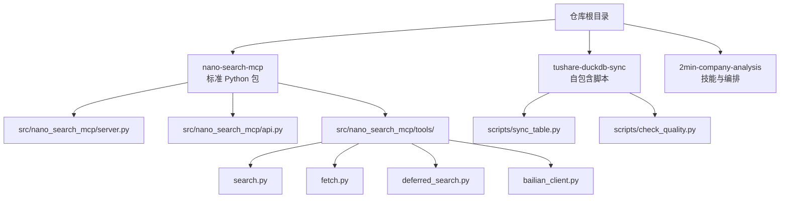
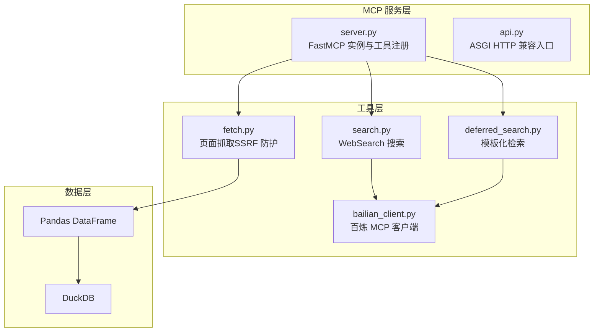
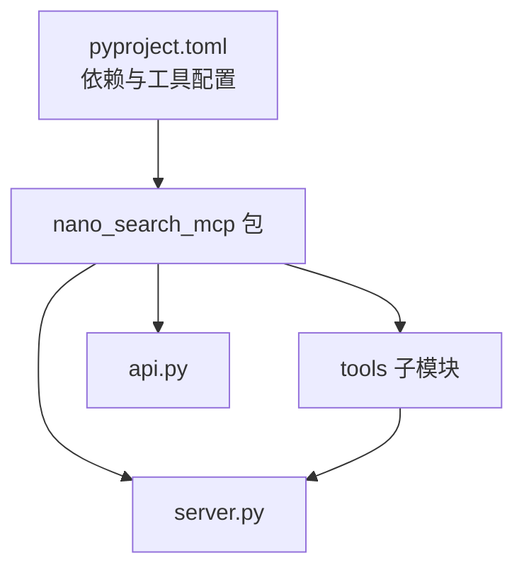

# 代码规范与风格

<cite>
**本文引用的文件**
- [README.md](file://README.md)
- [nano-search-mcp/README.md](file://nano-search-mcp/README.md)
- [nano-search-mcp/pyproject.toml](file://nano-search-mcp/pyproject.toml)
- [nano-search-mcp/src/nano_search_mcp/__init__.py](file://nano-search-mcp/src/nano_search_mcp/__init__.py)
- [nano-search-mcp/src/nano_search_mcp/api.py](file://nano-search-mcp/src/nano_search_mcp/api.py)
- [nano-search-mcp/src/nano_search_mcp/server.py](file://nano-search-mcp/src/nano_search_mcp/server.py)
- [nano-search-mcp/src/nano_search_mcp/tools/__init__.py](file://nano-search-mcp/src/nano_search_mcp/tools/__init__.py)
- [nano-search-mcp/src/nano_search_mcp/tools/bailian_client.py](file://nano-search-mcp/src/nano_search_mcp/tools/bailian_client.py)
- [nano-search-mcp/src/nano_search_mcp/tools/search.py](file://nano-search-mcp/src/nano_search_mcp/tools/search.py)
- [nano-search-mcp/src/nano_search_mcp/tools/fetch.py](file://nano-search-mcp/src/nano_search_mcp/tools/fetch.py)
- [nano-search-mcp/src/nano_search_mcp/tools/deferred_search.py](file://nano-search-mcp/src/nano_search_mcp/tools/deferred_search.py)
- [nano-search-mcp/tests/test_server.py](file://nano-search-mcp/tests/test_server.py)
- [nano-search-mcp/tests/test_fetch.py](file://nano-search-mcp/tests/test_fetch.py)
- [tushare-duckdb-sync/README.md](file://tushare-duckdb-sync/README.md)
- [tushare-duckdb-sync/scripts/sync_table.py](file://tushare-duckdb-sync/scripts/sync_table.py)
- [tushare-duckdb-sync/scripts/check_quality.py](file://tushare-duckdb-sync/scripts/check_quality.py)
</cite>

## 目录
1. [简介](#简介)
2. [项目结构](#项目结构)
3. [核心组件](#核心组件)
4. [架构总览](#架构总览)
5. [详细组件分析](#详细组件分析)
6. [依赖分析](#依赖分析)
7. [性能考虑](#性能考虑)
8. [故障排查指南](#故障排查指南)
9. [结论](#结论)
10. [附录](#附录)

## 简介
本指南旨在为仓库中的 Python 代码建立统一的编码规范与风格标准，覆盖命名约定、缩进与格式、注释规范、导入顺序与模块组织、错误处理与异常抛出、代码审查检查清单与质量标准，并提供具体示例路径以展示正确与错误的编码方式。目标是提升代码一致性与可维护性，降低协作成本。

## 项目结构
仓库采用多模块分层结构：
- 数据同步模块：tushare-duckdb-sync（自包含脚本，无内部依赖）
- 数据搜索模块：nano-search-mcp（标准 Python 包，提供 MCP 服务与工具）
- 分析编排模块：2min-company-analysis（技能集合与编排）

图表来源
- [README.md:81-93](file://README.md#L81-L93)
- [nano-search-mcp/README.md:178-198](file://nano-search-mcp/README.md#L178-L198)
- [tushare-duckdb-sync/README.md:1-173](file://tushare-duckdb-sync/README.md#L1-L173)

章节来源
- [README.md:1-103](file://README.md#L1-L103)
- [nano-search-mcp/README.md:1-198](file://nano-search-mcp/README.md#L1-L198)
- [tushare-duckdb-sync/README.md:1-173](file://tushare-duckdb-sync/README.md#L1-L173)

## 核心组件
- nano-search-mcp：标准 Python 包，提供 MCP 服务入口与工具注册，工具模块按能力域划分，统一通过 server.py 注册。
- tushare-duckdb-sync：自包含脚本集合，提供数据同步与质量检查能力，无内部依赖，便于独立部署与复用。

章节来源
- [nano-search-mcp/README.md:1-198](file://nano-search-mcp/README.md#L1-L198)
- [tushare-duckdb-sync/README.md:1-173](file://tushare-duckdb-sync/README.md#L1-L173)

## 架构总览
MCP 服务通过 FastMCP 注册工具，工具实现基于百炼 MCP 客户端与 Playwright 渲染，统一返回结构化结果或失败字典。数据同步模块通过 DuckDB 与 Pandas 实现增量/全量同步与断点续传。

图表来源
- [nano-search-mcp/src/nano_search_mcp/server.py:1-91](file://nano-search-mcp/src/nano_search_mcp/server.py#L1-L91)
- [nano-search-mcp/src/nano_search_mcp/api.py:1-12](file://nano-search-mcp/src/nano_search_mcp/api.py#L1-L12)
- [nano-search-mcp/src/nano_search_mcp/tools/search.py:1-119](file://nano-search-mcp/src/nano_search_mcp/tools/search.py#L1-L119)
- [nano-search-mcp/src/nano_search_mcp/tools/fetch.py:1-245](file://nano-search-mcp/src/nano_search_mcp/tools/fetch.py#L1-L245)
- [nano-search-mcp/src/nano_search_mcp/tools/deferred_search.py:1-238](file://nano-search-mcp/src/nano_search_mcp/tools/deferred_search.py#L1-L238)
- [nano-search-mcp/src/nano_search_mcp/tools/bailian_client.py:1-93](file://nano-search-mcp/src/nano_search_mcp/tools/bailian_client.py#L1-L93)

## 详细组件分析

### 命名约定
- 模块名：小写下划线，清晰表达能力域（如 search、fetch、deferred_search）。
- 函数/方法名：小写下划线，动宾短语，描述行为（如 fetch_page_async、load_deferred_topics）。
- 类名：帕斯卡命名，抽象实体或状态（如 SyncError、UnsafeURLError）。
- 常量：全大写+下划线，静态配置或阈值（如 _MAX_RESULTS_MIN、_MAX_CONTENT_LEN）。
- 类型定义：帕斯卡命名（如 PageResult、SearchItem），用于 TypedDict。
- 模块内导出：通过 __all__ 明确暴露接口，避免无谓泄露（参见 tools/__init__.py）。

章节来源
- [nano-search-mcp/src/nano_search_mcp/tools/fetch.py:17-24](file://nano-search-mcp/src/nano_search_mcp/tools/fetch.py#L17-L24)
- [nano-search-mcp/src/nano_search_mcp/tools/deferred_search.py:36-40](file://nano-search-mcp/src/nano_search_mcp/tools/deferred_search.py#L36-L40)
- [nano-search-mcp/src/nano_search_mcp/tools/__init__.py:30-47](file://nano-search-mcp/src/nano_search_mcp/tools/__init__.py#L30-L47)

### 缩进与格式
- 统一使用 4 空格缩进。
- 行宽：Ruff 配置为 100，建议在 100 字符以内分行，必要时使用括号与反斜杠。
- 空行：模块级函数/类之间留空行；方法内部按逻辑分组；复杂逻辑前后适当空行。
- 导入分组：标准库、第三方库、项目内相对导入分组，组内字母序排序。

章节来源
- [nano-search-mcp/pyproject.toml:34-44](file://nano-search-mcp/pyproject.toml#L34-L44)

### 注释规范
- 模块级文档字符串：文件顶部使用三引号字符串，说明模块职责与边界。
- 函数/方法文档字符串：使用三引号字符串，包含参数说明（Args）、返回值（Returns）、异常（Raises）、注意事项（Notes）。
- 类注释：简述类职责与关键行为，必要时说明状态或约束。
- 行内注释：解释复杂分支、安全检查、性能权衡或历史原因，避免显而易见的注释。
- TODO/NOTE：使用明确标记，附带上下文与截止日期或责任人。

章节来源
- [nano-search-mcp/src/nano_search_mcp/server.py:1-2](file://nano-search-mcp/src/nano_search_mcp/server.py#L1-L2)
- [nano-search-mcp/src/nano_search_mcp/tools/search.py:89-111](file://nano-search-mcp/src/nano_search_mcp/tools/search.py#L89-L111)
- [nano-search-mcp/src/nano_search_mcp/tools/fetch.py:224-244](file://nano-search-mcp/src/nano_search_mcp/tools/fetch.py#L224-L244)
- [nano-search-mcp/src/nano_search_mcp/tools/deferred_search.py:156-189](file://nano-search-mcp/src/nano_search_mcp/tools/deferred_search.py#L156-L189)

### 导入顺序与模块组织
- 导入顺序：标准库 → 第三方库 → 项目内相对导入；同组内按字母序排列。
- 工具模块组织：按能力域拆分（search、fetch、deferred_search 等），通过 tools/__init__.py 统一导出。
- 包入口：__init__.py 仅暴露必要接口，避免泄露内部实现细节。
- 兼容入口：api.py 提供 ASGI 兼容入口，server.py 提供命令行入口。

章节来源
- [nano-search-mcp/src/nano_search_mcp/tools/__init__.py:1-48](file://nano-search-mcp/src/nano_search_mcp/tools/__init__.py#L1-L48)
- [nano-search-mcp/src/nano_search_mcp/api.py:1-12](file://nano-search-mcp/src/nano_search_mcp/api.py#L1-L12)
- [nano-search-mcp/src/nano_search_mcp/server.py:1-17](file://nano-search-mcp/src/nano_search_mcp/server.py#L1-L17)

### 错误处理与异常抛出
- 明确错误契约：部分工具在失败时返回结构化失败字典（如 unavailable），而非抛异常，保证调用方一致性处理。
- 结构化异常：定义专用异常类（如 SyncError、UnsafeURLError、BailianMCPError），携带上下文信息。
- 异常传播：上游异常捕获后包装为结构化错误字典，避免泄漏内部实现细节。
- 日志记录：统一使用 logging，区分 warning/error/info 级别，便于审计与排障。

章节来源
- [nano-search-mcp/src/nano_search_mcp/server.py:55-56](file://nano-search-mcp/src/nano_search_mcp/server.py#L55-L56)
- [nano-search-mcp/src/nano_search_mcp/tools/fetch.py:20-22](file://nano-search-mcp/src/nano_search_mcp/tools/fetch.py#L20-L22)
- [tushare-duckdb-sync/scripts/sync_table.py:90-96](file://tushare-duckdb-sync/scripts/sync_table.py#L90-L96)
- [tushare-duckdb-sync/scripts/sync_table.py:322-337](file://tushare-duckdb-sync/scripts/sync_table.py#L322-L337)

### 代码审查检查清单
- 命名一致性：是否遵循命名约定，避免魔法字符串与变量名歧义。
- 文档完整性：函数/类是否具备完整文档字符串，参数/返回/异常说明是否准确。
- 导入顺序与分组：是否符合顺序与分组规范，避免循环导入。
- 错误契约：失败路径是否统一返回结构化字典，异常是否按契约传播。
- 日志与可观测性：关键路径是否记录日志，错误信息是否可诊断。
- 安全性：SSRF 防护、URL 白名单、敏感信息脱敏。
- 性能与资源：重试策略、连接复用、锁粒度、超时设置。
- 测试覆盖：关键路径与边界条件是否覆盖，契约断言是否完备。

章节来源
- [nano-search-mcp/tests/test_server.py:49-83](file://nano-search-mcp/tests/test_server.py#L49-L83)
- [nano-search-mcp/tests/test_fetch.py:1-98](file://nano-search-mcp/tests/test_fetch.py#L1-L98)

### 具体示例（示例路径）
- 正确命名与文档字符串
  - [search 工具注册与文档字符串:79-119](file://nano-search-mcp/src/nano_search_mcp/tools/search.py#L79-L119)
  - [fetch 工具注册与文档字符串:220-244](file://nano-search-mcp/src/nano_search_mcp/tools/fetch.py#L220-L244)
- 正确错误契约与结构化异常
  - [SyncError 定义与使用:90-96](file://tushare-duckdb-sync/scripts/sync_table.py#L90-L96)
  - [失败返回字典（unavailable）:224-229](file://nano-search-mcp/src/nano_search_mcp/tools/deferred_search.py#L224-L229)
- 正确导入顺序与模块组织
  - [tools/__init__.py 统一导出:1-48](file://nano-search-mcp/src/nano_search_mcp/tools/__init__.py#L1-L48)
  - [server.py 注册工具与导入:8-16](file://nano-search-mcp/src/nano_search_mcp/server.py#L8-L16)
- 正确日志与安全检查
  - [fetch 的 SSRF 校验与日志:186-218](file://nano-search-mcp/src/nano_search_mcp/tools/fetch.py#L186-L218)
  - [bailian_client 的认证与错误解析:24-93](file://nano-search-mcp/src/nano_search_mcp/tools/bailian_client.py#L24-L93)

## 依赖分析
- 语言与版本：Python 3.10+，Ruff 作为 linter，pytest 作为测试框架。
- 第三方依赖：mcp、httpx、pyyaml、uvicorn、playwright、beautifulsoup4、markdownify、duckdb、pandas、loguru 等。
- 项目内依赖：nano-search-mcp 的 tools 模块通过 server.py 注册，api.py 暴露 ASGI app。

图表来源
- [nano-search-mcp/pyproject.toml:1-44](file://nano-search-mcp/pyproject.toml#L1-L44)
- [nano-search-mcp/src/nano_search_mcp/server.py:1-17](file://nano-search-mcp/src/nano_search_mcp/server.py#L1-L17)
- [nano-search-mcp/src/nano_search_mcp/api.py:1-12](file://nano-search-mcp/src/nano_search_mcp/api.py#L1-L12)

章节来源
- [nano-search-mcp/pyproject.toml:1-44](file://nano-search-mcp/pyproject.toml#L1-L44)

## 性能考虑
- 重试与退避：工具层普遍采用指数退避与最大重试次数，避免雪崩与浪费。
- 连接复用：浏览器实例与客户端连接复用，减少冷启动开销。
- 超时与限频：HTTP 超时与调用间隔（sleep）控制，避免触发上游限流。
- 数据处理：Pandas 与 DuckDB 的列对齐与类型转换，尽量在写入前完成规范化。

章节来源
- [nano-search-mcp/src/nano_search_mcp/tools/deferred_search.py:102-140](file://nano-search-mcp/src/nano_search_mcp/tools/deferred_search.py#L102-L140)
- [nano-search-mcp/src/nano_search_mcp/tools/fetch.py:133-161](file://nano-search-mcp/src/nano_search_mcp/tools/fetch.py#L133-L161)
- [tushare-duckdb-sync/scripts/sync_table.py:500-510](file://tushare-duckdb-sync/scripts/sync_table.py#L500-L510)

## 故障排查指南
- MCP 工具注册契约：通过测试断言确保所有承诺工具均已注册，避免遗漏。
- SSRF 防护：确认 URL 协议与目标地址白名单，失败时返回 blocked 并记录错误。
- 数据同步状态：检查 DuckDB 中 table_sync_state 表，定位失败维度与错误信息。
- 日志级别：使用 info/warning/error 区分正常、警告与异常，便于快速定位问题。

章节来源
- [nano-search-mcp/tests/test_server.py:49-83](file://nano-search-mcp/tests/test_server.py#L49-L83)
- [nano-search-mcp/tests/test_fetch.py:82-98](file://nano-search-mcp/tests/test_fetch.py#L82-L98)
- [tushare-duckdb-sync/scripts/sync_table.py:492-510](file://tushare-duckdb-sync/scripts/sync_table.py#L492-L510)

## 结论
通过统一的命名、注释、导入与错误处理规范，结合 Ruff 与 pytest 的工具链，本仓库实现了高一致性与可维护性的 Python 代码风格。建议在日常开发中严格遵循本指南，并在代码审查中对照检查清单进行核验，持续提升代码质量与协作效率。

## 附录

### 代码审查检查清单（摘要）
- 命名与文档：模块/函数/类/常量命名一致，文档字符串完整。
- 导入顺序：标准库 → 第三方 → 项目内，字母序排列。
- 错误契约：失败路径统一返回结构化字典，异常按契约传播。
- 安全性：URL 白名单、SSRF 防护、敏感信息脱敏。
- 日志与可观测性：关键路径记录日志，错误信息可诊断。
- 性能：重试与退避、连接复用、超时与限频设置合理。
- 测试：契约断言、边界条件、失败路径覆盖。

章节来源
- [nano-search-mcp/tests/test_server.py:49-83](file://nano-search-mcp/tests/test_server.py#L49-L83)
- [nano-search-mcp/tests/test_fetch.py:1-98](file://nano-search-mcp/tests/test_fetch.py#L1-L98)