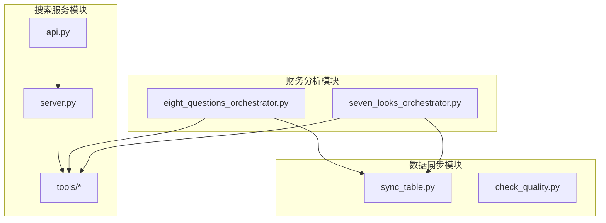
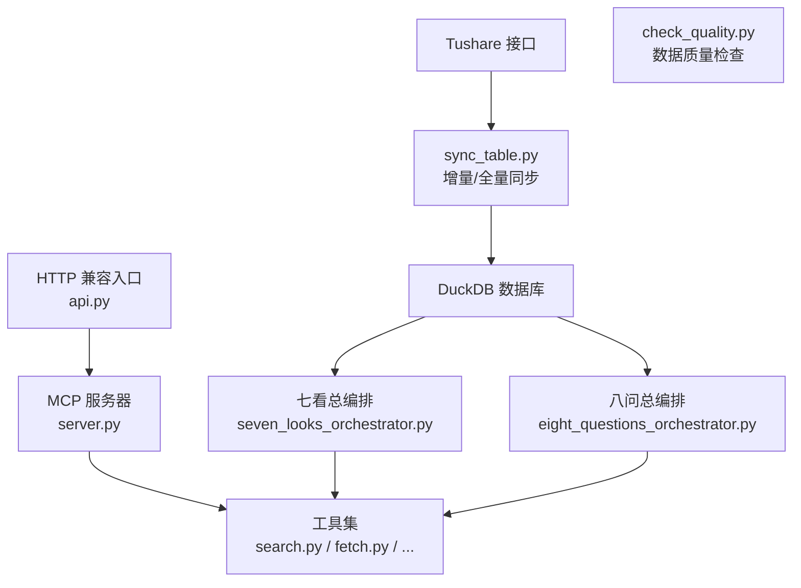
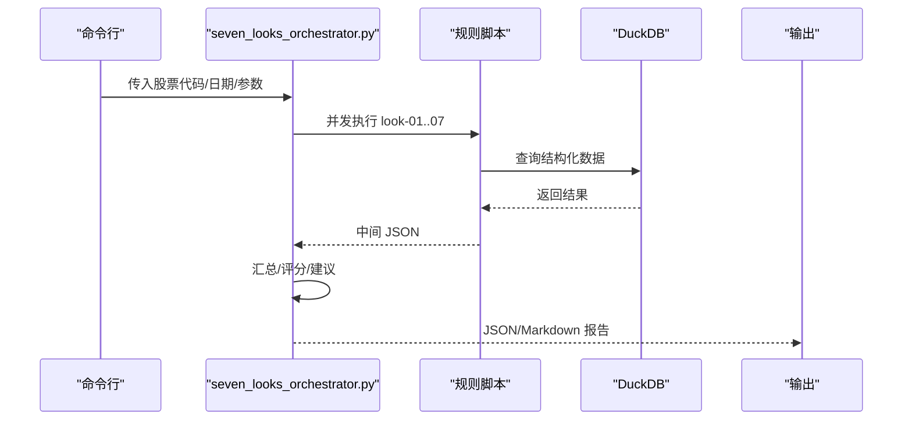
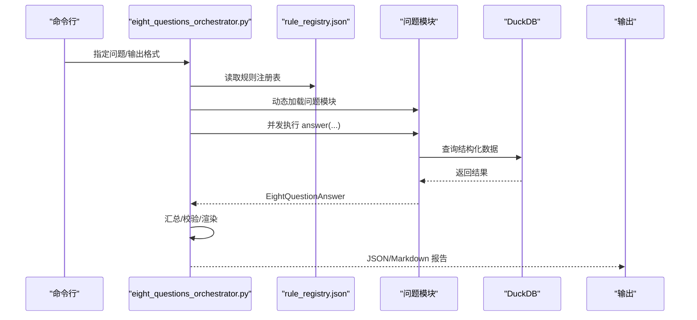
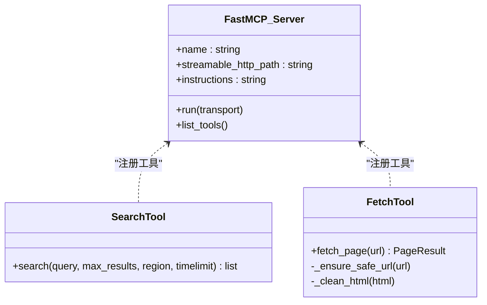
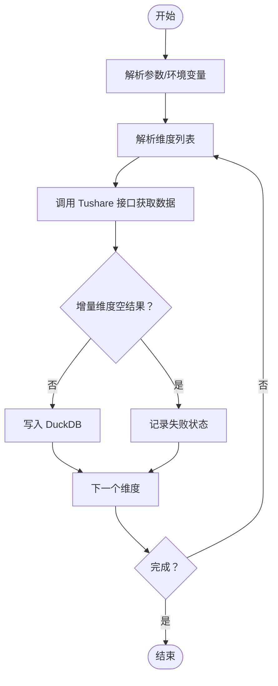
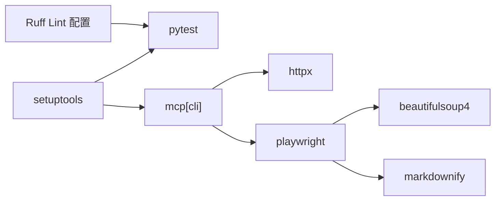

# 开发指南

<cite>
**本文引用的文件**
- [2min-company-analysis/README.md](file://2min-company-analysis/README.md)
- [2min-company-analysis/seven-look-eight-question/SKILL.md](file://2min-company-analysis/seven-look-eight-question/SKILL.md)
- [2min-company-analysis/seven-look-eight-question/scripts/seven_looks_orchestrator.py](file://2min-company-analysis/seven-look-eight-question/scripts/seven_looks_orchestrator.py)
- [2min-company-analysis/seven-look-eight-question/scripts/eight_questions_orchestrator.py](file://2min-company-analysis/seven-look-eight-question/scripts/eight_questions_orchestrator.py)
- [nano-search-mcp/pyproject.toml](file://nano-search-mcp/pyproject.toml)
- [nano-search-mcp/src/nano_search_mcp/__init__.py](file://nano-search-mcp/src/nano_search_mcp/__init__.py)
- [nano-search-mcp/src/nano_search_mcp/api.py](file://nano-search-mcp/src/nano_search_mcp/api.py)
- [nano-search-mcp/src/nano_search_mcp/server.py](file://nano-search-mcp/src/nano_search_mcp/server.py)
- [nano-search-mcp/src/nano_search_mcp/tools/__init__.py](file://nano-search-mcp/src/nano_search_mcp/tools/__init__.py)
- [nano-search-mcp/src/nano_search_mcp/tools/search.py](file://nano-search-mcp/src/nano_search_mcp/tools/search.py)
- [nano-search-mcp/src/nano_search_mcp/tools/fetch.py](file://nano-search-mcp/src/nano_search_mcp/tools/fetch.py)
- [nano-search-mcp/tests/test_server.py](file://nano-search-mcp/tests/test_server.py)
- [tushare-duckdb-sync/README.md](file://tushare-duckdb-sync/README.md)
- [tushare-duckdb-sync/SKILL.md](file://tushare-duckdb-sync/SKILL.md)
- [tushare-duckdb-sync/scripts/sync_table.py](file://tushare-duckdb-sync/scripts/sync_table.py)
- [tushare-duckdb-sync/scripts/check_quality.py](file://tushare-duckdb-sync/scripts/check_quality.py)
</cite>

## 目录
1. [简介](#简介)
2. [项目结构](#项目结构)
3. [核心组件](#核心组件)
4. [架构总览](#架构总览)
5. [详细组件分析](#详细组件分析)
6. [依赖分析](#依赖分析)
7. [性能考虑](#性能考虑)
8. [故障排查指南](#故障排查指南)
9. [结论](#结论)
10. [附录](#附录)

## 简介
本指南面向 NanoQuant Skills 项目的新老开发者，帮助快速搭建开发环境、理解代码结构、掌握开发规范与测试策略，并提供扩展新功能（新增 MCP 工具、分析规则、数据源）的方法。项目由三大模块组成：
- 数据底座：tushare-duckdb-sync，负责将 Tushare 数据同步到本地 DuckDB，并提供数据质量检查与元数据文档生成。
- 搜索服务：nano-search-mcp，基于 MCP 协议提供网页搜索、页面抓取、公告/研报/IR/监管等外部证据检索工具。
- 财务分析：2min-company-analysis，围绕“七看八问”框架，对 A 股公司进行结构化基本面快审，支持总编排与单项规则。

## 项目结构
项目采用按功能域划分的模块化组织方式，便于独立开发与测试：
- 2min-company-analysis：财务分析与编排，包含“七看”规则与“八问”证据收集。
- nano-search-mcp：MCP 搜索服务，提供多种检索工具与 HTTP 兼容入口。
- tushare-duckdb-sync：数据同步与质量检查工具，支撑上游结构化数据。

图表来源
- [2min-company-analysis/seven-look-eight-question/scripts/seven_looks_orchestrator.py:1-120](file://2min-company-analysis/seven-look-eight-question/scripts/seven_looks_orchestrator.py#L1-L120)
- [2min-company-analysis/seven-look-eight-question/scripts/eight_questions_orchestrator.py:1-120](file://2min-company-analysis/seven-look-eight-question/scripts/eight_questions_orchestrator.py#L1-L120)
- [nano-search-mcp/src/nano_search_mcp/api.py:1-12](file://nano-search-mcp/src/nano_search_mcp/api.py#L1-L12)
- [nano-search-mcp/src/nano_search_mcp/server.py:1-91](file://nano-search-mcp/src/nano_search_mcp/server.py#L1-L91)
- [tushare-duckdb-sync/scripts/sync_table.py:1-120](file://tushare-duckdb-sync/scripts/sync_table.py#L1-L120)

章节来源
- [2min-company-analysis/README.md:1-132](file://2min-company-analysis/README.md#L1-L132)
- [nano-search-mcp/pyproject.toml:1-44](file://nano-search-mcp/pyproject.toml#L1-L44)
- [tushare-duckdb-sync/README.md:1-173](file://tushare-duckdb-sync/README.md#L1-L173)

## 核心组件
- seven_looks_orchestrator：总编排脚本，负责串联“七看”7个规则与“八问”证据收集，汇总质量评分、红旗预警与行动建议。
- eight_questions_orchestrator：八问总入口，按规则注册表动态加载各问题模块，支持并发执行与汇总。
- MCP 服务：server.py 作为 FastMCP 服务器，注册各类工具；api.py 提供兼容的 HTTP 入口。
- 数据同步：sync_table.py 支持三种维度（无维度、交易日、报告期）的全量/增量同步；check_quality.py 提供标准化数据质量检查。
- 工具集：search.py 提供网页搜索；fetch.py 提供页面抓取与安全防护。

章节来源
- [2min-company-analysis/seven-look-eight-question/scripts/seven_looks_orchestrator.py:1-200](file://2min-company-analysis/seven-look-eight-question/scripts/seven_looks_orchestrator.py#L1-L200)
- [2min-company-analysis/seven-look-eight-question/scripts/eight_questions_orchestrator.py:1-120](file://2min-company-analysis/seven-look-eight-question/scripts/eight_questions_orchestrator.py#L1-L120)
- [nano-search-mcp/src/nano_search_mcp/server.py:1-91](file://nano-search-mcp/src/nano_search_mcp/server.py#L1-L91)
- [nano-search-mcp/src/nano_search_mcp/tools/search.py:1-119](file://nano-search-mcp/src/nano_search_mcp/tools/search.py#L1-L119)
- [nano-search-mcp/src/nano_search_mcp/tools/fetch.py:1-245](file://nano-search-mcp/src/nano_search_mcp/tools/fetch.py#L1-L245)
- [tushare-duckdb-sync/scripts/sync_table.py:1-200](file://tushare-duckdb-sync/scripts/sync_table.py#L1-L200)
- [tushare-duckdb-sync/scripts/check_quality.py:1-120](file://tushare-duckdb-sync/scripts/check_quality.py#L1-L120)

## 架构总览
整体架构围绕“数据底座 + 搜索服务 + 分析编排”的三层设计：
- 数据底座：DuckDB 本地数据库，提供结构化财务/行情/基本面数据。
- 搜索服务：MCP 服务器，提供网页搜索、页面抓取、公告/研报/IR/监管等工具，统一对外契约。
- 分析编排：总编排脚本统一调度规则与证据，输出标准化报告。

图表来源
- [tushare-duckdb-sync/scripts/sync_table.py:1-120](file://tushare-duckdb-sync/scripts/sync_table.py#L1-L120)
- [tushare-duckdb-sync/scripts/check_quality.py:1-120](file://tushare-duckdb-sync/scripts/check_quality.py#L1-L120)
- [nano-search-mcp/src/nano_search_mcp/server.py:1-91](file://nano-search-mcp/src/nano_search_mcp/server.py#L1-L91)
- [nano-search-mcp/src/nano_search_mcp/api.py:1-12](file://nano-search-mcp/src/nano_search_mcp/api.py#L1-L12)
- [2min-company-analysis/seven-look-eight-question/scripts/seven_looks_orchestrator.py:1-120](file://2min-company-analysis/seven-look-eight-question/scripts/seven_looks_orchestrator.py#L1-L120)
- [2min-company-analysis/seven-look-eight-question/scripts/eight_questions_orchestrator.py:1-120](file://2min-company-analysis/seven-look-eight-question/scripts/eight_questions_orchestrator.py#L1-L120)

## 详细组件分析

### seven_looks_orchestrator 组件
- 职责：按阶段执行“七看”规则，聚合中间结果，生成质量评分、红旗预警与行动建议；可选接入“八问”并合并证据摘要。
- 关键流程：阶段化执行（自动/半自动/汇总/评语），并发运行规则脚本，汇总输出契约。
- 输出契约：支持 JSON/Markdown 两种格式，包含标准化汇总视图与原始透传视图，确保下游消费一致性。

图表来源
- [2min-company-analysis/seven-look-eight-question/scripts/seven_looks_orchestrator.py:170-245](file://2min-company-analysis/seven-look-eight-question/scripts/seven_looks_orchestrator.py#L170-L245)
- [2min-company-analysis/seven-look-eight-question/scripts/seven_looks_orchestrator.py:655-687](file://2min-company-analysis/seven-look-eight-question/scripts/seven_looks_orchestrator.py#L655-L687)

章节来源
- [2min-company-analysis/seven-look-eight-question/scripts/seven_looks_orchestrator.py:1-200](file://2min-company-analysis/seven-look-eight-question/scripts/seven_looks_orchestrator.py#L1-L200)
- [2min-company-analysis/seven-look-eight-question/SKILL.md:74-104](file://2min-company-analysis/seven-look-eight-question/SKILL.md#L74-L104)

### eight_questions_orchestrator 组件
- 职责：根据规则注册表动态加载各问题模块，支持并发执行与汇总，输出平均评级、加权平均评级与证据清单。
- 关键流程：加载模块 → 并发执行 → 汇总统计 → 渲染 Markdown/JSON。
- 与七看协作：通过 cross-validation 对关键证据进行交叉验证，合并到最终报告。

图表来源
- [2min-company-analysis/seven-look-eight-question/scripts/eight_questions_orchestrator.py:41-101](file://2min-company-analysis/seven-look-eight-question/scripts/eight_questions_orchestrator.py#L41-L101)
- [2min-company-analysis/seven-look-eight-question/scripts/eight_questions_orchestrator.py:119-164](file://2min-company-analysis/seven-look-eight-question/scripts/eight_questions_orchestrator.py#L119-L164)
- [2min-company-analysis/seven-look-eight-question/scripts/eight_questions_orchestrator.py:346-392](file://2min-company-analysis/seven-look-eight-question/scripts/eight_questions_orchestrator.py#L346-L392)

章节来源
- [2min-company-analysis/seven-look-eight-question/scripts/eight_questions_orchestrator.py:1-200](file://2min-company-analysis/seven-look-eight-question/scripts/eight_questions_orchestrator.py#L1-L200)
- [2min-company-analysis/seven-look-eight-question/SKILL.md:1-120](file://2min-company-analysis/seven-look-eight-question/SKILL.md#L1-L120)

### MCP 服务与工具组件
- 服务端：FastMCP 服务器，注册工具并提供 streamable HTTP 兼容入口；支持 transport 切换（stdio/streamable-http）。
- 工具集：search 提供网页搜索；fetch 提供页面抓取，内置 SSRF 安全检查与内容清洗；deferred_search 支持模板化检索；announcements/industry_reports/ir_meetings/regulatory_penalties 等工具提供特定领域检索。

图表来源
- [nano-search-mcp/src/nano_search_mcp/server.py:1-91](file://nano-search-mcp/src/nano_search_mcp/server.py#L1-L91)
- [nano-search-mcp/src/nano_search_mcp/tools/search.py:79-119](file://nano-search-mcp/src/nano_search_mcp/tools/search.py#L79-L119)
- [nano-search-mcp/src/nano_search_mcp/tools/fetch.py:220-245](file://nano-search-mcp/src/nano_search_mcp/tools/fetch.py#L220-L245)

章节来源
- [nano-search-mcp/src/nano_search_mcp/server.py:1-91](file://nano-search-mcp/src/nano_search_mcp/server.py#L1-L91)
- [nano-search-mcp/src/nano_search_mcp/api.py:1-12](file://nano-search-mcp/src/nano_search_mcp/api.py#L1-L12)
- [nano-search-mcp/src/nano_search_mcp/tools/__init__.py:1-48](file://nano-search-mcp/src/nano_search_mcp/tools/__init__.py#L1-L48)
- [nano-search-mcp/tests/test_server.py:49-84](file://nano-search-mcp/tests/test_server.py#L49-L84)

### 数据同步与质量检查组件
- sync_table.py：支持三种维度（none/trade_date/period），提供断点续传、安全截止规则、错误记录与日志事件。
- check_quality.py：提供标准化数据质量检查（行数、PK 唯一性/非空、日期范围、NaN 污染、度量列空值率等）。

图表来源
- [tushare-duckdb-sync/scripts/sync_table.py:451-518](file://tushare-duckdb-sync/scripts/sync_table.py#L451-L518)

章节来源
- [tushare-duckdb-sync/scripts/sync_table.py:1-200](file://tushare-duckdb-sync/scripts/sync_table.py#L1-L200)
- [tushare-duckdb-sync/scripts/check_quality.py:58-174](file://tushare-duckdb-sync/scripts/check_quality.py#L58-L174)

## 依赖分析
- 语言与版本：Python >= 3.10（MCP 模块）；依赖 mcp[cli]、httpx、playwright、beautifulsoup4、markdownify 等。
- 项目打包：setuptools；pytest 作为 dev 依赖；Ruff 作为 lint 工具，配置行宽与规则。
- 模块耦合：MCP 工具与服务解耦，通过 FastMCP 注册；分析模块通过 DuckDB 与 MCP 工具分别获取结构化与非结构化证据。

图表来源
- [nano-search-mcp/pyproject.toml:1-44](file://nano-search-mcp/pyproject.toml#L1-L44)

章节来源
- [nano-search-mcp/pyproject.toml:1-44](file://nano-search-mcp/pyproject.toml#L1-L44)

## 性能考虑
- 并发执行：七看与八问均采用并发执行，缩短总耗时；注意资源限制与限频控制。
- 异步抓取：fetch 工具使用 Playwright 异步渲染，惰性创建浏览器实例并复用，降低冷启动开销。
- 增量同步：sync_table 支持断点续传与维度跳过，减少重复工作量。
- 安全截止：交易日维度默认采用“18:00 安全截止”，避免空 payload 写入成功，提高数据可靠性。

章节来源
- [2min-company-analysis/seven-look-eight-question/scripts/seven_looks_orchestrator.py:32-36](file://2min-company-analysis/seven-look-eight-question/scripts/seven_looks_orchestrator.py#L32-L36)
- [nano-search-mcp/src/nano_search_mcp/tools/fetch.py:126-161](file://nano-search-mcp/src/nano_search_mcp/tools/fetch.py#L126-L161)
- [tushare-duckdb-sync/scripts/sync_table.py:234-288](file://tushare-duckdb-sync/scripts/sync_table.py#L234-L288)

## 故障排查指南
- MCP 工具缺失：测试用例确保所有承诺工具均已注册，新增工具后需同步更新注册与契约。
- SSRF 安全：fetch 工具对 URL 进行严格校验，拒绝内网/本地/保留地址；如遇拒绝，检查目标 URL 是否合规。
- 数据同步失败：检查 TUSHARE_TOKEN 环境变量、维度解析与安全截止规则；失败维度会写入 table_sync_state，便于重试。
- 数据质量异常：使用 check_quality 输出结构化报告，关注 PK 唯一性、空值率、NaN 污染等指标。

章节来源
- [nano-search-mcp/tests/test_server.py:49-84](file://nano-search-mcp/tests/test_server.py#L49-L84)
- [nano-search-mcp/src/nano_search_mcp/tools/fetch.py:24-75](file://nano-search-mcp/src/nano_search_mcp/tools/fetch.py#L24-L75)
- [tushare-duckdb-sync/scripts/sync_table.py:189-216](file://tushare-duckdb-sync/scripts/sync_table.py#L189-L216)
- [tushare-duckdb-sync/scripts/check_quality.py:58-174](file://tushare-duckdb-sync/scripts/check_quality.py#L58-L174)

## 结论
本指南提供了 NanoQuant Skills 项目的开发环境搭建、代码结构与开发规范、测试策略、扩展方法与调试技巧。建议新开发者从数据同步与 MCP 服务入手，再进入财务分析编排模块，逐步熟悉各组件职责与交互方式。

## 附录

### 开发环境搭建步骤
- 安装 Python >= 3.10，推荐使用虚拟环境。
- 安装依赖：pip install tushare duckdb pandas loguru；MCP 模块依赖见 pyproject.toml。
- 配置 Tushare Token：export TUSHARE_TOKEN=your_token。
- 安装 MCP 搜索服务：pip install -e ./nano-search-mcp。
- 运行示例：参考各模块 README 的命令行示例。

章节来源
- [tushare-duckdb-sync/README.md:15-39](file://tushare-duckdb-sync/README.md#L15-L39)
- [2min-company-analysis/README.md:109-121](file://2min-company-analysis/README.md#L109-L121)
- [nano-search-mcp/pyproject.toml:6-14](file://nano-search-mcp/pyproject.toml#L6-L14)

### 代码结构与开发规范
- 命名约定：模块/函数/类使用清晰语义命名；工具函数前缀区分职责（如 fetch_*、check_*）。
- 代码风格：使用 Ruff 进行静态检查，行宽 100，忽略 E501；测试文件对特定规则放宽。
- 注释标准：公共接口提供 docstring，说明参数、返回值、异常与注意事项；复杂逻辑提供注释说明。

章节来源
- [nano-search-mcp/pyproject.toml:34-43](file://nano-search-mcp/pyproject.toml#L34-L43)

### 测试策略与用例编写指南
- 单元测试：pytest；覆盖 MCP 工具注册、HTTP 兼容入口、URL 安全校验等。
- 集成测试：验证 seven_looks_orchestrator 与 eight_questions_orchestrator 的编排流程与输出契约。
- 端到端测试：结合 DuckDB 与 MCP 服务，模拟真实数据流，验证从数据同步到报告输出的完整链路。

章节来源
- [nano-search-mcp/tests/test_server.py:1-84](file://nano-search-mcp/tests/test_server.py#L1-L84)
- [2min-company-analysis/seven-look-eight-question/SKILL.md:74-104](file://2min-company-analysis/seven-look-eight-question/SKILL.md#L74-L104)

### 扩展新功能指南
- 新增 MCP 工具：
  - 在 tools 目录新增模块并导出工具函数。
  - 在 tools/__init__.py 暴露导出项并在 server.py 中注册。
  - 更新测试用例确保工具契约与注册一致。
- 添加分析规则：
  - 在 seven-look-eight-question/scripts 下新增规则脚本，遵循统一输出契约。
  - 在 seven_looks_orchestrator 中更新执行序列与参数传递。
- 集成新的数据源：
  - 在 tushare-duckdb-sync 中新增 endpoint 映射与维度解析逻辑。
  - 更新元数据文档与映射注册表，确保断点续传与质量检查生效。

章节来源
- [nano-search-mcp/src/nano_search_mcp/tools/__init__.py:1-48](file://nano-search-mcp/src/nano_search_mcp/tools/__init__.py#L1-L48)
- [nano-search-mcp/src/nano_search_mcp/server.py:60-70](file://nano-search-mcp/src/nano_search_mcp/server.py#L60-L70)
- [tushare-duckdb-sync/SKILL.md:399-449](file://tushare-duckdb-sync/SKILL.md#L399-L449)

### 调试技巧与性能分析
- 调试技巧：利用日志级别与结构化事件（如 sync_started/sync_completed）定位问题；对并发执行使用独立输出目录与文件。
- 性能分析：关注网络请求延迟、浏览器渲染耗时、数据库查询性能；必要时增加重试与退避策略。

章节来源
- [tushare-duckdb-sync/scripts/sync_table.py:495-517](file://tushare-duckdb-sync/scripts/sync_table.py#L495-L517)
- [nano-search-mcp/src/nano_search_mcp/tools/fetch.py:133-161](file://nano-search-mcp/src/nano_search_mcp/tools/fetch.py#L133-L161)

### 贡献流程与代码审查标准
- 提交流程：创建分支、编写测试、提交 PR、触发 CI、代码审查与合并。
- 代码审查标准：遵循命名与风格规范；确保新增工具/规则的契约与测试覆盖；关注安全与性能影响。

章节来源
- [nano-search-mcp/pyproject.toml:34-43](file://nano-search-mcp/pyproject.toml#L34-L43)
- [nano-search-mcp/tests/test_server.py:49-84](file://nano-search-mcp/tests/test_server.py#L49-L84)