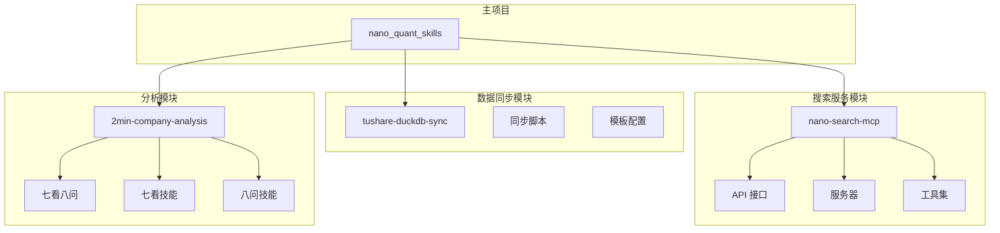

# 开发环境搭建

<cite>
**本文档引用的文件**
- [pyproject.toml](file://nano-search-mcp/pyproject.toml)
- [README.md](file://nano-search-mcp/README.md)
- [server.py](file://nano-search-mcp/src/nano_search_mcp/server.py)
- [api.py](file://nano-search-mcp/src/nano_search_mcp/api.py)
- [__main__.py](file://nano-search-mcp/src/nano_search_mcp/__main__.py)
- [test_server.py](file://nano-search-mcp/tests/test_server.py)
- [test_fetch.py](file://nano-search-mcp/tests/test_fetch.py)
- [README.md](file://tushare-duckdb-sync/README.md)
- [README.md](file://2min-company-analysis/README.md)
- [.gitignore](file://.gitignore)
</cite>

## 目录
1. [简介](#简介)
2. [项目结构](#项目结构)
3. [Python 环境要求](#python-环境要求)
4. [虚拟环境创建](#虚拟环境创建)
5. [依赖安装步骤](#依赖安装步骤)
6. [IDE 配置建议](#ide-配置建议)
7. [代码格式化工具配置](#代码格式化工具配置)
8. [项目初始化流程](#项目初始化流程)
9. [常见环境问题解决](#常见环境问题解决)
10. [故障排除指南](#故障排除指南)
11. [总结](#总结)

## 简介

本指南详细说明了如何搭建开发环境，包括 Python 环境要求、虚拟环境创建、依赖安装、IDE 配置以及开发工具推荐。项目基于 Python 3.10+，包含多个子模块，主要涉及 MCP（Model Context Protocol）服务、数据同步工具和公司分析模块。

## 项目结构

项目采用多模块架构，包含以下主要组件：



**图表来源**
- [pyproject.toml:1-44](file://nano-search-mcp/pyproject.toml#L1-L44)
- [README.md:178-198](file://nano-search-mcp/README.md#L178-L198)

**章节来源**
- [pyproject.toml:1-44](file://nano-search-mcp/pyproject.toml#L1-L44)
- [README.md:1-198](file://nano-search-mcp/README.md#L1-L198)

## Python 环境要求

### 版本要求
- **最低版本**: Python 3.10+
- **推荐版本**: Python 3.10.x（与项目配置完全匹配）

### 环境管理
项目推荐使用 Conda 环境管理器，创建专用的开发环境：

```bash
# 创建 conda 环境
conda create -n legonanobot python=3.10

# 激活环境
conda activate legonanobot
```

**章节来源**
- [pyproject.toml](file://nano-search-mcp/pyproject.toml#L5)
- [README.md:55-59](file://nano-search-mcp/README.md#L55-L59)

## 虚拟环境创建

### Conda 环境配置
```bash
# 创建环境
conda create -n legonanobot python=3.10

# 激活环境
conda activate legonanobot

# 验证 Python 版本
python --version
```

### 环境隔离
项目使用 `.gitignore` 文件确保环境隔离：
- Python 缓存文件：`__pycache__/`, `*.py[cod]`
- 虚拟环境：`.venv/`, `venv/`, `env/`
- DuckDB 数据：`*.duckdb`, `*.duckdb.wal`

**章节来源**
- [.gitignore:1-39](file://.gitignore#L1-L39)

## 依赖安装步骤

### 核心依赖项

#### 1. MCP 服务依赖
```bash
# 安装开发依赖（包含 pytest）
pip install -e ".[dev]"

# 或安装基础依赖
pip install .
```

#### 2. Playwright 依赖
```bash
# 安装 Chromium 浏览器
playwright install chromium
```

#### 3. 关键包说明

| 包名称 | 版本要求 | 功能描述 |
|--------|----------|----------|
| `mcp[cli]` | >=1.0.0 | MCP 协议客户端和 CLI 工具 |
| `httpx` | >=0.27.0 | 异步 HTTP 客户端 |
| `playwright` | >=1.40.0 | 网页自动化和抓取 |
| `beautifulsoup4` | >=4.12.0 | HTML 解析和内容提取 |
| `duckdb` | - | DuckDB 数据库引擎 |
| `pytest` | >=8.3.0 | 测试框架 |

### 依赖安装流程

```bash
# 1. 激活 conda 环境
conda activate legonanobot

# 2. 进入搜索模块目录
cd nano-search-mcp

# 3. 安装开发依赖
pip install -e ".[dev]"

# 4. 安装 Playwright 浏览器
playwright install chromium

# 5. 验证安装
python -c "import nano_search_mcp; print('安装成功')"
```

**章节来源**
- [pyproject.toml:6-19](file://nano-search-mcp/pyproject.toml#L6-L19)
- [README.md:61-76](file://nano-search-mcp/README.md#L61-L76)

## IDE 配置建议

### 推荐 IDE
- **VS Code**: 完整的 Python 开发支持
- **PyCharm**: 专业 Python IDE
- **Sublime Text**: 轻量级编辑器

### VS Code 配置建议

#### 1. Python 解释器配置
```json
{
    "python.defaultInterpreterPath": "./env/bin/python",
    "python.terminal.activateEnvironment": true,
    "python.linting.enabled": true,
    "python.linting.pylintEnabled": false,
    "python.linting.flake8Enabled": true,
    "python.formatting.provider": "black",
    "editor.formatOnSave": true,
    "editor.codeActionsOnSave": {
        "source.organizeImports": true
    }
}
```

#### 2. 扩展推荐
- Python (by Microsoft)
- Pylance
- Black Formatter
- Flake8
- GitLens

### PyCharm 配置建议

#### 1. 项目解释器设置
- 选择 Conda 环境路径
- 配置 Python 3.10 解释器

#### 2. 代码风格设置
- 使用 PEP 8 风格
- 启用自动格式化

**章节来源**
- [README.md:106-125](file://nano-search-mcp/README.md#L106-L125)

## 代码格式化工具配置

### Ruff 配置
项目使用 Ruff 作为主要的代码格式化和静态分析工具：

```toml
[tool.ruff]
line-length = 100
target-version = "py310"

[tool.ruff.lint]
select = ["E", "F", "W", "I", "B", "UP", "BLE"]
ignore = ["E501"]

[tool.ruff.lint.per-file-ignores]
"tests/*" = ["BLE001"]
```

### Black 配置
```toml
[tool.black]
line-length = 100
target-version = ["py310"]
include = '\.pyi?$'
extend-exclude = '''
/(
  # directories
  \.eggs
  | \.git
  | \.venv
  | dist
  # other patterns
  | build
)/
'''
```

### Flake8 配置
```toml
[flake8]
max-line-length = 100
ignore = E203, W503
exclude = .git,__pycache__,.venv
```

### 格式化命令
```bash
# 使用 Ruff 格式化
ruff format .

# 使用 Black 格式化
black .

# 使用 Flake8 检查
flake8 .

# 运行所有检查
ruff check .
```

**章节来源**
- [pyproject.toml:34-43](file://nano-search-mcp/pyproject.toml#L34-L43)

## 项目初始化流程

### 1. 克隆项目
```bash
# 克隆仓库
git clone <repository-url>
cd nano_quant_skills

# 验证项目结构
ls -la
```

### 2. 初始化搜索服务
```bash
# 激活环境
conda activate legonanobot

# 进入搜索模块
cd nano-search-mcp

# 安装依赖
pip install -e ".[dev]"

# 安装 Playwright
playwright install chromium
```

### 3. 初始化数据同步
```bash
# 进入数据同步模块
cd ../tushare-duckdb-sync

# 安装依赖
pip install tushare duckdb pandas loguru

# 设置 Tushare Token
export TUSHARE_TOKEN=your_token_here
```

### 4. 初始化分析模块
```bash
# 进入分析模块
cd ../2min-company-analysis

# 安装依赖
pip install duckdb pandas numpy

# 如需外部证据功能
pip install -e ../nano-search-mcp
```

### 5. 启动 MCP 服务
```bash
# 启动 MCP 服务器
conda activate legonanobot
nano-search-mcp

# 或使用 Python 模块方式
python -m nano_search_mcp --transport stdio
```

**章节来源**
- [README.md:17-26](file://nano-search-mcp/README.md#L17-L26)
- [README.md:15-28](file://tushare-duckdb-sync/README.md#L15-L28)
- [README.md:109-115](file://2min-company-analysis/README.md#L109-L115)

## 常见环境问题解决

### 1. Python 版本不兼容
**问题**: Python 版本低于 3.10
**解决方案**:
```bash
# 升级 Python 版本
conda create -n legonanobot python=3.10
conda activate legonanobot
```

### 2. Playwright 浏览器安装失败
**问题**: Chromium 浏览器无法下载
**解决方案**:
```bash
# 清理缓存重新安装
playwright install-deps
playwright install chromium

# 或使用系统浏览器
export PLAYWRIGHT_BROWSERS_PATH=/usr/lib/chromium-browser
```

### 3. 依赖安装权限问题
**问题**: pip 安装权限不足
**解决方案**:
```bash
# 使用用户安装
pip install --user -e ".[dev]"

# 或使用虚拟环境
conda create -n legonanobot python=3.10
conda activate legonanobot
pip install -e ".[dev]"
```

### 4. 环境变量配置问题
**问题**: Tushare Token 未设置
**解决方案**:
```bash
# 设置环境变量
export TUSHARE_TOKEN=your_actual_token_here

# 或在 .env 文件中配置
echo "TUSHARE_TOKEN=your_token" > .env
source .env
```

### 5. DuckDB 数据库问题
**问题**: DuckDB 文件权限问题
**解决方案**:
```bash
# 检查文件权限
ls -la *.duckdb*

# 修复权限
chmod 666 *.duckdb*
chmod 666 *.duckdb.wal
```

**章节来源**
- [README.md:55-59](file://nano-search-mcp/README.md#L55-L59)
- [README.md:21-28](file://tushare-duckdb-sync/README.md#L21-L28)

## 故障排除指南

### 1. 服务启动问题

#### MCP 服务无法启动
```bash
# 检查端口占用
netstat -tulpn | grep 8000

# 查看服务日志
conda activate legonanobot
nano-search-mcp 2>&1 | tee /tmp/mcp.log

# 检查依赖完整性
pip check
```

#### 传输模式问题
```bash
# 切换到 stdio 模式
conda activate legonanobot
nano-search-mcp --transport stdio

# 或使用 HTTP 模式
conda activate legonanobot
nano-search-mcp --transport streamable-http
```

### 2. 测试运行问题

#### 单元测试失败
```bash
# 运行特定测试
conda activate legonanobot
pytest tests/test_server.py -v

# 运行所有测试
conda activate legonanobot
pytest -v

# 查看测试覆盖率
conda activate legonanobot
pytest --cov=src --cov-report=html
```

#### SSRF 防护测试
```bash
# 运行安全测试
conda activate legonanobot
pytest tests/test_fetch.py -v
```

### 3. 依赖冲突问题

#### 依赖版本冲突
```bash
# 检查依赖树
pipdeptree

# 更新 pip
pip install --upgrade pip

# 清理缓存
pip cache purge

# 重新安装
pip uninstall -r requirements.txt
pip install -e ".[dev]"
```

#### 环境隔离问题
```bash
# 检查当前环境
conda info --envs

# 激活正确环境
conda activate legonanobot

# 验证 Python 路径
which python
```

### 4. 开发工具问题

#### Linting 工具配置
```bash
# 检查 Ruff 配置
ruff config show

# 运行 Ruff 检查
ruff check src/

# 格式化代码
ruff format src/
```

#### IDE 配置问题
```bash
# 重启语言服务器
# VS Code: Ctrl+Shift+P -> "Python: Restart Language Server"

# 清理缓存
rm -rf ~/.cache/pypoetry
rm -rf ~/.cache/pip
```

**章节来源**
- [test_server.py:1-84](file://nano-search-mcp/tests/test_server.py#L1-L84)
- [test_fetch.py:1-98](file://nano-search-mcp/tests/test_fetch.py#L1-L98)

## 总结

本开发环境搭建指南涵盖了从 Python 环境配置到项目初始化的完整流程。关键要点包括：

### 核心要求
- Python 3.10+ 环境
- Conda 环境管理
- Playwright 浏览器依赖
- DuckDB 数据库支持

### 开发流程
1. **环境准备**: 创建并激活 Conda 环境
2. **依赖安装**: 安装 MCP 服务、Playwright 和其他依赖
3. **工具配置**: 设置 IDE 和代码格式化工具
4. **项目初始化**: 启动 MCP 服务和数据同步
5. **测试验证**: 运行单元测试确保环境正常

### 维护建议
- 定期更新依赖包
- 使用版本控制管理环境配置
- 建立标准化的开发工作流程
- 定期进行代码质量检查

通过遵循本指南，开发者可以快速搭建完整的开发环境，确保项目能够正常运行和开发。