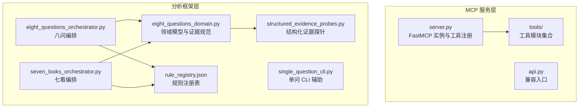
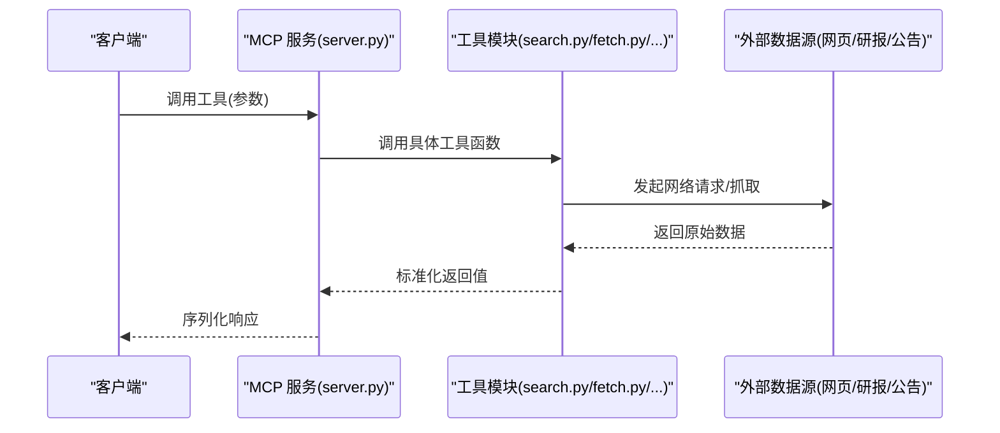
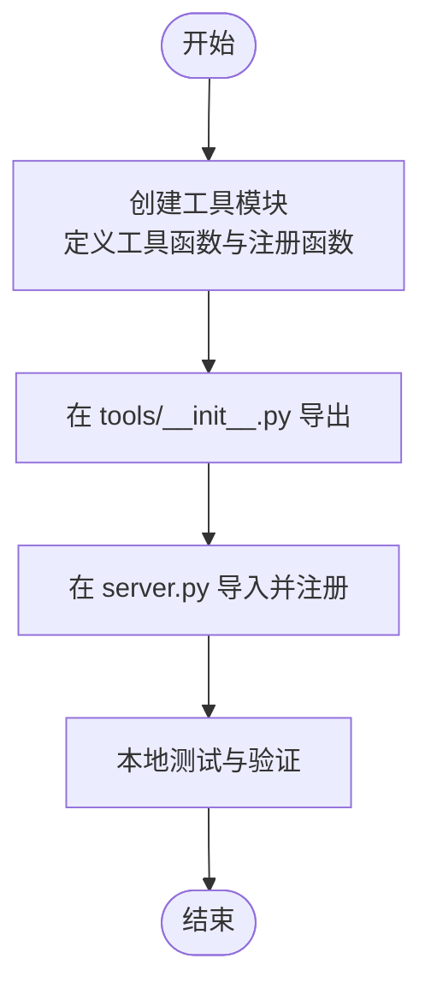
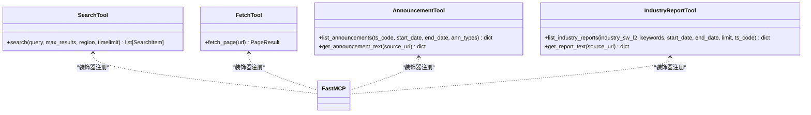
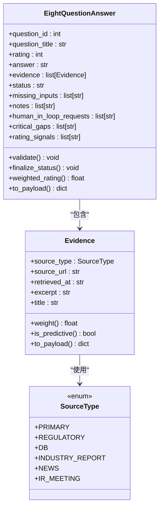
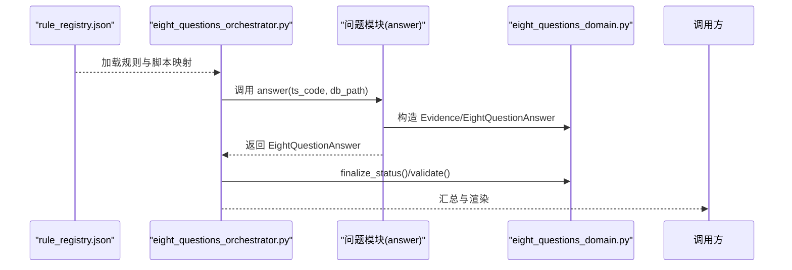
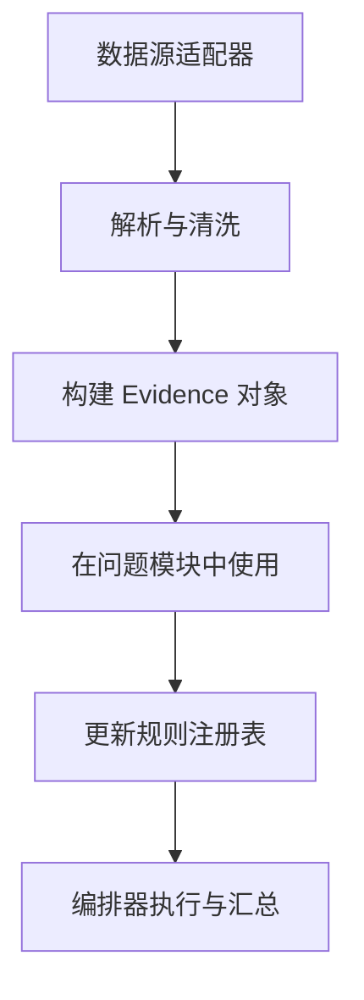
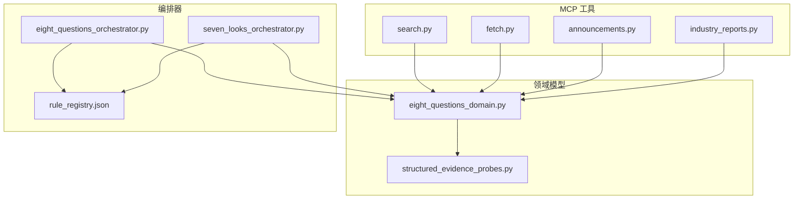

# 扩展开发指南

<cite>
**本文档引用的文件**
- [server.py](file://nano-search-mcp/src/nano_search_mcp/server.py)
- [api.py](file://nano-search-mcp/src/nano_search_mcp/api.py)
- [tools/__init__.py](file://nano-search-mcp/src/nano_search_mcp/tools/__init__.py)
- [search.py](file://nano-search-mcp/src/nano_search_mcp/tools/search.py)
- [fetch.py](file://nano-search-mcp/src/nano_search_mcp/tools/fetch.py)
- [announcements.py](file://nano-search-mcp/src/nano_search_mcp/tools/announcements.py)
- [industry_reports.py](file://nano-search-mcp/src/nano_search_mcp/tools/industry_reports.py)
- [eight_questions_domain.py](file://2min-company-analysis/seven-look-eight-question/scripts/eight_questions_domain.py)
- [eight_questions_orchestrator.py](file://2min-company-analysis/seven-look-eight-question/scripts/eight_questions_orchestrator.py)
- [seven_looks_orchestrator.py](file://2min-company-analysis/seven-look-eight-question/scripts/seven_looks_orchestrator.py)
- [single_question_cli.py](file://2min-company-analysis/seven-look-eight-question/scripts/single_question_cli.py)
- [structured_evidence_probes.py](file://2min-company-analysis/seven-look-eight-question/scripts/structured_evidence_probes.py)
- [rule_registry.json](file://2min-company-analysis/seven-look-eight-question/assets/rule_registry.json)
- [q01_industry.py](file://2min-company-analysis/ask-q1-industry-prospect/scripts/q01_industry.py)
- [look_01_profit_quality.py](file://2min-company-analysis/look-01-profit-quality/scripts/look_01_profit_quality.py)
</cite>

## 目录
1. [简介](#简介)
2. [项目结构](#项目结构)
3. [核心组件](#核心组件)
4. [架构总览](#架构总览)
5. [详细组件分析](#详细组件分析)
6. [依赖关系分析](#依赖关系分析)
7. [性能考虑](#性能考虑)
8. [故障排除指南](#故障排除指南)
9. [结论](#结论)
10. [附录](#附录)

## 简介
本指南面向希望在现有系统基础上进行扩展开发的工程师，涵盖以下主题：
- 新增 MCP 工具：工具接口实现、参数定义与返回值格式
- 分析规则扩展：七看规则与八问问题的添加流程
- 新数据源集成：步骤与最佳实践
- 领域模型扩展与证据收集机制增强
- 配置管理与向后兼容性
- 性能优化与安全防护
- 代码示例与实现路径指引

## 项目结构
该项目采用分层与能力域分离的设计：
- nano-search-mcp：MCP 服务器与工具集，提供网页搜索、页面抓取、公告与研报等检索工具
- 2min-company-analysis：财务分析框架，包含七看与八问两大分析体系，统一的领域模型与证据规范

**图表来源**
- [server.py:1-91](file://nano-search-mcp/src/nano_search_mcp/server.py#L1-L91)
- [eight_questions_domain.py:1-324](file://2min-company-analysis/seven-look-eight-question/scripts/eight_questions_domain.py#L1-L324)
- [eight_questions_orchestrator.py:1-396](file://2min-company-analysis/seven-look-eight-question/scripts/eight_questions_orchestrator.py#L1-L396)
- [seven_looks_orchestrator.py:1-800](file://2min-company-analysis/seven-look-eight-question/scripts/seven_looks_orchestrator.py#L1-L800)
- [rule_registry.json:1-410](file://2min-company-analysis/seven-look-eight-question/assets/rule_registry.json#L1-L410)

**章节来源**
- [server.py:1-91](file://nano-search-mcp/src/nano_search_mcp/server.py#L1-L91)
- [eight_questions_domain.py:1-324](file://2min-company-analysis/seven-look-eight-question/scripts/eight_questions_domain.py#L1-L324)

## 核心组件
- MCP 服务与工具注册：基于 FastMCP 的工具注册与运行，统一入口与传输协议
- 八问领域模型：统一的证据、答案与权重体系，确保分析一致性与可审计性
- 规则编排器：七看与八问的执行编排，支持并发与状态汇总
- 结构化证据探针：基于 DuckDB 的结构化数据证据抽取
- 规则注册表：集中管理规则与脚本映射，便于扩展与维护

**章节来源**
- [server.py:1-91](file://nano-search-mcp/src/nano_search_mcp/server.py#L1-L91)
- [eight_questions_orchestrator.py:1-396](file://2min-company-analysis/seven-look-eight-question/scripts/eight_questions_orchestrator.py#L1-L396)
- [seven_looks_orchestrator.py:1-800](file://2min-company-analysis/seven-look-eight-question/scripts/seven_looks_orchestrator.py#L1-L800)
- [structured_evidence_probes.py:1-386](file://2min-company-analysis/seven-look-eight-question/scripts/structured_evidence_probes.py#L1-L386)
- [rule_registry.json:1-410](file://2min-company-analysis/seven-look-eight-question/assets/rule_registry.json#L1-L410)

## 架构总览
系统采用“服务层 + 分析层”的双层架构：
- 服务层负责外部数据获取与工具暴露（MCP）
- 分析层负责领域建模、证据收集与规则编排

**图表来源**
- [server.py:60-69](file://nano-search-mcp/src/nano_search_mcp/server.py#L60-L69)
- [search.py:79-119](file://nano-search-mcp/src/nano_search_mcp/tools/search.py#L79-L119)
- [fetch.py:220-245](file://nano-search-mcp/src/nano_search_mcp/tools/fetch.py#L220-L245)

## 详细组件分析

### MCP 工具扩展指南

#### 1) 新增工具的步骤
- 在 tools 目录下创建新模块，定义工具函数与注册函数
- 在 tools/__init__.py 中导出工具函数与注册函数
- 在 server.py 中导入并注册工具

**图表来源**
- [tools/__init__.py:1-48](file://nano-search-mcp/src/nano_search_mcp/tools/__init__.py#L1-L48)
- [server.py:8-16](file://nano-search-mcp/src/nano_search_mcp/server.py#L8-L16)

**章节来源**
- [tools/__init__.py:1-48](file://nano-search-mcp/src/nano_search_mcp/tools/__init__.py#L1-L48)
- [server.py:83-86](file://nano-search-mcp/src/nano_search_mcp/server.py#L83-L86)

#### 2) 工具接口实现范式
- 使用 @mcp.tool() 装饰器声明工具
- 参数校验与异常处理：失败时返回包含 source 与 error 的字典
- 返回值格式：遵循统一的 TypedDict/字典契约，避免抛出异常

**图表来源**
- [search.py:79-119](file://nano-search-mcp/src/nano_search_mcp/tools/search.py#L79-L119)
- [fetch.py:220-245](file://nano-search-mcp/src/nano_search_mcp/tools/fetch.py#L220-L245)
- [announcements.py:404-535](file://nano-search-mcp/src/nano_search_mcp/tools/announcements.py#L404-L535)
- [industry_reports.py:384-495](file://nano-search-mcp/src/nano_search_mcp/tools/industry_reports.py#L384-L495)

**章节来源**
- [search.py:79-119](file://nano-search-mcp/src/nano_search_mcp/tools/search.py#L79-L119)
- [fetch.py:220-245](file://nano-search-mcp/src/nano_search_mcp/tools/fetch.py#L220-L245)
- [announcements.py:404-535](file://nano-search-mcp/src/nano_search_mcp/tools/announcements.py#L404-L535)
- [industry_reports.py:384-495](file://nano-search-mcp/src/nano_search_mcp/tools/industry_reports.py#L384-L495)

#### 3) 参数定义与返回值格式
- 参数类型：字符串、整数、布尔、列表等，必要时进行类型转换与范围约束
- 返回值：统一字典结构，包含 source、error、fetch_time 等字段（失败时）
- 示例参考：
  - 搜索工具返回包含 title/url/snippet 的列表
  - 页面抓取返回包含 url/content/method/truncated/error 的字典
  - 公告与研报列表返回包含 report_date/publisher/title/industry_tags/source_url 的条目

**章节来源**
- [search.py:73-119](file://nano-search-mcp/src/nano_search_mcp/tools/search.py#L73-L119)
- [fetch.py:178-245](file://nano-search-mcp/src/nano_search_mcp/tools/fetch.py#L178-L245)
- [industry_reports.py:386-495](file://nano-search-mcp/src/nano_search_mcp/tools/industry_reports.py#L386-L495)

#### 4) 安全与性能注意事项
- SSRF 防护：URL 协议与主机白名单校验，拒绝 loopback/私网/保留地址
- 速率限制与退避：请求间隔、指数退避重试
- 缓存策略：列表页与详情页 TTL 控制，减少重复抓取
- 异步与并发：浏览器复用、锁保护，避免资源泄漏

**章节来源**
- [fetch.py:16-75](file://nano-search-mcp/src/nano_search_mcp/tools/fetch.py#L16-L75)
- [announcements.py:137-179](file://nano-search-mcp/src/nano_search_mcp/tools/announcements.py#L137-L179)
- [industry_reports.py:121-158](file://nano-search-mcp/src/nano_search_mcp/tools/industry_reports.py#L121-L158)

### 分析规则扩展指南

#### 1) 八问领域模型扩展
- 统一证据与答案模型：Evidence 与 EightQuestionAnswer
- 来源类型与权重：SourceType 与 SOURCE_WEIGHTS
- 状态管理：validate/finalize_status/weighted_rating
- 证据规范化：to_payload 输出统一结构

**图表来源**
- [eight_questions_domain.py:26-111](file://2min-company-analysis/seven-look-eight-question/scripts/eight_questions_domain.py#L26-L111)
- [eight_questions_domain.py:123-213](file://2min-company-analysis/seven-look-eight-question/scripts/eight_questions_domain.py#L123-L213)

**章节来源**
- [eight_questions_domain.py:26-111](file://2min-company-analysis/seven-look-eight-question/scripts/eight_questions_domain.py#L26-L111)
- [eight_questions_domain.py:123-213](file://2min-company-analysis/seven-look-eight-question/scripts/eight_questions_domain.py#L123-L213)

#### 2) 添加新的八问问题
- 在 rule_registry.json 中注册新问题规则，指定脚本路径与依赖表
- 实现 answer 函数，返回 EightQuestionAnswer
- 使用 single_question_cli 进行独立运行与输出
- 八问编排器通过规则注册表动态加载模块并并发执行

**图表来源**
- [rule_registry.json:218-407](file://2min-company-analysis/seven-look-eight-question/assets/rule_registry.json#L218-L407)
- [eight_questions_orchestrator.py:41-101](file://2min-company-analysis/seven-look-eight-question/scripts/eight_questions_orchestrator.py#L41-L101)
- [q01_industry.py:52-147](file://2min-company-analysis/ask-q1-industry-prospect/scripts/q01_industry.py#L52-L147)

**章节来源**
- [rule_registry.json:218-407](file://2min-company-analysis/seven-look-eight-question/assets/rule_registry.json#L218-L407)
- [eight_questions_orchestrator.py:41-101](file://2min-company-analysis/seven-look-eight-question/scripts/eight_questions_orchestrator.py#L41-L101)
- [q01_industry.py:52-147](file://2min-company-analysis/ask-q1-industry-prospect/scripts/q01_industry.py#L52-L147)

#### 3) 添加新的七看规则
- 在 seven_looks_orchestrator.py 中维护 LOOK_SPECS，指定脚本路径与默认回看年限
- 规则脚本负责 DuckDB 查询、指标计算与证据抽取
- 编排器通过子进程调用各规则脚本，汇总状态与标志

**章节来源**
- [seven_looks_orchestrator.py:62-119](file://2min-company-analysis/seven-look-eight-question/scripts/seven_looks_orchestrator.py#L62-L119)
- [look_01_profit_quality.py:553-587](file://2min-company-analysis/look-01-profit-quality/scripts/look_01_profit_quality.py#L553-L587)

### 新数据源集成指南

#### 1) 集成步骤
- 设计数据源适配器：实现数据获取、解析与标准化
- 定义证据构造：将原始数据封装为 Evidence 对象
- 注册到领域模型：在相应问题模块中调用适配器
- 编排器接入：在规则注册表中声明依赖表与派生指标

**图表来源**
- [structured_evidence_probes.py:39-51](file://2min-company-analysis/seven-look-eight-question/scripts/structured_evidence_probes.py#L39-L51)
- [rule_registry.json:1-410](file://2min-company-analysis/seven-look-eight-question/assets/rule_registry.json#L1-L410)

**章节来源**
- [structured_evidence_probes.py:39-51](file://2min-company-analysis/seven-look-eight-question/scripts/structured_evidence_probes.py#L39-L51)
- [rule_registry.json:1-410](file://2min-company-analysis/seven-look-eight-question/assets/rule_registry.json#L1-L410)

#### 2) 最佳实践
- 明确来源类型与权重：事实/预测/监管/数据库等
- 证据完整性：禁止空引证，严格校验 excerpt 与 URL
- 可追溯性：记录 retrieved_at、title、excerpt 与 source_url
- 性能与缓存：对重复查询与外部接口实施缓存与 TTL 控制

**章节来源**
- [eight_questions_domain.py:72-111](file://2min-company-analysis/seven-look-eight-question/scripts/eight_questions_domain.py#L72-L111)
- [industry_reports.py:43-46](file://nano-search-mcp/src/nano_search_mcp/tools/industry_reports.py#L43-L46)

### 领域模型扩展与证据收集机制增强

#### 1) 领域模型扩展
- 新增来源类型：在 SourceType 中扩展枚举值，并在 SOURCE_WEIGHTS 与 SOURCE_LABEL 中补充权重与标签
- 扩展证据字段：在 Evidence 中增加必要字段并在 to_payload 中序列化
- 状态与校验：在 EightQuestionAnswer.validate 中增加新约束

**章节来源**
- [eight_questions_domain.py:26-57](file://2min-company-analysis/seven-look-eight-question/scripts/eight_questions_domain.py#L26-L57)
- [eight_questions_domain.py:140-167](file://2min-company-analysis/seven-look-eight-question/scripts/eight_questions_domain.py#L140-L167)

#### 2) 证据收集机制增强
- DuckDB 探针：在 structured_evidence_probes.py 中新增探针函数，返回 (rows, Evidence)
- 外部数据源：在问题模块中调用外部收集器，合并证据并处理 requires_human 场景

**章节来源**
- [structured_evidence_probes.py:58-81](file://2min-company-analysis/seven-look-eight-question/scripts/structured_evidence_probes.py#L58-L81)
- [q01_industry.py:82-106](file://2min-company-analysis/ask-q1-industry-prospect/scripts/q01_industry.py#L82-L106)

### 配置管理与向后兼容性

#### 1) 配置管理
- 规则注册表：集中管理规则、脚本映射与依赖表
- 工具注册：在 server.py 中统一注册，避免硬编码
- CLI 参数：统一的 --format/--output-dir 等参数约定

**章节来源**
- [rule_registry.json:1-410](file://2min-company-analysis/seven-look-eight-question/assets/rule_registry.json#L1-L410)
- [server.py:60-69](file://nano-search-mcp/src/nano_search_mcp/server.py#L60-L69)
- [eight_questions_orchestrator.py:346-391](file://2min-company-analysis/seven-look-eight-question/scripts/eight_questions_orchestrator.py#L346-L391)

#### 2) 向后兼容性
- 工具返回契约：失败时返回包含 source/unavailable 与 error 的字典，不抛异常
- 版本化：规则注册表包含 version 字段，便于演进
- 兼容入口：api.py 提供兼容入口，保证旧调用方式可用

**章节来源**
- [server.py:55-57](file://nano-search-mcp/src/nano_search_mcp/server.py#L55-L57)
- [api.py:1-12](file://nano-search-mcp/src/nano_search_mcp/api.py#L1-L12)

### 性能优化与安全防护

#### 1) 性能优化
- 并发执行：八问编排器使用 ThreadPoolExecutor 并发执行
- 缓存策略：列表页与详情页 TTL 控制，减少重复抓取
- 资源复用：Playwright 浏览器实例复用，降低冷启动开销
- 数据库查询：DuckDB 连接只读，合理使用索引与派生指标

**章节来源**
- [eight_questions_orchestrator.py:153-163](file://2min-company-analysis/seven-look-eight-question/scripts/eight_questions_orchestrator.py#L153-L163)
- [industry_reports.py:43-46](file://nano-search-mcp/src/nano_search_mcp/tools/industry_reports.py#L43-L46)
- [fetch.py:133-143](file://nano-search-mcp/src/nano_search_mcp/tools/fetch.py#L133-L143)
- [look_01_profit_quality.py:75-79](file://2min-company-analysis/look-01-profit-quality/scripts/look_01_profit_quality.py#L75-L79)

#### 2) 安全防护
- SSRF 防护：URL 协议与主机白名单校验，拒绝 loopback/私网/保留地址
- 输入校验：正则校验 stockid/date/url 等关键字段
- 速率限制：请求间隔与退避重试，避免对外部接口造成压力

**章节来源**
- [fetch.py:24-75](file://nano-search-mcp/src/nano_search_mcp/tools/fetch.py#L24-L75)
- [announcements.py:85-125](file://nano-search-mcp/src/nano_search_mcp/tools/announcements.py#L85-L125)
- [industry_reports.py:121-158](file://nano-search-mcp/src/nano_search_mcp/tools/industry_reports.py#L121-L158)

## 依赖关系分析

**图表来源**
- [search.py:1-119](file://nano-search-mcp/src/nano_search_mcp/tools/search.py#L1-L119)
- [fetch.py:1-245](file://nano-search-mcp/src/nano_search_mcp/tools/fetch.py#L1-L245)
- [announcements.py:1-535](file://nano-search-mcp/src/nano_search_mcp/tools/announcements.py#L1-L535)
- [industry_reports.py:1-495](file://nano-search-mcp/src/nano_search_mcp/tools/industry_reports.py#L1-L495)
- [eight_questions_domain.py:1-324](file://2min-company-analysis/seven-look-eight-question/scripts/eight_questions_domain.py#L1-L324)
- [eight_questions_orchestrator.py:1-396](file://2min-company-analysis/seven-look-eight-question/scripts/eight_questions_orchestrator.py#L1-L396)
- [seven_looks_orchestrator.py:1-800](file://2min-company-analysis/seven-look-eight-question/scripts/seven_looks_orchestrator.py#L1-L800)
- [rule_registry.json:1-410](file://2min-company-analysis/seven-look-eight-question/assets/rule_registry.json#L1-L410)

**章节来源**
- [eight_questions_orchestrator.py:1-396](file://2min-company-analysis/seven-look-eight-question/scripts/eight_questions_orchestrator.py#L1-L396)
- [seven_looks_orchestrator.py:1-800](file://2min-company-analysis/seven-look-eight-question/scripts/seven_looks_orchestrator.py#L1-L800)

## 性能考虑
- 并发与限流：合理设置并发度与请求间隔，避免外部接口限流
- 缓存与去重：对重复查询与外部接口实施缓存，减少网络开销
- 数据库优化：使用只读连接与派生指标，避免全表扫描
- 输出格式：按需选择 JSON/Markdown，减少不必要的渲染开销

## 故障排除指南
- 工具失败：检查返回字典中的 error 字段，确认 source 是否为 unavailable
- DuckDB 不可用：检查 db_path 与文件权限，确认连接成功
- 证据缺失：查看 missing_inputs 与 human_in_loop_requests，按提示补充数据
- 状态异常：调用 finalize_status() 与 validate()，确保状态符合 VALID_STATUSES

**章节来源**
- [eight_questions_orchestrator.py:132-151](file://2min-company-analysis/seven-look-eight-question/scripts/eight_questions_orchestrator.py#L132-L151)
- [eight_questions_domain.py:140-167](file://2min-company-analysis/seven-look-eight-question/scripts/eight_questions_domain.py#L140-L167)

## 结论
通过遵循统一的领域模型、工具注册与编排机制，开发者可以高效地扩展 MCP 工具与分析规则。建议在扩展过程中严格遵守证据规范、安全与性能最佳实践，并通过规则注册表与编排器实现平滑集成与向后兼容。

## 附录
- 代码示例路径（不含具体代码内容）：
  - [MCP 搜索工具实现:79-119](file://nano-search-mcp/src/nano_search_mcp/tools/search.py#L79-L119)
  - [MCP 页面抓取工具实现:220-245](file://nano-search-mcp/src/nano_search_mcp/tools/fetch.py#L220-L245)
  - [MCP 公告工具实现:404-535](file://nano-search-mcp/src/nano_search_mcp/tools/announcements.py#L404-L535)
  - [MCP 行业研报工具实现:384-495](file://nano-search-mcp/src/nano_search_mcp/tools/industry_reports.py#L384-L495)
  - [八问领域模型:26-213](file://2min-company-analysis/seven-look-eight-question/scripts/eight_questions_domain.py#L26-L213)
  - [八问编排器:41-163](file://2min-company-analysis/seven-look-eight-question/scripts/eight_questions_orchestrator.py#L41-L163)
  - [七看编排器:62-119](file://2min-company-analysis/seven-look-eight-question/scripts/seven_looks_orchestrator.py#L62-L119)
  - [结构化证据探针:39-51](file://2min-company-analysis/seven-look-eight-question/scripts/structured_evidence_probes.py#L39-L51)
  - [规则注册表:1-410](file://2min-company-analysis/seven-look-eight-question/assets/rule_registry.json#L1-L410)
  - [单问 CLI 辅助:126-158](file://2min-company-analysis/seven-look-eight-question/scripts/single_question_cli.py#L126-L158)
  - [示例问题模块:52-147](file://2min-company-analysis/ask-q1-industry-prospect/scripts/q01_industry.py#L52-L147)
  - [示例七看规则:553-587](file://2min-company-analysis/look-01-profit-quality/scripts/look_01_profit_quality.py#L553-L587)