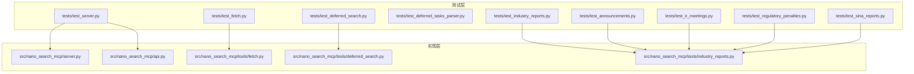
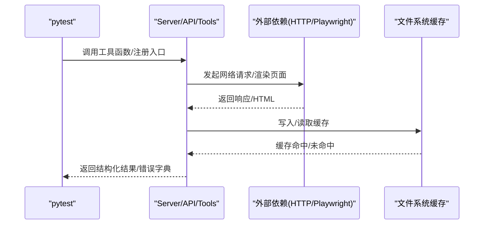
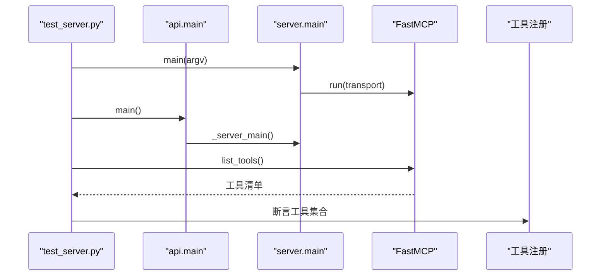
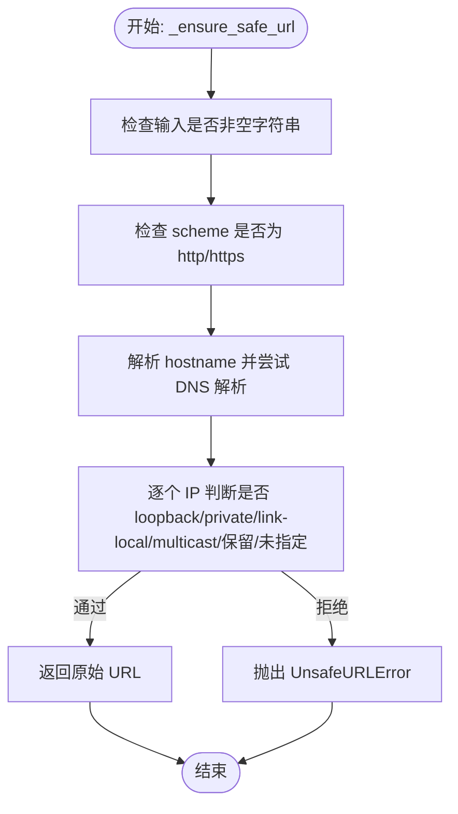
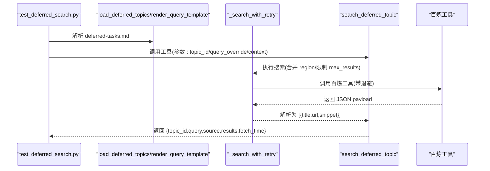
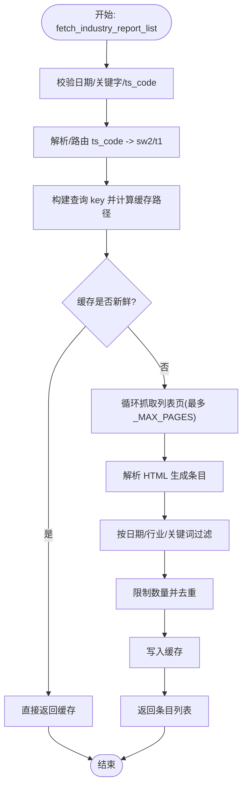
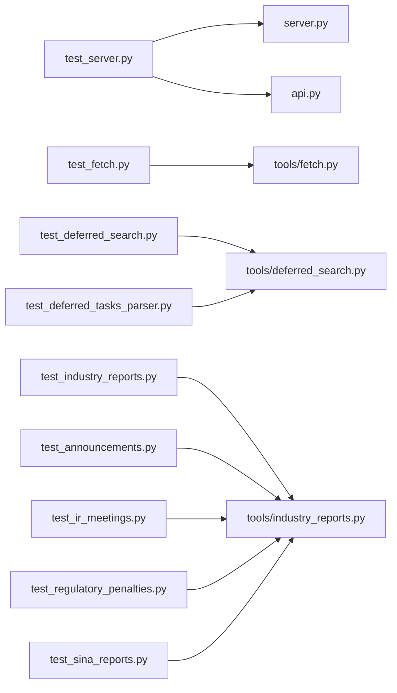

# 测试策略与实践

<cite>
**本文引用的文件**   
- [nano-search-mcp/tests/test_server.py](file://nano-search-mcp/tests/test_server.py)
- [nano-search-mcp/tests/test_fetch.py](file://nano-search-mcp/tests/test_fetch.py)
- [nano-search-mcp/tests/test_deferred_search.py](file://nano-search-mcp/tests/test_deferred_search.py)
- [nano-search-mcp/tests/test_deferred_tasks_parser.py](file://nano-search-mcp/tests/test_deferred_tasks_parser.py)
- [nano-search-mcp/tests/test_industry_reports.py](file://nano-search-mcp/tests/test_industry_reports.py)
- [nano-search-mcp/tests/test_announcements.py](file://nano-search-mcp/tests/test_announcements.py)
- [nano-search-mcp/tests/test_ir_meetings.py](file://nano-search-mcp/tests/test_ir_meetings.py)
- [nano-search-mcp/tests/test_regulatory_penalties.py](file://nano-search-mcp/tests/test_regulatory_penalties.py)
- [nano-search-mcp/tests/test_sina_reports.py](file://nano-search-mcp/tests/test_sina_reports.py)
- [nano-search-mcp/src/nano_search_mcp/server.py](file://nano-search-mcp/src/nano_search_mcp/server.py)
- [nano-search-mcp/src/nano_search_mcp/api.py](file://nano-search-mcp/src/nano_search_mcp/api.py)
- [nano-search-mcp/src/nano_search_mcp/tools/fetch.py](file://nano-search-mcp/src/nano_search_mcp/tools/fetch.py)
- [nano-search-mcp/src/nano_search_mcp/tools/deferred_search.py](file://nano-search-mcp/src/nano_search_mcp/tools/deferred_search.py)
- [nano-search-mcp/src/nano_search_mcp/tools/industry_reports.py](file://nano-search-mcp/src/nano_search_mcp/tools/industry_reports.py)
- [nano-search-mcp/pyproject.toml](file://nano-search-mcp/pyproject.toml)
- [nano-search-mcp/README.md](file://nano-search-mcp/README.md)
</cite>

## 目录
1. [引言](#引言)
2. [项目结构](#项目结构)
3. [核心组件](#核心组件)
4. [架构总览](#架构总览)
5. [详细组件分析](#详细组件分析)
6. [依赖分析](#依赖分析)
7. [性能考虑](#性能考虑)
8. [故障排查指南](#故障排查指南)
9. [结论](#结论)
10. [附录](#附录)

## 引言
本文件系统化梳理并输出 nano_quant_skills 仓库中“NanoSearchMCP”模块的测试策略与实践，覆盖单元测试、集成测试与端到端测试的设计原则与实施方法，重点围绕 pytest 框架的使用、测试夹具（fixture）与测试数据准备，以及 MCP 工具测试的最佳实践（模拟外部依赖、异步操作测试）。同时给出测试覆盖率与质量门禁建议、测试环境配置与持续集成设置要点，并提供具体测试用例示例，展示如何测试搜索工具、分析引擎与数据同步功能，最后总结可维护测试代码的编写规范与常见问题处理。

## 项目结构
NanoSearchMCP 作为子模块，提供 MCP 服务与一组抓取/搜索工具，测试集中在 tests/ 目录，覆盖服务器入口、HTTP 兼容层、工具注册契约、抓取与解析、以及各类数据源工具。关键文件如下：
- 测试入口与服务器契约：tests/test_server.py
- SSRF 防护专项测试：tests/test_fetch.py
- 延迟任务与模板化搜索：tests/test_deferred_search.py、tests/test_deferred_tasks_parser.py
- 行业研报工具：tests/test_industry_reports.py
- 公告工具：tests/test_announcements.py
- IR 会议工具：tests/test_ir_meetings.py
- 监管处罚工具：tests/test_regulatory_penalties.py
- 新浪定期报告工具：tests/test_sina_reports.py
- 服务器与工具注册：src/nano_search_mcp/server.py、src/nano_search_mcp/api.py
- 抓取与 Playwright：src/nano_search_mcp/tools/fetch.py
- 延迟搜索与百炼工具：src/nano_search_mcp/tools/deferred_search.py
- 行业研报抓取：src/nano_search_mcp/tools/industry_reports.py
- 测试配置与依赖：pyproject.toml、README.md

图表来源
- [nano-search-mcp/tests/test_server.py:1-84](file://nano-search-mcp/tests/test_server.py#L1-L84)
- [nano-search-mcp/src/nano_search_mcp/server.py:1-91](file://nano-search-mcp/src/nano_search_mcp/server.py#L1-L91)
- [nano-search-mcp/src/nano_search_mcp/api.py:1-12](file://nano-search-mcp/src/nano_search_mcp/api.py#L1-L12)
- [nano-search-mcp/src/nano_search_mcp/tools/fetch.py:1-245](file://nano-search-mcp/src/nano_search_mcp/tools/fetch.py#L1-L245)
- [nano-search-mcp/src/nano_search_mcp/tools/deferred_search.py:1-238](file://nano-search-mcp/src/nano_search_mcp/tools/deferred_search.py#L1-L238)
- [nano-search-mcp/src/nano_search_mcp/tools/industry_reports.py:1-495](file://nano-search-mcp/src/nano_search_mcp/tools/industry_reports.py#L1-L495)

章节来源
- [nano-search-mcp/README.md:160-177](file://nano-search-mcp/README.md#L160-L177)

## 核心组件
- 服务器与工具注册契约：通过 tests/test_server.py 断言 MCP 工具清单与路由正确性，确保新增工具不会遗漏注册。
- SSRF 防护专项：tests/test_fetch.py 对 _ensure_safe_url 与 fetch_page_async 的安全边界进行严格测试。
- 延迟搜索与模板：tests/test_deferred_search.py 与 tests/test_deferred_tasks_parser.py 覆盖模板解析、重试机制与工具集成。
- 数据源工具：tests/test_industry_reports.py、tests/test_announcements.py、tests/test_ir_meetings.py、tests/test_regulatory_penalties.py 验证输入校验、HTML 解析、缓存与错误路径。
- 新浪定期报告：tests/test_sina_reports.py 验证参数契约与错误处理。
- 测试框架与配置：pyproject.toml 指定 pytest 测试路径与 lint 规则，README.md 提供测试运行说明。

章节来源
- [nano-search-mcp/tests/test_server.py:49-83](file://nano-search-mcp/tests/test_server.py#L49-L83)
- [nano-search-mcp/tests/test_fetch.py:1-98](file://nano-search-mcp/tests/test_fetch.py#L1-L98)
- [nano-search-mcp/tests/test_deferred_search.py:1-282](file://nano-search-mcp/tests/test_deferred_search.py#L1-L282)
- [nano-search-mcp/tests/test_deferred_tasks_parser.py:1-186](file://nano-search-mcp/tests/test_deferred_tasks_parser.py#L1-L186)
- [nano-search-mcp/tests/test_industry_reports.py:1-213](file://nano-search-mcp/tests/test_industry_reports.py#L1-L213)
- [nano-search-mcp/tests/test_announcements.py:1-321](file://nano-search-mcp/tests/test_announcements.py#L1-L321)
- [nano-search-mcp/tests/test_ir_meetings.py:1-294](file://nano-search-mcp/tests/test_ir_meetings.py#L1-L294)
- [nano-search-mcp/tests/test_regulatory_penalties.py:1-280](file://nano-search-mcp/tests/test_regulatory_penalties.py#L1-L280)
- [nano-search-mcp/tests/test_sina_reports.py:1-212](file://nano-search-mcp/tests/test_sina_reports.py#L1-L212)
- [nano-search-mcp/pyproject.toml:31-33](file://nano-search-mcp/pyproject.toml#L31-L33)
- [nano-search-mcp/README.md:160-177](file://nano-search-mcp/README.md#L160-L177)

## 架构总览
NanoSearchMCP 的测试架构遵循“最小实现 + 最大断言”的原则：对服务器入口、工具注册、抓取与解析、以及各数据源工具分别进行单元测试；通过 pytest 的 monkeypatch、patch、tmp_path 等机制模拟外部依赖与文件系统；对异步抓取（Playwright）通过 asyncio.run 或锁控制进行隔离测试。

图表来源
- [nano-search-mcp/tests/test_server.py:36-46](file://nano-search-mcp/tests/test_server.py#L36-L46)
- [nano-search-mcp/src/nano_search_mcp/server.py:83-86](file://nano-search-mcp/src/nano_search_mcp/server.py#L83-L86)
- [nano-search-mcp/src/nano_search_mcp/api.py:9-11](file://nano-search-mcp/src/nano_search_mcp/api.py#L9-L11)
- [nano-search-mcp/src/nano_search_mcp/tools/fetch.py:186-218](file://nano-search-mcp/src/nano_search_mcp/tools/fetch.py#L186-L218)
- [nano-search-mcp/src/nano_search_mcp/tools/industry_reports.py:273-381](file://nano-search-mcp/src/nano_search_mcp/tools/industry_reports.py#L273-L381)

## 详细组件分析

### 服务器与工具注册契约测试
- 断言点
  - 服务器入口使用 streamable-http 传输并可切换 stdio。
  - HTTP 兼容入口暴露 /mcp 路由。
  - API main 代理到 server.main。
  - 工具注册契约：确保所有承诺的 MCP 工具均已注册，防止遗漏。
- 测试设计
  - 使用 monkeypatch 设置 mcp.run 与 api._server_main 的行为，断言调用与参数。
  - 使用 anyio.run 调用 mcp.list_tools 并比对工具集合。
- 最佳实践
  - 将“承诺的工具清单”与“注册清单”解耦，通过契约测试强制一致性。
  - 对 transport 参数与路由路径进行参数化断言，提升覆盖率。

图表来源
- [nano-search-mcp/tests/test_server.py:4-27](file://nano-search-mcp/tests/test_server.py#L4-L27)
- [nano-search-mcp/tests/test_server.py:30-46](file://nano-search-mcp/tests/test_server.py#L30-L46)
- [nano-search-mcp/tests/test_server.py:49-83](file://nano-search-mcp/tests/test_server.py#L49-L83)
- [nano-search-mcp/src/nano_search_mcp/api.py:9-11](file://nano-search-mcp/src/nano_search_mcp/api.py#L9-L11)
- [nano-search-mcp/src/nano_search_mcp/server.py:83-86](file://nano-search-mcp/src/nano_search_mcp/server.py#L83-L86)

章节来源
- [nano-search-mcp/tests/test_server.py:4-83](file://nano-search-mcp/tests/test_server.py#L4-L83)
- [nano-search-mcp/src/nano_search_mcp/api.py:1-12](file://nano-search-mcp/src/nano_search_mcp/api.py#L1-L12)
- [nano-search-mcp/src/nano_search_mcp/server.py:1-91](file://nano-search-mcp/src/nano_search_mcp/server.py#L1-L91)

### SSRF 防护专项测试
- 断言点
  - _ensure_safe_url 对合法 URL 放行；对 file://、loopback、私网、云元数据等拒绝。
  - fetch_page_async 对不安全 URL 返回 blocked 结果。
- 测试设计
  - 参数化测试多种非法协议与地址。
  - 使用 asyncio.run 直接调用异步抓取函数，断言返回结构。
- 最佳实践
  - 将 URL 校验与抓取解耦，便于单元测试。
  - 对异常输入（空字符串、缺少 host）进行边界覆盖。

图表来源
- [nano-search-mcp/tests/test_fetch.py:19-98](file://nano-search-mcp/tests/test_fetch.py#L19-L98)
- [nano-search-mcp/src/nano_search_mcp/tools/fetch.py:24-74](file://nano-search-mcp/src/nano_search_mcp/tools/fetch.py#L24-L74)

章节来源
- [nano-search-mcp/tests/test_fetch.py:1-98](file://nano-search-mcp/tests/test_fetch.py#L1-L98)
- [nano-search-mcp/src/nano_search_mcp/tools/fetch.py:1-245](file://nano-search-mcp/src/nano_search_mcp/tools/fetch.py#L1-L245)

### 延迟搜索与模板化搜索测试
- 断言点
  - deferred-tasks.md 解析器：支持多条目、跳过 resolved、忽略占位符、重复 id 后者覆盖。
  - 模板渲染：变量替换与缺失变量保留。
  - 搜索重试：指数退避与最大重试次数，失败返回 unavailable。
  - 工具集成：根据 topic_id 或 query_override 执行搜索，max_results 裁剪。
- 测试设计
  - 使用 tmp_path 写入临时 deferred-tasks.md，模拟真实路径。
  - 使用 patch 替换百炼工具调用与解析函数，断言最终结果。
  - 对异常路径（未知 topic_id、网络错误）进行降级断言。
- 最佳实践
  - 将外部依赖（百炼工具）完全隔离，使用 patch/mock。
  - 对时间相关逻辑（sleep）使用 time.sleep 的 patch 进行控制。

图表来源
- [nano-search-mcp/tests/test_deferred_search.py:19-282](file://nano-search-mcp/tests/test_deferred_search.py#L19-L282)
- [nano-search-mcp/tests/test_deferred_tasks_parser.py:1-186](file://nano-search-mcp/tests/test_deferred_tasks_parser.py#L1-L186)
- [nano-search-mcp/src/nano_search_mcp/tools/deferred_search.py:45-140](file://nano-search-mcp/src/nano_search_mcp/tools/deferred_search.py#L45-L140)

章节来源
- [nano-search-mcp/tests/test_deferred_search.py:1-282](file://nano-search-mcp/tests/test_deferred_search.py#L1-L282)
- [nano-search-mcp/tests/test_deferred_tasks_parser.py:1-186](file://nano-search-mcp/tests/test_deferred_tasks_parser.py#L1-L186)
- [nano-search-mcp/src/nano_search_mcp/tools/deferred_search.py:1-238](file://nano-search-mcp/src/nano_search_mcp/tools/deferred_search.py#L1-L238)

### 行业研报工具测试
- 断言点
  - 输入校验：日期格式、URL 校验、关键字去重与规范化。
  - HTML 解析：列表页解析、详情页正文抽取。
  - 缓存策略：列表与详情缓存路径、TTL、命中/未命中。
  - 错误路径：非法 URL、网络错误、日期越界。
- 测试设计
  - 使用 tmp_path 注入缓存目录，断言缓存命中不触发 HTTP。
  - 使用 patch 模拟 _http_get_gbk，注入伪造 HTML。
  - 对 MCP 工具包装后的返回结构进行断言。
- 最佳实践
  - 将缓存目录注入到模块级变量，便于测试隔离。
  - 对解析器与抓取器分离测试，提高可维护性。

图表来源
- [nano-search-mcp/tests/test_industry_reports.py:109-161](file://nano-search-mcp/tests/test_industry_reports.py#L109-L161)
- [nano-search-mcp/src/nano_search_mcp/tools/industry_reports.py:273-381](file://nano-search-mcp/src/nano_search_mcp/tools/industry_reports.py#L273-L381)

章节来源
- [nano-search-mcp/tests/test_industry_reports.py:1-213](file://nano-search-mcp/tests/test_industry_reports.py#L1-L213)
- [nano-search-mcp/src/nano_search_mcp/tools/industry_reports.py:1-495](file://nano-search-mcp/src/nano_search_mcp/tools/industry_reports.py#L1-L495)

### 公告工具测试
- 断言点
  - 输入校验：股票代码、URL、公告类型分类。
  - HTML 解析：列表页解析、详情页正文抽取。
  - 缓存与分页：列表页“下一页”自动翻页、缓存命中。
  - 错误路径：非法 URL、网络错误、参数非法。
- 测试设计
  - 使用伪造 HTML 片段与 patch 注入 HTTP 调用。
  - 断言 MCP 工具返回结构与错误降级。
- 最佳实践
  - 将解析器函数拆分为独立模块，便于单元测试。
  - 对分页与缓存进行参数化与边界测试。

章节来源
- [nano-search-mcp/tests/test_announcements.py:1-321](file://nano-search-mcp/tests/test_announcements.py#L1-L321)
- [nano-search-mcp/src/nano_search_mcp/tools/industry_reports.py:1-495](file://nano-search-mcp/src/nano_search_mcp/tools/industry_reports.py#L1-L495)

### IR 会议工具测试
- 断言点
  - 输入校验：股票代码、日期、会议类型。
  - 标题过滤与会议类型分类。
  - 参与机构提取、HTML 解析。
  - 缓存命中、网络错误降级。
- 测试设计
  - 使用 tmp_path 注入缓存目录，断言不触发 HTTP。
  - 对 MCP 工具包装后的返回结构进行断言。
- 最佳实践
  - 将缓存目录注入到模块级变量，便于测试隔离。
  - 对非法输入与异常路径进行清晰的错误降级。

章节来源
- [nano-search-mcp/tests/test_ir_meetings.py:1-294](file://nano-search-mcp/tests/test_ir_meetings.py#L1-L294)
- [nano-search-mcp/src/nano_search_mcp/tools/industry_reports.py:1-495](file://nano-search-mcp/src/nano_search_mcp/tools/industry_reports.py#L1-L495)

### 监管处罚工具测试
- 断言点
  - 输入校验：股票代码、日期。
  - 处罚记录提取：issuer、reason、事件类型。
  - HTML 解析与日期过滤。
  - 缓存命中、网络错误降级。
- 测试设计
  - 使用伪造 HTML 与 patch 注入 HTTP 调用。
  - 断言 MCP 工具返回结构与错误降级。
- 最佳实践
  - 对解析器与过滤器进行独立测试，确保契约清晰。

章节来源
- [nano-search-mcp/tests/test_regulatory_penalties.py:1-280](file://nano-search-mcp/tests/test_regulatory_penalties.py#L1-L280)
- [nano-search-mcp/src/nano_search_mcp/tools/industry_reports.py:1-495](file://nano-search-mcp/src/nano_search_mcp/tools/industry_reports.py#L1-L495)

### 新浪定期报告工具测试
- 断言点
  - 参数契约：stockid、year、report_type 明确要求。
  - 报告类型映射与选择逻辑。
  - 错误处理：非法 stockid、未找到报告、不支持的 report_type。
- 测试设计
  - 使用 monkeypatch 替换 fetch_report_listing 与 fetch_report_content。
  - 断言返回文本包含目标报告标题与正文。
- 最佳实践
  - 对工具签名与默认参数进行契约测试，防止无意破坏。

章节来源
- [nano-search-mcp/tests/test_sina_reports.py:1-212](file://nano-search-mcp/tests/test_sina_reports.py#L1-L212)

## 依赖分析
- 组件耦合
  - 测试对实现层的依赖主要通过函数调用与模块导入，耦合度适中。
  - 外部依赖（HTTP、Playwright）通过 patch/monkeypatch 隔离，降低耦合。
- 直接/间接依赖
  - 服务器与 API 依赖 FastMCP 注册工具。
  - 工具模块依赖外部服务（百炼、新浪），通过工具函数封装便于测试。
- 循环依赖
  - 未发现循环依赖迹象。
- 外部依赖与集成点
  - 百炼 WebSearch：通过 call_bailian_tool_sync 与 parse_json_text_payload。
  - 新浪数据源：通过 _http_get_gbk 与 BeautifulSoup 解析。
  - Playwright：通过 fetch_page_async 控制浏览器生命周期与锁。

图表来源
- [nano-search-mcp/tests/test_server.py:1-84](file://nano-search-mcp/tests/test_server.py#L1-L84)
- [nano-search-mcp/src/nano_search_mcp/server.py:1-91](file://nano-search-mcp/src/nano_search_mcp/server.py#L1-L91)
- [nano-search-mcp/src/nano_search_mcp/api.py:1-12](file://nano-search-mcp/src/nano_search_mcp/api.py#L1-L12)
- [nano-search-mcp/tests/test_fetch.py:1-98](file://nano-search-mcp/tests/test_fetch.py#L1-L98)
- [nano-search-mcp/src/nano_search_mcp/tools/fetch.py:1-245](file://nano-search-mcp/src/nano_search_mcp/tools/fetch.py#L1-L245)
- [nano-search-mcp/tests/test_deferred_search.py:1-282](file://nano-search-mcp/tests/test_deferred_search.py#L1-L282)
- [nano-search-mcp/tests/test_deferred_tasks_parser.py:1-186](file://nano-search-mcp/tests/test_deferred_tasks_parser.py#L1-L186)
- [nano-search-mcp/src/nano_search_mcp/tools/deferred_search.py:1-238](file://nano-search-mcp/src/nano_search_mcp/tools/deferred_search.py#L1-L238)
- [nano-search-mcp/tests/test_industry_reports.py:1-213](file://nano-search-mcp/tests/test_industry_reports.py#L1-L213)
- [nano-search-mcp/src/nano_search_mcp/tools/industry_reports.py:1-495](file://nano-search-mcp/src/nano_search_mcp/tools/industry_reports.py#L1-L495)

章节来源
- [nano-search-mcp/tests/test_server.py:1-84](file://nano-search-mcp/tests/test_server.py#L1-L84)
- [nano-search-mcp/tests/test_fetch.py:1-98](file://nano-search-mcp/tests/test_fetch.py#L1-L98)
- [nano-search-mcp/tests/test_deferred_search.py:1-282](file://nano-search-mcp/tests/test_deferred_search.py#L1-L282)
- [nano-search-mcp/tests/test_deferred_tasks_parser.py:1-186](file://nano-search-mcp/tests/test_deferred_tasks_parser.py#L1-L186)
- [nano-search-mcp/tests/test_industry_reports.py:1-213](file://nano-search-mcp/tests/test_industry_reports.py#L1-L213)
- [nano-search-mcp/tests/test_announcements.py:1-321](file://nano-search-mcp/tests/test_announcements.py#L1-L321)
- [nano-search-mcp/tests/test_ir_meetings.py:1-294](file://nano-search-mcp/tests/test_ir_meetings.py#L1-L294)
- [nano-search-mcp/tests/test_regulatory_penalties.py:1-280](file://nano-search-mcp/tests/test_regulatory_penalties.py#L1-L280)
- [nano-search-mcp/tests/test_sina_reports.py:1-212](file://nano-search-mcp/tests/test_sina_reports.py#L1-L212)

## 性能考虑
- 异步抓取与浏览器复用
  - fetch_page_async 通过惰性创建与复用 Playwright 实例降低冷启动开销，测试中需注意资源释放（shutdown_browser）。
- 限速与重试
  - 行业研报与延迟搜索均实现指数退避与限速，测试中应使用 patch 控制 sleep，避免测试执行时间过长。
- 缓存策略
  - 列表与详情缓存分别设置 TTL，测试中通过 tmp_path 注入缓存目录，断言缓存命中不触发网络请求。
- 并发与锁
  - Playwright 实例通过 asyncio.Lock 保护，测试中应避免并发竞争，必要时使用锁或序列化测试。

## 故障排查指南
- 常见问题
  - URL 校验失败：检查 _ensure_safe_url 的输入与 DNS 解析逻辑。
  - 缓存未生效：确认缓存目录路径与 TTL 设置，确保 tmp_path 注入正确。
  - 外部依赖失败：使用 patch 替换 HTTP/百炼调用，断言错误降级返回。
  - 参数非法：检查工具参数校验与默认值，确保契约测试覆盖。
- 排查步骤
  - 单元测试：定位到具体测试文件与断言点，逐步缩小范围。
  - 集成测试：检查工具注册与路由，确认 FastMCP 工具列表。
  - 端到端测试：验证服务器入口与 transport 切换，确保 /mcp 路由可用。

章节来源
- [nano-search-mcp/tests/test_fetch.py:82-98](file://nano-search-mcp/tests/test_fetch.py#L82-L98)
- [nano-search-mcp/tests/test_industry_reports.py:135-161](file://nano-search-mcp/tests/test_industry_reports.py#L135-L161)
- [nano-search-mcp/tests/test_deferred_search.py:133-142](file://nano-search-mcp/tests/test_deferred_search.py#L133-L142)
- [nano-search-mcp/tests/test_server.py:30-46](file://nano-search-mcp/tests/test_server.py#L30-L46)

## 结论
本测试策略以 pytest 为核心，结合 monkeypatch、patch、tmp_path 等技术，对服务器入口、工具注册契约、SSRF 防护、模板化搜索、数据源抓取与解析、缓存与错误降级进行全面覆盖。通过将外部依赖隔离与工具函数解耦，测试具备良好的可维护性与扩展性。建议在持续集成中引入覆盖率统计与质量门禁，确保新增功能与回归测试的稳定性。

## 附录

### 测试框架与配置
- 测试路径：pyproject.toml 指定 testpaths = ["tests"]。
- 依赖：pytest 作为 dev 依赖，ruff 用于 lint，tests/* 忽略特定规则。
- 运行：README.md 提供 pytest 运行说明。

章节来源
- [nano-search-mcp/pyproject.toml:31-44](file://nano-search-mcp/pyproject.toml#L31-L44)
- [nano-search-mcp/README.md:169-177](file://nano-search-mcp/README.md#L169-L177)

### 测试用例示例路径
- 服务器与工具注册契约
  - [test_server_main_uses_streamable_http:4-14](file://nano-search-mcp/tests/test_server.py#L4-L14)
  - [test_server_main_accepts_stdio_transport:17-27](file://nano-search-mcp/tests/test_server.py#L17-L27)
  - [test_api_app_exposes_streamable_http_route:30-33](file://nano-search-mcp/tests/test_server.py#L30-L33)
  - [test_api_main_delegates_to_server_main:36-46](file://nano-search-mcp/tests/test_server.py#L36-L46)
  - [test_server_registers_all_tools:49-83](file://nano-search-mcp/tests/test_server.py#L49-L83)
- SSRF 防护
  - [test_ensure_safe_url_accepts_public_http:19-28](file://nano-search-mcp/tests/test_fetch.py#L19-L28)
  - [test_ensure_safe_url_rejects_non_http_schemes:34-45](file://nano-search-mcp/tests/test_fetch.py#L34-L45)
  - [test_ensure_safe_url_rejects_private_and_loopback:51-66](file://nano-search-mcp/tests/test_fetch.py#L51-L66)
  - [test_fetch_page_async_blocks_unsafe_url:85-90](file://nano-search-mcp/tests/test_fetch.py#L85-L90)
- 延迟搜索与模板
  - [test_load_deferred_topics_parses_entry:16-36](file://nano-search-mcp/tests/test_deferred_tasks_parser.py#L16-L36)
  - [test_search_success:119-131](file://nano-search-mcp/tests/test_deferred_search.py#L119-L131)
  - [test_search_by_topic_id_success:147-173](file://nano-search-mcp/tests/test_deferred_search.py#L147-L173)
  - [test_max_results_clamping:253-279](file://nano-search-mcp/tests/test_deferred_search.py#L253-L279)
- 行业研报
  - [test_fetch_industry_report_list_date_filter:109-122](file://nano-search-mcp/tests/test_industry_reports.py#L109-L122)
  - [test_fetch_industry_report_list_cache_hit:135-141](file://nano-search-mcp/tests/test_industry_reports.py#L135-L141)
  - [test_list_industry_reports_tool_success:169-176](file://nano-search-mcp/tests/test_industry_reports.py#L169-L176)
- 公告
  - [test_fetch_list_pagination:194-201](file://nano-search-mcp/tests/test_announcements.py#L194-L201)
  - [test_list_announcements_tool_success:250-259](file://nano-search-mcp/tests/test_announcements.py#L250-L259)
- IR 会议
  - [test_fetch_ir_meeting_list_cache_hit:208-235](file://nano-search-mcp/tests/test_ir_meetings.py#L208-L235)
  - [test_mcp_list_ir_meetings_invalid_ts_code:266-273](file://nano-search-mcp/tests/test_ir_meetings.py#L266-L273)
- 监管处罚
  - [test_fetch_penalty_list_cache_hit:181-199](file://nano-search-mcp/tests/test_regulatory_penalties.py#L181-L199)
  - [test_mcp_tool_list_penalties_success:237-260](file://nano-search-mcp/tests/test_regulatory_penalties.py#L237-L260)
- 新浪定期报告
  - [test_get_company_report_requires_explicit_year_parameter:26-32](file://nano-search-mcp/tests/test_sina_reports.py#L26-L32)
  - [test_get_company_report_returns_requested_periodic_report:100-161](file://nano-search-mcp/tests/test_sina_reports.py#L100-L161)