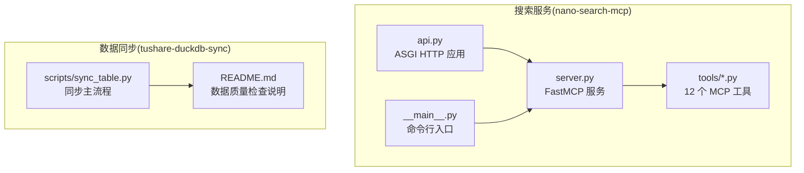
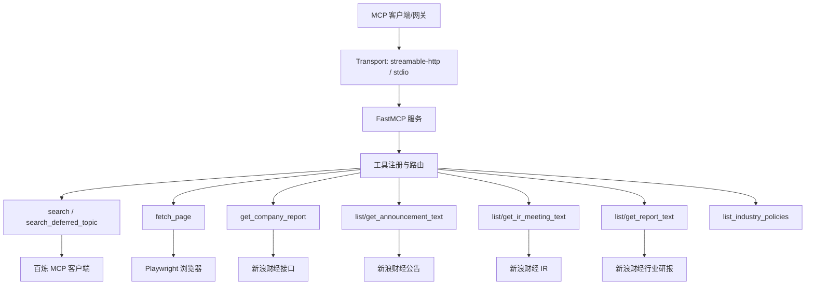
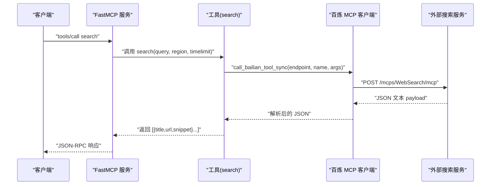
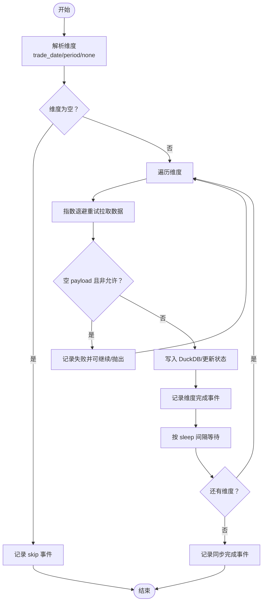
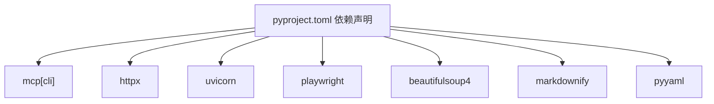

# 调试与性能分析

<cite>
**本文引用的文件**
- [README.md](file://nano-search-mcp/README.md)
- [pyproject.toml](file://nano-search-mcp/pyproject.toml)
- [__main__.py](file://nano-search-mcp/src/nano_search_mcp/__main__.py)
- [server.py](file://nano-search-mcp/src/nano_search_mcp/server.py)
- [api.py](file://nano-search-mcp/src/nano_search_mcp/api.py)
- [search.py](file://nano-search-mcp/src/nano_search_mcp/tools/search.py)
- [fetch.py](file://nano-search-mcp/src/nano_search_mcp/tools/fetch.py)
- [sina_reports.py](file://nano-search-mcp/src/nano_search_mcp/tools/sina_reports.py)
- [deferred_search.py](file://nano-search-mcp/src/nano_search_mcp/tools/deferred_search.py)
- [bailian_client.py](file://nano-search-mcp/src/nano_search_mcp/tools/bailian_client.py)
- [announcements.py](file://nano-search-mcp/src/nano_search_mcp/tools/announcements.py)
- [industry_reports.py](file://nano-search-mcp/src/nano_search_mcp/tools/industry_reports.py)
- [ir_meetings.py](file://nano-search-mcp/src/nano_search_mcp/tools/ir_meetings.py)
- [test_server.py](file://nano-search-mcp/tests/test_server.py)
- [test_fetch.py](file://nano-search-mcp/tests/test_fetch.py)
- [README.md](file://tushare-duckdb-sync/README.md)
- [sync_table.py](file://tushare-duckdb-sync/scripts/sync_table.py)
</cite>

## 目录
1. [简介](#简介)
2. [项目结构](#项目结构)
3. [核心组件](#核心组件)
4. [架构总览](#架构总览)
5. [详细组件分析](#详细组件分析)
6. [依赖分析](#依赖分析)
7. [性能考虑](#性能考虑)
8. [故障排查指南](#故障排查指南)
9. [结论](#结论)
10. [附录](#附录)

## 简介
本指南聚焦于调试与性能分析，围绕以下目标展开：
- 使用 Python 调试器、日志分析与网络请求跟踪进行系统性调试
- 针对 MCP 协议的调试方法与工具链
- 识别与优化性能瓶颈，涵盖内存使用与 CPU 监控
- 分析搜索服务与数据同步的性能问题与效率优化
- 提供具体调试案例与故障排除流程
- 生产环境调试的安全注意事项与监控配置建议
- 使用性能分析工具定位并解决问题

## 项目结构
本仓库包含两个主要模块：
- nano-search-mcp：基于 MCP 协议的搜索与抓取服务，提供 12 个工具域（通用检索、定期报告、临时公告、行业研报、监管处罚、投资者关系、行业政策等）
- tushare-duckdb-sync：Tushare → DuckDB 的数据同步工具，负责结构化数据的全量/增量同步与质量检查

图表来源
- [server.py:1-91](file://nano-search-mcp/src/nano_search_mcp/server.py#L1-L91)
- [api.py:1-12](file://nano-search-mcp/src/nano_search_mcp/api.py#L1-L12)
- [__main__.py:1-15](file://nano-search-mcp/src/nano_search_mcp/__main__.py#L1-L15)
- [sync_table.py:1-618](file://tushare-duckdb-sync/scripts/sync_table.py#L1-L618)

章节来源
- [README.md:1-198](file://nano-search-mcp/README.md#L1-L198)
- [pyproject.toml:1-44](file://nano-search-mcp/pyproject.toml#L1-L44)

## 核心组件
- MCP 服务入口与工具注册
  - 服务实例创建、指令说明、工具注册与传输参数解析
  - 参考：[server.py:1-91](file://nano-search-mcp/src/nano_search_mcp/server.py#L1-L91)
- HTTP 兼容入口与命令行入口
  - ASGI 应用与命令行启动脚本
  - 参考：[api.py:1-12](file://nano-search-mcp/src/nano_search_mcp/api.py#L1-L12)，[__main__.py:1-15](file://nano-search-mcp/src/nano_search_mcp/__main__.py#L1-L15)
- 搜索与抓取工具族
  - 百炼 WebSearch、页面抓取（Playwright）、定期报告、公告、行业研报、IR 纪要、行业政策等
  - 参考：[search.py:1-119](file://nano-search-mcp/src/nano_search_mcp/tools/search.py#L1-L119)，[fetch.py:1-245](file://nano-search-mcp/src/nano_search_mcp/tools/fetch.py#L1-L245)，[sina_reports.py:1-369](file://nano-search-mcp/src/nano_search_mcp/tools/sina_reports.py#L1-L369)，[announcements.py:1-535](file://nano-search-mcp/src/nano_search_mcp/tools/announcements.py#L1-L535)，[industry_reports.py:1-495](file://nano-search-mcp/src/nano_search_mcp/tools/industry_reports.py#L1-L495)，[ir_meetings.py:1-618](file://nano-search-mcp/src/nano_search_mcp/tools/ir_meetings.py#L1-L618)，[deferred_search.py:1-238](file://nano-search-mcp/src/nano_search_mcp/tools/deferred_search.py#L1-L238)
- 百炼 MCP 客户端
  - HTTP 调用封装、认证头、超时控制、错误解析
  - 参考：[bailian_client.py:1-93](file://nano-search-mcp/src/nano_search_mcp/tools/bailian_client.py#L1-L93)
- 数据同步与质量
  - Tushare → DuckDB 同步、断点续传、安全截止窗口、日志事件、质量检查
  - 参考：[README.md:1-173](file://tushare-duckdb-sync/README.md#L1-L173)，[sync_table.py:1-618](file://tushare-duckdb-sync/scripts/sync_table.py#L1-L618)

章节来源
- [server.py:1-91](file://nano-search-mcp/src/nano_search_mcp/server.py#L1-L91)
- [api.py:1-12](file://nano-search-mcp/src/nano_search_mcp/api.py#L1-L12)
- [__main__.py:1-15](file://nano-search-mcp/src/nano_search_mcp/__main__.py#L1-L15)
- [search.py:1-119](file://nano-search-mcp/src/nano_search_mcp/tools/search.py#L1-L119)
- [fetch.py:1-245](file://nano-search-mcp/src/nano_search_mcp/tools/fetch.py#L1-L245)
- [sina_reports.py:1-369](file://nano-search-mcp/src/nano_search_mcp/tools/sina_reports.py#L1-L369)
- [announcements.py:1-535](file://nano-search-mcp/src/nano_search_mcp/tools/announcements.py#L1-L535)
- [industry_reports.py:1-495](file://nano-search-mcp/src/nano_search_mcp/tools/industry_reports.py#L1-L495)
- [ir_meetings.py:1-618](file://nano-search-mcp/src/nano_search_mcp/tools/ir_meetings.py#L1-L618)
- [deferred_search.py:1-238](file://nano-search-mcp/src/nano_search_mcp/tools/deferred_search.py#L1-L238)
- [bailian_client.py:1-93](file://nano-search-mcp/src/nano_search_mcp/tools/bailian_client.py#L1-L93)
- [README.md:1-173](file://tushare-duckdb-sync/README.md#L1-L173)
- [sync_table.py:1-618](file://tushare-duckdb-sync/scripts/sync_table.py#L1-L618)

## 架构总览
MCP 服务采用 FastMCP 作为运行时，通过 streamable HTTP 或 stdio 传输方式对外提供工具。工具层分为：
- 搜索与抓取：WebSearch、fetch_page、deferred_search
- 结构化数据抓取：定期报告、公告、行业研报、IR 纪要、监管处罚、行业政策
- 安全与限流：SSRF 防护、指数退避重试、请求节流、缓存策略

图表来源
- [server.py:1-91](file://nano-search-mcp/src/nano_search_mcp/server.py#L1-L91)
- [search.py:1-119](file://nano-search-mcp/src/nano_search_mcp/tools/search.py#L1-L119)
- [deferred_search.py:1-238](file://nano-search-mcp/src/nano_search_mcp/tools/deferred_search.py#L1-L238)
- [fetch.py:1-245](file://nano-search-mcp/src/nano_search_mcp/tools/fetch.py#L1-L245)
- [sina_reports.py:1-369](file://nano-search-mcp/src/nano_search_mcp/tools/sina_reports.py#L1-L369)
- [announcements.py:1-535](file://nano-search-mcp/src/nano_search_mcp/tools/announcements.py#L1-L535)
- [industry_reports.py:1-495](file://nano-search-mcp/src/nano_search_mcp/tools/industry_reports.py#L1-L495)
- [ir_meetings.py:1-618](file://nano-search-mcp/src/nano_search_mcp/tools/ir_meetings.py#L1-L618)
- [bailian_client.py:1-93](file://nano-search-mcp/src/nano_search_mcp/tools/bailian_client.py#L1-L93)

## 详细组件分析

### 搜索与抓取工具链调试
- 百炼 WebSearch
  - 调用路径：search → _search_via_bailian → call_bailian_tool_sync → BailianMCPError/解析
  - 关键调试点：环境变量 DASHSCOPE_API_KEY、BAILIAN_WEBSEARCH_ENDPOINT、超时 BAILIAN_MCP_TIMEOUT
  - 参考：[search.py:1-119](file://nano-search-mcp/src/nano_search_mcp/tools/search.py#L1-L119)，[bailian_client.py:1-93](file://nano-search-mcp/src/nano_search_mcp/tools/bailian_client.py#L1-L93)
- 页面抓取（Playwright）
  - 调用路径：fetch_page → fetch_page_async → _ensure_safe_url → _fetch_with_playwright → _clean_html → 截断
  - 关键调试点：SSRF 白名单、浏览器复用、渲染等待、内容截断
  - 参考：[fetch.py:1-245](file://nano-search-mcp/src/nano_search_mcp/tools/fetch.py#L1-L245)
- 定期报告（新浪财经）
  - 调用路径：get_company_report → fetch_report_listing → fetch_report_content → _extract_detail_text
  - 关键调试点：stockid 校验、URL 模板、GBK 解码、指数退避、标题筛选
  - 参考：[sina_reports.py:1-369](file://nano-search-mcp/src/nano_search_mcp/tools/sina_reports.py#L1-L369)
- 公告、行业研报、IR 纪要
  - 调用路径：list_announcements → fetch_announcement_list → _parse_announcement_list → 缓存
  - 调用路径：list_industry_reports → fetch_industry_report_list → _parse_report_list → 缓存
  - 调用路径：list_ir_meetings → fetch_ir_meeting_list → _parse_ir_list → 参会机构抽取
  - 关键调试点：域名白名单、请求节流、缓存 TTL、日期过滤、早停策略
  - 参考：[announcements.py:1-535](file://nano-search-mcp/src/nano_search_mcp/tools/announcements.py#L1-L535)，[industry_reports.py:1-495](file://nano-search-mcp/src/nano_search_mcp/tools/industry_reports.py#L1-L495)，[ir_meetings.py:1-618](file://nano-search-mcp/src/nano_search_mcp/tools/ir_meetings.py#L1-L618)
- 延迟搜索（deferred_search）
  - 调用路径：search_deferred_topic → 加载 deferred-tasks.md → 模板渲染 → 百炼搜索 → 指数退避
  - 关键调试点：模板路径、YAML 解析、重试与错误返回
  - 参考：[deferred_search.py:1-238](file://nano-search-mcp/src/nano_search_mcp/tools/deferred_search.py#L1-L238)

图表来源
- [search.py:1-119](file://nano-search-mcp/src/nano_search_mcp/tools/search.py#L1-L119)
- [bailian_client.py:1-93](file://nano-search-mcp/src/nano_search_mcp/tools/bailian_client.py#L1-L93)

章节来源
- [search.py:1-119](file://nano-search-mcp/src/nano_search_mcp/tools/search.py#L1-L119)
- [fetch.py:1-245](file://nano-search-mcp/src/nano_search_mcp/tools/fetch.py#L1-L245)
- [sina_reports.py:1-369](file://nano-search-mcp/src/nano_search_mcp/tools/sina_reports.py#L1-L369)
- [announcements.py:1-535](file://nano-search-mcp/src/nano_search_mcp/tools/announcements.py#L1-L535)
- [industry_reports.py:1-495](file://nano-search-mcp/src/nano_search_mcp/tools/industry_reports.py#L1-L495)
- [ir_meetings.py:1-618](file://nano-search-mcp/src/nano_search_mcp/tools/ir_meetings.py#L1-L618)
- [deferred_search.py:1-238](file://nano-search-mcp/src/nano_search_mcp/tools/deferred_search.py#L1-L238)
- [bailian_client.py:1-93](file://nano-search-mcp/src/nano_search_mcp/tools/bailian_client.py#L1-L93)

### 数据同步性能分析
- 同步主流程
  - 维度解析（none/trade_date/period）、安全截止窗口、断点续传、空 payload 保护、重试与退避
  - 参考：[sync_table.py:221-288](file://tushare-duckdb-sync/scripts/sync_table.py#L221-L288)，[sync_table.py:294-338](file://tushare-duckdb-sync/scripts/sync_table.py#L294-L338)，[sync_table.py:451-518](file://tushare-duckdb-sync/scripts/sync_table.py#L451-L518)
- 日志事件
  - 启动、维度完成、同步完成、跳过等事件，便于性能观测与问题定位
  - 参考：[sync_table.py:98-99](file://tushare-duckdb-sync/scripts/sync_table.py#L98-L99)，[sync_table.py:495-498](file://tushare-duckdb-sync/scripts/sync_table.py#L495-L498)，[sync_table.py:511-517](file://tushare-duckdb-sync/scripts/sync_table.py#L511-L517)

图表来源
- [sync_table.py:265-288](file://tushare-duckdb-sync/scripts/sync_table.py#L265-L288)
- [sync_table.py:294-338](file://tushare-duckdb-sync/scripts/sync_table.py#L294-L338)
- [sync_table.py:451-518](file://tushare-duckdb-sync/scripts/sync_table.py#L451-L518)

章节来源
- [sync_table.py:1-618](file://tushare-duckdb-sync/scripts/sync_table.py#L1-L618)
- [README.md:1-173](file://tushare-duckdb-sync/README.md#L1-L173)

## 依赖分析
- MCP 服务依赖
  - mcp[cli]、httpx、uvicorn、playwright、beautifulsoup4、markdownify、pyyaml
  - 参考：[pyproject.toml:1-44](file://nano-search-mcp/pyproject.toml#L1-L44)
- 工具层依赖
  - BeautifulSoup、markdownify 用于 HTML 清洗与 Markdown 转换
  - httpx 用于百炼 MCP 调用
  - Playwright 用于 fetch_page 的页面渲染
  - 参考：[fetch.py:1-245](file://nano-search-mcp/src/nano_search_mcp/tools/fetch.py#L1-L245)，[bailian_client.py:1-93](file://nano-search-mcp/src/nano_search_mcp/tools/bailian_client.py#L1-L93)

图表来源
- [pyproject.toml:1-44](file://nano-search-mcp/pyproject.toml#L1-L44)

章节来源
- [pyproject.toml:1-44](file://nano-search-mcp/pyproject.toml#L1-L44)

## 性能考虑
- 搜索与抓取
  - 百炼 WebSearch：超时可配置，建议在高延迟网络下适当提高 BAILIAN_MCP_TIMEOUT；注意限频与重试策略
  - Playwright：浏览器复用降低冷启动开销；渲染等待时间影响整体时延；内容截断避免超长正文导致内存压力
  - 定期报告：GBK 解码与正则筛选；列表页与详情页缓存减少重复抓取
  - 公告/研报/IR：请求节流与缓存 TTL 控制；早停策略减少无效翻页
- 数据同步
  - 断点续传与失败追踪：table_sync_state 记录维度同步状态，支持重试与定位失败原因
  - 安全截止窗口：交易日维度默认只同步到上一个开放交易日，避免空 payload 误判
  - 日志事件：结构化事件日志便于性能观测与问题定位
- 内存与 CPU
  - HTML 解析与正则匹配：注意正则复杂度与大规模文本处理；缓存与截断有助于控制内存峰值
  - 并发与限流：Playwright 浏览器实例复用；HTTP 请求节流与指数退避避免触发目标站点限流

章节来源
- [bailian_client.py:1-93](file://nano-search-mcp/src/nano_search_mcp/tools/bailian_client.py#L1-L93)
- [fetch.py:1-245](file://nano-search-mcp/src/nano_search_mcp/tools/fetch.py#L1-L245)
- [sina_reports.py:1-369](file://nano-search-mcp/src/nano_search_mcp/tools/sina_reports.py#L1-L369)
- [announcements.py:1-535](file://nano-search-mcp/src/nano_search_mcp/tools/announcements.py#L1-L535)
- [industry_reports.py:1-495](file://nano-search-mcp/src/nano_search_mcp/tools/industry_reports.py#L1-L495)
- [ir_meetings.py:1-618](file://nano-search-mcp/src/nano_search_mcp/tools/ir_meetings.py#L1-L618)
- [sync_table.py:1-618](file://tushare-duckdb-sync/scripts/sync_table.py#L1-L618)

## 故障排查指南
- MCP 服务启动与传输
  - streamable-http 默认监听 /mcp；stdio 适合本地直连
  - 参考：[server.py:72-87](file://nano-search-mcp/src/nano_search_mcp/server.py#L72-L87)，[api.py:1-12](file://nano-search-mcp/src/nano_search_mcp/api.py#L1-L12)，[__main__.py:1-15](file://nano-search-mcp/src/nano_search_mcp/__main__.py#L1-L15)
- 工具注册契约
  - 确保所有承诺的工具均已注册，避免遗漏
  - 参考：[test_server.py:49-84](file://nano-search-mcp/tests/test_server.py#L49-L84)
- SSRF 防护与 URL 校验
  - fetch_page 对 URL 协议与目标地址进行严格校验；拒绝 loopback/私网/元数据等
  - 参考：[test_fetch.py:1-98](file://nano-search-mcp/tests/test_fetch.py#L1-L98)，[fetch.py:24-75](file://nano-search-mcp/src/nano_search_mcp/tools/fetch.py#L24-L75)
- 百炼 MCP 调用失败
  - 检查 DASHSCOPE_API_KEY、endpoint、超时设置；查看返回的 error 字段
  - 参考：[bailian_client.py:1-93](file://nano-search-mcp/src/nano_search_mcp/tools/bailian_client.py#L1-L93)
- 定期报告抓取失败
  - stockid 校验、年份与报告类型解析、标题筛选、详情页抓取异常
  - 参考：[sina_reports.py:78-154](file://nano-search-mcp/src/nano_search_mcp/tools/sina_reports.py#L78-L154)
- 公告/研报/IR 列表抓取异常
  - 域名白名单、请求节流、缓存命中、早停条件
  - 参考：[announcements.py:146-179](file://nano-search-mcp/src/nano_search_mcp/tools/announcements.py#L146-L179)，[industry_reports.py:129-159](file://nano-search-mcp/src/nano_search_mcp/tools/industry_reports.py#L129-L159)，[ir_meetings.py:201-231](file://nano-search-mcp/src/nano_search_mcp/tools/ir_meetings.py#L201-L231)
- 数据同步失败
  - 检查 TUSHARE_TOKEN、维度解析、安全截止窗口、空 payload 保护、断点续传
  - 参考：[sync_table.py:67-80](file://tushare-duckdb-sync/scripts/sync_table.py#L67-L80)，[sync_table.py:234-263](file://tushare-duckdb-sync/scripts/sync_table.py#L234-L263)，[sync_table.py:322-338](file://tushare-duckdb-sync/scripts/sync_table.py#L322-L338)，[README.md:1-173](file://tushare-duckdb-sync/README.md#L1-L173)

章节来源
- [server.py:72-87](file://nano-search-mcp/src/nano_search_mcp/server.py#L72-L87)
- [api.py:1-12](file://nano-search-mcp/src/nano_search_mcp/api.py#L1-L12)
- [__main__.py:1-15](file://nano-search-mcp/src/nano_search_mcp/__main__.py#L1-L15)
- [test_server.py:49-84](file://nano-search-mcp/tests/test_server.py#L49-L84)
- [test_fetch.py:1-98](file://nano-search-mcp/tests/test_fetch.py#L1-L98)
- [bailian_client.py:1-93](file://nano-search-mcp/src/nano_search_mcp/tools/bailian_client.py#L1-L93)
- [sina_reports.py:78-154](file://nano-search-mcp/src/nano_search_mcp/tools/sina_reports.py#L78-L154)
- [announcements.py:146-179](file://nano-search-mcp/src/nano_search_mcp/tools/announcements.py#L146-L179)
- [industry_reports.py:129-159](file://nano-search-mcp/src/nano_search_mcp/tools/industry_reports.py#L129-L159)
- [ir_meetings.py:201-231](file://nano-search-mcp/src/nano_search_mcp/tools/ir_meetings.py#L201-L231)
- [sync_table.py:67-80](file://tushare-duckdb-sync/scripts/sync_table.py#L67-L80)
- [sync_table.py:234-263](file://tushare-duckdb-sync/scripts/sync_table.py#L234-L263)
- [sync_table.py:322-338](file://tushare-duckdb-sync/scripts/sync_table.py#L322-L338)
- [README.md:1-173](file://tushare-duckdb-sync/README.md#L1-L173)

## 结论
- 调试方面：利用日志、单元测试、结构化事件日志与工具契约，快速定位问题；重点关注 SSRF 防护、限流与重试、缓存策略与超时配置
- 性能方面：通过浏览器复用、指数退避、请求节流、缓存与截断等手段优化端到端时延与资源占用；在数据同步中利用断点续传与安全截止窗口提升稳定性
- 生产环境：严格配置环境变量与超时参数，启用结构化日志事件，结合监控与告警机制持续观测性能与可用性

## 附录
- MCP 协议调试要点
  - 传输方式：streamable-http（默认）与 stdio（本地直连）
  - 工具契约：确保工具注册清单与文档一致
  - 错误契约：search 与 get_company_report 抛异常；其余工具返回 {source:"unavailable", error, fetch_time}
  - 参考：[server.py:55-57](file://nano-search-mcp/src/nano_search_mcp/server.py#L55-L57)，[test_server.py:49-84](file://nano-search-mcp/tests/test_server.py#L49-L84)，[README.md:47-56](file://nano-search-mcp/README.md#L47-L56)
- 生产环境安全与监控
  - 环境变量：DASHSCOPE_API_KEY、BAILIAN_WEBSEARCH_ENDPOINT、BAILIAN_MCP_TIMEOUT
  - 监控建议：记录结构化事件、观察维度完成与同步完成事件、设置告警阈值
  - 参考：[bailian_client.py:12-22](file://nano-search-mcp/src/nano_search_mcp/tools/bailian_client.py#L12-L22)，[sync_table.py:98-99](file://tushare-duckdb-sync/scripts/sync_table.py#L98-L99)，[README.md:1-173](file://tushare-duckdb-sync/README.md#L1-L173)

章节来源
- [server.py:55-57](file://nano-search-mcp/src/nano_search_mcp/server.py#L55-L57)
- [test_server.py:49-84](file://nano-search-mcp/tests/test_server.py#L49-L84)
- [README.md:47-56](file://nano-search-mcp/README.md#L47-L56)
- [bailian_client.py:12-22](file://nano-search-mcp/src/nano_search_mcp/tools/bailian_client.py#L12-L22)
- [sync_table.py:98-99](file://tushare-duckdb-sync/scripts/sync_table.py#L98-L99)
- [README.md:1-173](file://tushare-duckdb-sync/README.md#L1-L173)