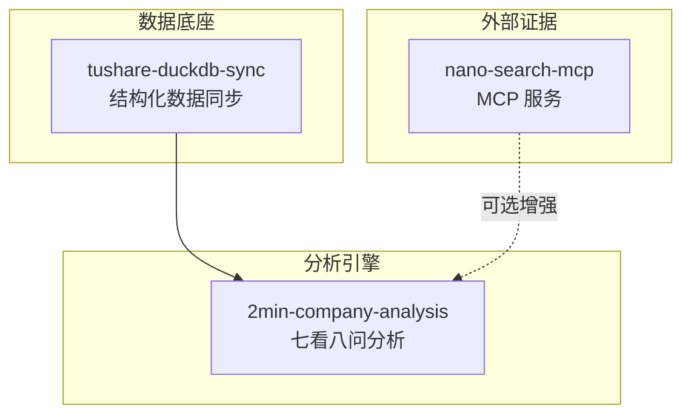
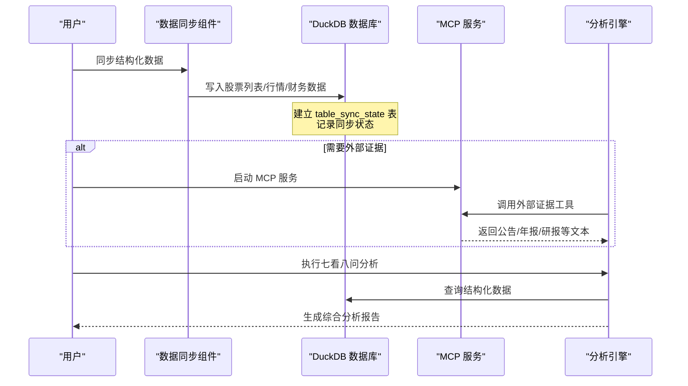
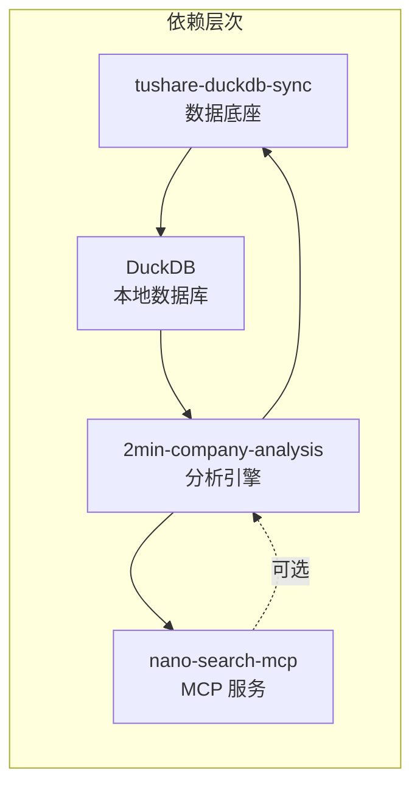

# 快速开始

<cite>
**本文引用的文件**
- [README.md](file://README.md)
- [nano-search-mcp/pyproject.toml](file://nano-search-mcp/pyproject.toml)
- [nano-search-mcp/README.md](file://nano-search-mcp/README.md)
- [nano-search-mcp/src/nano_search_mcp/server.py](file://nano-search-mcp/src/nano_search_mcp/server.py)
- [nano-search-mcp/src/nano_search_mcp/__main__.py](file://nano-search-mcp/src/nano_search_mcp/__main__.py)
- [tushare-duckdb-sync/README.md](file://tushare-duckdb-sync/README.md)
- [tushare-duckdb-sync/SKILL.md](file://tushare-duckdb-sync/SKILL.md)
- [tushare-duckdb-sync/scripts/sync_table.py](file://tushare-duckdb-sync/scripts/sync_table.py)
- [tushare-duckdb-sync/templates/task_config.json](file://tushare-duckdb-sync/templates/task_config.json)
- [2min-company-analysis/README.md](file://2min-company-analysis/README.md)
- [2min-company-analysis/ask-q3-management/SKILL.md](file://2min-company-analysis/ask-q3-management/SKILL.md)
- [2min-company-analysis/seven-look-eight-question/scripts/seven_looks_orchestrator.py](file://2min-company-analysis/seven-look-eight-question/scripts/seven_looks_orchestrator.py)
- [2min-company-analysis/seven-look-eight-question/scripts/eight_questions_orchestrator.py](file://2min-company-analysis/seven-look-eight-question/scripts/eight_questions_orchestrator.py)
- [2min-company-analysis/look-01-profit-quality/scripts/look_01_profit_quality.py](file://2min-company-analysis/look-01-profit-quality/scripts/look_01_profit_quality.py)
</cite>

## 目录
1. [简介](#简介)
2. [项目结构](#项目结构)
3. [核心组件](#核心组件)
4. [架构概览](#架构概览)
5. [详细组件分析](#详细组件分析)
6. [依赖关系分析](#依赖关系分析)
7. [性能考虑](#性能考虑)
8. [故障排除指南](#故障排除指南)
9. [结论](#结论)
10. [附录](#附录)

## 简介
本指南面向新用户，帮助您在最短时间内完成 NanoQuant Skills 项目的安装与配置，并运行完整的分析流程。项目包含三个核心子模块：
- 数据底座生产端：tushare-duckdb-sync，负责将 Tushare Pro 数据同步到本地 DuckDB
- 外部证据搜索：nano-search-mcp，基于 MCP 协议提供公告、年报、行业政策等非结构化证据
- 结构化分析：2min-company-analysis，基于 DuckDB 数据进行七看八问的财务与定性分析

## 项目结构
项目采用多模块仓库结构，各模块职责清晰、相互协作：
- tushare-duckdb-sync：提供结构化财务/行情/基本面数据的同步与质量检测
- nano-search-mcp：提供 MCP 服务，用于抓取公告、年报、行业政策等外部证据
- 2min-company-analysis：基于 DuckDB 数据执行七看（定量）与八问（定性）分析



**图表来源**
- [tushare-duckdb-sync/README.md:1-12](file://tushare-duckdb-sync/README.md#L1-L12)
- [nano-search-mcp/README.md:1-16](file://nano-search-mcp/README.md#L1-L16)
- [2min-company-analysis/README.md:1-11](file://2min-company-analysis/README.md#L1-L11)

**章节来源**
- [tushare-duckdb-sync/README.md:1-12](file://tushare-duckdb-sync/README.md#L1-L12)
- [nano-search-mcp/README.md:1-16](file://nano-search-mcp/README.md#L1-L16)
- [2min-company-analysis/README.md:1-11](file://2min-company-analysis/README.md#L1-L11)

## 核心组件
本节详细介绍三个核心组件的安装方式、配置要求与基本使用方法。

### 数据同步组件（tushare-duckdb-sync）
- 功能定位：将 Tushare Pro 数据同步到本地 DuckDB，支持全量覆盖与增量追加
- 环境要求：Python 3.8+，依赖包：tushare、duckdb、pandas、loguru
- Token 设置：通过环境变量 TUSHARE_TOKEN 传入，脚本仅读取该环境变量
- 安全规则：对交易日维度默认采用 18:00 的安全截止规则，避免把当天空 payload 误记成功

**章节来源**
- [tushare-duckdb-sync/README.md:15-46](file://tushare-duckdb-sync/README.md#L15-L46)
- [tushare-duckdb-sync/SKILL.md:90-107](file://tushare-duckdb-sync/SKILL.md#L90-L107)

### 外部证据搜索组件（nano-search-mcp）
- 功能定位：基于 MCP 协议提供 12 个工具，涵盖公告、年报、行业研报、政策、IR 等外部证据
- 环境要求：Python 3.10+，Playwright Chromium 浏览器
- 安装方式：支持可编辑安装（开发模式）与普通安装两种方式
- 启动方式：支持 streamable HTTP 与 stdio 两种传输协议

**章节来源**
- [nano-search-mcp/README.md:55-104](file://nano-search-mcp/README.md#L55-L104)
- [nano-search-mcp/pyproject.toml:1-14](file://nano-search-mcp/pyproject.toml#L1-L14)

### 分析引擎组件（2min-company-analysis）
- 功能定位：对 A 股上市公司进行结构化基本面快审，包含七看（定量）与八问（定性）
- 依赖关系：tushare-duckdb-sync 为必选；nano-search-mcp 为可选增强
- 使用路径：总编排（推荐）、单独执行某个 look、单独执行某个 ask

**章节来源**
- [2min-company-analysis/README.md:13-24](file://2min-company-analysis/README.md#L13-L24)
- [2min-company-analysis/README.md:103-132](file://2min-company-analysis/README.md#L103-L132)

## 架构概览
整个分析流程从数据同步开始，到外部证据采集，再到最终报告生成的完整闭环。



**图表来源**
- [tushare-duckdb-sync/scripts/sync_table.py:156-200](file://tushare-duckdb-sync/scripts/sync_table.py#L156-L200)
- [nano-search-mcp/src/nano_search_mcp/server.py:18-70](file://nano-search-mcp/src/nano_search_mcp/server.py#L18-L70)
- [2min-company-analysis/seven-look-eight-question/scripts/seven_looks_orchestrator.py:1-22](file://2min-company-analysis/seven-look-eight-question/scripts/seven_looks_orchestrator.py#L1-L22)

## 详细组件分析

### 数据同步组件（tushare-duckdb-sync）

#### 安装与配置
- 环境准备：确保 Python 3.8+ 环境可用
- 依赖安装：pip install tushare duckdb pandas loguru
- Token 设置：export TUSHARE_TOKEN=你的token

#### 同步模式与参数
- 全量同步（无维度表）：使用 overwrite 模式，如股票列表
- 增量同步（交易日维度）：使用 append 模式，按 trade_date 维度逐日拉取
- 按报告期同步（财务报表）：使用 period 维度，按季末报告期拉取

#### 同步状态管理
脚本在 DuckDB 内维护 table_sync_state 表，支持断点续传与失败追踪。

**章节来源**
- [tushare-duckdb-sync/README.md:15-87](file://tushare-duckdb-sync/README.md#L15-L87)
- [tushare-duckdb-sync/scripts/sync_table.py:156-200](file://tushare-duckdb-sync/scripts/sync_table.py#L156-L200)

### 外部证据搜索组件（nano-search-mcp）

#### 安装方式对比
- 可编辑模式（开发调试）：pip install -e ".[dev]"，适合需要频繁修改源码的场景
- 普通安装：pip install .，适合稳定版本使用

#### 启动与调用
- 启动 MCP Server：nano-search-mcp 或 python -m nano_search_mcp
- 传输协议：默认 streamable HTTP（监听 http://127.0.0.1:8000/mcp），也可切换到 stdio
- 工具能力：12 个 MCP 工具，涵盖公告、年报、行业研报、政策、IR 等

**章节来源**
- [nano-search-mcp/README.md:61-104](file://nano-search-mcp/README.md#L61-L104)
- [nano-search-mcp/src/nano_search_mcp/server.py:72-86](file://nano-search-mcp/src/nano_search_mcp/server.py#L72-L86)

### 分析引擎组件（2min-company-analysis）

#### 使用路径
- 总编排（推荐）：python seven_looks_orchestrator.py --stock 000002.SZ --as-of-date 2025-04-30
- 单独执行某个 look：python look_01_profit_quality/scripts/look_01_profit_quality.py --stock 000002.SZ --as-of-date 2025-04-30
- 单独执行某个 ask：python ask-q1-industry-prospect/scripts/q01_industry.py --ts-code 000002.SZ --as-of-date 2025-04-30

#### 输出约定
- 输入核心参数：股票代码、分析日期、DuckDB 路径
- 七看综合输出：质量评分（A/B/C/D）、红旗预警、维度汇总、行动建议
- 八问并入方式：作为扩展字段合并到总输出

**章节来源**
- [2min-company-analysis/README.md:58-101](file://2min-company-analysis/README.md#L58-L101)
- [2min-company-analysis/ask-q3-management/SKILL.md:35-61](file://2min-company-analysis/ask-q3-management/SKILL.md#L35-L61)

## 依赖关系分析



**图表来源**
- [tushare-duckdb-sync/README.md:5-11](file://tushare-duckdb-sync/README.md#L5-L11)
- [2min-company-analysis/README.md:103-107](file://2min-company-analysis/README.md#L103-L107)

**章节来源**
- [tushare-duckdb-sync/README.md:5-11](file://tushare-duckdb-sync/README.md#L5-L11)
- [2min-company-analysis/README.md:103-107](file://2min-company-analysis/README.md#L103-L107)

## 性能考虑
- 数据同步：合理设置 --sleep 参数避免 API 限频，使用 --sync-all 实现断点续传
- 并发执行：七看八问分析支持多线程并发，提升整体执行效率
- 缓存策略：MCP 服务具备抓取缓存能力，减少重复网络请求
- 数据质量：定期执行数据质量检查，确保分析结果的可靠性

## 故障排除指南

### 常见问题与解决方案

#### 1. Tushare Token 相关问题
- 问题：TUSHARE_TOKEN 环境变量未设置
- 解决：export TUSHARE_TOKEN=你的token 或在调用前显式加载 .env.tushare 文件

#### 2. DuckDB 连接失败
- 问题：找不到 DuckDB 文件或连接超时
- 解决：确认 DuckDB 文件路径正确，检查文件权限，确保数据库文件存在

#### 3. MCP 服务启动失败
- 问题：端口占用或浏览器驱动问题
- 解决：更换端口或重新安装 Playwright，执行 playwright install chromium

#### 4. 分析结果异常
- 问题：七看八问评分与预期不符
- 解决：检查 DuckDB 数据完整性，确认外部证据采集是否正常，查看 table_sync_state 表状态

#### 5. 依赖安装问题
- 问题：pip 安装失败或版本冲突
- 解决：使用虚拟环境隔离依赖，确保 Python 版本满足要求（tushare-duckdb-sync: >=3.8，nano-search-mcp: >=3.10）

**章节来源**
- [tushare-duckdb-sync/README.md:21-46](file://tushare-duckdb-sync/README.md#L21-L46)
- [nano-search-mcp/README.md:55-76](file://nano-search-mcp/README.md#L55-L76)
- [2min-company-analysis/README.md:122-126](file://2min-company-analysis/README.md#L122-L126)

## 结论
通过本快速开始指南，您应该能够：
1. 完成三个核心组件的安装与配置
2. 成功运行数据同步流程
3. 启动 MCP 服务并进行外部证据采集
4. 执行完整的七看八问分析流程
5. 处理常见的安装与运行问题

建议按照"数据同步 → 外部证据（可选） → 分析执行"的顺序进行，以获得最佳体验。

## 附录

### 最小联动示例执行流程

#### 第一步：环境准备与依赖安装
```bash
# 创建并激活 Python 环境
conda create -n legonanobot python=3.10
conda activate legonanobot

# 安装数据同步组件依赖
pip install tushare duckdb pandas loguru

# 安装 MCP 组件（可选，如需外部证据）
pip install -e ./nano-search-mcp
playwright install chromium
```

#### 第二步：设置 Tushare Token
```bash
# 方式一：一次性提供
export TUSHARE_TOKEN=your_tushare_token_here

# 方式二：从固定位置加载
set -a
source ./.env.tushare
set +a
```

#### 第三步：执行数据同步
```bash
# 全量同步股票列表
python tushare-duckdb-sync/scripts/sync_table.py \
  --endpoint stock_basic \
  --duckdb-path ./ashare.duckdb \
  --target-table stk_info \
  --mode overwrite \
  --dimension-type none

# 增量同步日线行情（示例）
python tushare-duckdb-sync/scripts/sync_table.py \
  --endpoint daily \
  --duckdb-path ./ashare.duckdb \
  --target-table stk_daily \
  --mode append \
  --dimension-type trade_date \
  --start-date 20240101 \
  --sync-all \
  --sleep 0.3
```

#### 第四步：启动 MCP 服务（可选）
```bash
# 启动 MCP 服务
conda activate legonanobot
nano-search-mcp
```

#### 第五步：执行分析
```bash
# 总编排执行（推荐）
python 2min-company-analysis/seven-look-eight-question/scripts/seven_looks_orchestrator.py \
  --stock 000002.SZ \
  --as-of-date 2025-04-30 \
  --include-eight-questions \
  --format json

# 或单独执行某个 look
python 2min-company-analysis/look-01-profit-quality/scripts/look_01_profit_quality.py \
  --stock 000002.SZ \
  --as-of-date 2025-04-30
```

#### 预期输出结果
- 数据同步：成功写入 DuckDB 表，更新 table_sync_state 表
- 分析执行：生成 JSON/Markdown 格式的综合分析报告，包含七看评分与八问证据
- 外部证据：MCP 服务返回公告、年报、研报等文本内容（如启用）

**章节来源**
- [tushare-duckdb-sync/README.md:13-114](file://tushare-duckdb-sync/README.md#L13-L114)
- [nano-search-mcp/README.md:79-104](file://nano-search-mcp/README.md#L79-L104)
- [2min-company-analysis/README.md:60-94](file://2min-company-analysis/README.md#L60-L94)