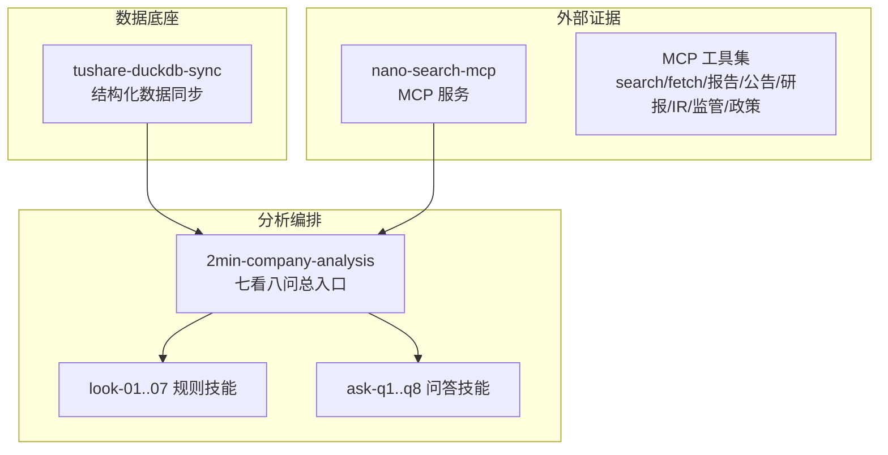
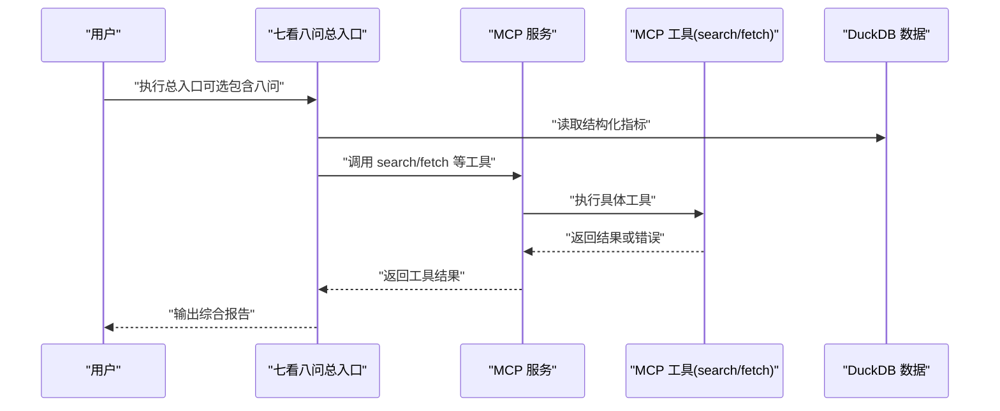
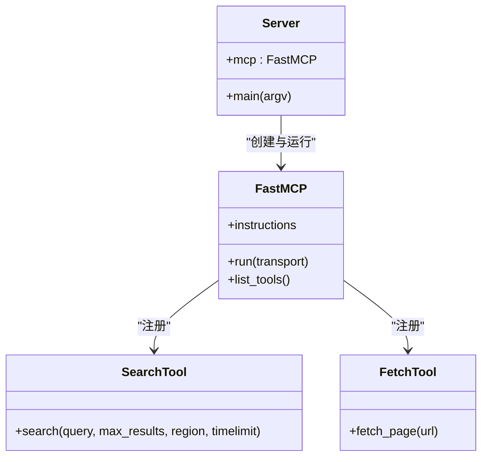
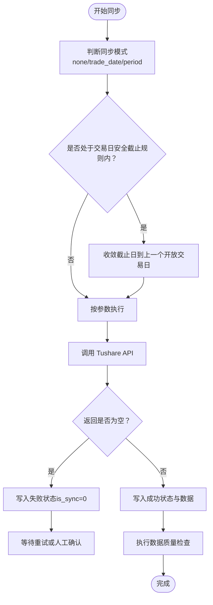
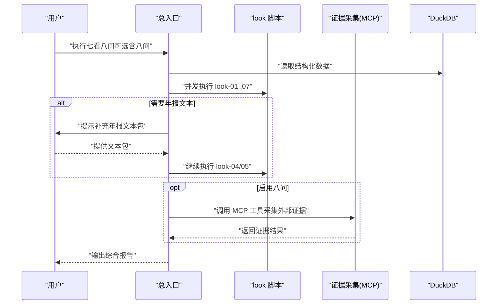
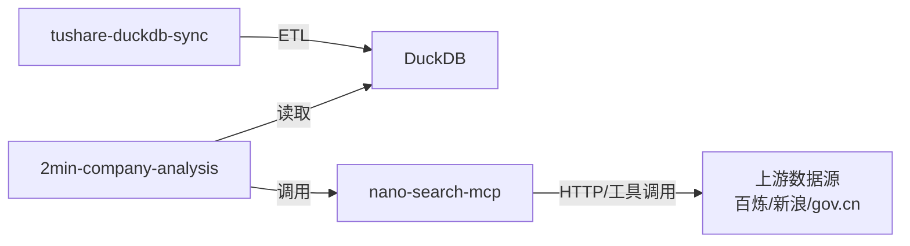

# 故障排除与常见问题

<cite>
**本文引用的文件**   
- [README.md](file://nano-search-mcp/README.md)
- [pyproject.toml](file://nano-search-mcp/pyproject.toml)
- [server.py](file://nano-search-mcp/src/nano_search_mcp/server.py)
- [search.py](file://nano-search-mcp/src/nano_search_mcp/tools/search.py)
- [fetch.py](file://nano-search-mcp/src/nano_search_mcp/tools/fetch.py)
- [test_server.py](file://nano-search-mcp/tests/test_server.py)
- [README.md](file://tushare-duckdb-sync/README.md)
- [SKILL.md](file://tushare-duckdb-sync/SKILL.md)
- [sync_table.py](file://tushare-duckdb-sync/scripts/sync_table.py)
- [check_quality.py](file://tushare-duckdb-sync/scripts/check_quality.py)
- [README.md](file://2min-company-analysis/README.md)
- [SKILL.md](file://2min-company-analysis/seven-look-eight-question/SKILL.md)
- [seven_looks_orchestrator.py](file://2min-company-analysis/seven-look-eight-question/scripts/seven_looks_orchestrator.py)
</cite>

## 目录
1. [简介](#简介)
2. [项目结构](#项目结构)
3. [核心组件](#核心组件)
4. [架构总览](#架构总览)
5. [详细组件分析](#详细组件分析)
6. [依赖分析](#依赖分析)
7. [性能考虑](#性能考虑)
8. [故障排除指南](#故障排除指南)
9. [结论](#结论)
10. [附录](#附录)

## 简介
本指南面向 NanoQuant Skills 用户，聚焦安装、配置与使用过程中的常见问题与系统化排障流程。内容涵盖：
- 网络连接问题与 API 限制
- 数据同步失败与断点续传
- MCP 服务启动与工具调用异常
- 外部证据采集（抓取/搜索）失败
- 性能瓶颈与优化建议
- 日志分析与错误信息解读
- 社区支持与问题反馈流程

目标是帮助用户自助解决大多数问题，降低技术支持负担。

## 项目结构
本仓库采用多模块协作的单仓（mono-repo）结构：
- 数据底座：tushare-duckdb-sync（结构化数据同步）
- 外部证据采集：nano-search-mcp（MCP 服务，提供搜索与抓取工具）
- 分析编排：2min-company-analysis（七看八问总入口与规则技能）

**图表来源**
- [README.md:1-132](file://2min-company-analysis/README.md#L1-L132)
- [README.md:1-198](file://nano-search-mcp/README.md#L1-L198)
- [SKILL.md:1-449](file://tushare-duckdb-sync/SKILL.md#L1-L449)

**章节来源**
- [README.md:1-132](file://2min-company-analysis/README.md#L1-L132)
- [README.md:1-198](file://nano-search-mcp/README.md#L1-L198)
- [SKILL.md:1-449](file://tushare-duckdb-sync/SKILL.md#L1-L449)

## 核心组件
- MCP 服务与工具
  - 服务入口与指令说明：[server.py:1-91](file://nano-search-mcp/src/nano_search_mcp/server.py#L1-L91)
  - 搜索工具实现：[search.py:1-119](file://nano-search-mcp/src/nano_search_mcp/tools/search.py#L1-L119)
  - 页面抓取工具（Playwright + SSRF 防护）：[fetch.py:1-245](file://nano-search-mcp/src/nano_search_mcp/tools/fetch.py#L1-L245)
  - 安装与运行说明：[README.md:61-125](file://nano-search-mcp/README.md#L61-L125)
  - 依赖与脚本入口：[pyproject.toml:1-44](file://nano-search-mcp/pyproject.toml#L1-L44)
- 数据同步与质量
  - 同步脚本与参数说明：[sync_table.py:1-200](file://tushare-duckdb-sync/scripts/sync_table.py#L1-L200)
  - 质检脚本与检查项：[check_quality.py:1-200](file://tushare-duckdb-sync/scripts/check_quality.py#L1-L200)
  - 工作流与人类在环约束：[SKILL.md:1-449](file://tushare-duckdb-sync/SKILL.md#L1-L449)
- 分析编排
  - 总入口与参数契约：[seven_looks_orchestrator.py:1-200](file://2min-company-analysis/seven-look-eight-question/scripts/seven_looks_orchestrator.py#L1-L200)
  - 总入口 SKILL 描述：[SKILL.md:1-201](file://2min-company-analysis/seven-look-eight-question/SKILL.md#L1-L201)
  - 项目 README 与使用路径：[README.md:1-132](file://2min-company-analysis/README.md#L1-L132)

**章节来源**
- [server.py:1-91](file://nano-search-mcp/src/nano_search_mcp/server.py#L1-L91)
- [search.py:1-119](file://nano-search-mcp/src/nano_search_mcp/tools/search.py#L1-L119)
- [fetch.py:1-245](file://nano-search-mcp/src/nano_search_mcp/tools/fetch.py#L1-L245)
- [pyproject.toml:1-44](file://nano-search-mcp/pyproject.toml#L1-L44)
- [README.md:61-125](file://nano-search-mcp/README.md#L61-L125)
- [sync_table.py:1-200](file://tushare-duckdb-sync/scripts/sync_table.py#L1-L200)
- [check_quality.py:1-200](file://tushare-duckdb-sync/scripts/check_quality.py#L1-L200)
- [SKILL.md:1-449](file://tushare-duckdb-sync/SKILL.md#L1-L449)
- [seven_looks_orchestrator.py:1-200](file://2min-company-analysis/seven-look-eight-question/scripts/seven_looks_orchestrator.py#L1-L200)
- [SKILL.md:1-201](file://2min-company-analysis/seven-look-eight-question/SKILL.md#L1-L201)
- [README.md:1-132](file://2min-company-analysis/README.md#L1-L132)

## 架构总览
MCP 服务作为外部证据采集的统一入口，提供搜索与抓取能力；2min-company-analysis 通过 MCP 工具与 DuckDB 数据进行联合分析。

**图表来源**
- [server.py:1-91](file://nano-search-mcp/src/nano_search_mcp/server.py#L1-L91)
- [seven_looks_orchestrator.py:1-200](file://2min-company-analysis/seven-look-eight-question/scripts/seven_looks_orchestrator.py#L1-L200)
- [README.md:103-132](file://2min-company-analysis/README.md#L103-L132)

## 详细组件分析

### MCP 服务与工具
- 服务注册与工具清单
  - 已注册工具集合与契约校验：[test_server.py:49-84](file://nano-search-mcp/tests/test_server.py#L49-L84)
  - 服务指令与工具说明：[server.py:18-70](file://nano-search-mcp/src/nano_search_mcp/server.py#L18-L70)
- 搜索工具
  - 功能：基于百炼 WebSearch 的网页搜索，返回标题/URL/摘要列表；支持区域与时效过滤参数的降级拼接。[search.py:79-119](file://nano-search-mcp/src/nano_search_mcp/tools/search.py#L79-L119)
- 页面抓取工具
  - 功能：Playwright 渲染 + HTML 清洗 + Markdown 导出；内置 SSRF 防护（协议白名单、内网/回环/私网/保留地址拦截）。[fetch.py:1-245](file://nano-search-mcp/src/nano_search_mcp/tools/fetch.py#L1-L245)
- 安全与错误契约
  - 除特定工具外，其余工具失败时返回统一字典结构，不抛异常。[README.md:47-48](file://nano-search-mcp/README.md#L47-L48)
- 启动与传输
  - 支持 streamable HTTP 与 stdio 两种传输；默认 streamable HTTP。[server.py:72-87](file://nano-search-mcp/src/nano_search_mcp/server.py#L72-L87)；[README.md:79-103](file://nano-search-mcp/README.md#L79-L103)

**图表来源**
- [server.py:1-91](file://nano-search-mcp/src/nano_search_mcp/server.py#L1-L91)
- [search.py:79-119](file://nano-search-mcp/src/nano_search_mcp/tools/search.py#L79-L119)
- [fetch.py:220-245](file://nano-search-mcp/src/nano_search_mcp/tools/fetch.py#L220-L245)

**章节来源**
- [test_server.py:49-84](file://nano-search-mcp/tests/test_server.py#L49-L84)
- [server.py:18-87](file://nano-search-mcp/src/nano_search_mcp/server.py#L18-L87)
- [search.py:79-119](file://nano-search-mcp/src/nano_search_mcp/tools/search.py#L79-L119)
- [fetch.py:1-245](file://nano-search-mcp/src/nano_search_mcp/tools/fetch.py#L1-L245)
- [README.md:47-48](file://nano-search-mcp/README.md#L47-L48)

### 数据同步与质量（tushare-duckdb-sync）
- 同步模式
  - 三种维度：none/trade_date/period；支持断点续传与失败追踪。[SKILL.md:162-169](file://tushare-duckdb-sync/SKILL.md#L162-L169)
  - 交易日安全截止规则：默认以 18:00 为发布截止，18:00 前自动收敛到上一个开放交易日。[SKILL.md:182-187](file://tushare-duckdb-sync/SKILL.md#L182-L187)
- 同步状态与映射注册
  - 维护 table_sync_state 表，记录维度值同步状态；映射注册表用于跨会话沉淀本地知识。[SKILL.md:253-277](file://tushare-duckdb-sync/SKILL.md#L253-L277)
- 质检检查项
  - 行数、PK 唯一性/非空、日期范围、NaN 字符串污染、度量列空值率等。[check_quality.py:58-174](file://tushare-duckdb-sync/scripts/check_quality.py#L58-L174)
- 常见错误与处理
  - 网络超时：内置重试；失败后单独重跑该表。[SKILL.md:246-252](file://tushare-duckdb-sync/SKILL.md#L246-L252)
  - API 限频：调整 --sleep（默认 0.3s）。[SKILL.md](file://tushare-duckdb-sync/SKILL.md#L248)
  - 字段不匹配：自动丢弃目标表不存在的列并在文档中标注差异。[SKILL.md](file://tushare-duckdb-sync/SKILL.md#L249)
  - 空 payload：增量维度默认记失败，避免误将“上游未发布”记为成功。[SKILL.md](file://tushare-duckdb-sync/SKILL.md#L251)

**图表来源**
- [SKILL.md:182-187](file://tushare-duckdb-sync/SKILL.md#L182-L187)
- [SKILL.md:246-252](file://tushare-duckdb-sync/SKILL.md#L246-L252)
- [check_quality.py:58-174](file://tushare-duckdb-sync/scripts/check_quality.py#L58-L174)

**章节来源**
- [SKILL.md:162-187](file://tushare-duckdb-sync/SKILL.md#L162-L187)
- [SKILL.md:246-252](file://tushare-duckdb-sync/SKILL.md#L246-L252)
- [check_quality.py:58-174](file://tushare-duckdb-sync/scripts/check_quality.py#L58-L174)

### 分析编排（2min-company-analysis）
- 总入口职责
  - 一键执行 look-01..07；可选接入八问；输出统一 JSON/Markdown 报告。[SKILL.md:8-16](file://2min-company-analysis/seven-look-eight-question/SKILL.md#L8-L16)
- 人类在环（human-in-loop）工作流
  - look-04/05 依赖年报文本，未提供时报错并提示补充。[SKILL.md:162-179](file://2min-company-analysis/seven-look-eight-question/SKILL.md#L162-L179)
- 并发与输出契约
  - 并发调度 ask-q1..q8；输出包含 results/raw_results/critical_gaps 等字段。[SKILL.md:74-116](file://2min-company-analysis/seven-look-eight-question/SKILL.md#L74-L116)

**图表来源**
- [SKILL.md:58-73](file://2min-company-analysis/seven-look-eight-question/SKILL.md#L58-L73)
- [SKILL.md:162-179](file://2min-company-analysis/seven-look-eight-question/SKILL.md#L162-L179)
- [seven_looks_orchestrator.py:1-200](file://2min-company-analysis/seven-look-eight-question/scripts/seven_looks_orchestrator.py#L1-L200)

**章节来源**
- [SKILL.md:8-16](file://2min-company-analysis/seven-look-eight-question/SKILL.md#L8-L16)
- [SKILL.md:162-179](file://2min-company-analysis/seven-look-eight-question/SKILL.md#L162-L179)
- [seven_looks_orchestrator.py:1-200](file://2min-company-analysis/seven-look-eight-question/scripts/seven_looks_orchestrator.py#L1-L200)

## 依赖分析
- MCP 服务依赖
  - 核心依赖：mcp、httpx、playwright、beautifulsoup4、markdownify 等。[pyproject.toml:6-14](file://nano-search-mcp/pyproject.toml#L6-L14)
  - 可选 dev 依赖：pytest。[pyproject.toml:16-19](file://nano-search-mcp/pyproject.toml#L16-L19)
- 数据同步依赖
  - 依赖：tushare、duckdb、pandas、loguru。[README.md:17-19](file://tushare-duckdb-sync/README.md#L17-L19)
- 项目耦合
  - 2min-company-analysis 依赖 DuckDB 数据与可选的 MCP 服务；MCP 服务与上游数据源（百炼、新浪、政府网站等）交互。

**图表来源**
- [pyproject.toml:6-14](file://nano-search-mcp/pyproject.toml#L6-L14)
- [README.md:17-19](file://tushare-duckdb-sync/README.md#L17-L19)
- [README.md:103-115](file://2min-company-analysis/README.md#L103-L115)

**章节来源**
- [pyproject.toml:6-19](file://nano-search-mcp/pyproject.toml#L6-L19)
- [README.md:17-19](file://tushare-duckdb-sync/README.md#L17-L19)
- [README.md:103-115](file://2min-company-analysis/README.md#L103-L115)

## 性能考虑
- MCP 抓取性能
  - Playwright 无头浏览器复用：降低冷启动开销。[fetch.py:133-143](file://nano-search-mcp/src/nano_search_mcp/tools/fetch.py#L133-L143)
  - 页面等待与内容截断：渲染后等待固定时间，正文最大字符数限制，避免内存与网络压力过大。[fetch.py:77-118](file://nano-search-mcp/src/nano_search_mcp/tools/fetch.py#L77-L118)
- 数据同步性能
  - 限频控制：--sleep 控制调用间隔；--max-retries 控制失败重试次数。[SKILL.md:147-149](file://tushare-duckdb-sync/SKILL.md#L147-L149)
  - 断点续传：--sync-all 跳过已同步维度，提高整体吞吐。[SKILL.md:72-73](file://tushare-duckdb-sync/SKILL.md#L72-L73)
- 并发与资源
  - 七看总入口并发执行多个 look 脚本，注意 CPU/IO 资源占用。[seven_looks_orchestrator.py:1-200](file://2min-company-analysis/seven-look-eight-question/scripts/seven_looks_orchestrator.py#L1-L200)

**章节来源**
- [fetch.py:77-143](file://nano-search-mcp/src/nano_search_mcp/tools/fetch.py#L77-L143)
- [SKILL.md:147-149](file://tushare-duckdb-sync/SKILL.md#L147-L149)
- [seven_looks_orchestrator.py:1-200](file://2min-company-analysis/seven-look-eight-question/scripts/seven_looks_orchestrator.py#L1-L200)

## 故障排除指南

### 一、安装与环境问题
- 症状
  - 安装失败或依赖缺失
- 排查步骤
  - 确认 Python 3.10+ 与 conda 环境激活。[README.md:55-59](file://nano-search-mcp/README.md#L55-L59)
  - 安装开发依赖与 Playwright 浏览器：[README.md:61-76](file://nano-search-mcp/README.md#L61-L76)
  - 安装 tushare-duckdb-sync 依赖：[README.md:17-19](file://tushare-duckdb-sync/README.md#L17-L19)
- 解决方案
  - 使用提供的 pip 安装命令；如需 stdio 传输，使用 --transport stdio。[README.md:79-103](file://nano-search-mcp/README.md#L79-L103)

**章节来源**
- [README.md:55-76](file://nano-search-mcp/README.md#L55-L76)
- [README.md:79-103](file://nano-search-mcp/README.md#L79-L103)
- [README.md:17-19](file://tushare-duckdb-sync/README.md#L17-L19)

### 二、MCP 服务启动与工具调用
- 症状
  - 服务无法启动或工具不可用
- 排查步骤
  - 确认服务已注册全部工具：[test_server.py:49-84](file://nano-search-mcp/tests/test_server.py#L49-L84)
  - 检查传输参数：默认 streamable HTTP，本地直连可用 stdio。[server.py:72-87](file://nano-search-mcp/src/nano_search_mcp/server.py#L72-L87)
- 解决方案
  - 使用命令行启动服务：[README.md:81-103](file://nano-search-mcp/README.md#L81-L103)
  - 如需 stdio，添加 --transport stdio。[README.md:90-103](file://nano-search-mcp/README.md#L90-L103)

**章节来源**
- [test_server.py:49-84](file://nano-search-mcp/tests/test_server.py#L49-L84)
- [server.py:72-87](file://nano-search-mcp/src/nano_search_mcp/server.py#L72-L87)
- [README.md:81-103](file://nano-search-mcp/README.md#L81-L103)

### 三、网络连接与 API 限制
- 症状
  - 搜索/抓取超时、百炼/新浪/gov.cn 访问失败
- 排查步骤
  - 检查网络连通性与代理设置；确认 DNS 解析正常。[fetch.py:46-56](file://nano-search-mcp/src/nano_search_mcp/tools/fetch.py#L46-L56)
  - 检查上游 API 限频与配额；适当增加 --sleep。[SKILL.md](file://tushare-duckdb-sync/SKILL.md#L248)
- 解决方案
  - 增加 --sleep；必要时降低 --max-results 或调整 timelimit。[search.py:112-118](file://nano-search-mcp/src/nano_search_mcp/tools/search.py#L112-L118)
  - 对于 gov.cn 政策检索，确认 DASHSCOPE_API_KEY 已设置。[README.md:116-121](file://2min-company-analysis/README.md#L116-L121)

**章节来源**
- [fetch.py:46-56](file://nano-search-mcp/src/nano_search_mcp/tools/fetch.py#L46-L56)
- [SKILL.md](file://tushare-duckdb-sync/SKILL.md#L248)
- [search.py:112-118](file://nano-search-mcp/src/nano_search_mcp/tools/search.py#L112-L118)
- [README.md:116-121](file://2min-company-analysis/README.md#L116-L121)

### 四、数据同步失败与断点续传
- 症状
  - 同步中断、重复维度、空 payload
- 排查步骤
  - 查看 table_sync_state 表记录，定位失败维度。[SKILL.md:253-277](file://tushare-duckdb-sync/SKILL.md#L253-L277)
  - 检查是否处于交易日安全截止规则内，确认 end_date 是否收敛到上一个开放交易日。[SKILL.md:182-187](file://tushare-duckdb-sync/SKILL.md#L182-L187)
- 解决方案
  - 使用 --sync-all 启用断点续传；失败维度单独重试。[SKILL.md:72-73](file://tushare-duckdb-sync/SKILL.md#L72-L73)
  - 对空 payload，确认是否需要显式允许（仅在业务语义允许时）。[SKILL.md](file://tushare-duckdb-sync/SKILL.md#L251)

**章节来源**
- [SKILL.md:182-187](file://tushare-duckdb-sync/SKILL.md#L182-L187)
- [SKILL.md:253-277](file://tushare-duckdb-sync/SKILL.md#L253-L277)
- [SKILL.md:72-73](file://tushare-duckdb-sync/SKILL.md#L72-L73)
- [SKILL.md](file://tushare-duckdb-sync/SKILL.md#L251)

### 五、外部证据采集失败（抓取/搜索）
- 症状
  - fetch_page 返回 blocked 或 error；search 返回空列表
- 排查步骤
  - SSRF 防护：确认 URL 为 http/https，且不在禁止列表内。[fetch.py:24-74](file://nano-search-mcp/src/nano_search_mcp/tools/fetch.py#L24-L74)
  - 检查 Playwright 渲染超时与内容截断阈值。[fetch.py:77-118](file://nano-search-mcp/src/nano_search_mcp/tools/fetch.py#L77-L118)
- 解决方案
  - 使用更稳定的 URL；必要时缩短内容长度或调整等待时间。[fetch.py:163-176](file://nano-search-mcp/src/nano_search_mcp/tools/fetch.py#L163-L176)
  - 对搜索结果为空，调整 query/timelimit/region 参数。[search.py:112-118](file://nano-search-mcp/src/nano_search_mcp/tools/search.py#L112-L118)

**章节来源**
- [fetch.py:24-118](file://nano-search-mcp/src/nano_search_mcp/tools/fetch.py#L24-L118)
- [search.py:112-118](file://nano-search-mcp/src/nano_search_mcp/tools/search.py#L112-L118)

### 六、性能问题与优化
- 症状
  - 抓取/同步耗时过长、CPU/内存占用高
- 优化建议
  - 减少并发或增加 --sleep；启用断点续传避免重复工作。[SKILL.md:72-73](file://tushare-duckdb-sync/SKILL.md#L72-L73)
  - 合理设置 Playwright 等待时间与内容截断阈值。[fetch.py:77-118](file://nano-search-mcp/src/nano_search_mcp/tools/fetch.py#L77-L118)
  - 并发执行 look 脚本时监控资源使用，必要时串行执行。[seven_looks_orchestrator.py:1-200](file://2min-company-analysis/seven-look-eight-question/scripts/seven_looks_orchestrator.py#L1-L200)

**章节来源**
- [SKILL.md:72-73](file://tushare-duckdb-sync/SKILL.md#L72-L73)
- [fetch.py:77-118](file://nano-search-mcp/src/nano_search_mcp/tools/fetch.py#L77-L118)
- [seven_looks_orchestrator.py:1-200](file://2min-company-analysis/seven-look-eight-question/scripts/seven_looks_orchestrator.py#L1-L200)

### 七、日志分析与错误信息解读
- MCP 错误契约
  - 除特定工具外，其余工具失败时返回统一字典结构，包含 source、error、fetch_time 等字段。[README.md:47-48](file://nano-search-mcp/README.md#L47-L48)
- 数据同步错误
  - SyncError 结构化错误携带上下文；table_sync_state 记录失败原因。[sync_table.py:90-96](file://tushare-duckdb-sync/scripts/sync_table.py#L90-L96)
  - 质检报告包含各项检查通过与否与采样信息。[check_quality.py:63-174](file://tushare-duckdb-sync/scripts/check_quality.py#L63-L174)
- 七看八问输出
  - results/raw_results/critical_gaps 等字段用于审计与溯源。[SKILL.md:74-116](file://2min-company-analysis/seven-look-eight-question/SKILL.md#L74-L116)

**章节来源**
- [README.md:47-48](file://nano-search-mcp/README.md#L47-L48)
- [sync_table.py:90-96](file://tushare-duckdb-sync/scripts/sync_table.py#L90-L96)
- [check_quality.py:63-174](file://tushare-duckdb-sync/scripts/check_quality.py#L63-L174)
- [SKILL.md:74-116](file://2min-company-analysis/seven-look-eight-question/SKILL.md#L74-L116)

### 八、社区支持与问题反馈
- 使用路径
  - 优先使用仓库提供的 README 与 SKILL 文档；如需测试百炼相关能力，设置 DASHSCOPE_API_KEY。[README.md:116-121](file://2min-company-analysis/README.md#L116-L121)
- 问题反馈
  - 请在仓库 Issue 中提供：环境信息、复现步骤、日志片段、期望与实际结果。[README.md:160-177](file://nano-search-mcp/README.md#L160-L177)

**章节来源**
- [README.md:116-121](file://2min-company-analysis/README.md#L116-L121)
- [README.md:160-177](file://nano-search-mcp/README.md#L160-L177)

## 结论
通过本指南，用户可系统化地定位与解决安装、配置与使用过程中的常见问题。建议在执行关键流程前：
- 先完成数据同步与断点续传验证
- 再启用 MCP 服务并进行外部证据采集测试
- 最后运行七看八问总入口，结合日志与质检报告进行复核

## 附录

### A. 常见问题清单与快速定位
- 安装失败
  - 检查 Python 版本与依赖安装；参考：[README.md:55-76](file://nano-search-mcp/README.md#L55-L76)
- 服务启动失败
  - 确认传输参数与端口；参考：[server.py:72-87](file://nano-search-mcp/src/nano_search_mcp/server.py#L72-L87)
- 搜索/抓取失败
  - 检查 URL 与网络；参考：[fetch.py:24-74](file://nano-search-mcp/src/nano_search_mcp/tools/fetch.py#L24-L74)
- 同步中断
  - 查看 table_sync_state 并启用断点续传；参考：[SKILL.md:253-277](file://tushare-duckdb-sync/SKILL.md#L253-L277)
- 性能瓶颈
  - 调整并发与限频参数；参考：[SKILL.md:72-73](file://tushare-duckdb-sync/SKILL.md#L72-L73)

**章节来源**
- [README.md:55-76](file://nano-search-mcp/README.md#L55-L76)
- [server.py:72-87](file://nano-search-mcp/src/nano_search_mcp/server.py#L72-L87)
- [fetch.py:24-74](file://nano-search-mcp/src/nano_search_mcp/tools/fetch.py#L24-L74)
- [SKILL.md:253-277](file://tushare-duckdb-sync/SKILL.md#L253-L277)
- [SKILL.md:72-73](file://tushare-duckdb-sync/SKILL.md#L72-L73)