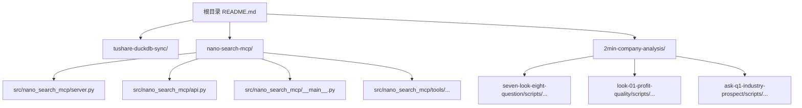
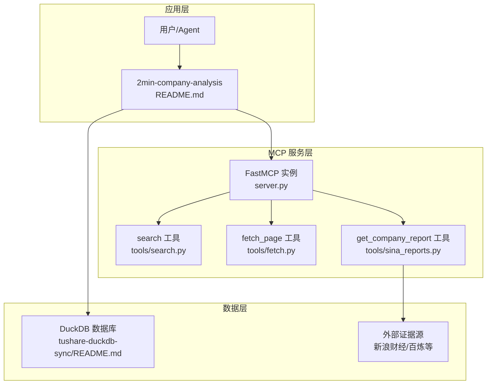
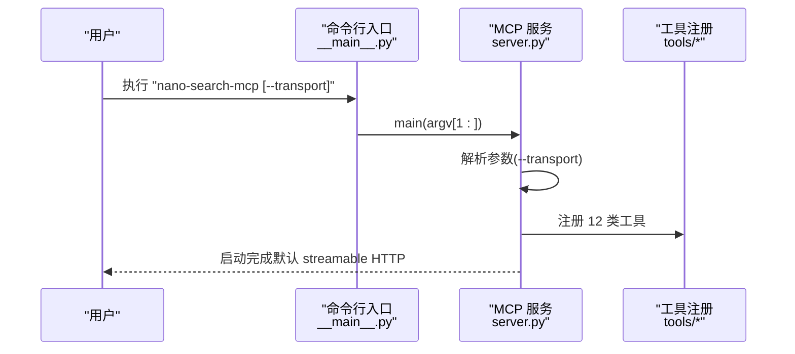
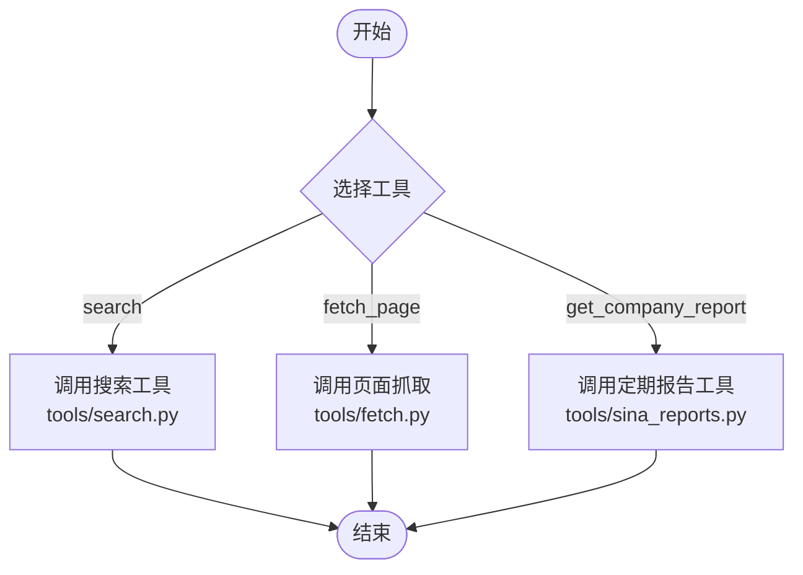

# 安装部署

<cite>
**本文引用的文件**
- [README.md](file://README.md)
- [2min-company-analysis/README.md](file://2min-company-analysis/README.md)
- [nano-search-mcp/README.md](file://nano-search-mcp/README.md)
- [nano-search-mcp/pyproject.toml](file://nano-search-mcp/pyproject.toml)
- [nano-search-mcp/src/nano_search_mcp/__main__.py](file://nano-search-mcp/src/nano_search_mcp/__main__.py)
- [nano-search-mcp/src/nano_search_mcp/server.py](file://nano-search-mcp/src/nano_search_mcp/server.py)
- [nano-search-mcp/src/nano_search_mcp/api.py](file://nano-search-mcp/src/nano_search_mcp/api.py)
- [nano-search-mcp/src/nano_search_mcp/tools/search.py](file://nano-search-mcp/src/nano_search_mcp/tools/search.py)
- [nano-search-mcp/src/nano_search_mcp/tools/fetch.py](file://nano-search-mcp/src/nano_search_mcp/tools/fetch.py)
- [nano-search-mcp/src/nano_search_mcp/tools/sina_reports.py](file://nano-search-mcp/src/nano_search_mcp/tools/sina_reports.py)
- [tushare-duckdb-sync/README.md](file://tushare-duckdb-sync/README.md)
</cite>

## 目录
1. [简介](#简介)
2. [项目结构](#项目结构)
3. [核心组件](#核心组件)
4. [架构总览](#架构总览)
5. [详细组件分析](#详细组件分析)
6. [依赖分析](#依赖分析)
7. [性能考虑](#性能考虑)
8. [故障排查指南](#故障排查指南)
9. [结论](#结论)
10. [附录](#附录)

## 简介
本指南面向 NanoQuant Skills 项目，提供从零开始的安装与部署方案，涵盖：
- pip 安装（普通依赖与可编辑安装）
- 源码安装与开发模式
- MCP 服务启动与验证
- 命令行工具使用与参数说明
- Docker 容器化部署（含 Dockerfile 与 docker-compose）
- Kubernetes 部署 YAML 示例
- 服务启停与重启操作
- 端口配置与网络设置

本项目采用模块化分层设计：上游数据同步模块（tushare-duckdb-sync）→ 外部证据搜索模块（nano-search-mcp）→ 分析编排模块（2min-company-analysis）。推荐按此顺序进行安装与使用。

## 项目结构
仓库采用多模块分层组织，核心模块如下：
- tushare-duckdb-sync：将 Tushare Pro 数据同步到本地 DuckDB，提供结构化数据底座。
- nano-search-mcp：基于 MCP 协议的搜索与抓取服务，提供公告、年报、行业研报、IR 纪要、监管处罚、行业政策等外部证据能力。
- 2min-company-analysis：封装“七看八问”15 个子 skill 与总编排入口，消费 DuckDB 数据并可选接入外部证据。

图表来源
- [README.md:81-93](file://README.md#L81-L93)
- [nano-search-mcp/src/nano_search_mcp/server.py:1-91](file://nano-search-mcp/src/nano_search_mcp/server.py#L1-L91)
- [nano-search-mcp/src/nano_search_mcp/api.py:1-12](file://nano-search-mcp/src/nano_search_mcp/api.py#L1-L12)
- [nano-search-mcp/src/nano_search_mcp/__main__.py:1-15](file://nano-search-mcp/src/nano_search_mcp/__main__.py#L1-L15)
- [2min-company-analysis/README.md:19-56](file://2min-company-analysis/README.md#L19-L56)

章节来源
- [README.md:81-93](file://README.md#L81-L93)
- [2min-company-analysis/README.md:19-56](file://2min-company-analysis/README.md#L19-L56)

## 核心组件
- MCP 服务入口与工具注册：server.py 创建 FastMCP 实例并注册 12 类工具，支持 streamable HTTP 与 stdio 两种传输方式。
- HTTP 兼容入口：api.py 暴露标准 ASGI 应用，复用 MCP streamable HTTP 服务。
- 命令行入口：__main__.py 将 CLI 参数转发给服务主函数。
- 工具实现：
  - 搜索工具：基于百炼 WebSearch 的搜索与模板化检索。
  - 页面抓取：Playwright 异步渲染与正文提取，内置 SSRF 防护。
  - 定期报告：直接抓取新浪财经年报/半年报/一季报/三季报正文。
- 依赖与构建：pyproject.toml 定义项目元数据、依赖、可选开发依赖与脚本入口。

章节来源
- [nano-search-mcp/src/nano_search_mcp/server.py:18-86](file://nano-search-mcp/src/nano_search_mcp/server.py#L18-L86)
- [nano-search-mcp/src/nano_search_mcp/api.py:1-12](file://nano-search-mcp/src/nano_search_mcp/api.py#L1-L12)
- [nano-search-mcp/src/nano_search_mcp/__main__.py:1-15](file://nano-search-mcp/src/nano_search_mcp/__main__.py#L1-L15)
- [nano-search-mcp/src/nano_search_mcp/tools/search.py:79-119](file://nano-search-mcp/src/nano_search_mcp/tools/search.py#L79-L119)
- [nano-search-mcp/src/nano_search_mcp/tools/fetch.py:220-245](file://nano-search-mcp/src/nano_search_mcp/tools/fetch.py#L220-L245)
- [nano-search-mcp/src/nano_search_mcp/tools/sina_reports.py:314-369](file://nano-search-mcp/src/nano_search_mcp/tools/sina_reports.py#L314-L369)
- [nano-search-mcp/pyproject.toml:1-44](file://nano-search-mcp/pyproject.toml#L1-L44)

## 架构总览
NanoSearch MCP 服务以 FastMCP 为核心，通过工具注册暴露多种外部证据能力；2min-company-analysis 在需要时通过 MCP 工具链获取外部证据，tushare-duckdb-sync 提供结构化数据底座。

图表来源
- [nano-search-mcp/src/nano_search_mcp/server.py:18-86](file://nano-search-mcp/src/nano_search_mcp/server.py#L18-L86)
- [nano-search-mcp/src/nano_search_mcp/tools/search.py:79-119](file://nano-search-mcp/src/nano_search_mcp/tools/search.py#L79-L119)
- [nano-search-mcp/src/nano_search_mcp/tools/fetch.py:220-245](file://nano-search-mcp/src/nano_search_mcp/tools/fetch.py#L220-L245)
- [nano-search-mcp/src/nano_search_mcp/tools/sina_reports.py:314-369](file://nano-search-mcp/src/nano_search_mcp/tools/sina_reports.py#L314-L369)
- [2min-company-analysis/README.md:103-107](file://2min-company-analysis/README.md#L103-L107)
- [tushare-duckdb-sync/README.md:1-12](file://tushare-duckdb-sync/README.md#L1-L12)

## 详细组件分析

### MCP 服务启动与参数
- 默认通过 streamable HTTP 监听本地地址，可在命令行切换到 stdio 传输，便于与支持 stdio 的 MCP 客户端直连。
- 服务启动后会注册 12 个工具，提供搜索、抓取、定期报告、公告、行业研报、监管处罚、IR 活动、行业政策等能力。

图表来源
- [nano-search-mcp/src/nano_search_mcp/__main__.py:9-12](file://nano-search-mcp/src/nano_search_mcp/__main__.py#L9-L12)
- [nano-search-mcp/src/nano_search_mcp/server.py:72-86](file://nano-search-mcp/src/nano_search_mcp/server.py#L72-L86)
- [nano-search-mcp/src/nano_search_mcp/server.py:60-69](file://nano-search-mcp/src/nano_search_mcp/server.py#L60-L69)

章节来源
- [nano-search-mcp/src/nano_search_mcp/__main__.py:1-15](file://nano-search-mcp/src/nano_search_mcp/__main__.py#L1-L15)
- [nano-search-mcp/src/nano_search_mcp/server.py:72-86](file://nano-search-mcp/src/nano_search_mcp/server.py#L72-L86)
- [nano-search-mcp/README.md:79-104](file://nano-search-mcp/README.md#L79-L104)

### 命令行工具与参数说明
- 可执行入口：通过 pyproject.toml 注册的脚本入口，支持直接运行 MCP 服务。
- 关键参数：
  - --transport：选择传输方式，可选 streamable-http（默认）或 stdio。

章节来源
- [nano-search-mcp/pyproject.toml:21-22](file://nano-search-mcp/pyproject.toml#L21-L22)
- [nano-search-mcp/src/nano_search_mcp/server.py:72-80](file://nano-search-mcp/src/nano_search_mcp/server.py#L72-L80)

### 工具能力与调用流程
- 搜索工具：支持参数化搜索与模板化检索，返回标题、URL、摘要列表。
- 页面抓取：Playwright 渲染，正文提取，内置 SSRF 防护与长度截断。
- 定期报告：直接抓取新浪财经年报/半年报/一季报/三季报正文，按年份与报告类型筛选。

图表来源
- [nano-search-mcp/src/nano_search_mcp/tools/search.py:79-119](file://nano-search-mcp/src/nano_search_mcp/tools/search.py#L79-L119)
- [nano-search-mcp/src/nano_search_mcp/tools/fetch.py:220-245](file://nano-search-mcp/src/nano_search_mcp/tools/fetch.py#L220-L245)
- [nano-search-mcp/src/nano_search_mcp/tools/sina_reports.py:314-369](file://nano-search-mcp/src/nano_search_mcp/tools/sina_reports.py#L314-L369)

章节来源
- [nano-search-mcp/src/nano_search_mcp/tools/search.py:79-119](file://nano-search-mcp/src/nano_search_mcp/tools/search.py#L79-L119)
- [nano-search-mcp/src/nano_search_mcp/tools/fetch.py:220-245](file://nano-search-mcp/src/nano_search_mcp/tools/fetch.py#L220-L245)
- [nano-search-mcp/src/nano_search_mcp/tools/sina_reports.py:314-369](file://nano-search-mcp/src/nano_search_mcp/tools/sina_reports.py#L314-L369)

## 依赖分析
- 依赖关系链：tushare-duckdb-sync（数据底座）→ nano-search-mcp（外部证据服务）→ 2min-company-analysis（分析编排）。
- 依赖声明与脚本入口：pyproject.toml 明确了项目元数据、依赖、可选开发依赖与脚本入口。
- 环境要求：Python 3.10+，Playwright Chromium 浏览器。

图表来源
- [README.md:5-11](file://README.md#L5-L11)
- [nano-search-mcp/pyproject.toml:1-14](file://nano-search-mcp/pyproject.toml#L1-L14)

章节来源
- [README.md:5-11](file://README.md#L5-L11)
- [nano-search-mcp/pyproject.toml:1-14](file://nano-search-mcp/pyproject.toml#L1-L14)

## 性能考虑
- 异步抓取：页面抓取工具使用 Playwright 异步渲染，降低并发等待时间。
- 浏览器复用：惰性创建并复用 Chromium 实例，减少冷启动开销。
- 重试与退避：定期报告抓取采用指数退避重试，提升网络波动下的成功率。
- 输出截断：正文最大长度限制，避免超长响应导致内存压力。

章节来源
- [nano-search-mcp/src/nano_search_mcp/tools/fetch.py:133-142](file://nano-search-mcp/src/nano_search_mcp/tools/fetch.py#L133-L142)
- [nano-search-mcp/src/nano_search_mcp/tools/sina_reports.py:127-153](file://nano-search-mcp/src/nano_search_mcp/tools/sina_reports.py#L127-L153)
- [nano-search-mcp/src/nano_search_mcp/tools/fetch.py:113-117](file://nano-search-mcp/src/nano_search_mcp/tools/fetch.py#L113-L117)

## 故障排查指南
- 安装与环境
  - 确认 Python 版本满足要求，安装 Playwright 浏览器。
  - 开发模式安装后，确保可执行入口可用。
- 服务启动
  - 默认通过 streamable HTTP 监听本地地址；如需与 MCP 客户端直连，使用 stdio 传输。
  - 若 MCP 客户端或网关存在请求超时限制，需将超时时间调整至足以覆盖最慢的页面抓取或报告获取。
- 工具调用
  - 搜索工具与定期报告工具在参数非法或网络彻底失败时会抛异常；其他工具失败时返回统一错误字典。
  - 页面抓取工具对 SSRF 进行严格防护，拒绝 file://、loopback、RFC1918 私网、云元数据端点等地址。
- 数据同步
  - tushare-duckdb-sync 需要 Tushare Pro Token，建议在调用前显式导出环境变量。

章节来源
- [nano-search-mcp/README.md:55-104](file://nano-search-mcp/README.md#L55-L104)
- [nano-search-mcp/src/nano_search_mcp/server.py:55-56](file://nano-search-mcp/src/nano_search_mcp/server.py#L55-L56)
- [nano-search-mcp/src/nano_search_mcp/tools/fetch.py:24-74](file://nano-search-mcp/src/nano_search_mcp/tools/fetch.py#L24-L74)
- [tushare-duckdb-sync/README.md:21-38](file://tushare-duckdb-sync/README.md#L21-L38)

## 结论
通过本指南，您可以完成 NanoQuant Skills 项目的安装与部署，按顺序使用数据同步模块、外部证据服务与分析编排模块，获得从结构化数据到底层证据的完整分析链路。如需进一步扩展，可参考 Docker 与 Kubernetes 部署章节，将服务容器化并纳入生产环境。

## 附录

### 安装方式与步骤

- pip 安装（普通依赖）
  - 在激活的环境中执行安装命令，随后安装 Playwright 浏览器。
  - 适合仅作为依赖使用的场景。

- pip 安装（可编辑模式）
  - 在 nano-search-mcp 目录下执行可编辑安装，便于开发调试。
  - 适合开发者在本地修改代码后即时生效。

- 源码安装
  - 在 nano-search-mcp 目录下执行常规安装，随后安装 Playwright 浏览器。
  - 适合不需要开发模式的用户。

- 开发模式安装
  - 安装可选开发依赖，便于运行测试与代码规范检查。
  - 适合参与贡献或需要本地测试的用户。

章节来源
- [nano-search-mcp/README.md:61-77](file://nano-search-mcp/README.md#L61-L77)
- [nano-search-mcp/pyproject.toml:16-19](file://nano-search-mcp/pyproject.toml#L16-L19)

### 启动 MCP 服务与验证
- 启动 MCP 服务
  - 默认通过 streamable HTTP 监听本地地址。
  - 如需与 MCP 客户端直连，使用 stdio 传输。
- 验证安装
  - 启动后，服务会注册 12 个工具；可通过 MCP 客户端列出工具并调用验证。
  - 若 MCP 客户端或网关存在请求超时限制，需将超时时间调整至足以覆盖最慢的页面抓取或报告获取。

章节来源
- [nano-search-mcp/README.md:79-104](file://nano-search-mcp/README.md#L79-L104)

### 命令行工具使用与参数
- 可执行入口：通过 pyproject.toml 注册的脚本入口。
- 关键参数：
  - --transport：选择传输方式，可选 streamable-http（默认）或 stdio。

章节来源
- [nano-search-mcp/pyproject.toml:21-22](file://nano-search-mcp/pyproject.toml#L21-L22)
- [nano-search-mcp/src/nano_search_mcp/server.py:72-80](file://nano-search-mcp/src/nano_search_mcp/server.py#L72-L80)

### Docker 容器化部署
- Dockerfile（示例思路）
  - 基于 Python 3.10+ 镜像。
  - 安装系统依赖（如 libgtk等）以支持 Playwright 浏览器。
  - 复制项目代码，安装依赖与可执行入口。
  - 预装 Playwright 浏览器。
  - 暴露 MCP 服务端口（默认 HTTP 端口）。
  - 设置启动命令为 MCP 服务入口。
- docker-compose（示例思路）
  - 定义服务：镜像、端口映射、环境变量（如 Tushare Token）、卷挂载（DuckDB 数据文件）。
  - 依赖关系：先启动数据同步服务，再启动 MCP 服务。
  - 健康检查：对 MCP 服务端口进行探测，确保服务可用。

说明：本节为概念性流程说明，未直接对应具体源文件，因此不附“章节来源”。

### Kubernetes 部署
- Deployment（示例思路）
  - 定义容器镜像、资源限制、端口暴露。
  - 设置环境变量（如 TUSHARE_TOKEN、DASHSCOPE_API_KEY）。
  - 配置持久卷挂载（DuckDB 数据文件）。
- Service（示例思路）
  - 暴露 MCP 服务端口，支持集群内访问。
- ConfigMap/Secret（示例思路）
  - 通过 ConfigMap/Secret 注入配置与密钥。
- Ingress（示例思路）
  - 如需对外暴露，配置 Ingress 并设置超时时间以适配页面抓取耗时。

说明：本节为概念性流程说明，未直接对应具体源文件，因此不附“章节来源”。

### 服务启停与重启
- 启动
  - 使用可执行入口启动 MCP 服务，或通过容器编排工具启动。
- 停止
  - 优雅关闭服务进程，释放 Playwright 资源。
- 重启
  - 重新启动服务，确保外部证据源可用。

说明：本节为通用运维说明，未直接对应具体源文件，因此不附“章节来源”。

### 端口配置与网络设置
- 默认监听地址：本地 HTTP 端口（streamable HTTP）。
- 端口映射：在容器编排中将容器端口映射到宿主机端口。
- 网络设置：确保外部证据源（如新浪财经、百炼）可达；如使用反向代理或网关，需设置足够长的请求超时时间。

章节来源
- [nano-search-mcp/README.md:88-104](file://nano-search-mcp/README.md#L88-L104)