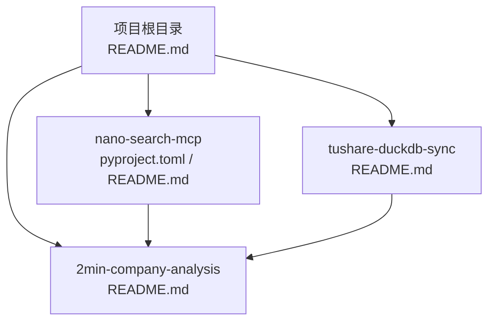
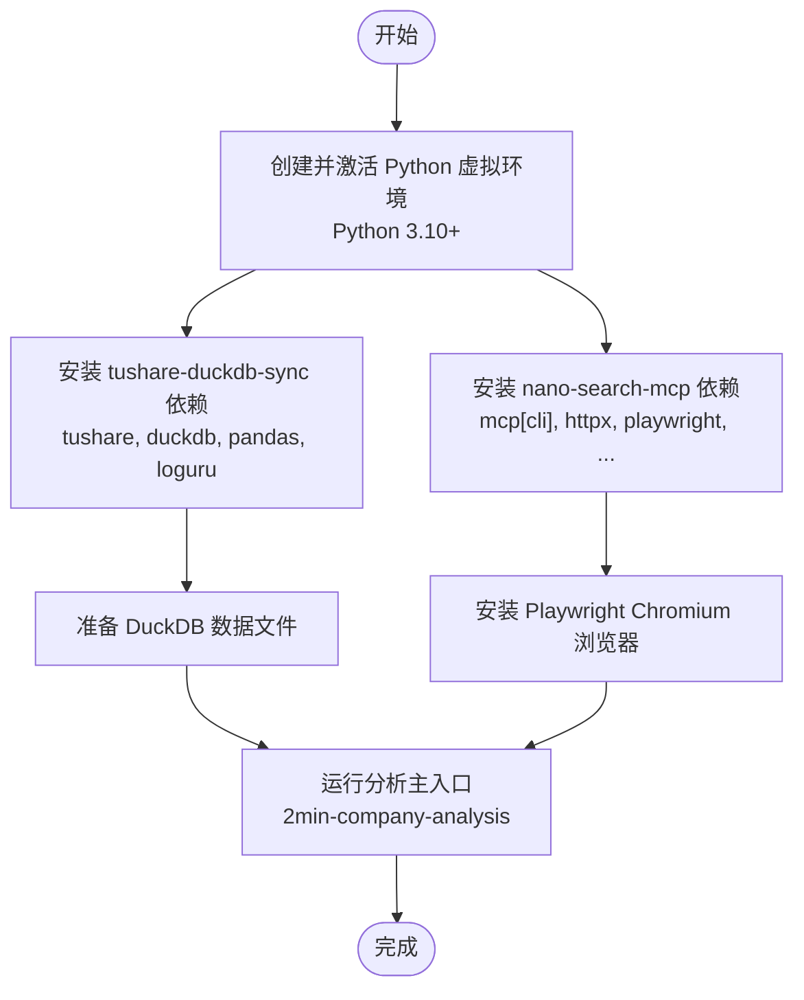
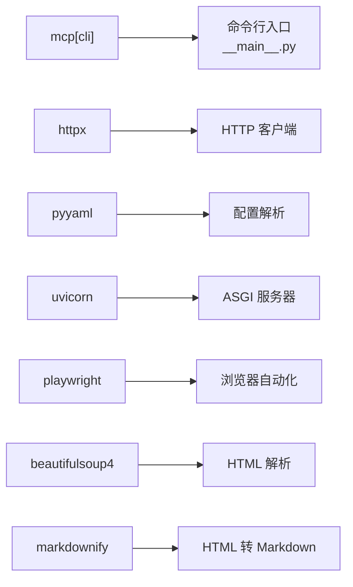

# 环境配置

<cite>
**本文引用的文件**
- [README.md](file://README.md)
- [nano-search-mcp/pyproject.toml](file://nano-search-mcp/pyproject.toml)
- [nano-search-mcp/README.md](file://nano-search-mcp/README.md)
- [2min-company-analysis/README.md](file://2min-company-analysis/README.md)
- [tushare-duckdb-sync/README.md](file://tushare-duckdb-sync/README.md)
- [.gitignore](file://.gitignore)
</cite>

## 目录
1. [简介](#简介)
2. [项目结构](#项目结构)
3. [核心组件](#核心组件)
4. [架构总览](#架构总览)
5. [详细组件分析](#详细组件分析)
6. [依赖关系分析](#依赖关系分析)
7. [性能考虑](#性能考虑)
8. [故障排查指南](#故障排查指南)
9. [结论](#结论)
10. [附录](#附录)

## 简介
本指南面向 NanoQuant Skills 项目使用者，提供从零搭建开发与运行环境的完整步骤，涵盖 Python 版本要求、依赖安装、虚拟环境、Playwright 浏览器准备、环境变量配置以及常见问题排查。项目由三个子模块组成：上游数据生产模块（tushare-duckdb-sync）、外部证据搜索模块（nano-search-mcp）、分析与编排模块（2min-company-analysis）。推荐按顺序执行：先同步 DuckDB 数据，再安装并使用 MCP 搜索模块，最后运行分析主入口。

## 项目结构
仓库采用多模块分层结构，便于独立维护与复用：
- tushare-duckdb-sync：将 Tushare Pro 数据同步到本地 DuckDB，提供全量/增量同步、数据质量检查与映射注册表。
- nano-search-mcp：基于 MCP 协议的搜索服务，提供公告、年报、行业研报、IR 纪要、监管处罚、行业政策等检索与正文抓取能力。
- 2min-company-analysis：封装“七看八问”15 个子 skill 与总编排入口，消费 DuckDB 数据，并可选接入外部证据。

图表来源
- [README.md:1-103](file://README.md#L1-L103)
- [tushare-duckdb-sync/README.md:1-173](file://tushare-duckdb-sync/README.md#L1-L173)
- [nano-search-mcp/README.md:1-198](file://nano-search-mcp/README.md#L1-L198)
- [2min-company-analysis/README.md:1-132](file://2min-company-analysis/README.md#L1-L132)

章节来源
- [README.md:1-103](file://README.md#L1-L103)

## 核心组件
- Python 版本要求
  - Python 3.10 及以上。nano-search-mcp 的项目元数据明确要求 Python >= 3.10。
- 必需依赖（来自 nano-search-mcp）
  - mcp[cli]：MCP 协议客户端与命令行工具。
  - httpx：HTTP 客户端库。
  - pyyaml：YAML 解析与序列化。
  - uvicorn：ASGI 服务器，用于 MCP HTTP 服务。
  - playwright：浏览器自动化与页面抓取。
  - beautifulsoup4：HTML/XML 解析。
  - markdownify：HTML 转 Markdown。
- 可选依赖
  - pytest：开发测试框架（可选）。
- 系统资源与浏览器
  - 需要安装 Playwright 的 Chromium 浏览器运行时，以便抓取动态渲染页面。
- 环境变量
  - TUSHARE_TOKEN：tushare-duckdb-sync 同步脚本读取的 Tushare Pro Token。
  - DASHSCOPE_API_KEY：可选，用于启用百炼相关能力（如行业政策检索）。

章节来源
- [nano-search-mcp/pyproject.toml:1-44](file://nano-search-mcp/pyproject.toml#L1-L44)
- [nano-search-mcp/README.md:55-77](file://nano-search-mcp/README.md#L55-L77)
- [tushare-duckdb-sync/README.md:21-27](file://tushare-duckdb-sync/README.md#L21-L27)
- [2min-company-analysis/README.md:116-121](file://2min-company-analysis/README.md#L116-L121)

## 架构总览
NanoQuant Skills 的环境配置围绕“数据底座 + 外部证据 + 分析编排”的三层依赖展开。推荐的最小联动示例如下：

图表来源
- [README.md:60-80](file://README.md#L60-L80)
- [tushare-duckdb-sync/README.md:15-27](file://tushare-duckdb-sync/README.md#L15-L27)
- [nano-search-mcp/README.md:61-77](file://nano-search-mcp/README.md#L61-L77)

## 详细组件分析

### Python 与虚拟环境
- 推荐使用 conda 环境：legonanobot（仓库示例环境名）。
- 创建与激活步骤（示例）
  - 创建：conda create -n legonanobot python=3.10
  - 激活：conda activate legonanobot
- 也可使用 venv/virtualenv，但仓库示例与文档多处采用 conda 环境，建议保持一致以减少差异。
- 仓库根目录的 .gitignore 已忽略常见虚拟环境目录（.venv、venv、env），避免误提交。

章节来源
- [2min-company-analysis/README.md:111-114](file://2min-company-analysis/README.md#L111-L114)
- [.gitignore:10-14](file://.gitignore#L10-L14)

### 依赖安装与版本要求
- 安装顺序与要点
  1) 安装 tushare-duckdb-sync 依赖：tushare、duckdb、pandas、loguru。
  2) 安装 nano-search-mcp：pip install -e ".[dev]"（可编辑安装，包含 dev 可选依赖 pytest）。
  3) 安装 Playwright Chromium：playwright install chromium。
- 依赖清单与版本约束
  - mcp[cli] >= 1.0.0
  - httpx >= 0.27.0
  - pyyaml >= 6.0
  - uvicorn >= 0.30.0
  - playwright >= 1.40.0
  - beautifulsoup4 >= 4.12.0
  - markdownify >= 0.13.0
  - pytest >= 8.3.0（可选，开发依赖）

章节来源
- [nano-search-mcp/pyproject.toml:6-19](file://nano-search-mcp/pyproject.toml#L6-L19)
- [nano-search-mcp/README.md:61-77](file://nano-search-mcp/README.md#L61-L77)
- [tushare-duckdb-sync/README.md:15-27](file://tushare-duckdb-sync/README.md#L15-L27)

### Playwright 浏览器准备
- 重要提示：抓取动态渲染页面需要 Chromium 浏览器运行时。
- 安装命令：playwright install chromium
- 若后续需要其他浏览器（如 Firefox、WebKit），可按需添加安装。

章节来源
- [nano-search-mcp/README.md:63-67](file://nano-search-mcp/README.md#L63-L67)
- [nano-search-mcp/pyproject.toml:11-11](file://nano-search-mcp/pyproject.toml#L11-L11)

### 环境变量配置
- TUSHARE_TOKEN
  - 用途：tushare-duckdb-sync 同步脚本读取的 Tushare Pro Token。
  - 设置方式：export TUSHARE_TOKEN=你的token
  - 注意：脚本不会自动扫描 .env、.env.local 等文件，需在当前命令上下文导出。
- DASHSCOPE_API_KEY（可选）
  - 用途：启用百炼相关能力（如行业政策检索）。
  - 设置方式：export DASHSCOPE_API_KEY=your_token

章节来源
- [tushare-duckdb-sync/README.md:21-27](file://tushare-duckdb-sync/README.md#L21-L27)
- [2min-company-analysis/README.md:116-121](file://2min-company-analysis/README.md#L116-L121)

### 不同操作系统安装要点
- Windows
  - 使用 Anaconda Prompt 或 PowerShell，确保 conda 环境已创建并激活。
  - 安装 Playwright 时可能需要先安装系统依赖（如 Visual C++ 运行库）。
  - 若遇到权限问题，建议以管理员身份运行终端。
- macOS
  - 若系统为 Apple Silicon（M 系列芯片），注意 Python 与 Playwright 的兼容性，必要时使用 x86_64 版本的 Python。
  - 安装 Playwright 时可能需要安装 Xcode 命令行工具。
- Linux
  - Ubuntu/Debian：建议先 apt update && apt install -y libgtk-3-0 libwebkit2gtk-4.0-37 libxcomposite-dev libxdamage-dev libxrandr-dev libxss-dev libxtst-dev libasound2-dev libatk1.0-dev libatk-bridge2.0-dev libcups2-dev libdbus-1-dev libexpat1-dev libfontconfig1-dev libfreetype6-dev libgl1-mesa-dev libglib2.0-dev libminizip-dev libnspr4-dev libpango1.0-dev libpci-dev libpulse-dev libsrtp2-dev libsystemd-dev libudev-dev libwoff1-dev libxkbcommon-dev libxml2-dev libxslt1-dev zlib1g-dev。
  - CentOS/RHEL：使用 dnf/yum 安装相应依赖包。
  - 安装 Playwright 后，如遇浏览器启动失败，检查 DISPLAY/X11 或使用无头模式进行调试。

[本节为通用操作系统建议，不直接分析具体文件，故无章节来源]

### 可选依赖与用途
- pytest
  - 用途：单元测试框架，便于在开发阶段验证 MCP 工具与抓取路径。
  - 安装：pip install -e ".[dev]"（已包含）
  - 运行：pytest（在 nano-search-mcp 目录下）

章节来源
- [nano-search-mcp/pyproject.toml:16-19](file://nano-search-mcp/pyproject.toml#L16-L19)
- [nano-search-mcp/README.md:169-176](file://nano-search-mcp/README.md#L169-L176)

### 系统资源要求
- CPU 与内存
  - 数据同步与外部证据抓取涉及网络请求与页面渲染，建议至少 8GB 内存起步，CPU 双核以上。
- 磁盘空间
  - DuckDB 数据文件随同步增长，建议预留数十 GB 空间（取决于同步表规模与维度）。
- 网络与并发
  - Tushare API 有调用频率限制，建议在同步脚本中设置合理的 sleep 间隔（默认 0.3s）。
  - Playwright 抓取页面时会占用一定内存与 CPU，建议控制并发数量。

[本节为通用资源建议，不直接分析具体文件，故无章节来源]

## 依赖关系分析
nano-search-mcp 的依赖关系如下所示：

图表来源
- [nano-search-mcp/pyproject.toml:6-14](file://nano-search-mcp/pyproject.toml#L6-L14)
- [nano-search-mcp/README.md:180-198](file://nano-search-mcp/README.md#L180-L198)

章节来源
- [nano-search-mcp/pyproject.toml:1-44](file://nano-search-mcp/pyproject.toml#L1-L44)

## 性能考虑
- 控制并发与限频
  - Tushare 同步脚本默认 sleep 0.3s，可根据网络状况适当增加以降低限频风险。
  - 增量同步时利用断点续传（sync_all），避免重复拉取。
- 抓取性能
  - Playwright 抓取页面时建议使用 headless 模式，减少图形开销。
  - 对于大量页面抓取，建议分批执行并设置合理的超时时间。
- DuckDB 写入
  - 建议在建表时按 (ts_code, trade_date) 排序并建立索引，提升查询与范围扫描性能。

[本节提供通用性能建议，不直接分析具体文件，故无章节来源]

## 故障排查指南
- Python 版本不兼容
  - 现象：安装依赖时报错或运行时报错。
  - 处理：确保使用 Python 3.10+，并激活正确的 conda 环境。
- Playwright 浏览器未安装
  - 现象：抓取页面失败或浏览器启动报错。
  - 处理：执行 playwright install chromium，并根据系统需求安装系统依赖。
- Tushare Token 未设置或无效
  - 现象：同步脚本报错或返回空数据。
  - 处理：export TUSHARE_TOKEN=你的token；或在固定位置授权后以环境变量形式导出。
- 环境变量未生效
  - 现象：脚本读取不到环境变量。
  - 处理：确认在当前 shell 会话中导出，且未被后续命令覆盖。
- 依赖安装失败（Windows/macOS/Linux）
  - 现象：安装特定包时报错（如编译错误）。
  - 处理：检查系统依赖是否齐全；必要时使用预编译 wheel 或更换 Python 发行版（如 conda-forge）。
- DuckDB 文件被占用或损坏
  - 现象：同步或查询失败。
  - 处理：关闭占用 DuckDB 的进程，或备份后删除 .duckdb 与 .duckdb.wal 文件重新同步。

章节来源
- [tushare-duckdb-sync/README.md:21-46](file://tushare-duckdb-sync/README.md#L21-L46)
- [nano-search-mcp/README.md:61-77](file://nano-search-mcp/README.md#L61-L77)
- [.gitignore:15-17](file://.gitignore#L15-L17)

## 结论
按照本指南完成 Python 环境、依赖与 Playwright 浏览器的准备，并正确设置环境变量后，即可顺利运行 tushare-duckdb-sync、nano-search-mcp 与 2min-company-analysis。建议优先完成上游数据同步，再启用外部证据搜索模块，最后执行分析主入口，以获得完整的“七看八问”分析体验。

## 附录
- 最小联动示例（按推荐顺序）
  - 安装搜索模块（可编辑模式）
  - 执行公司分析总编排
- 示例命令路径
  - 安装搜索模块：[2min-company-analysis/README.md:111-114](file://2min-company-analysis/README.md#L111-L114)
  - 执行总编排：[README.md:66-80](file://README.md#L66-L80)

章节来源
- [README.md:60-80](file://README.md#L60-L80)
- [2min-company-analysis/README.md:109-115](file://2min-company-analysis/README.md#L109-L115)