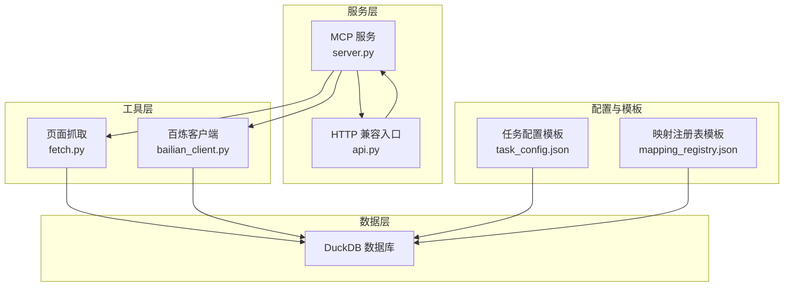
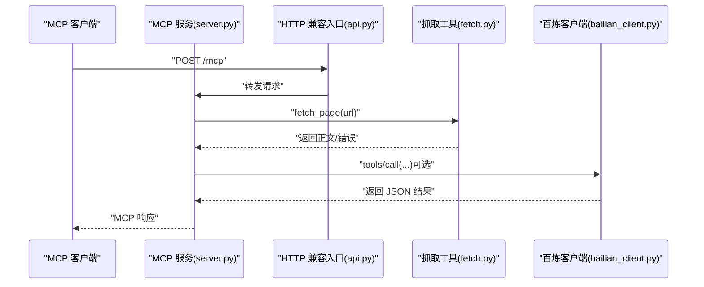
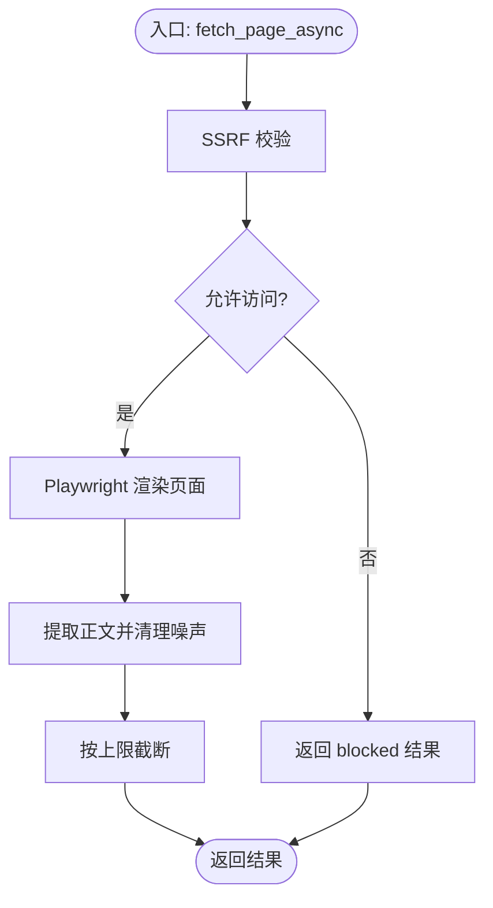
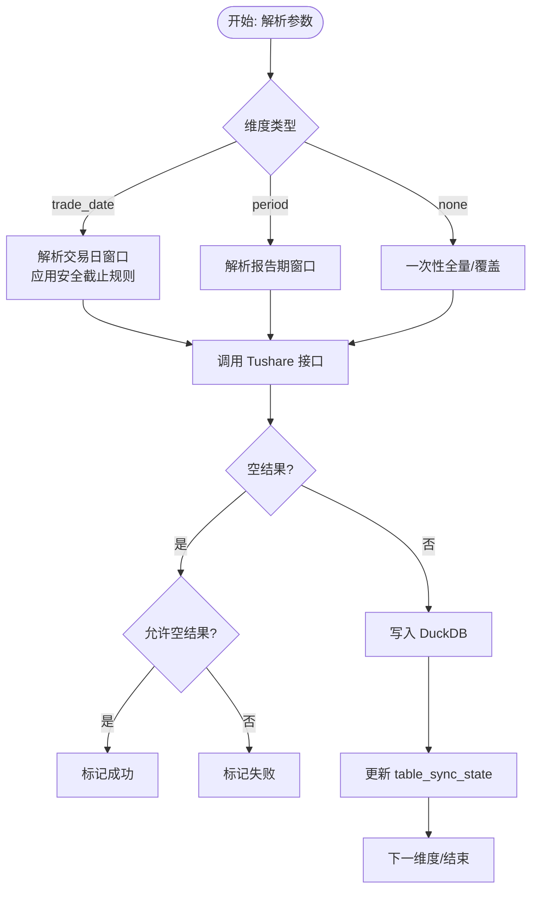
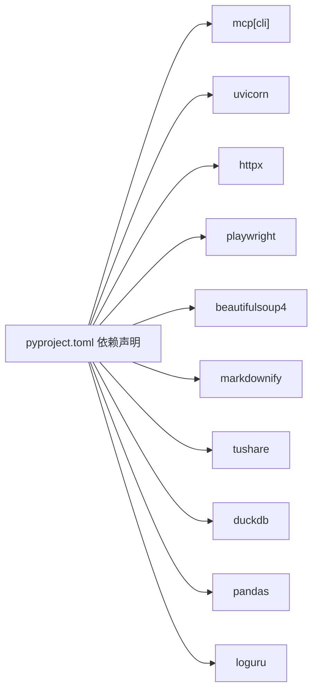

# 生产配置

<cite>
**本文引用的文件**
- [nano-search-mcp/pyproject.toml](file://nano-search-mcp/pyproject.toml)
- [nano-search-mcp/README.md](file://nano-search-mcp/README.md)
- [nano-search-mcp/src/nano_search_mcp/server.py](file://nano-search-mcp/src/nano_search_mcp/server.py)
- [nano-search-mcp/src/nano_search_mcp/api.py](file://nano-search-mcp/src/nano_search_mcp/api.py)
- [nano-search-mcp/src/nano_search_mcp/tools/bailian_client.py](file://nano-search-mcp/src/nano_search_mcp/tools/bailian_client.py)
- [nano-search-mcp/src/nano_search_mcp/tools/fetch.py](file://nano-search-mcp/src/nano_search_mcp/tools/fetch.py)
- [tushare-duckdb-sync/README.md](file://tushare-duckdb-sync/README.md)
- [tushare-duckdb-sync/SKILL.md](file://tushare-duckdb-sync/SKILL.md)
- [tushare-duckdb-sync/scripts/sync_table.py](file://tushare-duckdb-sync/scripts/sync_table.py)
- [tushare-duckdb-sync/templates/task_config.json](file://tushare-duckdb-sync/templates/task_config.json)
- [tushare-duckdb-sync/templates/mapping_registry.json](file://tushare-duckdb-sync/templates/mapping_registry.json)
- [.gitignore](file://.gitignore)
</cite>

## 目录
1. [简介](#简介)
2. [项目结构](#项目结构)
3. [核心组件](#核心组件)
4. [架构总览](#架构总览)
5. [详细组件分析](#详细组件分析)
6. [依赖分析](#依赖分析)
7. [性能考虑](#性能考虑)
8. [故障排查指南](#故障排查指南)
9. [结论](#结论)
10. [附录](#附录)

## 简介
本指南面向生产环境，基于仓库中的两个核心子系统：NanoSearch MCP 搜索服务与 Tushare → DuckDB 数据同步工具，提供系统要求、硬件建议、配置参数、安全加固、日志与监控、性能调优、高可用与负载均衡、备份与灾备以及合规与审计的实操指引。文档严格依据仓库现有实现与说明文件，避免臆造信息。

## 项目结构
仓库包含三个主要模块：
- nano-search-mcp：基于 MCP 协议的搜索与抓取服务，提供多类外部证据工具（公告、研报、政策、IR 等），并内置 HTTP 兼容入口。
- tushare-duckdb-sync：将 Tushare Pro 数据同步到本地 DuckDB，支持全量与按交易日/报告期的增量同步，并提供映射注册表与任务配置模板。
- 2min-company-analysis：下游分析模块，依赖 DuckDB 数据与 MCP 工具链。

**图表来源**
- [nano-search-mcp/src/nano_search_mcp/server.py:18-70](file://nano-search-mcp/src/nano_search_mcp/server.py#L18-L70)
- [nano-search-mcp/src/nano_search_mcp/api.py:1-12](file://nano-search-mcp/src/nano_search_mcp/api.py#L1-L12)
- [nano-search-mcp/src/nano_search_mcp/tools/bailian_client.py:12-36](file://nano-search-mcp/src/nano_search_mcp/tools/bailian_client.py#L12-L36)
- [nano-search-mcp/src/nano_search_mcp/tools/fetch.py:16-75](file://nano-search-mcp/src/nano_search_mcp/tools/fetch.py#L16-L75)
- [tushare-duckdb-sync/templates/task_config.json:1-22](file://tushare-duckdb-sync/templates/task_config.json#L1-L22)
- [tushare-duckdb-sync/templates/mapping_registry.json:1-16](file://tushare-duckdb-sync/templates/mapping_registry.json#L1-L16)

**章节来源**
- [nano-search-mcp/README.md:1-198](file://nano-search-mcp/README.md#L1-L198)
- [tushare-duckdb-sync/README.md:1-173](file://tushare-duckdb-sync/README.md#L1-L173)

## 核心组件
- MCP 服务与 HTTP 兼容入口：提供 streamable HTTP 路由与可切换的传输方式（streamable-http/stdio）。
- 工具集：页面抓取（Playwright 渲染+SSRF 防护）、百炼 MCP 工具调用（鉴权与超时控制）。
- 数据同步：Tushare → DuckDB，支持三种维度（none/trade_date/period），断点续传与状态表记录。
- 配置模板：任务配置与映射注册表模板，支撑批量与自动化同步。

**章节来源**
- [nano-search-mcp/src/nano_search_mcp/server.py:18-86](file://nano-search-mcp/src/nano_search_mcp/server.py#L18-L86)
- [nano-search-mcp/src/nano_search_mcp/api.py:1-12](file://nano-search-mcp/src/nano_search_mcp/api.py#L1-L12)
- [tushare-duckdb-sync/scripts/sync_table.py:524-562](file://tushare-duckdb-sync/scripts/sync_table.py#L524-L562)
- [tushare-duckdb-sync/templates/task_config.json:1-22](file://tushare-duckdb-sync/templates/task_config.json#L1-L22)
- [tushare-duckdb-sync/templates/mapping_registry.json:1-16](file://tushare-duckdb-sync/templates/mapping_registry.json#L1-L16)

## 架构总览
NanoSearch MCP 服务通过 streamable HTTP 暴露 /mcp 路由，兼容标准 MCP 客户端。页面抓取工具对目标 URL 进行 SSRF 校验与内容清洗，百炼客户端通过环境变量注入 API Key 并设置超时。数据同步模块通过 Tushare Token 与 DuckDB 路径进行配置，支持批量任务与断点续传。

**图表来源**
- [nano-search-mcp/src/nano_search_mcp/api.py:1-12](file://nano-search-mcp/src/nano_search_mcp/api.py#L1-L12)
- [nano-search-mcp/src/nano_search_mcp/server.py:72-86](file://nano-search-mcp/src/nano_search_mcp/server.py#L72-L86)
- [nano-search-mcp/src/nano_search_mcp/tools/fetch.py:186-245](file://nano-search-mcp/src/nano_search_mcp/tools/fetch.py#L186-L245)
- [nano-search-mcp/src/nano_search_mcp/tools/bailian_client.py:63-93](file://nano-search-mcp/src/nano_search_mcp/tools/bailian_client.py#L63-L93)

## 详细组件分析

### MCP 服务与传输配置
- 传输方式：支持 streamable-http（默认）与 stdio。生产建议使用 streamable-http 并结合反向代理。
- 监听路径：/mcp。
- 启动方式：命令行入口或作为 Python 包导入，暴露 mcp 对象与 ASGI app。

**章节来源**
- [nano-search-mcp/src/nano_search_mcp/server.py:72-86](file://nano-search-mcp/src/nano_search_mcp/server.py#L72-L86)
- [nano-search-mcp/src/nano_search_mcp/api.py:1-12](file://nano-search-mcp/src/nano_search_mcp/api.py#L1-L12)
- [nano-search-mcp/README.md:79-104](file://nano-search-mcp/README.md#L79-L104)

### 页面抓取与 SSRF 防护
- URL 校验：仅允许 http/https，拒绝 loopback、RFC1918 私网、链路本地、多播、保留地址等。
- 内容提取：基于 BeautifulSoup 清理噪声标签与类名，Markdown 输出。
- 限长与截断：正文最大字符数限制，超长截断。
- Playwright 复用：惰性创建与复用浏览器实例，降低冷启动成本。

**图表来源**
- [nano-search-mcp/src/nano_search_mcp/tools/fetch.py:24-75](file://nano-search-mcp/src/nano_search_mcp/tools/fetch.py#L24-L75)
- [nano-search-mcp/src/nano_search_mcp/tools/fetch.py:163-218](file://nano-search-mcp/src/nano_search_mcp/tools/fetch.py#L163-L218)

**章节来源**
- [nano-search-mcp/src/nano_search_mcp/tools/fetch.py:16-75](file://nano-search-mcp/src/nano_search_mcp/tools/fetch.py#L16-L75)
- [nano-search-mcp/src/nano_search_mcp/tools/fetch.py:186-245](file://nano-search-mcp/src/nano_search_mcp/tools/fetch.py#L186-L245)

### 百炼 MCP 客户端与 API 密钥管理
- 端点：通过环境变量配置，默认值来自仓库定义。
- 超时：支持通过环境变量覆盖默认超时。
- 鉴权：从环境变量读取 API Key，缺失时报错。
- 错误处理：HTTP 错误、非 JSON 响应、MCP error 字段均抛出异常。

**章节来源**
- [nano-search-mcp/src/nano_search_mcp/tools/bailian_client.py:12-36](file://nano-search-mcp/src/nano_search_mcp/tools/bailian_client.py#L12-L36)
- [nano-search-mcp/src/nano_search_mcp/tools/bailian_client.py:63-93](file://nano-search-mcp/src/nano_search_mcp/tools/bailian_client.py#L63-L93)

### 数据同步与任务配置
- 环境变量：TUSHARE_TOKEN（必需）。
- DuckDB 路径：通过参数指定。
- 维度类型：none/trade_date/period。
- 断点续传：table_sync_state 记录同步状态，支持跳过已同步维度。
- 批量任务：tasks.json 模板，支持覆盖 sleep、publish cutoff 等参数。

**图表来源**
- [tushare-duckdb-sync/scripts/sync_table.py:265-288](file://tushare-duckdb-sync/scripts/sync_table.py#L265-L288)
- [tushare-duckdb-sync/scripts/sync_table.py:294-338](file://tushare-duckdb-sync/scripts/sync_table.py#L294-L338)
- [tushare-duckdb-sync/scripts/sync_table.py:451-518](file://tushare-duckdb-sync/scripts/sync_table.py#L451-L518)

**章节来源**
- [tushare-duckdb-sync/README.md:131-153](file://tushare-duckdb-sync/README.md#L131-L153)
- [tushare-duckdb-sync/scripts/sync_table.py:524-562](file://tushare-duckdb-sync/scripts/sync_table.py#L524-L562)
- [tushare-duckdb-sync/templates/task_config.json:1-22](file://tushare-duckdb-sync/templates/task_config.json#L1-L22)
- [tushare-duckdb-sync/templates/mapping_registry.json:1-16](file://tushare-duckdb-sync/templates/mapping_registry.json#L1-L16)

## 依赖分析
- Python 与运行时：Python 3.10+，依赖 mcp、httpx、pyyaml、uvicorn、playwright、beautifulsoup4、markdownify。
- MCP 服务：FastMCP 提供工具注册与运行；ASGI app 由 streamable HTTP 适配。
- 数据同步：依赖 tushare、duckdb、pandas、loguru。

**图表来源**
- [nano-search-mcp/pyproject.toml:6-14](file://nano-search-mcp/pyproject.toml#L6-L14)
- [tushare-duckdb-sync/README.md:15-19](file://tushare-duckdb-sync/README.md#L15-L19)

**章节来源**
- [nano-search-mcp/pyproject.toml:1-44](file://nano-search-mcp/pyproject.toml#L1-L44)
- [tushare-duckdb-sync/README.md:15-19](file://tushare-duckdb-sync/README.md#L15-L19)

## 性能考虑
- 并发与资源
  - Playwright 浏览器复用：减少冷启动开销，建议在容器/进程内复用实例。
  - 请求限频：数据同步模块提供 sleep 与 max_retries，避免上游限流。
- 网络与超时
  - MCP 客户端超时可通过环境变量覆盖，生产需根据最慢工具调用设置足够超时。
  - 反向代理/网关超时需覆盖单次 fetch_page 或报告抓取的最长耗时。
- 存储与索引
  - DuckDB 建议为主键与日期列建立索引，按 (ts_code, trade_date) 排序以优化范围查询。
- 日志与可观测性
  - 使用 loguru 输出结构化事件，便于日志聚合与检索。

**章节来源**
- [nano-search-mcp/src/nano_search_mcp/tools/fetch.py:120-161](file://nano-search-mcp/src/nano_search_mcp/tools/fetch.py#L120-L161)
- [tushare-duckdb-sync/scripts/sync_table.py:542-562](file://tushare-duckdb-sync/scripts/sync_table.py#L542-L562)
- [tushare-duckdb-sync/README.md:40-46](file://tushare-duckdb-sync/README.md#L40-L46)
- [tushare-duckdb-sync/SKILL.md:378-387](file://tushare-duckdb-sync/SKILL.md#L378-L387)

## 故障排查指南
- 环境变量缺失
  - TUSHARE_TOKEN：同步脚本要求，缺失时报错。
  - DASHSCOPE_API_KEY：百炼客户端要求，缺失时报错。
- URL 安全
  - fetch_page 拒绝 loopback、RFC1918、链路本地等地址，检查目标 URL 与 DNS 解析。
- 空结果与断点续传
  - 增量维度默认把空 payload 视为失败，避免误判；必要时使用 allow-empty-result。
- 日志与事件
  - 同步脚本输出结构化事件，便于定位失败维度与错误信息。

**章节来源**
- [tushare-duckdb-sync/scripts/sync_table.py:67-79](file://tushare-duckdb-sync/scripts/sync_table.py#L67-L79)
- [nano-search-mcp/src/nano_search_mcp/tools/bailian_client.py:28-36](file://nano-search-mcp/src/nano_search_mcp/tools/bailian_client.py#L28-L36)
- [nano-search-mcp/src/nano_search_mcp/tools/fetch.py:186-218](file://nano-search-mcp/src/nano_search_mcp/tools/fetch.py#L186-L218)
- [tushare-duckdb-sync/README.md:154-161](file://tushare-duckdb-sync/README.md#L154-L161)

## 结论
本指南基于仓库现有实现，给出了生产环境的系统要求、配置要点、安全加固、日志与性能调优、高可用与负载均衡建议、备份与灾备思路以及合规与审计指引。建议在部署前完成环境变量与密钥管理策略、反向代理超时配置、DuckDB 索引与分区规划，并建立结构化日志与监控体系。

## 附录

### 系统要求与硬件建议
- 运行时
  - Python 3.10+，安装依赖与 Playwright 浏览器。
  - DuckDB 文件与 WAL 目录需具备充足磁盘空间与写入权限。
- 网络
  - 出站访问 Tushare、百炼 MCP、目标站点（如新浪财经、gov.cn）。
- 硬件建议（估算）
  - CPU：按并发请求数与页面渲染复杂度评估，建议至少 2 核起步。
  - 内存：页面渲染与数据帧处理，建议 4GB+。
  - 存储：DuckDB 数据文件与 WAL，建议 SSD 与预留 20% 空间。
  - 网络：稳定的公网带宽，避免上游限流导致重试风暴。

**章节来源**
- [nano-search-mcp/README.md:55-60](file://nano-search-mcp/README.md#L55-L60)
- [tushare-duckdb-sync/README.md:15-19](file://tushare-duckdb-sync/README.md#L15-L19)

### 配置文件格式与参数说明
- MCP 服务
  - 传输：--transport=streamable-http|stdio
  - 监听：默认 /mcp（streamable HTTP）
- 百炼客户端
  - 环境变量：DASHSCOPE_API_KEY、BAILIAN_WEBSEARCH_ENDPOINT、BAILIAN_MCP_TIMEOUT
- 数据同步
  - 环境变量：TUSHARE_TOKEN
  - 关键参数：endpoint、duckdb-path、target-table、mode、dimension-type、start-date、end-date、sync-all、params、sleep、max-retries、allow-empty-result、publish-cutoff-hour、tasks-file

**章节来源**
- [nano-search-mcp/src/nano_search_mcp/server.py:72-86](file://nano-search-mcp/src/nano_search_mcp/server.py#L72-L86)
- [nano-search-mcp/src/nano_search_mcp/tools/bailian_client.py:12-21](file://nano-search-mcp/src/nano_search_mcp/tools/bailian_client.py#L12-L21)
- [tushare-duckdb-sync/README.md:131-153](file://tushare-duckdb-sync/README.md#L131-L153)
- [tushare-duckdb-sync/templates/task_config.json:1-22](file://tushare-duckdb-sync/templates/task_config.json#L1-L22)

### 安全配置最佳实践
- SSRF 防护：页面抓取工具已内置严格 URL 校验，生产环境仍需确保反向代理不绕过校验。
- API 密钥管理：通过环境变量注入，避免硬编码；使用最小权限与轮换策略。
- 网络隔离：将服务置于受控 VPC，限制出站访问白名单。
- 访问控制：反向代理启用认证与速率限制，/mcp 路由仅对可信来源开放。

**章节来源**
- [nano-search-mcp/src/nano_search_mcp/tools/fetch.py:24-75](file://nano-search-mcp/src/nano_search_mcp/tools/fetch.py#L24-L75)
- [nano-search-mcp/src/nano_search_mcp/tools/bailian_client.py:28-36](file://nano-search-mcp/src/nano_search_mcp/tools/bailian_client.py#L28-L36)
- [nano-search-mcp/README.md:50-54](file://nano-search-mcp/README.md#L50-L54)

### 日志配置与日志级别
- 同步脚本使用 loguru 输出结构化事件，包含事件类型与上下文，便于集中收集与分析。
- 建议在生产中配置日志轮转与远程采集（如 Loki、ELK）。

**章节来源**
- [tushare-duckdb-sync/scripts/sync_table.py:98-99](file://tushare-duckdb-sync/scripts/sync_table.py#L98-L99)

### 性能调优参数与监控指标
- 调优参数
  - 数据同步：sleep（调用间隔）、max-retries（重试次数）、publish-cutoff-hour（安全截止小时）、allow-empty-result（空结果策略）。
  - MCP 客户端：BAILIAN_MCP_TIMEOUT（超时）。
- 监控指标建议
  - 请求延迟与成功率、错误分布（网络/上游限流/解析失败）、DuckDB 写入吞吐、Playwright 渲染耗时、table_sync_state 更新速率。

**章节来源**
- [tushare-duckdb-sync/scripts/sync_table.py:542-562](file://tushare-duckdb-sync/scripts/sync_table.py#L542-L562)
- [nano-search-mcp/src/nano_search_mcp/tools/bailian_client.py:20-21](file://nano-search-mcp/src/nano_search_mcp/tools/bailian_client.py#L20-L21)

### 负载均衡与高可用部署
- 反向代理：Nginx/Traefik/Envoy，启用健康检查与超时设置，确保覆盖最慢工具调用。
- 多副本：水平扩展 MCP 服务与数据同步任务，共享 DuckDB 或使用只读副本。
- 会话亲和：MCP 服务为无状态，无需亲和；抓取任务可按队列/任务调度分散。

**章节来源**
- [nano-search-mcp/README.md:104-104](file://nano-search-mcp/README.md#L104-L104)

### 备份策略与灾难恢复
- DuckDB 备份：定期复制 .duckdb 与 .duckdb.wal；验证恢复流程。
- 元数据与状态：table_sync_state 与 mapping_registry.json 作为可重放的知识与进度记录。
- 灾备演练：异地存储与周期性恢复测试，确保 RPO/RTO 满足业务要求。

**章节来源**
- [.gitignore:15-18](file://.gitignore#L15-L18)
- [tushare-duckdb-sync/SKILL.md:390-396](file://tushare-duckdb-sync/SKILL.md#L390-L396)
- [tushare-duckdb-sync/templates/mapping_registry.json:1-16](file://tushare-duckdb-sync/templates/mapping_registry.json#L1-L16)

### 合规性与审计要求
- 数据来源与使用：遵守 Tushare 使用条款与数据合规要求。
- 审计轨迹：结构化日志与同步事件记录，保留最近 N 条同步记录与质量快照。
- 令牌与密钥：禁止提交至版本库，使用受控环境变量注入与轮换。

**章节来源**
- [tushare-duckdb-sync/README.md:170-173](file://tushare-duckdb-sync/README.md#L170-L173)
- [tushare-duckdb-sync/SKILL.md:94-107](file://tushare-duckdb-sync/SKILL.md#L94-L107)
- [.gitignore:33-36](file://.gitignore#L33-L36)