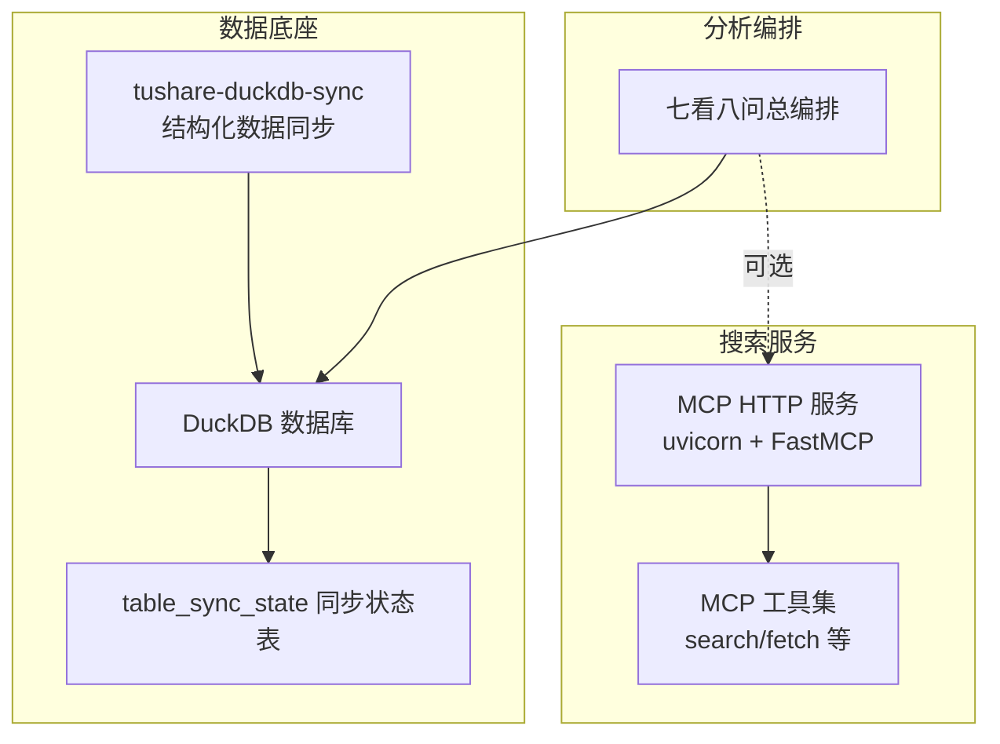
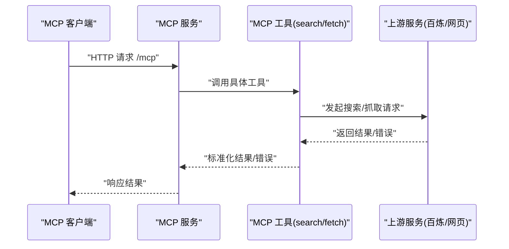
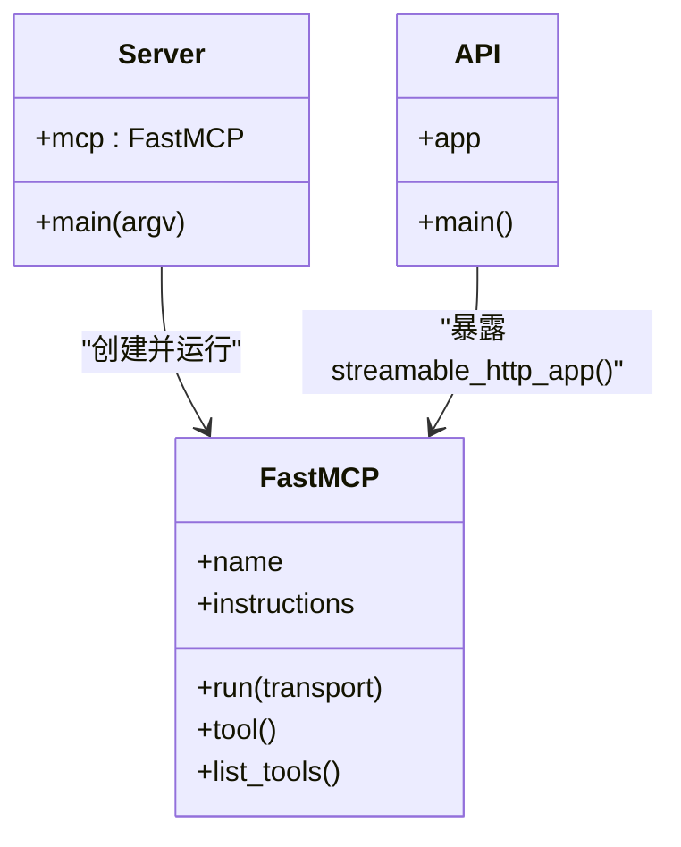
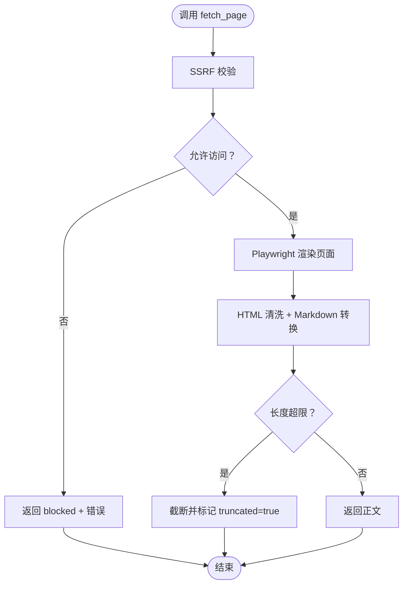
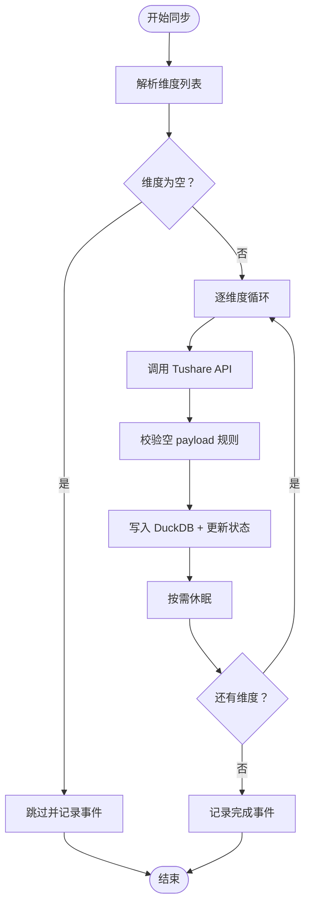

# 监控运维

<cite>
**本文引用的文件**
- [nano-search-mcp/README.md](file://nano-search-mcp/README.md)
- [nano-search-mcp/pyproject.toml](file://nano-search-mcp/pyproject.toml)
- [nano-search-mcp/src/nano_search_mcp/server.py](file://nano-search-mcp/src/nano_search_mcp/server.py)
- [nano-search-mcp/src/nano_search_mcp/api.py](file://nano-search-mcp/src/nano_search_mcp/api.py)
- [nano-search-mcp/src/nano_search_mcp/tools/search.py](file://nano-search-mcp/src/nano_search_mcp/tools/search.py)
- [nano-search-mcp/src/nano_search_mcp/tools/fetch.py](file://nano-search-mcp/src/nano_search_mcp/tools/fetch.py)
- [nano-search-mcp/tests/test_server.py](file://nano-search-mcp/tests/test_server.py)
- [nano-search-mcp/tests/test_fetch.py](file://nano-search-mcp/tests/test_fetch.py)
- [tushare-duckdb-sync/README.md](file://tushare-duckdb-sync/README.md)
- [tushare-duckdb-sync/SKILL.md](file://tushare-duckdb-sync/SKILL.md)
- [tushare-duckdb-sync/scripts/sync_table.py](file://tushare-duckdb-sync/scripts/sync_table.py)
- [2min-company-analysis/README.md](file://2min-company-analysis/README.md)
</cite>

## 目录
1. [简介](#简介)
2. [项目结构](#项目结构)
3. [核心组件](#核心组件)
4. [架构总览](#架构总览)
5. [详细组件分析](#详细组件分析)
6. [依赖分析](#依赖分析)
7. [性能考虑](#性能考虑)
8. [故障排查指南](#故障排查指南)
9. [结论](#结论)
10. [附录](#附录)

## 简介
本指南面向“nano_quant_skills”仓库中的监控与运维实践，聚焦以下方面：
- 关键指标与监控工具选择：结合服务特性（HTTP MCP 服务、网页抓取、数据同步）定义可观测性重点。
- 日志管理最佳实践：统一日志格式、存储与查询策略。
- 健康检查与故障检测：服务可用性、上游依赖健康、抓取与同步稳定性。
- 性能监控与瓶颈分析：并发、超时、资源占用与重试策略。
- 告警配置与通知：基于事件日志与错误路径的告警建议。
- 备份与恢复：DuckDB 数据与同步状态的备份策略。
- 系统维护与升级：版本演进、依赖更新与迁移。
- 安全监控与入侵检测：SSRF 防护、访问控制与异常行为识别。
- 运维自动化与 CI/CD 集成：批处理、断点续传与流水线。

## 项目结构
该仓库采用多模块协作的 monorepo 结构：
- 数据底座：tushare-duckdb-sync，负责结构化数据的全量/增量同步，并维护同步状态与质量。
- 搜索服务：nano-search-mcp，提供 MCP HTTP 服务，封装网页搜索与抓取能力。
- 分析编排：2min-company-analysis，消费 DuckDB 数据与可选的外部证据（来自搜索服务）进行结构化分析。

图表来源
- [nano-search-mcp/src/nano_search_mcp/server.py:18-70](file://nano-search-mcp/src/nano_search_mcp/server.py#L18-L70)
- [tushare-duckdb-sync/scripts/sync_table.py:156-207](file://tushare-duckdb-sync/scripts/sync_table.py#L156-L207)
- [2min-company-analysis/README.md:1-132](file://2min-company-analysis/README.md#L1-L132)

章节来源
- [nano-search-mcp/README.md:1-198](file://nano-search-mcp/README.md#L1-L198)
- [tushare-duckdb-sync/README.md:1-173](file://tushare-duckdb-sync/README.md#L1-L173)
- [2min-company-analysis/README.md:1-132](file://2min-company-analysis/README.md#L1-L132)

## 核心组件
- MCP 服务与工具注册：服务通过 FastMCP 注册 12 个工具，提供搜索、抓取、报告、公告、研报、监管、IR、政策等能力。
- HTTP 入口：提供 streamable HTTP 路由，兼容标准 MCP 客户端。
- 网页抓取与 SSRF 防护：Playwright 渲染 + HTML 清洗 + URL 白名单校验，拒绝 loopback/私网/元数据等危险地址。
- 数据同步与状态管理：Tushare → DuckDB 同步，支持三种维度（none/trade_date/period），维护 table_sync_state 以支持断点续传与失败追踪。
- 质检与文档：同步后执行数据质量检查，更新元数据文档与映射注册表。

章节来源
- [nano-search-mcp/src/nano_search_mcp/server.py:18-70](file://nano-search-mcp/src/nano_search_mcp/server.py#L18-L70)
- [nano-search-mcp/src/nano_search_mcp/api.py:1-12](file://nano-search-mcp/src/nano_search_mcp/api.py#L1-L12)
- [nano-search-mcp/src/nano_search_mcp/tools/fetch.py:24-74](file://nano-search-mcp/src/nano_search_mcp/tools/fetch.py#L24-L74)
- [tushare-duckdb-sync/scripts/sync_table.py:156-207](file://tushare-duckdb-sync/scripts/sync_table.py#L156-L207)
- [tushare-duckdb-sync/SKILL.md:390-449](file://tushare-duckdb-sync/SKILL.md#L390-L449)

## 架构总览
MCP 服务作为外部证据采集的“搜索网关”，与数据底座（DuckDB）和分析编排（七看八问）形成清晰的三层协作关系。同步脚本通过 Tushare API 拉取数据，落地 DuckDB 并记录同步状态；分析模块在运行时读取 DuckDB 数据，必要时调用 MCP 工具获取外部证据。

图表来源
- [nano-search-mcp/src/nano_search_mcp/server.py:18-70](file://nano-search-mcp/src/nano_search_mcp/server.py#L18-L70)
- [nano-search-mcp/src/nano_search_mcp/tools/search.py:41-70](file://nano-search-mcp/src/nano_search_mcp/tools/search.py#L41-L70)
- [nano-search-mcp/src/nano_search_mcp/tools/fetch.py:163-176](file://nano-search-mcp/src/nano_search_mcp/tools/fetch.py#L163-L176)

## 详细组件分析

### MCP 服务与工具注册
- 服务实例：FastMCP，提供 streamable HTTP 路由与指令说明，声明 12 个工具域的能力边界。
- 工具注册：按能力域逐一注册，包括通用检索、定期报告、临时公告、行业研报、监管与处罚、投资者关系、行业政策等。
- 启动方式：支持 streamable-http（默认）与 stdio 两种传输；通过命令行参数切换。

图表来源
- [nano-search-mcp/src/nano_search_mcp/server.py:18-86](file://nano-search-mcp/src/nano_search_mcp/server.py#L18-L86)
- [nano-search-mcp/src/nano_search_mcp/api.py:1-12](file://nano-search-mcp/src/nano_search_mcp/api.py#L1-L12)

章节来源
- [nano-search-mcp/src/nano_search_mcp/server.py:18-86](file://nano-search-mcp/src/nano_search_mcp/server.py#L18-L86)
- [nano-search-mcp/tests/test_server.py:49-83](file://nano-search-mcp/tests/test_server.py#L49-L83)

### 搜索工具（WebSearch）
- 功能：基于百炼 WebSearch 的网页搜索，返回标题、URL、摘要列表。
- 参数与约束：max_results 限定范围、region/timelimit 作为查询提示词拼接、错误路径抛出异常。
- 错误契约：失败时抛出异常，便于上层感知严重错误。

章节来源
- [nano-search-mcp/src/nano_search_mcp/tools/search.py:79-119](file://nano-search-mcp/src/nano_search_mcp/tools/search.py#L79-L119)

### 页面抓取工具（SSRF 防护与 Playwright 渲染）
- SSRF 防护：仅允许 http/https，拒绝 file、loopback、RFC1918 私网、链路本地、云元数据端点等。
- 渲染与清洗：Playwright 无头浏览器渲染，BeautifulSoup 清理噪声标签，markdownify 输出正文。
- 结果结构：包含 url、content、method、truncated、error；失败时返回 blocked 与错误信息。
- 资源复用：惰性创建并复用 Chromium 实例，降低冷启动开销。

图表来源
- [nano-search-mcp/src/nano_search_mcp/tools/fetch.py:24-74](file://nano-search-mcp/src/nano_search_mcp/tools/fetch.py#L24-L74)
- [nano-search-mcp/src/nano_search_mcp/tools/fetch.py:163-176](file://nano-search-mcp/src/nano_search_mcp/tools/fetch.py#L163-L176)

章节来源
- [nano-search-mcp/src/nano_search_mcp/tools/fetch.py:163-245](file://nano-search-mcp/src/nano_search_mcp/tools/fetch.py#L163-L245)
- [nano-search-mcp/tests/test_fetch.py:1-98](file://nano-search-mcp/tests/test_fetch.py#L1-L98)

### 数据同步与状态管理（Tushare → DuckDB）
- 维度类型：none（全量覆盖）、trade_date（交易日增量）、period（报告期增量）。
- 安全截止规则：默认 Asia/Shanghai 18:00 截止，避免当日未发布数据导致的空 payload 误判。
- 断点续传：基于 DuckDB 内表 table_sync_state 记录维度值同步状态，支持失败追踪与继续。
- 写入策略：overwrite/append 模式，自动对齐列、日期类型转换、空值规范化。
- 事件日志：统一以 JSON 事件格式记录同步生命周期事件，便于审计与监控。

图表来源
- [tushare-duckdb-sync/scripts/sync_table.py:265-288](file://tushare-duckdb-sync/scripts/sync_table.py#L265-L288)
- [tushare-duckdb-sync/scripts/sync_table.py:294-338](file://tushare-duckdb-sync/scripts/sync_table.py#L294-L338)
- [tushare-duckdb-sync/scripts/sync_table.py:451-518](file://tushare-duckdb-sync/scripts/sync_table.py#L451-L518)

章节来源
- [tushare-duckdb-sync/scripts/sync_table.py:1-618](file://tushare-duckdb-sync/scripts/sync_table.py#L1-L618)
- [tushare-duckdb-sync/SKILL.md:108-188](file://tushare-duckdb-sync/SKILL.md#L108-L188)

## 依赖分析
- MCP 服务依赖：mcp[cli]、httpx、pyyaml、uvicorn、playwright、beautifulsoup4、markdownify。
- 同步脚本依赖：tushare、duckdb、pandas、loguru；使用 zoneinfo（Python 3.9+）或回退实现。
- 测试依赖：pytest；测试覆盖工具注册契约、SSRF 防护、MCP 工具层与关键抓取路径。

章节来源
- [nano-search-mcp/pyproject.toml:6-14](file://nano-search-mcp/pyproject.toml#L6-L14)
- [tushare-duckdb-sync/README.md:17-27](file://tushare-duckdb-sync/README.md#L17-L27)

## 性能考虑
- 并发与资源复用：MCP 服务基于 FastMCP，工具层采用异步抓取；抓取工具复用 Playwright/Chromium 实例，减少冷启动。
- 超时与重试：抓取工具对不安全 URL 直接阻断并返回；同步脚本对上游调用进行有限重试与退避；建议根据上游 SLA 调整 sleep/base_sleep。
- 网络与渲染成本：抓取工具对页面渲染后等待固定时长，建议在代理/网络稳定环境下运行，避免不必要的超时。
- 数据写入：DuckDB 批量写入与列对齐，注意维度类型转换与空值处理的成本。

章节来源
- [nano-search-mcp/src/nano_search_mcp/tools/fetch.py:133-161](file://nano-search-mcp/src/nano_search_mcp/tools/fetch.py#L133-L161)
- [tushare-duckdb-sync/scripts/sync_table.py:300-320](file://tushare-duckdb-sync/scripts/sync_table.py#L300-L320)

## 故障排查指南
- MCP 服务不可用
  - 检查 HTTP 路由与传输参数；确认默认监听路径与客户端对接一致。
  - 核对工具注册清单，确保新增工具已注册。
- 抓取失败
  - SSRF 防护触发：检查 URL 协议与目标地址是否在白名单范围内。
  - 渲染失败：检查网络连通性、DNS 解析、代理设置；适当增加超时或重试。
- 同步失败
  - 空 payload：确认是否处于“发布截止窗口”内；必要时使用 allow_empty_result 或调整截止规则。
  - 断点续传：查看 table_sync_state 中失败记录，定位具体维度值并重试。
- 质检不通过
  - 检查 PK 唯一性、日期范围、空值率、NaN 字符污染等；按文档更新元数据与映射注册表。

章节来源
- [nano-search-mcp/tests/test_server.py:49-83](file://nano-search-mcp/tests/test_server.py#L49-L83)
- [nano-search-mcp/tests/test_fetch.py:48-98](file://nano-search-mcp/tests/test_fetch.py#L48-L98)
- [tushare-duckdb-sync/scripts/sync_table.py:322-338](file://tushare-duckdb-sync/scripts/sync_table.py#L322-L338)
- [tushare-duckdb-sync/SKILL.md:278-320](file://tushare-duckdb-sync/SKILL.md#L278-L320)

## 结论
本仓库围绕“数据底座 + 搜索服务 + 分析编排”的三层架构，提供了完善的可观测性基础：MCP 服务具备工具注册契约与 HTTP 入口；抓取工具内置 SSRF 防护与日志；同步脚本以事件日志与状态表支撑断点续传与质量治理。建议在此基础上引入统一日志平台、健康检查与告警策略，以实现端到端的监控运维闭环。

## 附录

### 关键指标与监控工具选择
- 指标建议
  - MCP 服务：请求量、成功率、P95/P99 延迟、并发连接数、工具调用耗时分布。
  - 抓取链路：SSRF 拦截次数、渲染失败率、超时比例、内容截断比例。
  - 同步链路：维度处理速率、重试次数、空 payload 比例、写入吞吐、状态表更新延迟。
- 工具建议
  - 日志：统一 JSON 事件格式，结合结构化日志收集（如 Loki/ELK）。
  - 指标：Prometheus + Grafana，暴露 HTTP/ASGI 指标与自定义指标。
  - 告警：基于阈值与趋势的告警策略，结合值班与通知渠道。

### 日志管理最佳实践
- 格式：统一 JSON 事件，包含 event、timestamp、source、level、payload 等字段。
- 存储：按天/按月切分，保留 30-90 天滚动日志；事件日志与应用日志分离。
- 查询：建立索引字段（如 event、source、level），支持关键字与时间范围检索。
- 安全：避免敏感信息（如 Token）落盘；对日志进行脱敏与访问控制。

章节来源
- [tushare-duckdb-sync/scripts/sync_table.py:98-99](file://tushare-duckdb-sync/scripts/sync_table.py#L98-L99)
- [tushare-duckdb-sync/SKILL.md:390-396](file://tushare-duckdb-sync/SKILL.md#L390-L396)

### 健康检查与故障检测
- 健康检查
  - MCP 服务：/mcp 路由可达性与工具列表一致性。
  - 抓取链路：定时探测外部站点连通性与渲染可用性。
  - 同步链路：检查 DuckDB 可写、table_sync_state 可读写、Tushare Token 有效。
- 故障检测
  - 异常路径：工具异常、SSRF 拦截、空 payload、写入失败。
  - 周期性巡检：维度缺口、日期断层、重复记录、字段差异。

章节来源
- [nano-search-mcp/tests/test_server.py:30-47](file://nano-search-mcp/tests/test_server.py#L30-L47)
- [tushare-duckdb-sync/SKILL.md:278-320](file://tushare-duckdb-sync/SKILL.md#L278-L320)

### 性能监控与瓶颈分析
- 抓取瓶颈：网络抖动、DNS 解析、渲染超时；建议在边缘节点部署或使用代理。
- 同步瓶颈：API 限频、DuckDB 写入、列对齐与类型转换；建议调整 sleep 与批次大小。
- 资源瓶颈：CPU/内存/磁盘 IO；建议监控容器资源并扩容。

章节来源
- [tushare-duckdb-sync/scripts/sync_table.py:500-501](file://tushare-duckdb-sync/scripts/sync_table.py#L500-L501)
- [nano-search-mcp/src/nano_search_mcp/tools/fetch.py:133-161](file://nano-search-mcp/src/nano_search_mcp/tools/fetch.py#L133-L161)

### 告警配置与通知机制
- 告警规则
  - 请求错误率突增、P95 延迟超阈、抓取失败率、同步空 payload 比例、状态表更新停滞。
- 通知渠道
  - 邮件、IM、电话；区分严重/警告级别；避免告警风暴。

### 备份与恢复
- DuckDB 数据：定期物理备份；支持增量备份策略。
- 同步状态：table_sync_state 作为断点续传依据，需纳入备份与校验。
- 恢复流程：验证备份完整性 → 停服/切换流量 → 恢复数据 → 校验同步状态 → 启动服务。

章节来源
- [tushare-duckdb-sync/scripts/sync_table.py:156-207](file://tushare-duckdb-sync/scripts/sync_table.py#L156-L207)
- [tushare-duckdb-sync/SKILL.md:390-396](file://tushare-duckdb-sync/SKILL.md#L390-L396)

### 系统维护与升级
- 升级策略：灰度发布、回滚预案、依赖版本锁定。
- 维护窗口：避开交易日 18:00 截止窗口；同步任务暂停或延后。
- 变更管理：变更前冻结同步任务，变更后验证工具注册与抓取链路。

章节来源
- [tushare-duckdb-sync/README.md:40-46](file://tushare-duckdb-sync/README.md#L40-L46)
- [nano-search-mcp/README.md:79-104](file://nano-search-mcp/README.md#L79-L104)

### 安全监控与入侵检测
- SSRF 防护：持续验证 URL 白名单与解析逻辑；监控拦截事件。
- 访问控制：限制 MCP 服务暴露面，启用认证与授权。
- 异常行为：异常高失败率、异常维度处理、异常日志模式。

章节来源
- [nano-search-mcp/src/nano_search_mcp/tools/fetch.py:24-74](file://nano-search-mcp/src/nano_search_mcp/tools/fetch.py#L24-L74)
- [nano-search-mcp/README.md:50-54](file://nano-search-mcp/README.md#L50-L54)

### 运维自动化与 CI/CD 集成
- 批处理：使用 tasks.json 批量同步，结合断点续传与失败重试。
- 流水线：代码变更 → 单元测试 → 安全扫描 → 构建镜像 → 发布部署 → 健康检查。
- 监控集成：在流水线中加入指标与日志采集，确保发布质量。

章节来源
- [tushare-duckdb-sync/README.md:89-114](file://tushare-duckdb-sync/README.md#L89-L114)
- [tushare-duckdb-sync/SKILL.md:108-188](file://tushare-duckdb-sync/SKILL.md#L108-L188)