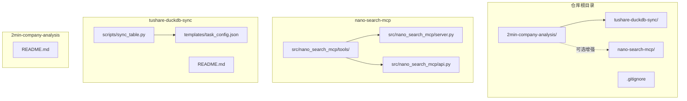
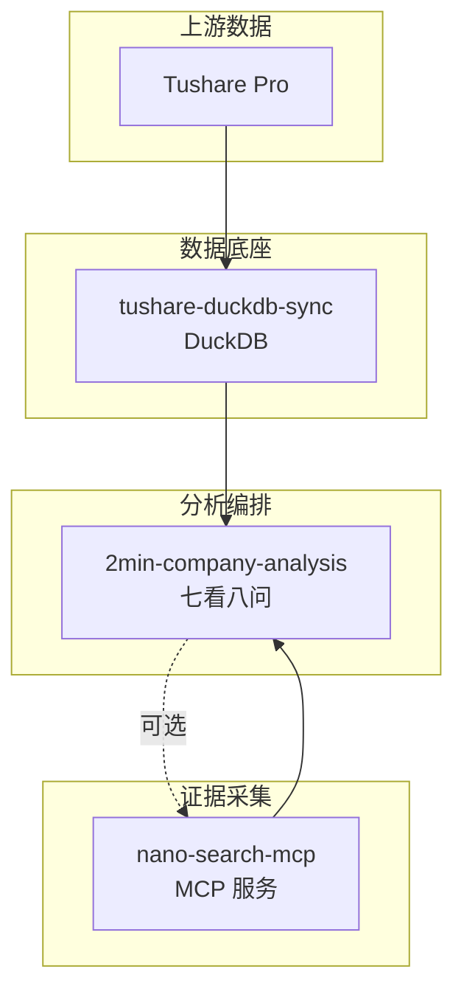
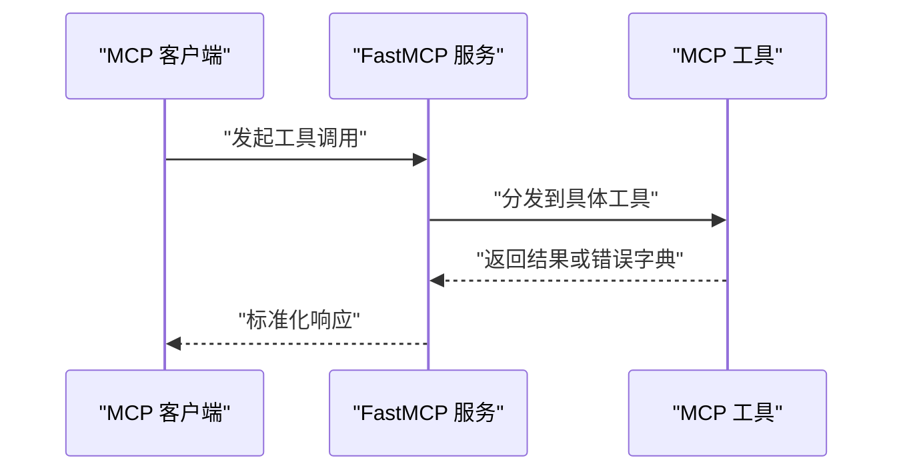
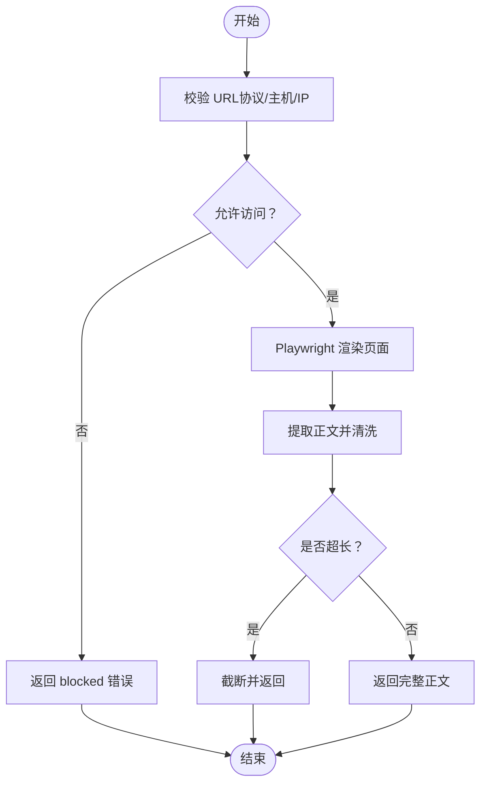
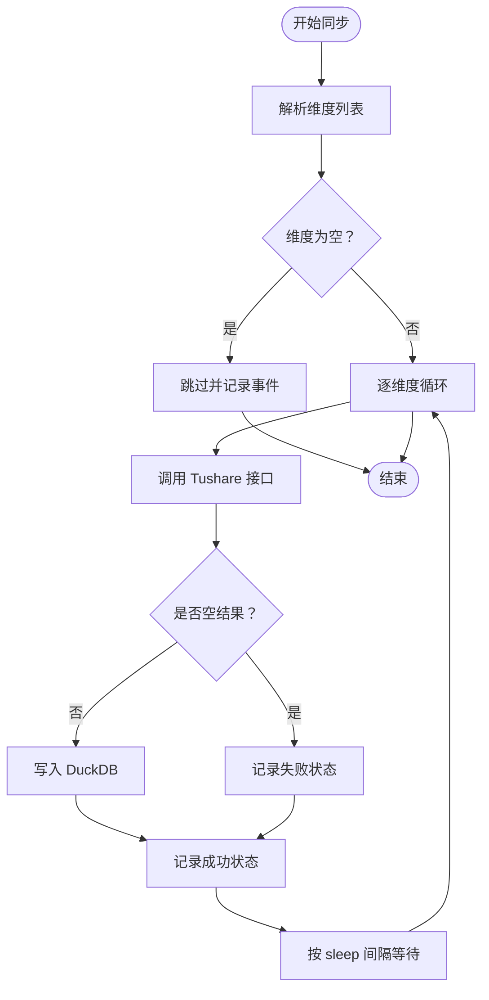
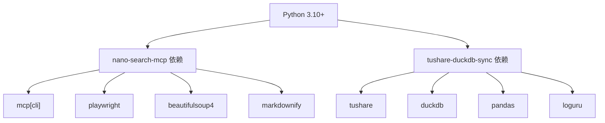

# 配置与部署

<cite>
**本文引用的文件**   
- [pyproject.toml](file://nano-search-mcp/pyproject.toml)
- [server.py](file://nano-search-mcp/src/nano_search_mcp/server.py)
- [api.py](file://nano-search-mcp/src/nano_search_mcp/api.py)
- [search.py](file://nano-search-mcp/src/nano_search_mcp/tools/search.py)
- [fetch.py](file://nano-search-mcp/src/nano_search_mcp/tools/fetch.py)
- [README.md（nano-search-mcp）](file://nano-search-mcp/README.md)
- [README.md（tushare-duckdb-sync）](file://tushare-duckdb-sync/README.md)
- [sync_table.py](file://tushare-duckdb-sync/scripts/sync_table.py)
- [task_config.json](file://tushare-duckdb-sync/templates/task_config.json)
- [README.md（2min-company-analysis）](file://2min-company-analysis/README.md)
</cite>

## 目录
1. [简介](#简介)
2. [项目结构](#项目结构)
3. [核心组件](#核心组件)
4. [架构总览](#架构总览)
5. [详细组件分析](#详细组件分析)
6. [依赖关系分析](#依赖关系分析)
7. [性能考量](#性能考量)
8. [故障排除指南](#故障排除指南)
9. [结论](#结论)
10. [附录](#附录)

## 简介
本指南面向 NanoQuant Skills 项目，提供从环境准备、安装部署到生产运行与运维的全流程配置与部署说明。项目包含三大子模块：
- 数据底座：tushare-duckdb-sync，负责将 Tushare 结构化数据同步至 DuckDB，并提供断点续传与数据质量检查。
- 搜索服务：nano-search-mcp，基于 MCP 协议提供网页搜索、页面抓取与多类外部证据工具，内置安全防护与指数退避重试。
- 分析编排：2min-company-analysis，以“七看八问”为主线的结构化分析与证据采集编排模块，可选接入搜索服务。

本指南覆盖：
- 环境与依赖要求
- 安装与启动步骤（含不同操作系统与部署形态）
- 配置文件与参数说明（环境变量、CLI 参数、任务配置）
- 生产部署策略与安全考虑
- Docker 与 Kubernetes 部署思路
- 监控、日志与备份最佳实践
- 故障排除与性能调优建议

## 项目结构
仓库采用多模块（monorepo）组织，核心目录如下：
- nano-search-mcp：MCP 搜索服务，提供搜索、抓取与外部证据工具
- tushare-duckdb-sync：Tushare → DuckDB 同步工具，含脚本与模板
- 2min-company-analysis：分析编排与规则技能集合
- .gitignore：版本控制忽略清单

图表来源
- [server.py:1-91](file://nano-search-mcp/src/nano_search_mcp/server.py#L1-L91)
- [api.py:1-12](file://nano-search-mcp/src/nano_search_mcp/api.py#L1-L12)
- [sync_table.py:1-618](file://tushare-duckdb-sync/scripts/sync_table.py#L1-L618)
- [task_config.json:1-22](file://tushare-duckdb-sync/templates/task_config.json#L1-L22)
- [README.md（2min-company-analysis）:1-132](file://2min-company-analysis/README.md#L1-L132)

章节来源
- [README.md（2min-company-analysis）:1-132](file://2min-company-analysis/README.md#L1-L132)

## 核心组件
- MCP 服务（nano-search-mcp）
  - 通过 FastMCP 创建服务实例，注册 12 类工具，支持 streamable HTTP 与 stdio 两种传输方式
  - 提供搜索、页面抓取、公告、研报、IR、监管处罚、行业政策等工具
  - 内置 SSRF 防护、指数退避重试与统一错误契约
- DuckDB 同步（tushare-duckdb-sync）
  - 支持三种维度：none/trade_date/period
  - 断点续传、失败追踪、空 payload 保护
  - 提供任务配置模板与批量执行能力
- 分析编排（2min-company-analysis）
  - 以“七看八问”为主线的规则与证据采集流程
  - 可选接入 MCP 搜索服务以补充外部证据

章节来源
- [server.py:1-91](file://nano-search-mcp/src/nano_search_mcp/server.py#L1-L91)
- [README.md（nano-search-mcp）:1-198](file://nano-search-mcp/README.md#L1-L198)
- [README.md（tushare-duckdb-sync）:1-173](file://tushare-duckdb-sync/README.md#L1-L173)
- [README.md（2min-company-analysis）:1-132](file://2min-company-analysis/README.md#L1-L132)

## 架构总览
整体运行时由“数据底座 + 搜索服务 + 分析编排”组成，数据流如下：

图表来源
- [README.md（tushare-duckdb-sync）:1-173](file://tushare-duckdb-sync/README.md#L1-L173)
- [README.md（nano-search-mcp）:1-198](file://nano-search-mcp/README.md#L1-L198)
- [README.md（2min-company-analysis）:1-132](file://2min-company-analysis/README.md#L1-L132)

## 详细组件分析

### MCP 服务（nano-search-mcp）
- 服务入口与传输
  - 默认通过 streamable HTTP 监听本地路径，支持 stdio 本地直连
  - 通过命令行参数选择传输方式
- 工具注册与功能
  - 注册 12 类工具，覆盖搜索、抓取、公告、研报、IR、监管处罚、行业政策等
  - 统一错误契约：部分工具失败时返回结构化错误字典，非异常
- 安全与可靠性
  - SSRF 防护：严格校验 URL 协议与目标地址，拒绝 loopback、私网、云元数据等
  - 指数退避重试与请求限频，保障稳定性
- 启动与使用
  - 可作为命令行服务启动，也可在 Python 代码中导入服务对象或 ASGI 应用

图表来源
- [server.py:72-86](file://nano-search-mcp/src/nano_search_mcp/server.py#L72-L86)
- [api.py:6-11](file://nano-search-mcp/src/nano_search_mcp/api.py#L6-L11)

章节来源
- [server.py:1-91](file://nano-search-mcp/src/nano_search_mcp/server.py#L1-L91)
- [api.py:1-12](file://nano-search-mcp/src/nano_search_mcp/api.py#L1-L12)
- [README.md（nano-search-mcp）:1-198](file://nano-search-mcp/README.md#L1-L198)

### 搜索与抓取工具（search 与 fetch）
- 搜索工具（search）
  - 基于百炼 WebSearch，支持区域与时间范围过滤提示词拼接
  - 结果标准化为标题、URL、摘要三项
- 抓取工具（fetch_page）
  - 基于 Playwright 异步渲染，提取正文并转为 Markdown
  - 内容清洗：去除 header/footer/广告/侧边栏等噪声
  - SSRF 防护：严格校验协议与目标地址，拒绝内网/本地/保留地址
  - 截断保护：正文超过阈值自动截断

图表来源
- [fetch.py:24-74](file://nano-search-mcp/src/nano_search_mcp/tools/fetch.py#L24-L74)
- [fetch.py:163-175](file://nano-search-mcp/src/nano_search_mcp/tools/fetch.py#L163-L175)
- [fetch.py:186-218](file://nano-search-mcp/src/nano_search_mcp/tools/fetch.py#L186-L218)

章节来源
- [search.py:1-119](file://nano-search-mcp/src/nano_search_mcp/tools/search.py#L1-L119)
- [fetch.py:1-245](file://nano-search-mcp/src/nano_search_mcp/tools/fetch.py#L1-L245)

### DuckDB 同步（tushare-duckdb-sync）
- 环境变量
  - TUSHARE_TOKEN：Tushare Pro 访问令牌
- 维度与模式
  - 维度：none（全量覆盖）、trade_date（按交易日增量）、period（按报告期增量）
  - 模式：overwrite（覆盖）、append（追加）
- 安全截止与空 payload 保护
  - 交易日维度默认采用 Asia/Shanghai 18:00 安全截止规则
  - 增量维度默认把空返回记为失败，避免误成功
- 断点续传
  - DuckDB 内部维护 table_sync_state 表，记录同步状态，支持跳过已同步维度
- 任务配置
  - 支持单任务与批量任务（tasks.json），包含 endpoint、维度、日期范围、重试与限频等参数

图表来源
- [sync_table.py:265-287](file://tushare-duckdb-sync/scripts/sync_table.py#L265-L287)
- [sync_table.py:294-337](file://tushare-duckdb-sync/scripts/sync_table.py#L294-L337)
- [sync_table.py:451-517](file://tushare-duckdb-sync/scripts/sync_table.py#L451-L517)

章节来源
- [README.md（tushare-duckdb-sync）:1-173](file://tushare-duckdb-sync/README.md#L1-L173)
- [sync_table.py:1-618](file://tushare-duckdb-sync/scripts/sync_table.py#L1-L618)
- [task_config.json:1-22](file://tushare-duckdb-sync/templates/task_config.json#L1-L22)

### 分析编排（2min-company-analysis）
- 使用路径
  - 总编排：一键执行七看，可选并入八问并输出综合报告
  - 单独执行：按 look 或 ask 目录单独运行
- 依赖关系
  - 结构化数据依赖 tushare-duckdb-sync
  - 外部证据可选依赖 nano-search-mcp
- 环境变量
  - DASHSCOPE_API_KEY：用于百炼相关能力（如行业政策检索）

章节来源
- [README.md（2min-company-analysis）:1-132](file://2min-company-analysis/README.md#L1-L132)

## 依赖关系分析
- 语言与运行时
  - Python ≥ 3.10
  - 推荐 Conda 环境：legonanobot
- 依赖包
  - MCP 服务：mcp[cli]、httpx、pyyaml、uvicorn、playwright、beautifulsoup4、markdownify
  - 开发依赖：pytest
- 第三方服务
  - Tushare Pro：结构化数据源
  - 百炼（DashScope）：网页搜索与检索能力
  - DuckDB：本地嵌入式数据库

图表来源
- [pyproject.toml:6-14](file://nano-search-mcp/pyproject.toml#L6-L14)
- [README.md（tushare-duckdb-sync）:15-19](file://tushare-duckdb-sync/README.md#L15-L19)

章节来源
- [pyproject.toml:1-44](file://nano-search-mcp/pyproject.toml#L1-L44)
- [README.md（tushare-duckdb-sync）:15-19](file://tushare-duckdb-sync/README.md#L15-L19)

## 性能考量
- 搜索与抓取
  - 搜索工具支持区域与时间过滤提示词，减少无关结果，提高命中率
  - 抓取工具使用 Playwright 异步渲染，结合内容清洗与截断保护，平衡准确性与性能
- 同步与限频
  - DuckDB 同步脚本内置 sleep 与指数退避重试，避免触发上游限频
  - 交易日维度默认安全截止，减少无效重试
- 并发与资源
  - MCP 服务默认 streamable HTTP，适合高并发接入；stdio 适合本地直连
  - 建议根据并发量调整进程/容器资源与超时配置

章节来源
- [search.py:17-38](file://nano-search-mcp/src/nano_search_mcp/tools/search.py#L17-L38)
- [fetch.py:163-175](file://nano-search-mcp/src/nano_search_mcp/tools/fetch.py#L163-L175)
- [sync_table.py:300-319](file://tushare-duckdb-sync/scripts/sync_table.py#L300-L319)
- [README.md（nano-search-mcp）:104-104](file://nano-search-mcp/README.md#L104-L104)

## 故障排除指南
- 环境与依赖
  - Python 版本过低：确保 ≥ 3.10
  - Playwright 未安装：执行浏览器安装命令
  - Tushare Token 未设置：导出 TUSHARE_TOKEN 环境变量
- MCP 服务
  - 传输方式选择：默认 streamable HTTP，本地直连可切换 stdio
  - 工具失败：检查参数合法性与网络可达性；部分工具失败返回错误字典而非抛异常
- 同步失败
  - 空 payload：交易日维度默认视为失败，可使用 allow_empty_result 明确允许
  - 断点续传：利用 table_sync_state 表定位失败维度，定向重试
- 日志与可观测性
  - 使用 loguru 输出结构化事件，便于排查与审计

章节来源
- [README.md（nano-search-mcp）:55-104](file://nano-search-mcp/README.md#L55-L104)
- [README.md（tushare-duckdb-sync）:21-46](file://tushare-duckdb-sync/README.md#L21-L46)
- [sync_table.py:198-206](file://tushare-duckdb-sync/scripts/sync_table.py#L198-L206)
- [sync_table.py:322-337](file://tushare-duckdb-sync/scripts/sync_table.py#L322-L337)

## 结论
本指南提供了 NanoQuant Skills 项目的完整配置与部署蓝图：从环境准备、安装部署到生产运行与运维。通过数据底座与搜索服务的协同，结合分析编排模块，可实现从结构化数据到外部证据的闭环分析流程。建议在生产环境中强化安全与监控，采用断点续传与指数退避策略，确保稳定性与可维护性。

## 附录

### 环境配置要求
- Python：≥ 3.10
- Conda 环境：legonanobot
- Playwright：Chromium 浏览器
- DuckDB：本地嵌入式数据库
- Tushare Pro：结构化数据源
- DashScope（可选）：百炼 API

章节来源
- [README.md（nano-search-mcp）:55-59](file://nano-search-mcp/README.md#L55-L59)
- [README.md（tushare-duckdb-sync）:15-19](file://tushare-duckdb-sync/README.md#L15-L19)

### 安装与部署步骤
- 安装 MCP 服务
  - 进入 nano-search-mcp 目录，使用可编辑安装与开发依赖
  - 安装 Playwright 浏览器
- 安装 DuckDB 同步
  - 安装依赖包
  - 设置 TUSHARE_TOKEN 环境变量
- 启动 MCP 服务
  - 默认 streamable HTTP 监听本地路径
  - 可切换 stdio 用于本地直连
- 运行分析编排
  - 先同步结构化数据，再执行总编排或单项规则
  - 可选启用外部证据链路并设置 DashScope API Key

章节来源
- [README.md（nano-search-mcp）:61-124](file://nano-search-mcp/README.md#L61-L124)
- [README.md（tushare-duckdb-sync）:13-38](file://tushare-duckdb-sync/README.md#L13-L38)
- [README.md（2min-company-analysis）:109-121](file://2min-company-analysis/README.md#L109-L121)

### 配置文件与参数说明
- 环境变量
  - TUSHARE_TOKEN：Tushare Pro 访问令牌
  - DASHSCOPE_API_KEY（可选）：百炼 API Key
- CLI 参数（MCP 服务）
  - --transport：选择 streamable-http 或 stdio
- CLI 参数（DuckDB 同步）
  - --endpoint：Tushare 接口名
  - --mode：overwrite 或 append
  - --dimension-type：none/trade_date/period
  - --start-date/--end-date：日期范围
  - --sync-all：启用断点续传
  - --sleep/--max-retries：限频与重试
  - --allow-empty-result：允许空 payload 成功
  - --tasks-file：批量任务 JSON 文件
- 任务配置模板
  - 包含 endpoint、维度、日期范围、限频与参数透传等字段

章节来源
- [README.md（tushare-duckdb-sync）:131-152](file://tushare-duckdb-sync/README.md#L131-L152)
- [task_config.json:1-22](file://tushare-duckdb-sync/templates/task_config.json#L1-L22)
- [sync_table.py:524-562](file://tushare-duckdb-sync/scripts/sync_table.py#L524-L562)

### 生产部署策略与安全考虑
- 部署形态
  - MCP 服务：streamable HTTP 适合对外提供能力；stdio 适合本地直连
  - DuckDB：单机文件存储，建议置于持久化卷
- 安全基线
  - SSRF 防护：严格校验 URL，拒绝内网/本地/保留地址
  - 指数退避与限频：避免触发上游限流
  - 传输安全：建议在反向代理层启用 TLS
- 超时与并发
  - 根据 fetch_page 与报告抓取的最长耗时设置反向代理与网关超时
  - 合理设置并发与资源配额，避免资源争用

章节来源
- [README.md（nano-search-mcp）:50-54](file://nano-search-mcp/README.md#L50-L54)
- [README.md（nano-search-mcp）:104-104](file://nano-search-mcp/README.md#L104-L104)
- [fetch.py:24-74](file://nano-search-mcp/src/nano_search_mcp/tools/fetch.py#L24-L74)

### Docker 与 Kubernetes 部署方案
- Docker 镜像建议
  - 基础镜像：Python 3.10+（Alpine 或 Debian）
  - 安装系统依赖与 Playwright 二进制
  - 复制并安装项目依赖，暴露 MCP 服务端口
- Kubernetes 配置要点
  - Deployment：副本数、资源请求/限制、健康检查
  - Service：ClusterIP/LoadBalancer，暴露 MCP 端口
  - ConfigMap/Secret：存放环境变量（TUSHARE_TOKEN、DASHSCOPE_API_KEY）
  - PVC：挂载 DuckDB 文件与日志目录
  - Ingress：TLS 终止与超时配置
- 建议
  - 将 DuckDB 文件与日志目录持久化
  - 使用 PodDisruptionBudget 控制滚动更新
  - 配置 HPA/VPD 以弹性伸缩

（本节为概念性部署建议，不直接映射到具体源码文件）

### 监控、日志与备份最佳实践
- 监控
  - 指标：请求速率、错误率、P95/P99 延迟、并发连接数
  - 告警：异常增长、超时、SSRF 拦截事件
- 日志
  - 使用 loguru 输出结构化事件，包含事件类型、维度值、错误上下文
  - 采集容器 stdout/stderr，集中化存储与检索
- 备份
  - DuckDB 文件定期快照与异地备份
  - table_sync_state 状态表用于断点续传，建议纳入备份策略

章节来源
- [sync_table.py:98-99](file://tushare-duckdb-sync/scripts/sync_table.py#L98-L99)
- [sync_table.py:189-206](file://tushare-duckdb-sync/scripts/sync_table.py#L189-L206)