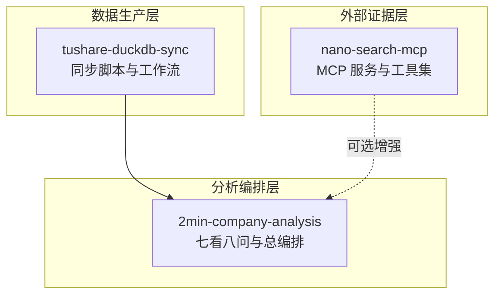
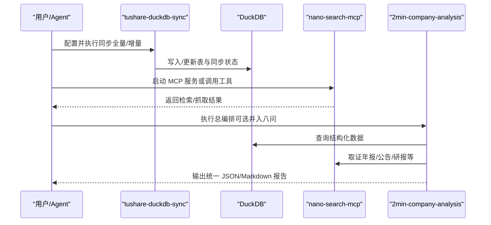
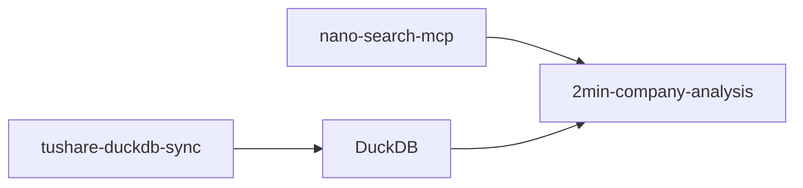

# 使用场景

<cite>
**本文引用的文件**
- [README.md](file://README.md)
- [2min-company-analysis/README.md](file://2min-company-analysis/README.md)
- [2min-company-analysis/seven-look-eight-question/SKILL.md](file://2min-company-analysis/seven-look-eight-question/SKILL.md)
- [2min-company-analysis/seven-look-eight-question/scripts/seven_looks_orchestrator.py](file://2min-company-analysis/seven-look-eight-question/scripts/seven_looks_orchestrator.py)
- [2min-company-analysis/seven-look-eight-question/scripts/eight_questions_orchestrator.py](file://2min-company-analysis/seven-look-eight-question/scripts/eight_questions_orchestrator.py)
- [2min-company-analysis/look-01-profit-quality/scripts/look_01_profit_quality.py](file://2min-company-analysis/look-01-profit-quality/scripts/look_01_profit_quality.py)
- [2min-company-analysis/seven-look-eight-question/assets/rule_registry.json](file://2min-company-analysis/seven-look-eight-question/assets/rule_registry.json)
- [2min-company-analysis/seven-look-eight-question/references/data-coverage.md](file://2min-company-analysis/seven-look-eight-question/references/data-coverage.md)
- [2min-company-analysis/seven-look-eight-question/references/evidence-playbook.md](file://2min-company-analysis/seven-look-eight-question/references/evidence-playbook.md)
- [nano-search-mcp/README.md](file://nano-search-mcp/README.md)
- [nano-search-mcp/src/nano_search_mcp/server.py](file://nano-search-mcp/src/nano_search_mcp/server.py)
- [tushare-duckdb-sync/README.md](file://tushare-duckdb-sync/README.md)
- [tushare-duckdb-sync/SKILL.md](file://tushare-duckdb-sync/SKILL.md)
- [tushare-duckdb-sync/scripts/sync_table.py](file://tushare-duckdb-sync/scripts/sync_table.py)
- [tushare-duckdb-sync/templates/task_config.json](file://tushare-duckdb-sync/templates/task_config.json)
</cite>

## 目录
1. [简介](#简介)
2. [项目结构](#项目结构)
3. [核心组件](#核心组件)
4. [架构总览](#架构总览)
5. [详细组件分析](#详细组件分析)
6. [依赖关系分析](#依赖关系分析)
7. [性能考量](#性能考量)
8. [故障排查指南](#故障排查指南)
9. [结论](#结论)
10. [附录](#附录)

## 简介
本文件面向 NanoQuant Skills 项目，聚焦三大用户角色的典型使用场景与最佳实践：
- 量化分析师：基于结构化财务数据与可选外部证据，完成“七看八问”快速尽调与报告生成，支撑投资决策。
- 数据工程师：通过 tushare-duckdb-sync 建立稳定的数据管道，实现全量/增量同步、断点续传与数据质量监控。
- 研究人员：组合“七看八问”技能，按主题深度研究，形成可复核的分析报告与证据清单。

同时，文档提供不同部署规模下的推荐配置、工作流对比与迁移建议，帮助团队快速落地并迭代。

## 项目结构
仓库采用模块化分层：
- 数据生产层：tushare-duckdb-sync（将 Tushare 数据同步至本地 DuckDB）
- 外部证据层：nano-search-mcp（公告、年报、行业研报、IR、监管处罚、行业政策检索与抓取）
- 分析编排层：2min-company-analysis（七看八问规则与总编排）

图表来源
- [README.md:1-103](file://README.md#L1-L103)
- [tushare-duckdb-sync/README.md:1-173](file://tushare-duckdb-sync/README.md#L1-L173)
- [nano-search-mcp/README.md:1-198](file://nano-search-mcp/README.md#L1-L198)
- [2min-company-analysis/README.md:1-132](file://2min-company-analysis/README.md#L1-L132)

章节来源
- [README.md:1-103](file://README.md#L1-L103)

## 核心组件
- tushare-duckdb-sync：提供 Tushare → DuckDB 的全量/增量同步、断点续传、交易日安全截止、数据质量检查与元数据文档生成。
- nano-search-mcp：提供 12 个 MCP 工具，覆盖公告、定期报告、行业研报、IR、监管处罚、行业政策等，支持安全抓取与错误契约。
- 2min-company-analysis：包含 7 个“七看”定量规则与 8 个“八问”定性问题，提供总编排脚本一键执行并输出统一报告。

章节来源
- [tushare-duckdb-sync/README.md:1-173](file://tushare-duckdb-sync/README.md#L1-L173)
- [nano-search-mcp/README.md:1-198](file://nano-search-mcp/README.md#L1-L198)
- [2min-company-analysis/README.md:1-132](file://2min-company-analysis/README.md#L1-L132)

## 架构总览
整体数据流从上游 Tushare 到本地 DuckDB，再由分析模块消费；当启用外部证据时，通过 MCP 服务抓取年报、公告、研报等文本证据，增强定性判断。

图表来源
- [tushare-duckdb-sync/scripts/sync_table.py:1-618](file://tushare-duckdb-sync/scripts/sync_table.py#L1-L618)
- [nano-search-mcp/src/nano_search_mcp/server.py:1-91](file://nano-search-mcp/src/nano_search_mcp/server.py#L1-L91)
- [2min-company-analysis/seven-look-eight-question/scripts/seven_looks_orchestrator.py:1-800](file://2min-company-analysis/seven-look-eight-question/scripts/seven_looks_orchestrator.py#L1-L800)

## 详细组件分析

### 量化分析师使用场景
目标：以“七看八问”快速完成 A 股非金融类公司基本面快审，输出可复核报告，辅助投资决策。

- 典型工作流
  1) 数据准备：执行 tushare-duckdb-sync，确保 DuckDB 中有所需财务/行情/基本面表。
  2) 可选取证：安装并启动 nano-search-mcp，或在 Python 代码中导入其工具，用于年报、公告、研报、IR、监管处罚、行业政策等抓取。
  3) 执行分析：运行 seven_looks_orchestrator.py，可选并入八问，输出统一 JSON/Markdown 报告。
  4) 复核与落地：根据报告中的“分项原始分析透传”章节核对汇总是否遗漏；必要时补充年报文本包以完成 look-04/05。

- 关键参数与输出
  - 输入：股票代码、分析日期、DuckDB 路径、是否包含八问、输出格式等。
  - 输出：质量评分（A/B/C/D）、红旗预警、七看概览、人类介入请求、行动建议、量化评语；并可选将八问摘要并入。
  - 评分与建议：基于红灯数量与维度趋势，自动生成下一步行动建议（如补充年报、深入排查关键风险、分析资本结构可持续性、评估收入恢复可能性、进入估值与股东结构分析）。

- 证据来源与优先级
  - 七看：纯数据库查询，无需外部输入。
  - 八问：依赖外部证据，按证据优先级与来源模板执行，Markdown 报告中对研报/IR 等进行标注。

- 使用建议
  - 优先使用总编排一键执行七看，再按需并入八问。
  - look-04/05 依赖年报全文/附注，若未提供将标记 human-in-loop，建议提前准备文本包。
  - 金融类公司（银行/保险/证券）相关 look 脚本会返回不适用，需改走金融类分析路径。

章节来源
- [2min-company-analysis/README.md:58-132](file://2min-company-analysis/README.md#L58-L132)
- [2min-company-analysis/seven-look-eight-question/SKILL.md:1-201](file://2min-company-analysis/seven-look-eight-question/SKILL.md#L1-L201)
- [2min-company-analysis/seven-look-eight-question/scripts/seven_looks_orchestrator.py:1-800](file://2min-company-analysis/seven-look-eight-question/scripts/seven_looks_orchestrator.py#L1-L800)
- [2min-company-analysis/seven-look-eight-question/references/evidence-playbook.md:1-54](file://2min-company-analysis/seven-look-eight-question/references/evidence-playbook.md#L1-L54)

### 数据工程师使用场景
目标：建立稳定、可观测、可复核的数据管道，保障上游 Tushare 数据到本地 DuckDB 的一致性与质量。

- 典型工作流
  1) 环境与 Token：配置 Python 环境与 TUSHARE_TOKEN；可一次性提供或约定固定位置读取。
  2) 元数据采集：在同步前完成表元数据文档（包含字段角色、量化用途、取值范围、注意事项等）。
  3) 判定模式：根据 table_sync_state 与目标表是否存在，自动判断全量/增量；trade_date 维度默认应用交易日安全截止规则。
  4) 执行同步：单表或批量任务执行；支持断点续传与失败追踪。
  5) 质检与归档：执行 check_quality.py，将结果写入元数据文档；更新映射注册表与同步记录。
  6) 输出任务纪要：三项资产完整性自检（数据、元数据、运维记录）。

- 关键机制
  - 同步状态表：table_sync_state 记录每个维度值的同步状态，支持断点续传与失败追踪。
  - 交易日安全截止：默认以 Asia/Shanghai 18:00 为安全截止，避免把当天空 payload 误记成功。
  - 字段对齐与类型转换：自动丢弃目标表不存在的列，日期列自动转换，空 payload 在增量维度默认记失败。
  - 映射注册表：记录 endpoint/method/dimension_type/pk 等参数，跨会话积累本地知识。

- 最佳实践
  - 优先使用“固定位置”方案存储 Token，避免泄露；Agent 仅从授权路径读取。
  - 元数据文档先行，确保即使同步中断也能复用；同步完成后立即更新质量快照。
  - 增量维度遇到空 payload 时，先确认是否早于发布截止时间，或改为上一个开放交易日。
  - 批量任务通过 tasks.json 统一管理，支持断点续传与重试策略。

章节来源
- [tushare-duckdb-sync/README.md:13-173](file://tushare-duckdb-sync/README.md#L13-L173)
- [tushare-duckdb-sync/SKILL.md:1-449](file://tushare-duckdb-sync/SKILL.md#L1-L449)
- [tushare-duckdb-sync/scripts/sync_table.py:1-618](file://tushare-duckdb-sync/scripts/sync_table.py#L1-L618)
- [tushare-duckdb-sync/templates/task_config.json:1-22](file://tushare-duckdb-sync/templates/task_config.json#L1-L22)

### 研究人员使用场景
目标：围绕特定主题组合“七看八问”，进行深度研究与交叉验证，形成可复核的研究报告。

- 组合策略
  - 七看：按主题选择若干 look（如 look-01/03/07）聚焦利润质量、增长趋势与 ROE 驱动。
  - 八问：按主题选择若干 question（如 Q1/Q2/Q5/Q8）聚焦行业前景、竞争优势、市场地位与未来规划。
  - 总编排：先执行七看，再按需并入八问，统一输出报告与证据清单。

- 深度研究要点
  - look-01：关注净现比、FCF、毛利率趋势，识别利润未落地为现金的风险。
  - look-04/05：在提供年报文本包后，深入业务构成、市场分布与隐性负债。
  - look-06：结合员工数与人均效率，评估投入产出效率与劳动生产率。
  - 八问：以证据优先级与来源模板为纲，Markdown 报告中对预测/公司口径证据进行标注。

- 质量控制
  - 使用“分项原始分析透传”章节核对汇总是否遗漏或失真。
  - 对关键证据缺口（critical gaps）进行标注与追踪，降低报告置信度。

章节来源
- [2min-company-analysis/seven-look-eight-question/SKILL.md:1-201](file://2min-company-analysis/seven-look-eight-question/SKILL.md#L1-L201)
- [2min-company-analysis/seven-look-eight-question/references/data-coverage.md:1-92](file://2min-company-analysis/seven-look-eight-question/references/data-coverage.md#L1-L92)
- [2min-company-analysis/seven-look-eight-question/references/evidence-playbook.md:1-54](file://2min-company-analysis/seven-look-eight-question/references/evidence-playbook.md#L1-L54)

### 三个角色工作流对比
- 量化分析师（侧重速度与复核）
  - 路径：总编排一键执行七看，按需并入八问，输出统一报告。
  - 关注：质量评分、红旗预警、行动建议、证据清单。
- 数据工程师（侧重稳定与可观测）
  - 路径：环境初始化 → 元数据文档 → 判定模式 → 同步执行 → 质检归档 → 任务纪要。
  - 关注：同步状态、断点续传、交易日安全截止、字段对齐与类型转换。
- 研究人员（侧重深度与交叉验证）
  - 路径：组合七看/八问，按主题深入，统一输出报告与证据清单。
  - 关注：证据优先级、来源模板、关键证据缺口、原始透传核对。

章节来源
- [2min-company-analysis/README.md:58-132](file://2min-company-analysis/README.md#L58-L132)
- [tushare-duckdb-sync/SKILL.md:110-449](file://tushare-duckdb-sync/SKILL.md#L110-L449)
- [2min-company-analysis/seven-look-eight-question/SKILL.md:1-201](file://2min-company-analysis/seven-look-eight-question/SKILL.md#L1-L201)

### 推荐配置与部署规模
- 小规模（个人/小团队）
  - 环境：单机 DuckDB + 本地 MCP 服务（可选 stdio 传输）。
  - 同步：按交易日/报告期增量为主，全量覆盖为辅；使用断点续传与安全截止。
  - 分析：总编排一键执行七看，按需并入八问；输出 JSON/Markdown 供复核。
- 中等规模（部门/小组）
  - 环境：共享 DuckDB 与元数据文档；CI/CD 管理同步任务。
  - 同步：批量任务统一管理；失败追踪与重试策略；定期质量快照。
  - 分析：统一证据优先级与来源模板；报告模板标准化。
- 大规模（企业级）
  - 环境：分布式存储与缓存；MCP 服务容器化部署；API 网关与鉴权。
  - 同步：多租户隔离；审计日志与合规检查；自动化质量门禁。
  - 分析：Agent 编排与工作流编排平台；报告与证据的版本化管理。

章节来源
- [nano-search-mcp/README.md:79-104](file://nano-search-mcp/README.md#L79-L104)
- [tushare-duckdb-sync/SKILL.md:350-375](file://tushare-duckdb-sync/SKILL.md#L350-L375)
- [2min-company-analysis/README.md:60-79](file://2min-company-analysis/README.md#L60-L79)

## 依赖关系分析
- 模块依赖链路：tushare-duckdb-sync → nano-search-mcp → 2min-company-analysis。
- 数据依赖：七看依赖 DuckDB 结构化表；八问依赖外部证据（可选）。
- 错误契约：除特定工具外，其余工具失败时返回字典而非抛异常，便于上游聚合处理。

图表来源
- [README.md:5-11](file://README.md#L5-L11)
- [2min-company-analysis/README.md:103-107](file://2min-company-analysis/README.md#L103-L107)

章节来源
- [README.md:5-11](file://README.md#L5-L11)
- [2min-company-analysis/README.md:103-107](file://2min-company-analysis/README.md#L103-L107)

## 性能考量
- 同步性能
  - trade_date 维度默认应用安全截止，避免无效重试。
  - 增量维度支持断点续传，减少重复拉取。
  - 字段对齐与类型转换在写入前完成，降低下游处理成本。
- 分析性能
  - 七看纯数据库查询，建议在关键列建立索引（如按日期列）。
  - 八问并发执行多个问题，注意 MCP 服务的请求超时与限频。
- 可观测性
  - 同步事件日志与 table_sync_state 记录，便于追踪与重试。
  - 报告输出包含中间文件与原始透传，便于审计与复核。

章节来源
- [tushare-duckdb-sync/scripts/sync_table.py:234-288](file://tushare-duckdb-sync/scripts/sync_table.py#L234-L288)
- [2min-company-analysis/seven-look-eight-question/scripts/seven_looks_orchestrator.py:170-245](file://2min-company-analysis/seven-look-eight-question/scripts/seven_looks_orchestrator.py#L170-L245)

## 故障排查指南
- 同步失败
  - 确认 TUSHARE_TOKEN 是否有效与可见；检查网络与限频策略。
  - 对于 trade_date 维度，若返回空 payload 且早于发布截止时间，改为上一个开放交易日或显式允许空结果。
  - 查看 table_sync_state 中失败记录与错误信息，定位具体维度并重试。
- MCP 工具失败
  - 除特定工具外，其余工具失败时返回字典，检查 source 与 error 字段。
  - 对应证据槽位留空，追加 missing_inputs 与人工取证任务。
- 报告异常
  - 使用“分项原始分析透传”核对汇总是否遗漏；必要时补充年报文本包。
  - 检查八问摘要中的关键证据缺口（critical gaps），降低报告置信度。

章节来源
- [tushare-duckdb-sync/scripts/sync_table.py:322-338](file://tushare-duckdb-sync/scripts/sync_table.py#L322-L338)
- [nano-search-mcp/src/nano_search_mcp/server.py:55-57](file://nano-search-mcp/src/nano_search_mcp/server.py#L55-L57)
- [2min-company-analysis/seven-look-eight-question/SKILL.md:162-180](file://2min-company-analysis/seven-look-eight-question/SKILL.md#L162-L180)

## 结论
NanoQuant Skills 通过模块化分层与标准化工作流，为量化分析师、数据工程师与研究人员提供了可复用、可扩展、可复核的分析与数据管道能力。依托 tushare-duckdb-sync 的稳定同步与质量控制，结合 nano-search-mcp 的外部证据抓取，以及 2min-company-analysis 的“七看八问”总编排，团队可在不同规模与环境下快速落地并持续迭代。

## 附录

### 使用案例与最佳实践
- 案例一：快速尽调
  - 步骤：安装并启动 MCP → 执行总编排（七看）→ 按需并入八问 → 输出报告。
  - 适用：高频覆盖、快速筛选与初步判断。
- 案例二：深度研究
  - 步骤：组合若干 look 与 question → 统一输出报告与证据清单 → 标注关键证据缺口。
  - 适用：专题研究、交叉验证与报告撰写。
- 案例三：数据管道建设
  - 步骤：环境初始化 → 元数据文档 → 判定模式 → 同步执行 → 质检归档 → 任务纪要。
  - 适用：团队级数据治理与自动化运维。

章节来源
- [2min-company-analysis/README.md:58-132](file://2min-company-analysis/README.md#L58-L132)
- [tushare-duckdb-sync/SKILL.md:110-449](file://tushare-duckdb-sync/SKILL.md#L110-L449)
- [nano-search-mcp/README.md:149-159](file://nano-search-mcp/README.md#L149-L159)