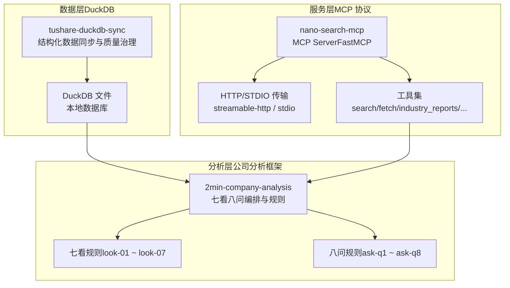
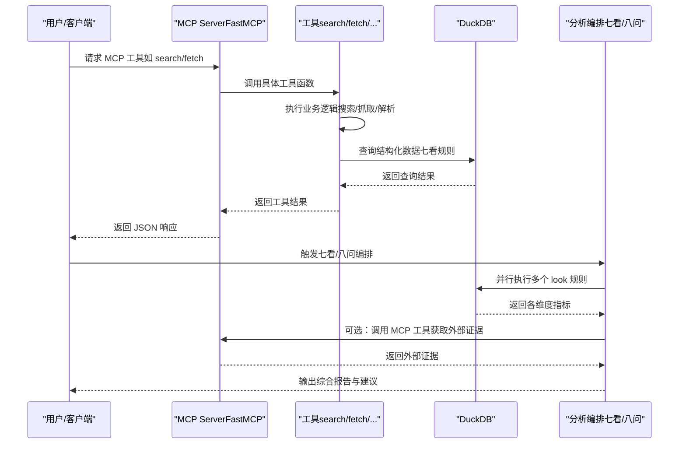
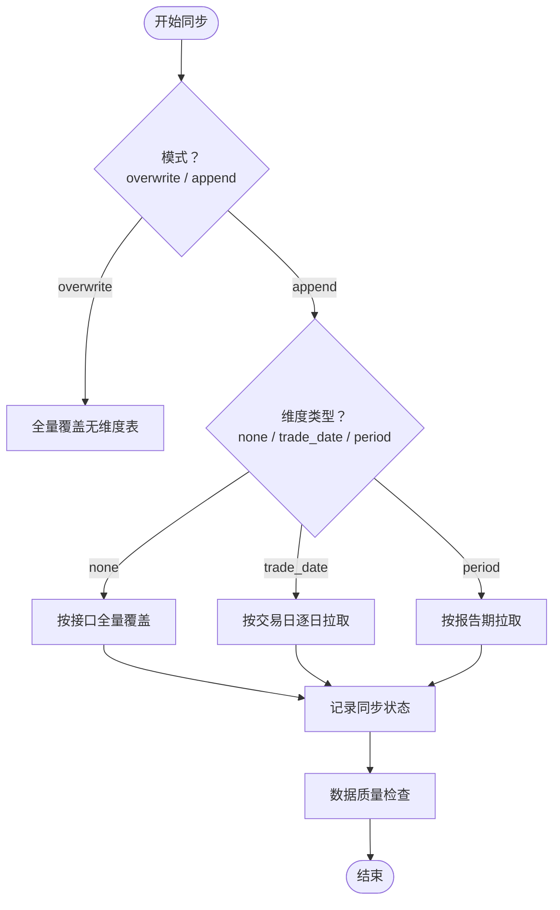
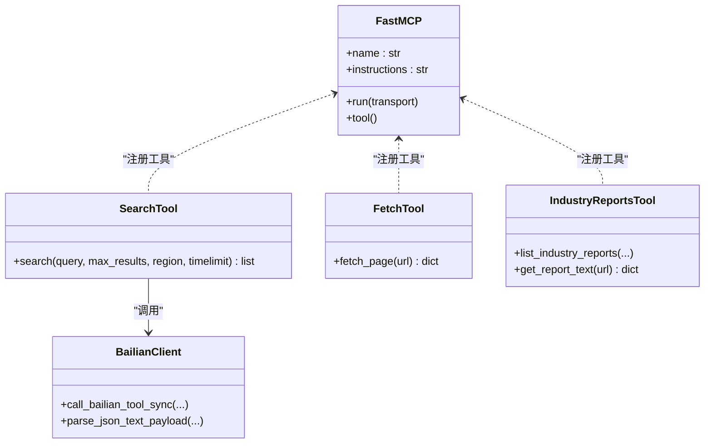
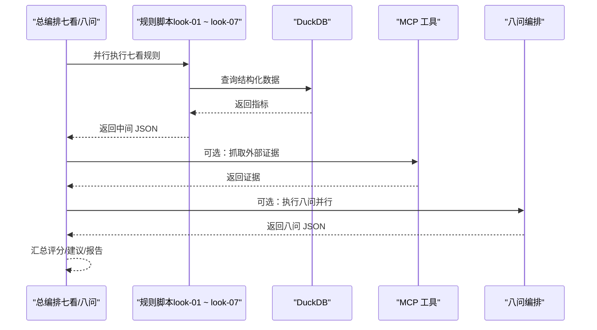
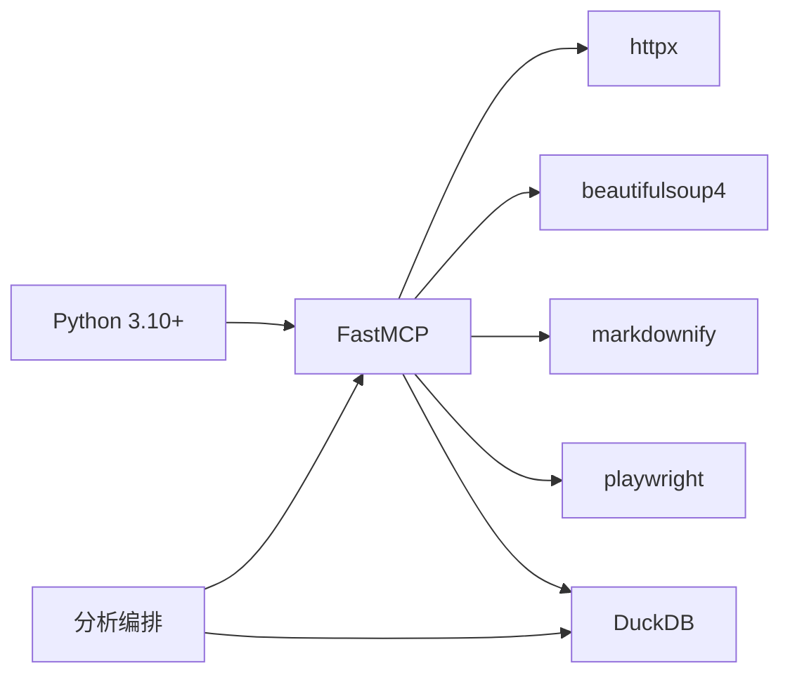

# 技术架构

<cite>
**本文引用的文件**
- [pyproject.toml](file://nano-search-mcp/pyproject.toml)
- [__main__.py](file://nano-search-mcp/src/nano_search_mcp/__main__.py)
- [server.py](file://nano-search-mcp/src/nano_search_mcp/server.py)
- [api.py](file://nano-search-mcp/src/nano_search_mcp/api.py)
- [tools/__init__.py](file://nano-search-mcp/src/nano_search_mcp/tools/__init__.py)
- [tools/search.py](file://nano-search-mcp/src/nano_search_mcp/tools/search.py)
- [tools/fetch.py](file://nano-search-mcp/src/nano_search_mcp/tools/fetch.py)
- [tools/bailian_client.py](file://nano-search-mcp/src/nano_search_mcp/tools/bailian_client.py)
- [tools/industry_reports.py](file://nano-search-mcp/src/nano_search_mcp/tools/industry_reports.py)
- [README.md（数据同步）](file://tushare-duckdb-sync/README.md)
- [mapping_registry.json](file://tushare-duckdb-sync/templates/mapping_registry.json)
- [README.md（2分钟公司分析）](file://2min-company-analysis/README.md)
- [seven_looks_orchestrator.py](file://2min-company-analysis/seven-look-eight-question/scripts/seven_looks_orchestrator.py)
- [eight_questions_orchestrator.py](file://2min-company-analysis/seven-look-eight-question/scripts/eight_questions_orchestrator.py)
- [look_01_profit_quality.py](file://2min-company-analysis/look-01-profit-quality/scripts/look_01_profit_quality.py)
- [q01_industry.py](file://2min-company-analysis/ask-q1-industry-prospect/scripts/q01_industry.py)
</cite>

## 目录
1. [简介](#简介)
2. [项目结构](#项目结构)
3. [核心组件](#核心组件)
4. [架构总览](#架构总览)
5. [详细组件分析](#详细组件分析)
6. [依赖分析](#依赖分析)
7. [性能考虑](#性能考虑)
8. [故障排查指南](#故障排查指南)
9. [结论](#结论)
10. [附录](#附录)

## 简介
本项目采用三层架构设计，围绕“数据层（DuckDB）—服务层（MCP 协议）—分析层（公司分析框架）”协同工作，形成可扩展、可演进的量化研究基础设施。数据层负责结构化财务与行情数据的本地化存储与质量治理；服务层通过 MCP 协议对外提供标准化工具能力，覆盖搜索、抓取、研报与政策等外部证据；分析层基于 DuckDB 数据与外部证据，执行“七看八问”的结构化财务与定性分析，支持自动化与半自动化的组合式报告生成。

## 项目结构
项目由三大子模块组成：
- 数据同步与治理：tushare-duckdb-sync，负责结构化数据的全量/增量同步与质量检查。
- 搜索与证据服务：nano-search-mcp，基于 MCP 协议提供搜索、抓取、研报与政策等工具。
- 公司分析框架：2min-company-analysis，基于 DuckDB 与外部证据执行七看八问分析。

图表来源
- [server.py:18-70](file://nano-search-mcp/src/nano_search_mcp/server.py#L18-L70)
- [README.md（数据同步）:5-12](file://tushare-duckdb-sync/README.md#L5-L12)
- [README.md（2分钟公司分析）:1-13](file://2min-company-analysis/README.md#L1-L13)

章节来源
- [server.py:18-70](file://nano-search-mcp/src/nano_search_mcp/server.py#L18-L70)
- [README.md（数据同步）:5-12](file://tushare-duckdb-sync/README.md#L5-L12)
- [README.md（2分钟公司分析）:1-13](file://2min-company-analysis/README.md#L1-L13)

## 核心组件
- 数据层（DuckDB）
  - 通过 tushare-duckdb-sync 将 Tushare 数据同步至本地 DuckDB，支持全量覆盖与按维度的增量同步，内置断点续传与同步状态跟踪。
  - 提供结构化财务/行情/基础数据，供分析层直接查询。
- 服务层（MCP 协议）
  - 基于 FastMCP 构建 MCP Server，注册多种工具：通用搜索、页面抓取、研报与政策检索、公告与IR纪要等。
  - 提供 streamable HTTP 与 stdio 两种传输方式，便于与客户端集成。
- 分析层（公司分析框架）
  - 七看：基于 DuckDB 的定量财务体检（如利润质量、成本结构、增长趋势等）。
  - 八问：结合 DuckDB 事实与外部证据（研报、政策、公告等）进行定性分析与评级。
  - 总编排脚本负责并行执行规则、汇总结果、生成报告与建议。

章节来源
- [README.md（数据同步）:1-173](file://tushare-duckdb-sync/README.md#L1-L173)
- [server.py:18-70](file://nano-search-mcp/src/nano_search_mcp/server.py#L18-L70)
- [README.md（2分钟公司分析）:1-132](file://2min-company-analysis/README.md#L1-L132)

## 架构总览
三层架构的职责分离与数据流转如下：
- 数据层：负责结构化数据的采集、清洗、入库与质量治理，确保下游分析具备高质量的事实基础。
- 服务层：通过 MCP 工具向外提供统一的能力接口，屏蔽外部数据源差异，支持异步抓取与缓存优化。
- 分析层：以规则为中心，串联 DuckDB 查询与外部证据收集，形成可复核的结构化报告。

图表来源
- [server.py:18-70](file://nano-search-mcp/src/nano_search_mcp/server.py#L18-L70)
- [tools/search.py:79-119](file://nano-search-mcp/src/nano_search_mcp/tools/search.py#L79-L119)
- [tools/fetch.py:220-245](file://nano-search-mcp/src/nano_search_mcp/tools/fetch.py#L220-L245)
- [seven_looks_orchestrator.py:170-245](file://2min-company-analysis/seven-look-eight-question/scripts/seven_looks_orchestrator.py#L170-L245)

## 详细组件分析

### 数据层：tushare-duckdb-sync
- 职责
  - 将 Tushare Pro 数据同步到本地 DuckDB，支持全量覆盖与按维度（无维度、交易日、报告期）的增量同步。
  - 维护同步状态表，支持断点续传与失败追踪。
  - 提供数据质量检查脚本，输出统计摘要与告警。
- 关键特性
  - 交易日安全窗口：在指定时间后同步当日数据，避免空结果。
  - 三种维度类型：none/trade_date/period，适配不同数据源的发布节奏。
  - 任务批量化：支持批量任务文件，简化运维。
- 与分析层的关系
  - 分析层规则脚本默认从本地 DuckDB 读取数据，外部证据可选接入 MCP 工具。

图表来源
- [README.md（数据同步）:47-173](file://tushare-duckdb-sync/README.md#L47-L173)
- [mapping_registry.json:1-16](file://tushare-duckdb-sync/templates/mapping_registry.json#L1-L16)

章节来源
- [README.md（数据同步）:1-173](file://tushare-duckdb-sync/README.md#L1-L173)
- [mapping_registry.json:1-16](file://tushare-duckdb-sync/templates/mapping_registry.json#L1-L16)

### 服务层：nano-search-mcp（MCP 协议）
- 职责
  - 基于 FastMCP 构建 MCP Server，注册多种工具，统一对外提供搜索、抓取、研报与政策等能力。
  - 支持 streamable HTTP 与 stdio 两种传输方式，便于本地直连与远程集成。
- 工具能力概览
  - 通用检索：search（百炼 WebSearch）、fetch_page（Playwright 渲染抓取）、deferred 模板检索。
  - 定期报告：get_company_report（年报/半年报/一季报/三季报全文）。
  - 临时公告：list_announcements、get_announcement_text。
  - 行业研报：list_industry_reports、get_report_text（新浪财经）。
  - 监管与处罚：list_regulatory_penalties。
  - 投资者关系：list_ir_meetings、get_ir_meeting_text。
  - 行业政策：list_industry_policies（gov.cn 近一年）。
- 安全与可靠性
  - URL 安全校验（SSRF 防护）、内容截断、浏览器复用与锁控制、错误契约（失败返回字典而非抛异常）。

图表来源
- [server.py:18-70](file://nano-search-mcp/src/nano_search_mcp/server.py#L18-L70)
- [tools/search.py:79-119](file://nano-search-mcp/src/nano_search_mcp/tools/search.py#L79-L119)
- [tools/fetch.py:220-245](file://nano-search-mcp/src/nano_search_mcp/tools/fetch.py#L220-L245)
- [tools/industry_reports.py:384-495](file://nano-search-mcp/src/nano_search_mcp/tools/industry_reports.py#L384-L495)
- [tools/bailian_client.py:63-93](file://nano-search-mcp/src/nano_search_mcp/tools/bailian_client.py#L63-L93)

章节来源
- [server.py:18-70](file://nano-search-mcp/src/nano_search_mcp/server.py#L18-L70)
- [tools/search.py:1-119](file://nano-search-mcp/src/nano_search_mcp/tools/search.py#L1-L119)
- [tools/fetch.py:1-245](file://nano-search-mcp/src/nano_search_mcp/tools/fetch.py#L1-L245)
- [tools/industry_reports.py:1-495](file://nano-search-mcp/src/nano_search_mcp/tools/industry_reports.py#L1-L495)
- [tools/bailian_client.py:1-93](file://nano-search-mcp/src/nano_search_mcp/tools/bailian_client.py#L1-L93)

### 分析层：2min-company-analysis（七看八问）
- 职责
  - 以规则为中心的结构化分析，七看聚焦定量财务体检，八问聚焦定性证据与评级。
  - 提供总编排脚本，支持并行执行、汇总评分、生成建议与报告。
- 七看（定量）
  - look-01 ~ look-07：覆盖利润质量、成本结构、增长趋势、业务构成、资产负债、投入产出、ROE 与资本回报等维度。
  - 规则脚本直接连接 DuckDB，按年/报告期去重与回溯分析。
- 八问（定性）
  - ask-q1 ~ ask-q8：结合 DuckDB 事实与外部证据（研报、政策、公告等）进行评级与交叉验证。
  - 提供并行执行与汇总，支持 Markdown/JSON 输出。
- 与服务层的协作
  - 通过 MCP 工具获取外部证据（研报、政策、公告等），并在必要时提示人工补充年报文本包。

图表来源
- [seven_looks_orchestrator.py:170-245](file://2min-company-analysis/seven-look-eight-question/scripts/seven_looks_orchestrator.py#L170-L245)
- [eight_questions_orchestrator.py:119-164](file://2min-company-analysis/seven-look-eight-question/scripts/eight_questions_orchestrator.py#L119-L164)
- [look_01_profit_quality.py:75-124](file://2min-company-analysis/look-01-profit-quality/scripts/look_01_profit_quality.py#L75-L124)
- [q01_industry.py:52-147](file://2min-company-analysis/ask-q1-industry-prospect/scripts/q01_industry.py#L52-L147)

章节来源
- [seven_looks_orchestrator.py:1-800](file://2min-company-analysis/seven-look-eight-question/scripts/seven_looks_orchestrator.py#L1-L800)
- [eight_questions_orchestrator.py:1-396](file://2min-company-analysis/seven-look-eight-question/scripts/eight_questions_orchestrator.py#L1-L396)
- [look_01_profit_quality.py:1-200](file://2min-company-analysis/look-01-profit-quality/scripts/look_01_profit_quality.py#L1-L200)
- [q01_industry.py:1-157](file://2min-company-analysis/ask-q1-industry-prospect/scripts/q01_industry.py#L1-L157)

## 依赖分析
- Python 3.10+：统一运行时版本，保证异步与类型标注一致性。
- FastAPI/MCP：MCP Server 基于 FastMCP，提供 streamable HTTP 与 STDIO 传输。
- DuckDB：本地嵌入式 OLAP 引擎，支持 SQL 查询与规则计算。
- 第三方工具
  - httpx：HTTP 客户端，用于百炼 MCP 调用与外部抓取。
  - beautifulsoup4/markdownify：HTML 解析与正文抽取。
  - playwright：无头浏览器渲染，保障动态内容抓取。
- 依赖关系可视化

图表来源
- [pyproject.toml:5-14](file://nano-search-mcp/pyproject.toml#L5-L14)
- [server.py:18-70](file://nano-search-mcp/src/nano_search_mcp/server.py#L18-L70)

章节来源
- [pyproject.toml:1-44](file://nano-search-mcp/pyproject.toml#L1-L44)
- [server.py:18-70](file://nano-search-mcp/src/nano_search_mcp/server.py#L18-L70)

## 性能考虑
- 并行执行
  - 七看与八问均采用并行执行与线程池，缩短整体分析时长。
- 异步抓取与浏览器复用
  - 页面抓取使用 Playwright 异步与实例复用，降低冷启动与上下文创建开销。
- 缓存与限流
  - 行业研报列表与详情缓存，配合退避与请求间隔，平衡抓取效率与站点压力。
- 数据访问优化
  - DuckDB 查询通过年/报告期去重与可见日期排序，减少重复披露与提高回溯准确性。
- 传输与序列化
  - MCP 使用 JSON-RPC over HTTP，结构清晰、易于调试与扩展。

## 故障排查指南
- MCP 工具失败
  - 搜索/研报/抓取等工具在失败时返回包含错误信息的字典，不抛异常；检查返回字典中的错误字段与抓取耗时。
- 外部证据缺失
  - 八问中若研报/政策采集失败，会记录缺失输入与人工介入请求；根据提示补充证据或调整参数。
- DuckDB 连接失败
  - 规则脚本在找不到 DuckDB 文件时抛出异常；确认数据库路径与文件存在。
- 环境变量
  - 百炼 MCP 需要 DASHSCOPE_API_KEY；行业政策检索需设置相应环境变量。
- 同步失败
  - tushare-duckdb-sync 的同步状态表记录失败原因；使用断点续传参数继续执行。

章节来源
- [tools/fetch.py:186-218](file://nano-search-mcp/src/nano_search_mcp/tools/fetch.py#L186-L218)
- [tools/industry_reports.py:436-457](file://nano-search-mcp/src/nano_search_mcp/tools/industry_reports.py#L436-L457)
- [q01_industry.py:83-105](file://2min-company-analysis/ask-q1-industry-prospect/scripts/q01_industry.py#L83-L105)
- [look_01_profit_quality.py:75-78](file://2min-company-analysis/look-01-profit-quality/scripts/look_01_profit_quality.py#L75-L78)
- [README.md（数据同步）:154-173](file://tushare-duckdb-sync/README.md#L154-L173)

## 结论
本项目通过三层架构实现了“数据可靠、服务统一、分析可复核”的量化研究体系。数据层以 DuckDB 为核心，提供高质量结构化数据；服务层以 MCP 协议抽象外部证据能力，屏蔽来源差异；分析层以规则为中心，结合事实与观点，形成可解释、可追溯的报告。该架构具备良好的模块化与扩展性，便于在未来引入新的数据源、工具与分析规则。

## 附录
- 系统边界
  - 数据边界：DuckDB 文件与同步状态表。
  - 服务边界：MCP Server 的工具契约与传输协议。
  - 分析边界：规则脚本的输入输出契约与报告格式。
- 关键决策与权衡
  - 选择 DuckDB 作为本地数据底座，兼顾易部署与 SQL 生态。
  - 选择 MCP 协议统一外部证据能力，便于替换与扩展。
  - 七看/八问的混合执行策略，在自动化与人工复核之间取得平衡。
- 扩展与演进
  - 新增数据源：在数据层增加同步脚本与映射注册。
  - 新增工具：在服务层注册新工具并完善错误契约。
  - 新增规则：在分析层新增规则脚本并纳入编排。