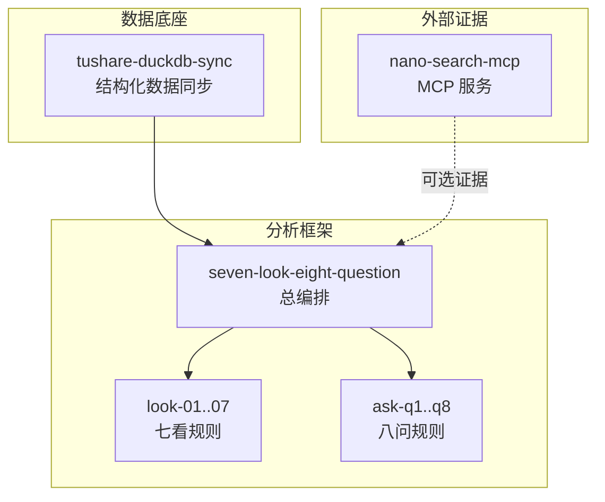
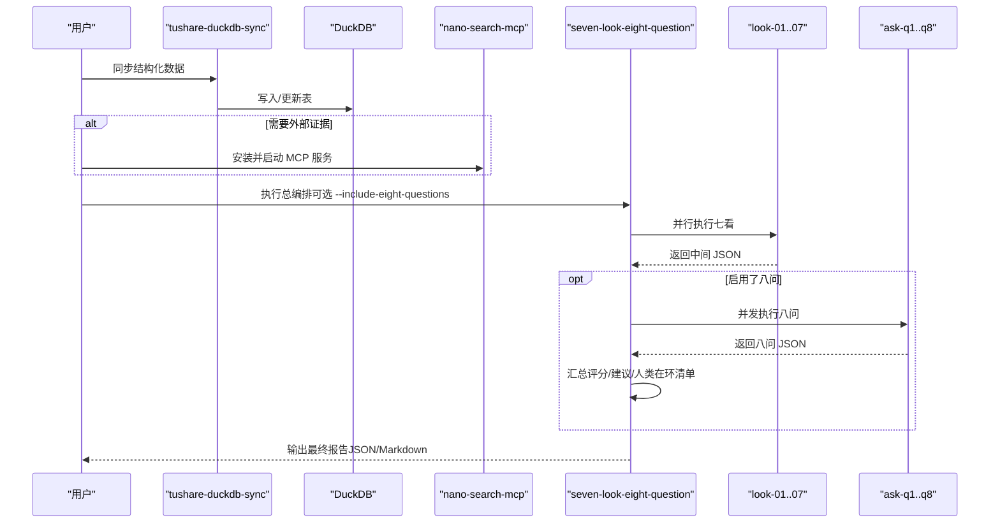
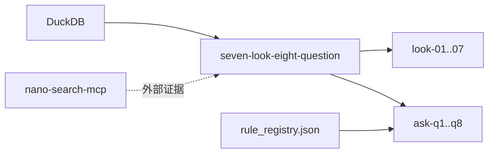

# 推荐使用流程

<cite>
**本文引用的文件**
- [2min-company-analysis/README.md](file://2min-company-analysis/README.md)
- [2min-company-analysis/seven-look-eight-question/SKILL.md](file://2min-company-analysis/seven-look-eight-question/SKILL.md)
- [2min-company-analysis/seven-look-eight-question/scripts/seven_looks_orchestrator.py](file://2min-company-analysis/seven-look-eight-question/scripts/seven_looks_orchestrator.py)
- [2min-company-analysis/seven-look-eight-question/scripts/eight_questions_orchestrator.py](file://2min-company-analysis/seven-look-eight-question/scripts/eight_questions_orchestrator.py)
- [2min-company-analysis/seven-look-eight-question/assets/rule_registry.json](file://2min-company-analysis/seven-look-eight-question/assets/rule_registry.json)
- [2min-company-analysis/seven-look-eight-question/references/evidence-playbook.md](file://2min-company-analysis/seven-look-eight-question/references/evidence-playbook.md)
- [nano-search-mcp/README.md](file://nano-search-mcp/README.md)
- [nano-search-mcp/pyproject.toml](file://nano-search-mcp/pyproject.toml)
- [nano-search-mcp/src/nano_search_mcp/__main__.py](file://nano-search-mcp/src/nano_search_mcp/__main__.py)
- [tushare-duckdb-sync/README.md](file://tushare-duckdb-sync/README.md)
- [tushare-duckdb-sync/scripts/sync_table.py](file://tushare-duckdb-sync/scripts/sync_table.py)
</cite>

## 目录
1. [简介](#简介)
2. [项目结构](#项目结构)
3. [核心组件](#核心组件)
4. [架构总览](#架构总览)
5. [详细组件分析](#详细组件分析)
6. [依赖关系分析](#依赖关系分析)
7. [性能考虑](#性能考虑)
8. [故障排除指南](#故障排除指南)
9. [结论](#结论)
10. [附录](#附录)

## 简介
本文件提供从安装到完成分析的完整推荐使用流程，严格遵循以下顺序：
1) 先用 tushare-duckdb-sync 同步本地 DuckDB 数据；
2) 如需外部证据，安装并启动 nano-search-mcp；
3) 再执行 2min-company-analysis 的总编排或单项规则。

同时，文档详细说明每一步的操作要点、配置要求、注意事项，并提供最小联动示例的完整命令行操作与预期结果；解释可选的八问分析功能及其启用方式；给出常见使用场景的流程变体与最佳实践；最后提供基础故障排除指导。

## 项目结构
该仓库采用多模块协作的 monorepo 结构：
- tushare-duckdb-sync：A 股结构化数据底座，提供 DuckDB 数据同步与质量检查。
- nano-search-mcp：MCP 服务，提供公告、年报、研报、政策、IR 等外部证据检索与抓取。
- 2min-company-analysis：基于 DuckDB 的“七看八问”分析框架，提供总编排与单项规则。

图表来源
- [2min-company-analysis/README.md:103-132](file://2min-company-analysis/README.md#L103-L132)
- [nano-search-mcp/README.md:7-16](file://nano-search-mcp/README.md#L7-L16)
- [tushare-duckdb-sync/README.md:5-12](file://tushare-duckdb-sync/README.md#L5-L12)

章节来源
- [2min-company-analysis/README.md:19-57](file://2min-company-analysis/README.md#L19-L57)
- [nano-search-mcp/README.md:7-16](file://nano-search-mcp/README.md#L7-L16)
- [tushare-duckdb-sync/README.md:5-12](file://tushare-duckdb-sync/README.md#L5-L12)

## 核心组件
- tushare-duckdb-sync：提供 Tushare → DuckDB 的全量/增量同步、断点续传、交易日安全窗口、数据质量检查等能力。
- nano-search-mcp：提供 12 个 MCP 工具，覆盖公告、年报、研报、政策、IR、监管处罚等外部证据采集。
- 2min-company-analysis：提供“七看八问”总编排与单项规则，支持人类在环（human-in-loop）与证据交叉验证。

章节来源
- [tushare-duckdb-sync/README.md:13-173](file://tushare-duckdb-sync/README.md#L13-L173)
- [nano-search-mcp/README.md:28-198](file://nano-search-mcp/README.md#L28-L198)
- [2min-company-analysis/README.md:7-127](file://2min-company-analysis/README.md#L7-L127)

## 架构总览
推荐的端到端执行链路如下：
- 第一步：tushare-duckdb-sync 同步结构化数据到 DuckDB；
- 第二步：可选地安装并启动 nano-search-mcp，为八问提供外部证据；
- 第三步：2min-company-analysis 的总编排脚本统一调度七看与八问，产出 JSON/Markdown 报告。

图表来源
- [2min-company-analysis/README.md:103-132](file://2min-company-analysis/README.md#L103-L132)
- [2min-company-analysis/seven-look-eight-question/SKILL.md:58-96](file://2min-company-analysis/seven-look-eight-question/SKILL.md#L58-L96)
- [nano-search-mcp/README.md:79-104](file://nano-search-mcp/README.md#L79-L104)

## 详细组件分析

### 第一步：tushare-duckdb-sync 同步本地 DuckDB 数据
- 目标：将 Tushare Pro 数据同步到本地 DuckDB，作为 2min-company-analysis 的数据底座。
- 关键能力：
  - 全量覆盖与增量追加；
  - 三种维度类型：none/trade_date/period；
  - 断点续传与失败追踪；
  - 交易日安全窗口（18:00 后同步当日数据）；
  - 数据质量检查（行数、PK 唯一性、空值率等）。

- 安装与环境要求
  - Python 依赖：tushare、duckdb、pandas、loguru；
  - 环境变量：TUSHARE_TOKEN；
  - 建议在每次同步前由人工提供一次性 Token，避免硬编码。

- 常用命令示例
  - 全量同步（如股票列表）：指定 endpoint、duckdb 路径、目标表、模式 overwrite；
  - 增量同步（如日线行情）：指定维度类型 trade_date、起止日期、sync-all 断点续传；
  - 按报告期同步（如财务报表）：指定维度类型 period；
  - 批量同步：tasks.json 配置多个任务。

- 数据质量检查
  - 使用 check_quality.py 检查表的完整性与质量，输出 text/json/markdown。

- 注意事项
  - 对盘后更新表（daily、moneyflow 等），建议在 18:00 后同步当天数据；
  - 未显式传入截止日期时，脚本默认收敛到上一个开放交易日；
  - 只有在“0 行结果本来就是正确业务语义”的场景下，才应显式使用允许空结果的开关。

章节来源
- [tushare-duckdb-sync/README.md:13-173](file://tushare-duckdb-sync/README.md#L13-L173)
- [tushare-duckdb-sync/scripts/sync_table.py:1-200](file://tushare-duckdb-sync/scripts/sync_table.py#L1-L200)

### 第二步：安装并使用 nano-search-mcp 获取外部证据（可选）
- 目标：为“七看八问”中的外部证据取证链路提供 MCP 服务，增强八问的证据强度。
- 安装方式
  - 推荐在仓库根目录安装：pip install -e ./nano-search-mcp；
  - 安装后需要安装 Playwright Chromium 浏览器；
  - 也可仅安装为普通依赖：pip install .。

- 启动方式
  - 命令行启动 MCP 服务：nano-search-mcp；
  - 支持 streamable HTTP 监听 http://127.0.0.1:8000/mcp；
  - 也可切换到 stdio transport，便于与 MCP Client 直接对接。

- 能力域与工具
  - 通用检索：search、fetch_page、search_deferred_topic；
  - 定期报告：get_company_report；
  - 临时公告：list_announcements、get_announcement_text；
  - 行业研报：list_industry_reports、get_report_text；
  - 监管处罚：list_regulatory_penalties；
  - 投资者关系：list_ir_meetings、get_ir_meeting_text；
  - 行业政策：list_industry_policies。

- 错误契约与安全基线
  - 除特定工具在参数非法或网络失败时报异常外，其余工具失败时统一返回包含 source 与 error 的字典；
  - 安全校验：域名白名单、SSRF 防护、指数退避重试与请求限频。

- 使用建议
  - 若需要百炼相关能力（如行业政策检索），需设置 DASHSCOPE_API_KEY；
  - 建议在执行前先测试 MCP 服务可用性，确保网络与浏览器环境正常。

章节来源
- [nano-search-mcp/README.md:17-125](file://nano-search-mcp/README.md#L17-L125)
- [nano-search-mcp/pyproject.toml:1-44](file://nano-search-mcp/pyproject.toml#L1-L44)
- [nano-search-mcp/src/nano_search_mcp/__main__.py:1-15](file://nano-search-mcp/src/nano_search_mcp/__main__.py#L1-L15)

### 第三步：进入 2min-company-analysis 进行分析
- 总编排入口
  - 一键执行七看，可选接入八问并输出综合报告；
  - 支持 JSON/Markdown 两种最终输出格式；
  - 七看评分体系保持独立，八问结果以扩展字段并入。

- 七看与八问的执行流程
  - Phase 1（自动）：依次运行 look-01/02/03/06/07；
  - Phase 2（半自动）：运行 look-04/05（若未提供年报文本包则标记 human-in-loop）；
  - Phase 2.5（可选）：若传入 --include-eight-questions，调用八问总入口，批量调度 ask-q1..q8；
  - Phase 3（汇总）：合并 7 份中间 JSON → 红旗预警 + 质量评分；
  - Phase 4（评语）：附加量化评语 + 最多 3 条行动建议。

- 八问证据优先级与来源模板
  - 通用铁律：每题至少 1 条 primary/regulatory/db 证据才允许 rating；
  - Q1-Q8 各题的证据来源模板与优先级详见证据手册；
  - 若 MCP 工具抛异常或返回 unavailable，对应证据槽位留空，并追加人工取证任务。

- 人类在环（human-in-loop）工作流
  - look-04（业务构成）与 look-05（资产负债健康度）依赖年报全文/附注文本；
  - 首次运行未提供时，脚本会列出需要人工补充的具体信息与建议；
  - 用户准备好 JSON 文本包后，重新运行并通过 --report-bundle-04/05 传入。

- 质量评分规则
  - 起始 100 分，每个严重红旗扣 15 分，每个警示扣 5 分，最低 0 分；
  - A (≥80)：财务质量良好；
  - B (60-79)：财务质量一般，存在部分隐患；
  - C (40-59)：财务质量较差，多项红旗预警；
  - D (<40)：财务质量极差，建议高度警惕。

- 常用命令示例
  - 总编排（推荐）：传入股票代码与分析日期，可追加 --include-eight-questions 与 --format；
  - 单独执行某个 look：直接调用对应 look 的脚本；
  - 单独执行某个 ask：直接调用对应 ask 的脚本。

章节来源
- [2min-company-analysis/README.md:58-127](file://2min-company-analysis/README.md#L58-L127)
- [2min-company-analysis/seven-look-eight-question/SKILL.md:58-187](file://2min-company-analysis/seven-look-eight-question/SKILL.md#L58-L187)
- [2min-company-analysis/seven-look-eight-question/scripts/seven_looks_orchestrator.py:1-800](file://2min-company-analysis/seven-look-eight-question/scripts/seven_looks_orchestrator.py#L1-L800)
- [2min-company-analysis/seven-look-eight-question/scripts/eight_questions_orchestrator.py:1-396](file://2min-company-analysis/seven-look-eight-question/scripts/eight_questions_orchestrator.py#L1-L396)
- [2min-company-analysis/seven-look-eight-question/references/evidence-playbook.md:1-54](file://2min-company-analysis/seven-look-eight-question/references/evidence-playbook.md#L1-L54)

## 依赖关系分析
- 数据依赖
  - 2min-company-analysis 默认读取 DuckDB 结构化数据；
  - look-04/05 依赖年报文本包，未提供时进入 human-in-loop；
  - 八问依赖外部证据（MCP 工具），可选接入。

- 组件耦合
  - seven-look-eight-question 作为总入口，协调七看与八问；
  - 八问总入口通过规则注册表动态加载各 ask 的 answer 函数；
  - MCP 服务与 2min-company-analysis 之间通过工具调用解耦。

图表来源
- [2min-company-analysis/README.md:103-114](file://2min-company-analysis/README.md#L103-L114)
- [2min-company-analysis/seven-look-eight-question/assets/rule_registry.json:1-200](file://2min-company-analysis/seven-look-eight-question/assets/rule_registry.json#L1-L200)

章节来源
- [2min-company-analysis/README.md:103-114](file://2min-company-analysis/README.md#L103-L114)
- [2min-company-analysis/seven-look-eight-question/assets/rule_registry.json:1-200](file://2min-company-analysis/seven-look-eight-question/assets/rule_registry.json#L1-L200)

## 性能考虑
- 并行执行：七看与八问均采用并发执行，提升整体吞吐；
- 断点续传：tushare-duckdb-sync 支持按维度断点续传，减少重复工作；
- 交易日安全窗口：避免在数据未发布时写入失败状态；
- 超时控制：总编排与八问执行均设置超时，防止长时间阻塞；
- 输出落盘：最终报告可直接落盘，避免下游代理再手工拼接。

章节来源
- [2min-company-analysis/seven-look-eight-question/scripts/seven_looks_orchestrator.py:170-245](file://2min-company-analysis/seven-look-eight-question/scripts/seven_looks_orchestrator.py#L170-L245)
- [2min-company-analysis/seven-look-eight-question/scripts/eight_questions_orchestrator.py:119-164](file://2min-company-analysis/seven-look-eight-question/scripts/eight_questions_orchestrator.py#L119-L164)
- [tushare-duckdb-sync/README.md:40-46](file://tushare-duckdb-sync/README.md#L40-L46)

## 故障排除指南
- Tushare Token 未设置
  - 症状：同步脚本报错，提示需要 TUSHARE_TOKEN；
  - 解决：在调用前显式导出 TUSHARE_TOKEN，或在团队约定位置加载后执行。

- 交易日安全窗口导致数据未更新
  - 症状：在 18:00 前执行，脚本默认只同步到上一个开放交易日；
  - 解决：在 18:00 后执行，或显式传入 --end-date 与 --disable-safe-trade-date（谨慎使用）。

- 八问证据不足或 MCP 工具失败
  - 症状：八问返回 insufficient-evidence 或 unavailable；
  - 解决：检查 MCP 服务是否启动、网络是否可达、浏览器是否安装；必要时人工补充证据并重试。

- look-04/05 需要年报文本
  - 症状：输出中标记 human-in-loop；
  - 解决：准备最近 3 年年报文本包（JSON 格式），通过 --report-bundle-04/05 传入后重跑。

- 评分异常或建议不符合预期
  - 症状：质量评分与预期不符；
  - 解决：检查七看中间 JSON 与 raw_results，核对红旗预警与评分规则；必要时调整 lookback 年数或检查数据覆盖。

章节来源
- [tushare-duckdb-sync/README.md:21-46](file://tushare-duckdb-sync/README.md#L21-L46)
- [2min-company-analysis/seven-look-eight-question/SKILL.md:162-187](file://2min-company-analysis/seven-look-eight-question/SKILL.md#L162-L187)
- [2min-company-analysis/seven-look-eight-question/references/evidence-playbook.md:5-13](file://2min-company-analysis/seven-look-eight-question/references/evidence-playbook.md#L5-L13)

## 结论
推荐流程强调“先结构化数据、后外部证据、再统一分析”的顺序，既能保证七看的自动化执行，又能通过八问增强外部证据的覆盖面与可信度。通过断点续传、人类在环与证据交叉验证，可显著提升分析质量与可复核性。建议在团队内固化安装与启动步骤，统一环境变量与输出格式，形成可复用的分析流水线。

## 附录

### 最小联动示例（命令行与预期结果）
- 安装与启动
  - 安装 tushare-duckdb-sync：pip install tushare duckdb pandas loguru；
  - 设置 TUSHARE_TOKEN；
  - 安装并启动 nano-search-mcp：pip install -e ./nano-search-mcp；playwright install chromium；nano-search-mcp；
  - 安装 2min-company-analysis：conda activate legonanobot；pip install -e ./nano-search-mcp；

- 同步数据
  - 全量同步股票列表：指定 endpoint、duckdb 路径、目标表、模式 overwrite；
  - 增量同步日线行情：指定维度类型 trade_date、起止日期、sync-all；
  - 数据质量检查：check_quality.py 输出 Markdown 报告。

- 执行分析
  - 总编排（七看）：python seven_looks_orchestrator.py --stock 000002.SZ --as-of-date 2025-04-30；
  - 总编排（七看+八问）：python seven_looks_orchestrator.py --stock 000002.SZ --as-of-date 2025-04-30 --include-eight-questions --format json；
  - 单独执行某个 look：python look_01_profit_quality.py --stock 000002.SZ --as-of-date 2025-04-30；
  - 单独执行某个 ask：python q01_industry.py --ts-code 000002.SZ --as-of-date 2025-04-30。

- 预期结果
  - 七看：输出中间 JSON 与最终报告（JSON/Markdown），包含质量评分、红旗预警、行动建议；
  - 八问：输出八问 JSON 与 Markdown，包含平均评级、加权平均、状态分布与证据清单；
  - 人类在环：若缺少年报文本，输出 human-in-loop 清单与建议。

章节来源
- [2min-company-analysis/README.md:58-127](file://2min-company-analysis/README.md#L58-L127)
- [nano-search-mcp/README.md:61-104](file://nano-search-mcp/README.md#L61-L104)
- [tushare-duckdb-sync/README.md:13-173](file://tushare-duckdb-sync/README.md#L13-L173)