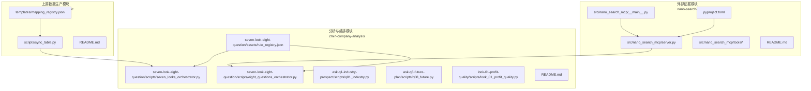
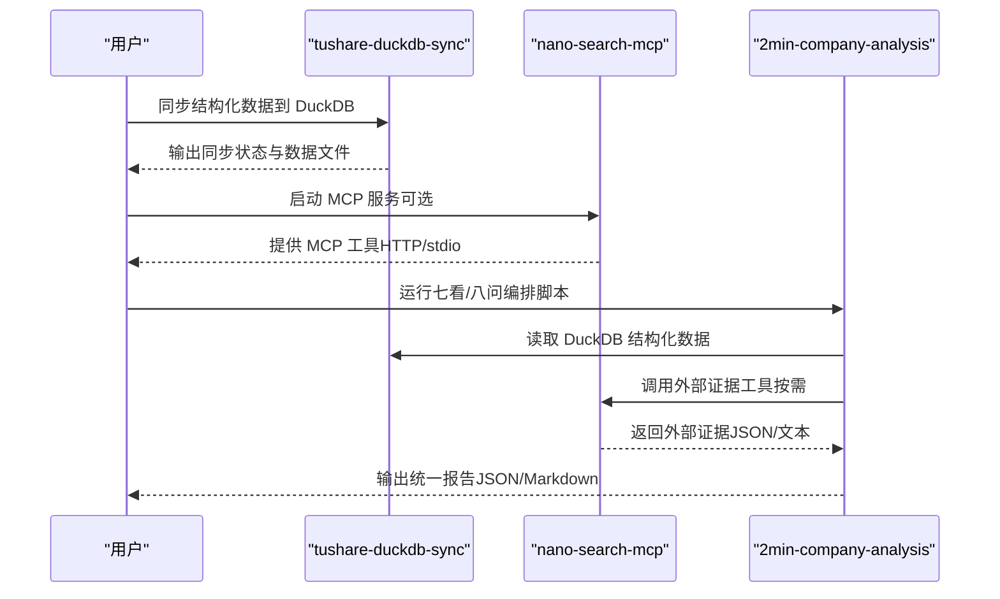
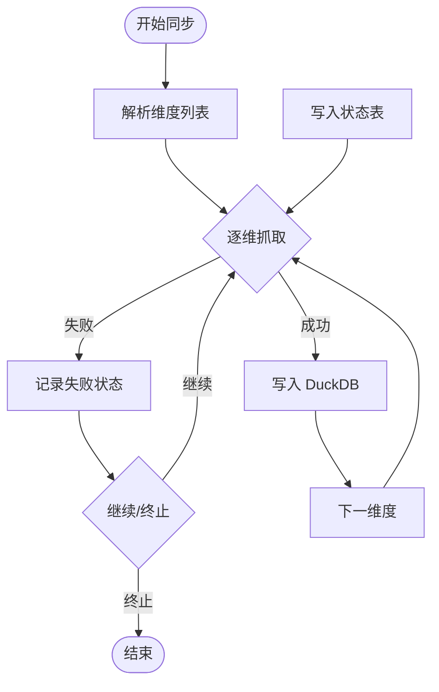
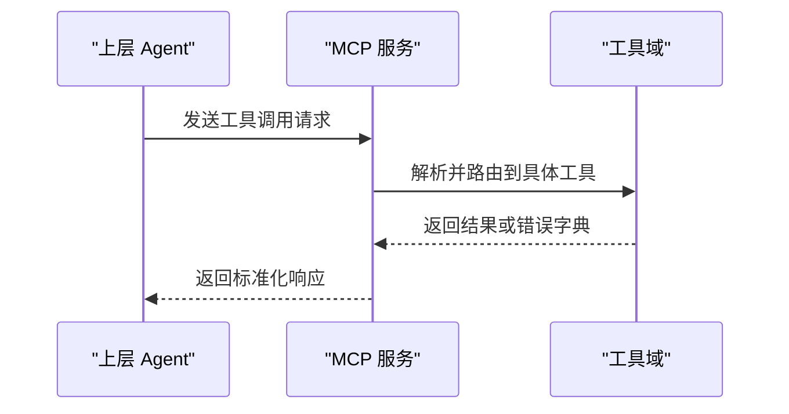
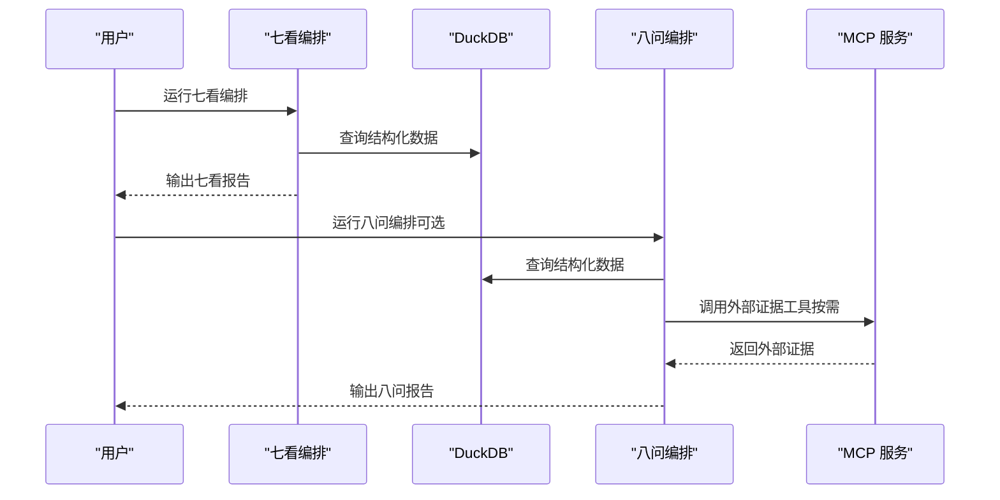

# 模块依赖关系

<cite>
**本文引用的文件**
- [2min-company-analysis/README.md](file://2min-company-analysis/README.md)
- [nano-search-mcp/README.md](file://nano-search-mcp/README.md)
- [tushare-duckdb-sync/README.md](file://tushare-duckdb-sync/README.md)
- [seven_looks_orchestrator.py](file://2min-company-analysis/seven-look-eight-question/scripts/seven_looks_orchestrator.py)
- [eight_questions_orchestrator.py](file://2min-company-analysis/seven-look-eight-question/scripts/eight_questions_orchestrator.py)
- [rule_registry.json](file://2min-company-analysis/seven-look-eight-question/assets/rule_registry.json)
- [server.py](file://nano-search-mcp/src/nano_search_mcp/server.py)
- [__main__.py](file://nano-search-mcp/src/nano_search_mcp/__main__.py)
- [sync_table.py](file://tushare-duckdb-sync/scripts/sync_table.py)
- [mapping_registry.json](file://tushare-duckdb-sync/templates/mapping_registry.json)
- [pyproject.toml](file://nano-search-mcp/pyproject.toml)
</cite>

## 目录
1. [简介](#简介)
2. [项目结构](#项目结构)
3. [核心组件](#核心组件)
4. [架构总览](#架构总览)
5. [详细组件分析](#详细组件分析)
6. [依赖关系分析](#依赖关系分析)
7. [性能考量](#性能考量)
8. [故障排除指南](#故障排除指南)
9. [结论](#结论)
10. [附录](#附录)

## 简介
本文件聚焦于 nano_quant_skills 仓库中三个核心子模块的模块依赖关系与协作模式，明确推荐的依赖链路：tushare-duckdb-sync → nano-search-mcp → 2min-company-analysis。  
- tushare-duckdb-sync：上游数据生产模块，负责将 Tushare Pro 数据同步到本地 DuckDB，提供结构化财务/行情/基本面数据。
- nano-search-mcp：外部证据模块，提供 MCP 服务，用于检索与抓取公告、年报正文、行业政策、研报、IR 纪要、监管处罚等非结构化外部证据。
- 2min-company-analysis：分析与编排模块，基于 DuckDB 结构化数据与可选的外部证据，执行“七看八问”量化分析与报告编排。

推荐流程与职责边界如下：
- 数据底座：tushare-duckdb-sync 必须先行，确保 DuckDB 中具备所需结构化数据。
- 外部证据：nano-search-mcp 可选增强，启用外部证据取证链路时建议安装并启动。
- 分析编排：2min-company-analysis 读取 DuckDB 数据，必要时调用外部证据模块，最终输出统一的 JSON/Markdown 报告。

章节来源
- [2min-company-analysis/README.md:103-132](file://2min-company-analysis/README.md#L103-L132)
- [nano-search-mcp/README.md:7-16](file://nano-search-mcp/README.md#L7-L16)
- [tushare-duckdb-sync/README.md:5-12](file://tushare-duckdb-sync/README.md#L5-L12)

## 项目结构
仓库采用按功能域划分的模块化结构：
- tushare-duckdb-sync：数据同步与质量检查脚本，模板与配置文件。
- nano-search-mcp：MCP 服务实现，工具模块与测试。
- 2min-company-analysis：七看八问的规则与编排脚本、资产与技能文档。

图表来源
- [seven_looks_orchestrator.py:50-61](file://2min-company-analysis/seven-look-eight-question/scripts/seven_looks_orchestrator.py#L50-L61)
- [eight_questions_orchestrator.py:22-38](file://2min-company-analysis/seven-look-eight-question/scripts/eight_questions_orchestrator.py#L22-L38)
- [server.py:18-70](file://nano-search-mcp/src/nano_search_mcp/server.py#L18-L70)
- [sync_table.py:451-458](file://tushare-duckdb-sync/scripts/sync_table.py#L451-L458)
- [mapping_registry.json:1-16](file://tushare-duckdb-sync/templates/mapping_registry.json#L1-L16)
- [pyproject.toml:1-44](file://nano-search-mcp/pyproject.toml#L1-L44)

章节来源
- [2min-company-analysis/README.md:19-57](file://2min-company-analysis/README.md#L19-L57)
- [nano-search-mcp/README.md:178-198](file://nano-search-mcp/README.md#L178-L198)
- [tushare-duckdb-sync/README.md:13-173](file://tushare-duckdb-sync/README.md#L13-L173)

## 核心组件
- tushare-duckdb-sync
  - 职责：将 Tushare Pro 数据同步到 DuckDB，支持全量覆盖与增量追加；维护同步状态表；提供数据质量检查脚本。
  - 关键文件：scripts/sync_table.py、templates/mapping_registry.json、README.md。
  - 依赖：tushare、duckdb、pandas、loguru。
- nano-search-mcp
  - 职责：提供 MCP 服务，注册 12 个工具域（通用检索、定期报告、临时公告、行业研报、监管处罚、投资者关系、行业政策），支持 streamable HTTP 与 stdio 传输。
  - 关键文件：src/nano_search_mcp/server.py、src/nano_search_mcp/__main__.py、README.md、pyproject.toml。
  - 依赖：mcp[cli]、httpx、playwright、beautifulsoup4、markdownify。
- 2min-company-analysis
  - 职责：七看（定量规则）与八问（定性证据）的编排与执行；基于规则注册表动态加载子规则；可选调用外部证据模块；输出统一报告。
  - 关键文件：seven_looks_orchestrator.py、eight_questions_orchestrator.py、assets/rule_registry.json、README.md。
  - 依赖：Python 标准库与第三方库（详见各脚本与 README）。

章节来源
- [tushare-duckdb-sync/README.md:13-173](file://tushare-duckdb-sync/README.md#L13-L173)
- [nano-search-mcp/README.md:178-198](file://nano-search-mcp/README.md#L178-L198)
- [2min-company-analysis/README.md:1-132](file://2min-company-analysis/README.md#L1-L132)

## 架构总览
推荐的依赖链路与数据流如下：

图表来源
- [seven_looks_orchestrator.py:170-245](file://2min-company-analysis/seven-look-eight-question/scripts/seven_looks_orchestrator.py#L170-L245)
- [eight_questions_orchestrator.py:119-164](file://2min-company-analysis/seven-look-eight-question/scripts/eight_questions_orchestrator.py#L119-L164)
- [server.py:83-87](file://nano-search-mcp/src/nano_search_mcp/server.py#L83-L87)
- [sync_table.py:451-518](file://tushare-duckdb-sync/scripts/sync_table.py#L451-L518)

章节来源
- [2min-company-analysis/README.md:103-132](file://2min-company-analysis/README.md#L103-L132)
- [nano-search-mcp/README.md:79-104](file://nano-search-mcp/README.md#L79-L104)
- [tushare-duckdb-sync/README.md:13-46](file://tushare-duckdb-sync/README.md#L13-L46)

## 详细组件分析

### 组件 A：tushare-duckdb-sync（上游数据生产模块）
- 实现要点
  - 同步状态管理：在 DuckDB 内维护 table_sync_state 表，支持断点续传与失败追踪。
  - 维度解析：支持 none/trade_date/period 三种维度，按交易日与报告期推进。
  - 错误处理：统一结构化异常，支持重试与空 payload 保护。
  - CLI：支持单任务与批量任务，参数丰富，便于自动化与运维。
- 数据结构与复杂度
  - 同步状态表 schema：包含 source_table、dimension_type、dimension_value、is_sync、error_message、updated_at。
  - 时间复杂度：按维度遍历，每次抓取与写入受网络与 DuckDB 写入性能影响。
- 优化机会
  - 批量写入与列类型推断可进一步减少类型转换开销。
  - 异常重试策略可结合指数退避与熔断。
- 错误处理
  - 对 trade_date 维度默认应用发布截止规则，避免“当日数据未发布”导致的误判。
  - 允许通过参数放宽空 payload 的处理策略。

图表来源
- [sync_table.py:265-288](file://tushare-duckdb-sync/scripts/sync_table.py#L265-L288)
- [sync_table.py:294-338](file://tushare-duckdb-sync/scripts/sync_table.py#L294-L338)
- [sync_table.py:405-445](file://tushare-duckdb-sync/scripts/sync_table.py#L405-L445)
- [sync_table.py:451-518](file://tushare-duckdb-sync/scripts/sync_table.py#L451-L518)

章节来源
- [tushare-duckdb-sync/README.md:13-173](file://tushare-duckdb-sync/README.md#L13-L173)
- [sync_table.py:451-518](file://tushare-duckdb-sync/scripts/sync_table.py#L451-L518)

### 组件 B：nano-search-mcp（外部证据模块）
- 实现要点
  - MCP 服务：FastMCP 实例，注册 12 个工具域，提供统一指令说明与错误契约。
  - 工具域：通用检索（search、fetch_page、search_deferred_topic）、定期报告（get_company_report）、临时公告、行业研报、监管处罚、投资者关系、行业政策。
  - 安全基线：URL 白名单校验、SSRF 防护、指数退避重试与限频。
- 交互模式
  - 作为 MCP 服务：通过 streamable HTTP 或 stdio 传输，供上层 Agent 调用。
  - 作为 Python 包：可直接导入 server.app 或 server.mcp，或通过命令行入口启动。
- 错误契约
  - 除 search 与 get_company_report 在参数非法或网络失败时抛异常外，其余工具失败时统一返回包含 source、error、fetch_time 的字典。

图表来源
- [server.py:18-70](file://nano-search-mcp/src/nano_search_mcp/server.py#L18-L70)
- [server.py:83-87](file://nano-search-mcp/src/nano_search_mcp/server.py#L83-L87)
- [__main__.py:9-12](file://nano-search-mcp/src/nano_search_mcp/__main__.py#L9-L12)

章节来源
- [nano-search-mcp/README.md:28-67](file://nano-search-mcp/README.md#L28-L67)
- [nano-search-mcp/README.md:126-125](file://nano-search-mcp/README.md#L126-L125)
- [server.py:18-70](file://nano-search-mcp/src/nano_search_mcp/server.py#L18-L70)

### 组件 C：2min-company-analysis（分析与编排模块）
- 实现要点
  - 七看编排：seven_looks_orchestrator.py 顺序执行 7 个 look 规则，收集中间 JSON，汇总为综合报告；对 look-04/05 若缺少年报文本包则标记 human-in-loop。
  - 八问编排：eight_questions_orchestrator.py 动态加载 rule_registry.json 中的 8 个问题脚本，支持并发执行与跨验证。
  - 规则注册：assets/rule_registry.json 描述每个规则的依赖表、派生指标、脚本路径与测试状态。
- 数据流向
  - 读取 DuckDB：所有 look 规则与八问问题脚本均以 DuckDB 为数据源。
  - 外部证据：当启用外部证据时，八问模块可调用 MCP 工具获取公告、年报、研报、IR 纪要、监管处罚、行业政策等证据。
- 输出约定
  - 统一输出 JSON/Markdown，包含评分、摘要、证据清单与人类介入请求。

图表来源
- [seven_looks_orchestrator.py:170-245](file://2min-company-analysis/seven-look-eight-question/scripts/seven_looks_orchestrator.py#L170-L245)
- [eight_questions_orchestrator.py:119-164](file://2min-company-analysis/seven-look-eight-question/scripts/eight_questions_orchestrator.py#L119-L164)
- [rule_registry.json:1-410](file://2min-company-analysis/seven-look-eight-question/assets/rule_registry.json#L1-L410)

章节来源
- [2min-company-analysis/README.md:58-132](file://2min-company-analysis/README.md#L58-L132)
- [seven_looks_orchestrator.py:170-245](file://2min-company-analysis/seven-look-eight-question/scripts/seven_looks_orchestrator.py#L170-L245)
- [eight_questions_orchestrator.py:119-164](file://2min-company-analysis/seven-look-eight-question/scripts/eight_questions_orchestrator.py#L119-L164)
- [rule_registry.json:1-410](file://2min-company-analysis/seven-look-eight-question/assets/rule_registry.json#L1-L410)

## 依赖关系分析
- 模块耦合与协作
  - 2min-company-analysis 与 tushare-duckdb-sync：强耦合（DuckDB 为唯一数据源），通过规则注册表与脚本路径解耦。
  - 2min-company-analysis 与 nano-search-mcp：弱耦合（可选外部证据），通过 MCP 工具接口与统一错误契约解耦。
  - nano-search-mcp 内部：工具域之间低耦合，通过 FastMCP 统一注册与路由。
- 外部依赖
  - tushare-duckdb-sync：依赖 tushare、duckdb、pandas、loguru。
  - nano-search-mcp：依赖 mcp[cli]、httpx、playwright、beautifulsoup4、markdownify。
- 依赖链路
  - 推荐链路：tushare-duckdb-sync → nano-search-mcp → 2min-company-analysis。
  - 可选增强：仅在需要外部证据时引入 nano-search-mcp。

图表来源
- [2min-company-analysis/README.md:103-107](file://2min-company-analysis/README.md#L103-L107)
- [nano-search-mcp/README.md:13-16](file://nano-search-mcp/README.md#L13-L16)
- [tushare-duckdb-sync/README.md:9-11](file://tushare-duckdb-sync/README.md#L9-L11)

章节来源
- [pyproject.toml:6-14](file://nano-search-mcp/pyproject.toml#L6-L14)
- [tushare-duckdb-sync/README.md:13-173](file://tushare-duckdb-sync/README.md#L13-L173)
- [nano-search-mcp/README.md:178-198](file://nano-search-mcp/README.md#L178-L198)

## 性能考量
- 数据同步
  - 增量维度采用断点续传，减少重复抓取；合理设置 sleep 与重试参数以平衡吞吐与限流。
  - 交易日安全截止规则避免“当日数据未发布”导致的无效重试。
- 外部证据
  - MCP 工具调用建议设置合理的超时时间，覆盖最慢的 fetch_page/get_company_report。
  - 并发执行八问问题时，注意工具调用的限频与资源占用。
- 编排执行
  - 七看与八问分别采用子进程与线程池并发，注意系统资源与超时控制。

章节来源
- [tushare-duckdb-sync/README.md:40-46](file://tushare-duckdb-sync/README.md#L40-L46)
- [nano-search-mcp/README.md:104-104](file://nano-search-mcp/README.md#L104-L104)
- [eight_questions_orchestrator.py:124-125](file://2min-company-analysis/seven-look-eight-question/scripts/eight_questions_orchestrator.py#L124-L125)

## 故障排除指南
- 数据同步失败
  - 检查 TUSHARE_TOKEN 是否设置；确认网络可达与接口权限。
  - 查看同步状态表记录，定位失败维度与错误信息。
  - 对 trade_date 维度，确认发布截止时间与 end-date 设置。
- MCP 服务不可用
  - 确认服务已启动（streamable HTTP 或 stdio），并检查端口与超时设置。
  - 对工具调用失败，遵循统一错误契约，记录 source、error、fetch_time 以便定位。
- 编排执行异常
  - 七看/八问子脚本输出不符合 JSON 契约时，编排会捕获异常并记录错误。
  - 对 human-in-loop 场景，根据提示补充年报文本包或外部证据。

章节来源
- [sync_table.py:90-96](file://tushare-duckdb-sync/scripts/sync_table.py#L90-L96)
- [server.py:55-57](file://nano-search-mcp/src/nano_search_mcp/server.py#L55-L57)
- [seven_looks_orchestrator.py:211-244](file://2min-company-analysis/seven-look-eight-question/scripts/seven_looks_orchestrator.py#L211-L244)
- [eight_questions_orchestrator.py:132-151](file://2min-company-analysis/seven-look-eight-question/scripts/eight_questions_orchestrator.py#L132-L151)

## 结论
本仓库通过清晰的模块边界与可插拔的外部证据链路，构建了从结构化数据到底层证据再到统一报告的完整量化分析流水线。推荐的依赖链路 tushare-duckdb-sync → nano-search-mcp → 2min-company-analysis，既保证了数据底座的稳定性，又提供了灵活的外部证据增强能力。模块间通过规则注册表、MCP 工具契约与统一输出格式实现了解耦与扩展，便于后续新增规则与证据源。

## 附录
- 安装与启动
  - tushare-duckdb-sync：安装依赖后设置 TUSHARE_TOKEN，运行同步脚本。
  - nano-search-mcp：安装后可启动 MCP 服务或作为 Python 包导入；可选安装 dev 依赖进行测试。
  - 2min-company-analysis：在仓库根目录安装后，可直接运行七看/八问编排脚本。

章节来源
- [tushare-duckdb-sync/README.md:15-39](file://tushare-duckdb-sync/README.md#L15-L39)
- [nano-search-mcp/README.md:17-27](file://nano-search-mcp/README.md#L17-L27)
- [2min-company-analysis/README.md:109-114](file://2min-company-analysis/README.md#L109-L114)