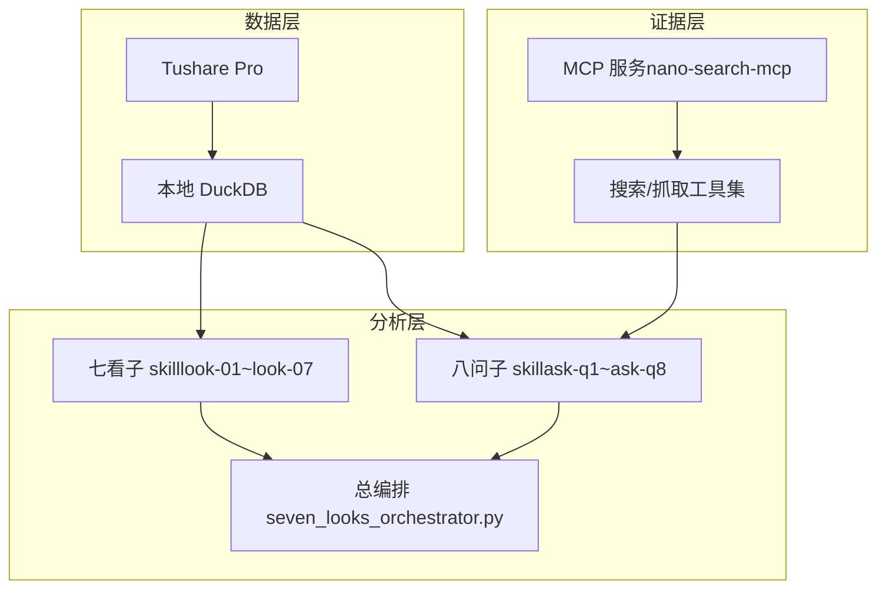
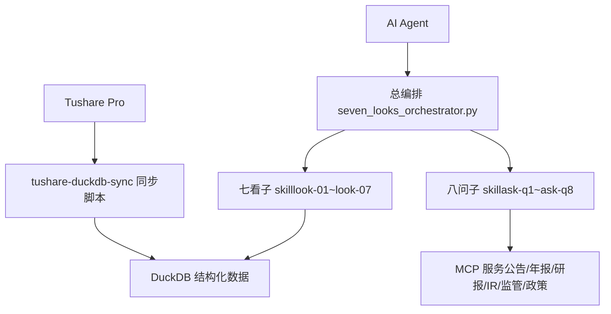
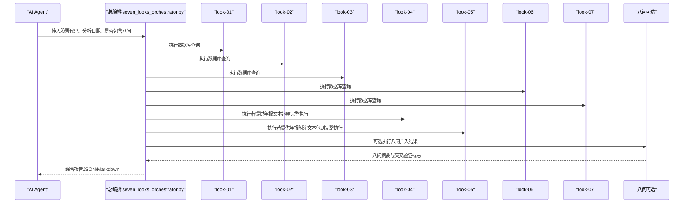
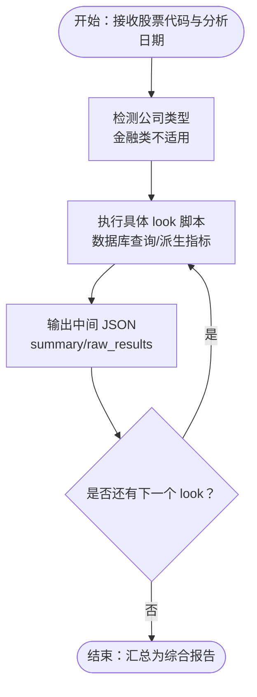
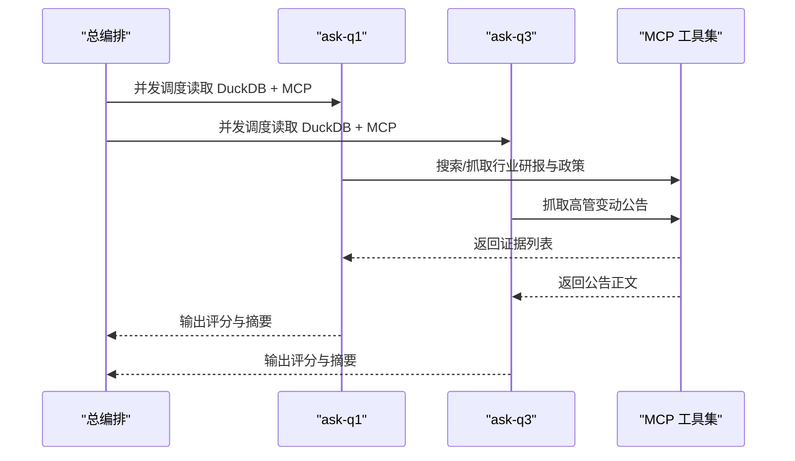
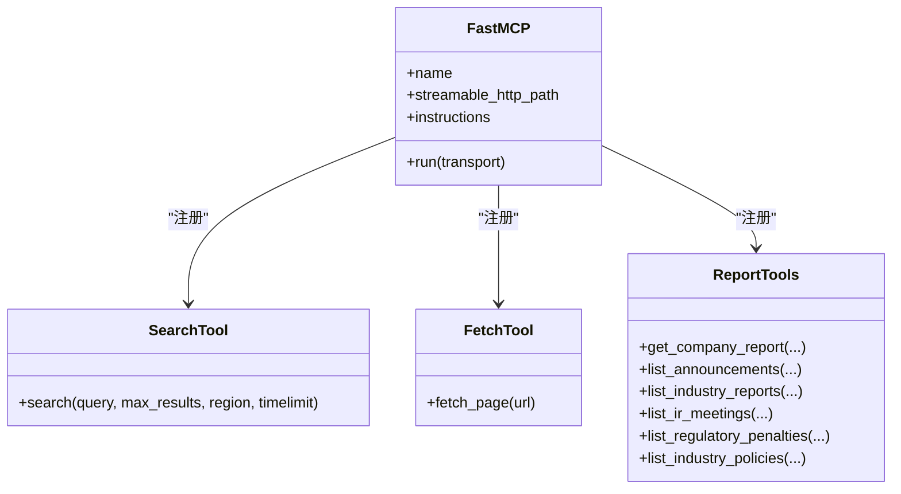
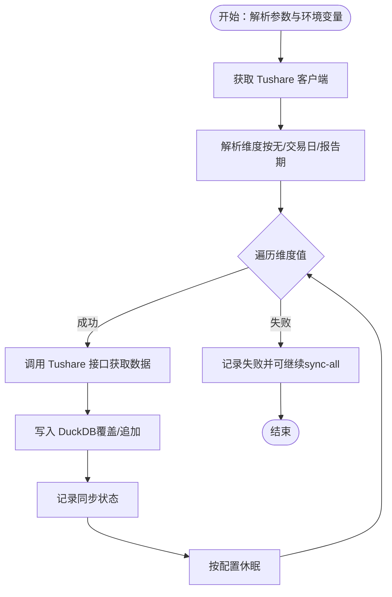
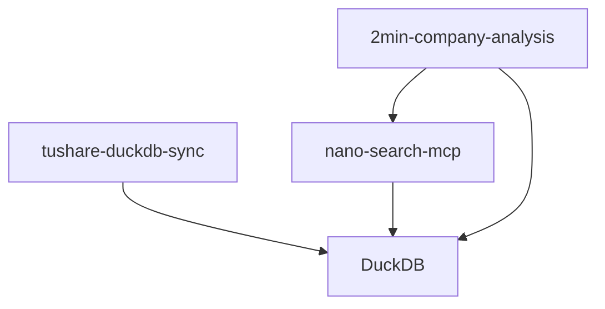

# 项目介绍

<cite>
**本文档引用的文件**
- [README.md](file://README.md)
- [2min-company-analysis/README.md](file://2min-company-analysis/README.md)
- [2min-company-analysis/seven-look-eight-question/SKILL.md](file://2min-company-analysis/seven-look-eight-question/SKILL.md)
- [2min-company-analysis/look-01-profit-quality/SKILL.md](file://2min-company-analysis/look-01-profit-quality/SKILL.md)
- [2min-company-analysis/ask-q1-industry-prospect/SKILL.md](file://2min-company-analysis/ask-q1-industry-prospect/SKILL.md)
- [2min-company-analysis/ask-q3-management/SKILL.md](file://2min-company-analysis/ask-q3-management/SKILL.md)
- [2min-company-analysis/seven-look-eight-question/scripts/seven_looks_orchestrator.py](file://2min-company-analysis/seven-look-eight-question/scripts/seven_looks_orchestrator.py)
- [2min-company-analysis/look-01-profit-quality/scripts/common.py](file://2min-company-analysis/look-01-profit-quality/scripts/common.py)
- [nano-search-mcp/README.md](file://nano-search-mcp/README.md)
- [nano-search-mcp/src/nano_search_mcp/server.py](file://nano-search-mcp/src/nano_search_mcp/server.py)
- [nano-search-mcp/src/nano_search_mcp/tools/search.py](file://nano-search-mcp/src/nano_search_mcp/tools/search.py)
- [tushare-duckdb-sync/README.md](file://tushare-duckdb-sync/README.md)
- [tushare-duckdb-sync/scripts/sync_table.py](file://tushare-duckdb-sync/scripts/sync_table.py)
- [tushare-duckdb-sync/templates/mapping_registry.json](file://tushare-duckdb-sync/templates/mapping_registry.json)
- [2min-company-analysis/seven-look-eight-question/assets/rule_registry.json](file://2min-company-analysis/seven-look-eight-question/assets/rule_registry.json)
</cite>

## 目录
1. [引言](#引言)
2. [项目结构](#项目结构)
3. [核心组件](#核心组件)
4. [架构总览](#架构总览)
5. [详细组件分析](#详细组件分析)
6. [依赖关系分析](#依赖关系分析)
7. [性能考量](#性能考量)
8. [故障排查指南](#故障排查指南)
9. [结论](#结论)
10. [附录](#附录)

## 引言
NanoQuant Skills 是一个面向 AI Agent 的量化分析技能仓库，旨在为 AI 代理提供可复用、可组合、可维护的专业量化分析能力。项目围绕“七看八问”高效财务分析框架，提供从结构化数据到外部证据的完整分析链路，帮助 AI Agent 快速、稳定地完成 A 股上市公司的结构化基本面快审与定性证据补充。

本项目的核心价值在于：
- **模块化分层设计**：将上游数据生产、外部证据检索与分析编排解耦，便于独立演进与替换。
- **可复用的技能目录**：每个 look/ask 与总编排均为独立技能，既可单独执行，也可在更高层编排中组合使用。
- **可审计的输出契约**：统一的中间 JSON 与最终报告格式，支持自动化消费与人工复核。
- **可扩展的证据来源**：通过 MCP 服务模块接入公告、年报、行业研报、IR 纪要、监管处罚、行业政策等外部证据。

## 项目结构
项目采用模块化分层架构，包含三大子模块：
- 数据同步模块（tushare-duckdb-sync）：负责将 Tushare Pro 数据同步到本地 DuckDB，形成结构化数据底座。
- 外部证据模块（nano-search-mcp）：提供 MCP 服务，按能力域提供搜索与抓取工具，补充年报、公告、研报、IR、监管与政策等非结构化证据。
- 分析编排模块（2min-company-analysis）：封装“七看八问”15 个子 skill 与 1 个总编排 skill，统一产出可复核的 JSON/Markdown 报告。

图表来源
- [README.md:1-103](file://README.md#L1-L103)
- [2min-company-analysis/README.md:1-132](file://2min-company-analysis/README.md#L1-L132)
- [nano-search-mcp/README.md:1-198](file://nano-search-mcp/README.md#L1-L198)
- [tushare-duckdb-sync/README.md:1-173](file://tushare-duckdb-sync/README.md#L1-L173)

章节来源
- [README.md:1-103](file://README.md#L1-L103)
- [2min-company-analysis/README.md:1-132](file://2min-company-analysis/README.md#L1-L132)

## 核心组件
- 数据同步模块（tushare-duckdb-sync）
  - 作用：将 Tushare Pro 的结构化数据同步到本地 DuckDB，支持全量覆盖与增量追加，内置断点续传与安全截止规则。
  - 关键特性：按维度类型（无维度、交易日、报告期）同步；维护同步状态表；提供数据质量检查工具。
- 外部证据模块（nano-search-mcp）
  - 作用：提供 MCP 服务，按能力域注册工具，覆盖搜索、抓取、定期报告、公告、行业研报、IR、监管处罚、行业政策等。
  - 关键特性：统一错误契约；安全基线（URL 白名单、SSRF 防护、指数退避重试与限频）；支持 streamable HTTP 与 stdio 传输。
- 分析编排模块（2min-company-analysis）
  - 作用：封装“七看八问”15 个子 skill 与 1 个总编排 skill，统一产出可复核的 JSON/Markdown 报告。
  - 关键特性：七看独立执行、半自动（look-04/05 需年报文本）、可选接入八问；统一评分与行动建议；支持人类在环（human-in-loop）提示。

章节来源
- [tushare-duckdb-sync/README.md:1-173](file://tushare-duckdb-sync/README.md#L1-L173)
- [nano-search-mcp/README.md:1-198](file://nano-search-mcp/README.md#L1-L198)
- [2min-company-analysis/README.md:1-132](file://2min-company-analysis/README.md#L1-L132)

## 架构总览
本项目通过“数据底座 + 外部证据 + 分析编排”的三层架构，为 AI Agent 提供专业、稳健、可审计的量化分析能力。数据层确保结构化指标的完整性与一致性；证据层补充非结构化证据以完善定性分析；编排层将多个子 skill 组合为统一报告，支持自动化与人工复核。

图表来源
- [2min-company-analysis/seven-look-eight-question/scripts/seven_looks_orchestrator.py:1-800](file://2min-company-analysis/seven-look-eight-question/scripts/seven_looks_orchestrator.py#L1-L800)
- [nano-search-mcp/src/nano_search_mcp/server.py:1-91](file://nano-search-mcp/src/nano_search_mcp/server.py#L1-L91)
- [tushare-duckdb-sync/scripts/sync_table.py:1-618](file://tushare-duckdb-sync/scripts/sync_table.py#L1-L618)

## 详细组件分析

### 总编排组件（seven_looks_orchestrator.py）
总编排脚本负责统一调度七看与可选八问，收集中间 JSON，汇总为综合报告，并生成行动建议与质量评分。其执行流程分为四个阶段：
- 阶段 1（自动）：执行 look-01/02/03/06/07（纯数据库查询，无需外部输入）
- 阶段 2（半自动）：执行 look-04/05（若未提供年报文本包则标记 human-in-loop）
- 阶段 3（汇总）：合并 7 份中间 JSON → 红旗预警 + 质量评分
- 阶段 4（评语）：附加量化评语 + 最多 3 条行动建议

图表来源
- [2min-company-analysis/seven-look-eight-question/scripts/seven_looks_orchestrator.py:1-800](file://2min-company-analysis/seven-look-eight-question/scripts/seven_looks_orchestrator.py#L1-L800)

章节来源
- [2min-company-analysis/seven-look-eight-question/SKILL.md:1-201](file://2min-company-analysis/seven-look-eight-question/SKILL.md#L1-L201)
- [2min-company-analysis/seven-look-eight-question/scripts/seven_looks_orchestrator.py:1-800](file://2min-company-analysis/seven-look-eight-question/scripts/seven_looks_orchestrator.py#L1-L800)

### 七看组件（look-01 ~ look-07）
七看覆盖定量财务分析的七个关键维度，每个 look 为独立 skill，具备稳定的输入输出契约与可审计的中间产物。例如：
- look-01：盈收与利润质量（关注净现比、自由现金流、毛利率趋势等）
- look-02：费用成本结构（关注四费率与费用增速/营收增速匹配度）
- look-03：增长率趋势（关注 CAGR 与增长模式识别）
- look-04：业务构成与市场分布（依赖年报文本，半自动）
- look-05：资产负债健康度（关注杠杆与现金流覆盖）
- look-06：投入产出效率（关注营运资金/收入、人均效率）
- look-07：收益率与资本回报（杜邦 ROE 分解）

图表来源
- [2min-company-analysis/look-01-profit-quality/scripts/common.py:1-153](file://2min-company-analysis/look-01-profit-quality/scripts/common.py#L1-L153)
- [2min-company-analysis/look-01-profit-quality/SKILL.md:1-69](file://2min-company-analysis/look-01-profit-quality/SKILL.md#L1-L69)

章节来源
- [2min-company-analysis/look-01-profit-quality/SKILL.md:1-69](file://2min-company-analysis/look-01-profit-quality/SKILL.md#L1-L69)
- [2min-company-analysis/ask-q3-management/SKILL.md:1-67](file://2min-company-analysis/ask-q3-management/SKILL.md#L1-L67)

### 八问组件（ask-q1 ~ ask-q8）
八问聚焦定性证据与专家判断，覆盖行业前景、竞争优势、管理层、财务真实性、市场地位、商业模式、风险因素与未来规划等主题。每个 ask 为独立 skill，可单独执行，亦可在总编排中并发调度。例如：
- ask-q1：行业前景与市场规模（基于政策与研报的情绪与密度评分）
- ask-q3：管理团队与股权结构（关注高管变动、股权集中度与治理风险）

图表来源
- [2min-company-analysis/ask-q1-industry-prospect/SKILL.md:1-101](file://2min-company-analysis/ask-q1-industry-prospect/SKILL.md#L1-L101)
- [2min-company-analysis/ask-q3-management/SKILL.md:1-67](file://2min-company-analysis/ask-q3-management/SKILL.md#L1-L67)
- [nano-search-mcp/src/nano_search_mcp/server.py:1-91](file://nano-search-mcp/src/nano_search_mcp/server.py#L1-L91)

章节来源
- [2min-company-analysis/ask-q1-industry-prospect/SKILL.md:1-101](file://2min-company-analysis/ask-q1-industry-prospect/SKILL.md#L1-L101)
- [2min-company-analysis/ask-q3-management/SKILL.md:1-67](file://2min-company-analysis/ask-q3-management/SKILL.md#L1-L67)

### 外部证据模块（nano-search-mcp）
MCP 服务提供 12 个工具，按能力域注册，统一错误契约与安全基线。典型调用流程包括：搜索、抓取页面、获取定期报告、列表查询等。服务支持 streamable HTTP 与 stdio 两种传输方式，便于与不同类型的 MCP 客户端集成。

图表来源
- [nano-search-mcp/src/nano_search_mcp/server.py:1-91](file://nano-search-mcp/src/nano_search_mcp/server.py#L1-L91)
- [nano-search-mcp/src/nano_search_mcp/tools/search.py:1-119](file://nano-search-mcp/src/nano_search_mcp/tools/search.py#L1-L119)

章节来源
- [nano-search-mcp/README.md:1-198](file://nano-search-mcp/README.md#L1-L198)
- [nano-search-mcp/src/nano_search_mcp/server.py:1-91](file://nano-search-mcp/src/nano_search_mcp/server.py#L1-L91)

### 数据同步模块（tushare-duckdb-sync）
该模块负责将 Tushare Pro 的结构化数据同步到本地 DuckDB，支持三种维度类型（无维度、交易日、报告期），内置断点续传与安全截止规则，避免在数据未发布时误判成功。同步状态记录在 DuckDB 内部的 table_sync_state 表中，支持失败追踪与空 payload 保护。

图表来源
- [tushare-duckdb-sync/scripts/sync_table.py:1-618](file://tushare-duckdb-sync/scripts/sync_table.py#L1-L618)

章节来源
- [tushare-duckdb-sync/README.md:1-173](file://tushare-duckdb-sync/README.md#L1-L173)
- [tushare-duckdb-sync/templates/mapping_registry.json:1-16](file://tushare-duckdb-sync/templates/mapping_registry.json#L1-L16)

## 依赖关系分析
项目模块之间的依赖关系清晰，推荐依赖链路为：数据同步模块 → 外部证据模块 → 分析编排模块。这种分层设计使得各模块可独立演进，同时通过统一的输出契约与配置文件实现松耦合集成。

图表来源
- [README.md:5-11](file://README.md#L5-L11)
- [2min-company-analysis/README.md:103-107](file://2min-company-analysis/README.md#L103-L107)

章节来源
- [README.md:1-103](file://README.md#L1-L103)
- [2min-company-analysis/README.md:1-132](file://2min-company-analysis/README.md#L1-L132)

## 性能考量
- 数据同步
  - 交易日安全截止：默认在 18:00 后同步当日数据，避免空 payload 误判成功。
  - 断点续传：通过同步状态表记录维度值，支持失败重试与跳过已同步维度。
  - 限频与重试：对 Tushare 接口调用进行指数退避与最大重试次数控制。
- 外部证据
  - 统一错误契约：失败时返回字典而非抛异常，便于上层统一处理。
  - SSRF 防护与白名单：限制域名与协议，防止 SSRF 攻击。
  - Playwright 渲染：支持动态页面抓取，提高正文提取成功率。
- 分析编排
  - 并行执行：七看与八问可并发调度，缩短总执行时间。
  - 人类在环提示：对需要年报文本的 look-04/05 提示补充证据，避免无效重试。

## 故障排查指南
- 数据同步失败
  - 检查 TUSHARE_TOKEN 是否正确设置；确认网络可达与接口权限。
  - 查看同步状态表（table_sync_state）中的失败记录，定位具体维度值。
  - 对于交易日维度，确认是否在 18:00 前执行且未传入 --end-date。
- 外部证据抓取异常
  - 检查 MCP 服务是否正常启动（streamable HTTP 或 stdio）。
  - 确认 Playwright 已安装并可渲染页面；查看 SSRF 防护日志。
  - 对于搜索工具，确认百炼 WebSearch 的 API Key 与网络访问权限。
- 分析编排报错
  - 查看七看/八问子脚本的 JSON 输出是否符合预期；必要时开启 --output-dir 查看中间文件。
  - 对于 look-04/05，确认是否提供了年报文本包；根据 human-in-loop 提示补充证据。
  - 检查公司类型前检（金融类不适用）是否导致某些 look 返回 not-applicable。

章节来源
- [tushare-duckdb-sync/README.md:116-173](file://tushare-duckdb-sync/README.md#L116-L173)
- [nano-search-mcp/README.md:160-198](file://nano-search-mcp/README.md#L160-L198)
- [2min-company-analysis/seven-look-eight-question/SKILL.md:188-201](file://2min-company-analysis/seven-look-eight-question/SKILL.md#L188-L201)

## 结论
NanoQuant Skills 通过模块化分层架构，为 AI Agent 提供了可复用、可组合、可维护的量化分析能力。数据同步模块确保结构化数据的完整性与一致性，外部证据模块补充非结构化证据以完善定性分析，分析编排模块将多个子 skill 组合为统一报告。该设计既适合初学者快速上手，也为有经验的开发者提供了足够的技术深度与扩展空间。

## 附录
- 适用场景与目标用户
  - 量化分析师：使用七看八问框架进行结构化与定性分析，快速筛选目标公司。
  - 数据工程师：基于模块化设计进行数据管道与工具链集成，保障数据质量与稳定性。
  - 研究人员：利用 MCP 服务与外部证据模块，构建跨源证据采集与交叉验证流程。
- 快速开始
  - 安装并同步 DuckDB 数据，安装并启动 MCP 服务，最后执行总编排脚本，即可获得统一的 JSON/Markdown 报告。