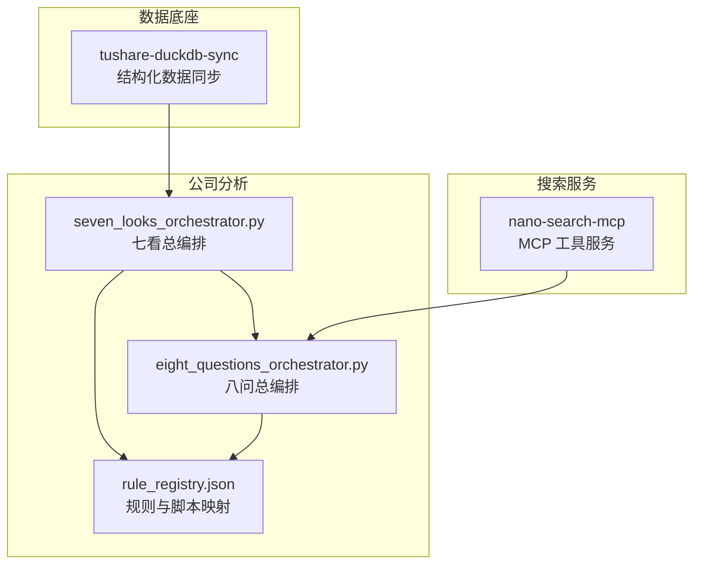
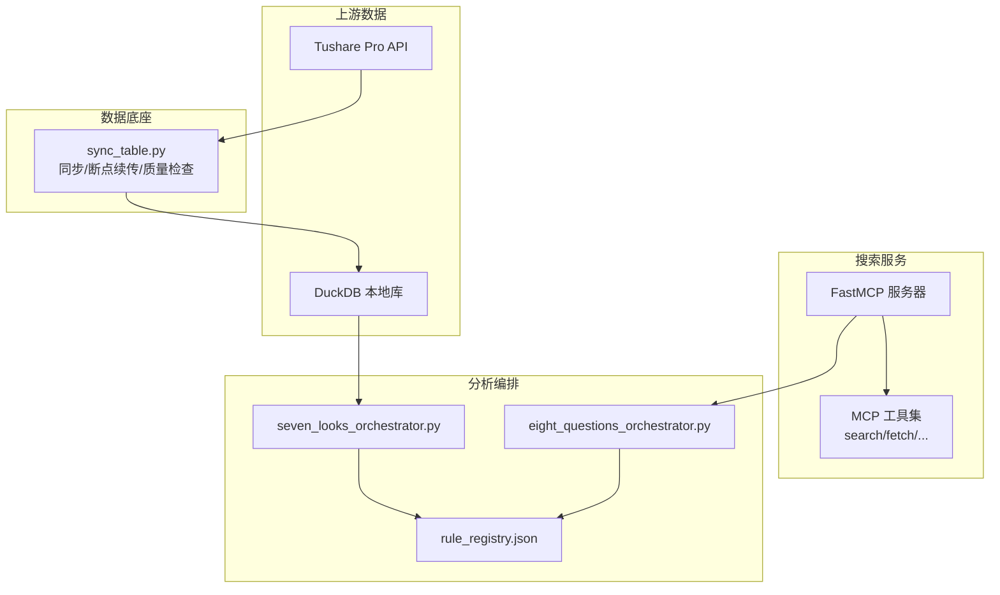
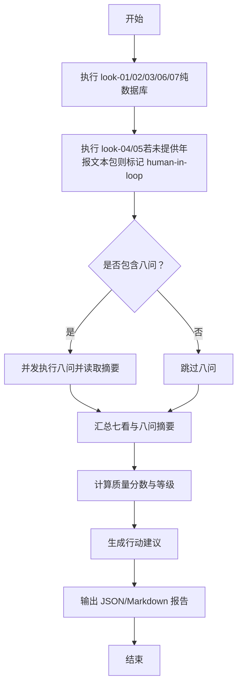
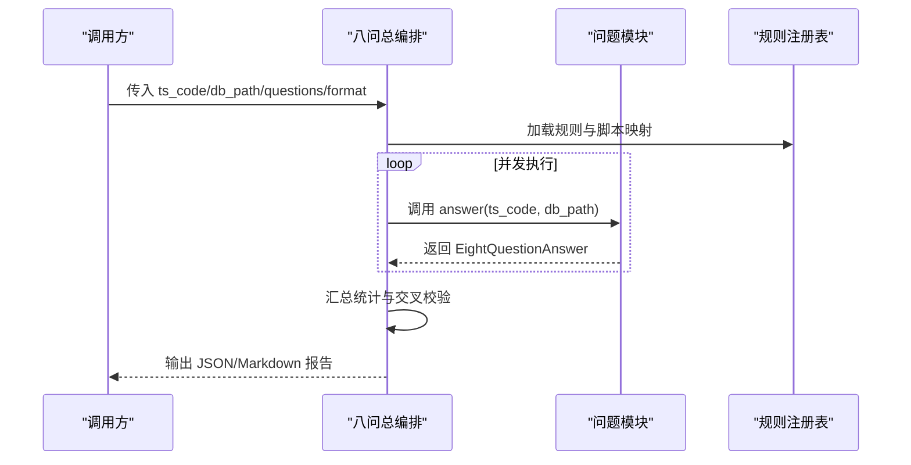
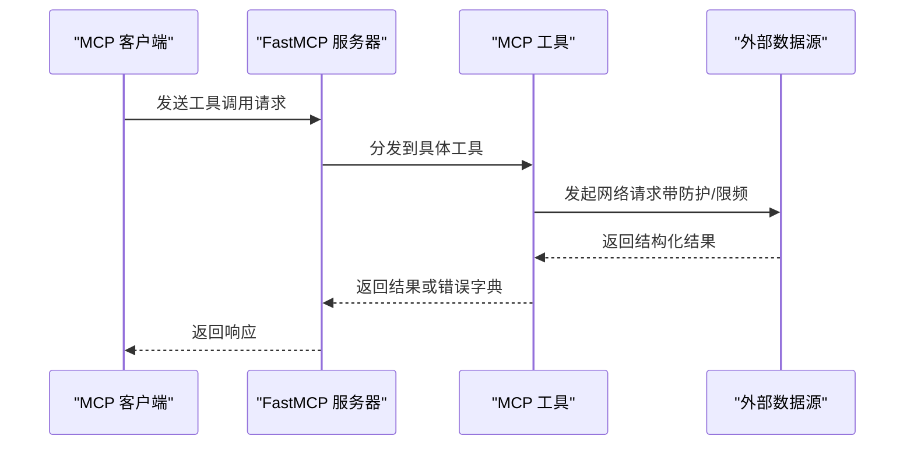
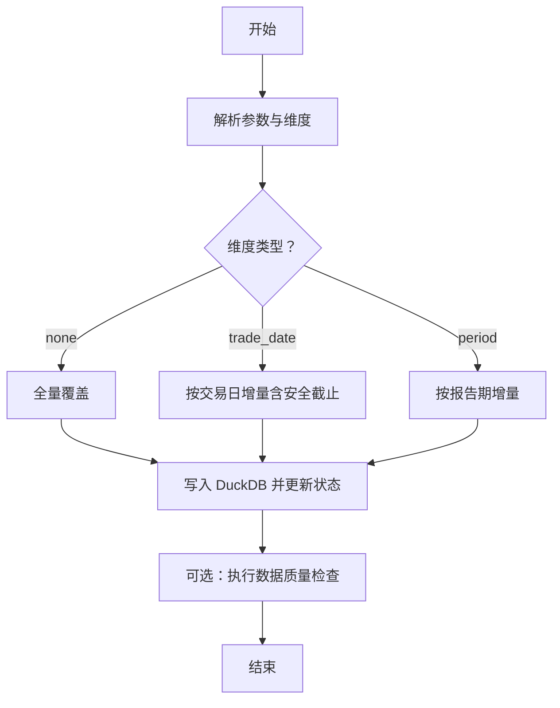
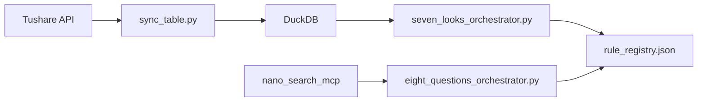

# 项目概述

<cite>
**本文引用的文件**
- [2min-company-analysis/README.md](file://2min-company-analysis/README.md)
- [nano-search-mcp/README.md](file://nano-search-mcp/README.md)
- [tushare-duckdb-sync/README.md](file://tushare-duckdb-sync/README.md)
- [2min-company-analysis/seven-look-eight-question/SKILL.md](file://2min-company-analysis/seven-look-eight-question/SKILL.md)
- [2min-company-analysis/seven-look-eight-question/scripts/seven_looks_orchestrator.py](file://2min-company-analysis/seven-look-eight-question/scripts/seven_looks_orchestrator.py)
- [2min-company-analysis/seven-look-eight-question/scripts/eight_questions_orchestrator.py](file://2min-company-analysis/seven-look-eight-question/scripts/eight_questions_orchestrator.py)
- [2min-company-analysis/seven-look-eight-question/assets/rule_registry.json](file://2min-company-analysis/seven-look-eight-question/assets/rule_registry.json)
- [2min-company-analysis/look-01-profit-quality/SKILL.md](file://2min-company-analysis/look-01-profit-quality/SKILL.md)
- [2min-company-analysis/look-01-profit-quality/scripts/look_01_profit_quality.py](file://2min-company-analysis/look-01-profit-quality/scripts/look_01_profit_quality.py)
- [nano-search-mcp/src/nano_search_mcp/server.py](file://nano-search-mcp/src/nano_search_mcp/server.py)
- [nano-search-mcp/src/nano_search_mcp/tools/search.py](file://nano-search-mcp/src/nano_search_mcp/tools/search.py)
- [tushare-duckdb-sync/scripts/sync_table.py](file://tushare-duckdb-sync/scripts/sync_table.py)
- [nano-search-mcp/pyproject.toml](file://nano-search-mcp/pyproject.toml)
- [tushare-duckdb-sync/SKILL.md](file://tushare-duckdb-sync/SKILL.md)
</cite>

## 目录
1. [简介](#简介)
2. [项目结构](#项目结构)
3. [核心组件](#核心组件)
4. [架构总览](#架构总览)
5. [详细组件分析](#详细组件分析)
6. [依赖分析](#依赖分析)
7. [性能考虑](#性能考虑)
8. [故障排除指南](#故障排除指南)
9. [结论](#结论)
10. [附录](#附录)

## 简介
NanoQuant Skills 是一个面向 A 股公司的量化分析与证据采集基础设施，围绕三大子模块协同工作：  
- 数据底座：tushare-duckdb-sync，负责结构化数据的同步与质量治理  
- 搜索服务：nano-search-mcp，提供 MCP 工具化的外部证据采集（公告、年报、研报、政策、IR 等）  
- 公司分析：2min-company-analysis，基于“七看八问”框架对 A 股公司进行结构化财务快审与定性证据整合  

项目的价值主张在于为 AI Agent 提供“可复核、可溯源、可扩展”的量化分析技能组合：  
- 以结构化 DuckDB 数据为“七看”提供稳健的数据库查询基础  
- 以 MCP 搜索服务为“八问”提供标准化外部证据采集能力  
- 以统一的编排与汇总流程，输出结构化报告与行动建议，支撑 Agent 的决策闭环

## 项目结构
仓库采用“多模块 MonoRepo”组织方式，三大子模块既可独立运行，又通过统一的编排与契约协同工作：

图表来源
- [2min-company-analysis/seven-look-eight-question/scripts/seven_looks_orchestrator.py:1-120](file://2min-company-analysis/seven-look-eight-question/scripts/seven_looks_orchestrator.py#L1-L120)
- [2min-company-analysis/seven-look-eight-question/scripts/eight_questions_orchestrator.py:1-120](file://2min-company-analysis/seven-look-eight-question/scripts/eight_questions_orchestrator.py#L1-L120)
- [2min-company-analysis/seven-look-eight-question/assets/rule_registry.json:1-60](file://2min-company-analysis/seven-look-eight-question/assets/rule_registry.json#L1-L60)
- [nano-search-mcp/src/nano_search_mcp/server.py:1-91](file://nano-search-mcp/src/nano_search_mcp/server.py#L1-L91)
- [tushare-duckdb-sync/scripts/sync_table.py:1-120](file://tushare-duckdb-sync/scripts/sync_table.py#L1-L120)

章节来源
- [2min-company-analysis/README.md:1-132](file://2min-company-analysis/README.md#L1-L132)
- [nano-search-mcp/README.md:1-198](file://nano-search-mcp/README.md#L1-L198)
- [tushare-duckdb-sync/README.md:1-173](file://tushare-duckdb-sync/README.md#L1-L173)

## 核心组件
- 数据底座（tushare-duckdb-sync）  
  - 职责：将 Tushare Pro 数据同步到本地 DuckDB，支持全量覆盖与增量追加；维护同步状态与数据质量快照；提供自包含的同步与质检脚本。  
  - 关键特性：三种维度类型（无维度/交易日/报告期）、断点续传、交易日安全截止、字段对齐与日期类型转换、日志事件与错误结构化。  
  - 适用场景：为“七看”提供稳定的财务/行情/基本面数据源。  

- 搜索服务（nano-search-mcp）  
  - 职责：提供 MCP 工具化的外部证据采集能力，覆盖公告、年报、行业研报、政策、IR 等。  
  - 关键特性：12 个 MCP 工具域、统一错误契约、SSRF 防护、Playwright 渲染、可作为服务或 SDK 使用。  
  - 适用场景：为“八问”提供标准化外部证据采集与抓取。  

- 公司分析（2min-company-analysis）  
  - 职责：以“七看八问”框架对 A 股公司进行结构化财务快审与定性证据整合，输出统一报告与行动建议。  
  - 关键特性：七看（定量规则）与八问（定性证据）双轨并行；总编排脚本统一执行、汇总与评分；支持人类介入与证据缺口提示。  
  - 适用场景：AI Agent 的“财务分析 + 外部证据取证”一体化工作流。

章节来源
- [tushare-duckdb-sync/README.md:1-173](file://tushare-duckdb-sync/README.md#L1-L173)
- [nano-search-mcp/README.md:1-198](file://nano-search-mcp/README.md#L1-L198)
- [2min-company-analysis/README.md:1-132](file://2min-company-analysis/README.md#L1-L132)
- [2min-company-analysis/seven-look-eight-question/SKILL.md:1-201](file://2min-company-analysis/seven-look-eight-question/SKILL.md#L1-L201)

## 架构总览
整体架构以“数据底座 + 搜索服务 + 公司分析”的分层设计实现模块解耦与能力复用：

图表来源
- [tushare-duckdb-sync/scripts/sync_table.py:1-120](file://tushare-duckdb-sync/scripts/sync_table.py#L1-L120)
- [nano-search-mcp/src/nano_search_mcp/server.py:1-91](file://nano-search-mcp/src/nano_search_mcp/server.py#L1-L91)
- [2min-company-analysis/seven-look-eight-question/scripts/seven_looks_orchestrator.py:1-120](file://2min-company-analysis/seven-look-eight-question/scripts/seven_looks_orchestrator.py#L1-L120)
- [2min-company-analysis/seven-look-eight-question/scripts/eight_questions_orchestrator.py:1-120](file://2min-company-analysis/seven-look-eight-question/scripts/eight_questions_orchestrator.py#L1-L120)
- [2min-company-analysis/seven-look-eight-question/assets/rule_registry.json:1-60](file://2min-company-analysis/seven-look-eight-question/assets/rule_registry.json#L1-L60)

## 详细组件分析

### 七看总编排（seven_looks_orchestrator.py）
- 功能要点  
  - 顺序执行七看规则（look-01 ~ look-07），收集中间 JSON，汇总为综合财务质量报告  
  - 支持人类介入（human-in-loop）：当 look-04/05 依赖年报文本时，提示补充证据  
  - 八问并入：可选并发调度八问，将摘要与证据缺口合并进最终输出  
  - 质量评分：基于红灯/警告数量计算分数与等级  
  - 行动建议：根据分析结果生成最多三条下一步建议  

- 关键流程（简化）

图表来源
- [2min-company-analysis/seven-look-eight-question/scripts/seven_looks_orchestrator.py:1-120](file://2min-company-analysis/seven-look-eight-question/scripts/seven_looks_orchestrator.py#L1-L120)
- [2min-company-analysis/seven-look-eight-question/scripts/seven_looks_orchestrator.py:170-245](file://2min-company-analysis/seven-look-eight-question/scripts/seven_looks_orchestrator.py#L170-L245)
- [2min-company-analysis/seven-look-eight-question/scripts/seven_looks_orchestrator.py:655-687](file://2min-company-analysis/seven-look-eight-question/scripts/seven_looks_orchestrator.py#L655-L687)

章节来源
- [2min-company-analysis/seven-look-eight-question/SKILL.md:58-104](file://2min-company-analysis/seven-look-eight-question/SKILL.md#L58-L104)
- [2min-company-analysis/seven-look-eight-question/scripts/seven_looks_orchestrator.py:1-120](file://2min-company-analysis/seven-look-eight-question/scripts/seven_looks_orchestrator.py#L1-L120)

### 八问总编排（eight_questions_orchestrator.py）
- 功能要点  
  - 通过规则注册表动态加载八问模块，按问题 ID 并发执行  
  - 统一汇总平均评级、加权平均评级、状态分布、人类介入请求与关键证据缺口  
  - 支持 Markdown/JSON 输出，并提供交叉校验能力（如与 look-01 的现金流指标联动）  

- 关键流程（简化）

图表来源
- [2min-company-analysis/seven-look-eight-question/scripts/eight_questions_orchestrator.py:1-120](file://2min-company-analysis/seven-look-eight-question/scripts/eight_questions_orchestrator.py#L1-L120)
- [2min-company-analysis/seven-look-eight-question/scripts/eight_questions_orchestrator.py:119-164](file://2min-company-analysis/seven-look-eight-question/scripts/eight_questions_orchestrator.py#L119-L164)
- [2min-company-analysis/seven-look-eight-question/assets/rule_registry.json:1-60](file://2min-company-analysis/seven-look-eight-question/assets/rule_registry.json#L1-L60)

章节来源
- [2min-company-analysis/seven-look-eight-question/SKILL.md:1-201](file://2min-company-analysis/seven-look-eight-question/SKILL.md#L1-L201)
- [2min-company-analysis/seven-look-eight-question/scripts/eight_questions_orchestrator.py:1-120](file://2min-company-analysis/seven-look-eight-question/scripts/eight_questions_orchestrator.py#L1-L120)

### 搜索服务（nano-search-mcp）
- 功能要点  
  - 提供 12 个 MCP 工具：通用检索、定期报告、临时公告、行业研报、监管处罚、投资者关系、行业政策等  
  - 统一错误契约：除特定工具外，失败时返回字典而非抛异常  
  - 安全基线：域名白名单、SSRF 防护、指数退避与限频  
  - 启动方式：HTTP 流式传输或 stdio，便于与 MCP 客户端集成  

- 关键流程（简化）

图表来源
- [nano-search-mcp/src/nano_search_mcp/server.py:1-91](file://nano-search-mcp/src/nano_search_mcp/server.py#L1-L91)
- [nano-search-mcp/src/nano_search_mcp/tools/search.py:1-119](file://nano-search-mcp/src/nano_search_mcp/tools/search.py#L1-L119)

章节来源
- [nano-search-mcp/README.md:1-198](file://nano-search-mcp/README.md#L1-L198)
- [nano-search-mcp/src/nano_search_mcp/server.py:1-91](file://nano-search-mcp/src/nano_search_mcp/server.py#L1-L91)
- [nano-search-mcp/src/nano_search_mcp/tools/search.py:1-119](file://nano-search-mcp/src/nano_search_mcp/tools/search.py#L1-L119)

### 数据底座（tushare-duckdb-sync）
- 功能要点  
  - 支持三种维度：无维度（全量覆盖）、交易日（增量）、报告期（增量）  
  - 断点续传：维护 table_sync_state 表记录同步状态  
  - 安全截止：交易日维度默认 18:00 截止，避免“当日数据未发布”误判  
  - 字段对齐：自动丢弃目标表不存在的列，日期列自动转换  
  - 质检脚本：提供数据质量快照与检查项清单  

- 关键流程（简化）

图表来源
- [tushare-duckdb-sync/scripts/sync_table.py:265-288](file://tushare-duckdb-sync/scripts/sync_table.py#L265-L288)
- [tushare-duckdb-sync/scripts/sync_table.py:451-518](file://tushare-duckdb-sync/scripts/sync_table.py#L451-L518)

章节来源
- [tushare-duckdb-sync/README.md:1-173](file://tushare-duckdb-sync/README.md#L1-L173)
- [tushare-duckdb-sync/scripts/sync_table.py:1-120](file://tushare-duckdb-sync/scripts/sync_table.py#L1-L120)

### 示例：规则 1（盈收与利润质量）
- 作用：为“七看”提供稳健的数据库查询证据，支持单独迭代与复核  
- 关键口径：合并报表、年报、可见性控制、字段选择与派生指标  
- 输出：结构化证据表、缺失统计、派生指标摘要、适用性判断  

章节来源
- [2min-company-analysis/look-01-profit-quality/SKILL.md:1-69](file://2min-company-analysis/look-01-profit-quality/SKILL.md#L1-L69)
- [2min-company-analysis/look-01-profit-quality/scripts/look_01_profit_quality.py:1-120](file://2min-company-analysis/look-01-profit-quality/scripts/look_01_profit_quality.py#L1-L120)

## 依赖分析
- 模块间依赖关系  
  - 数据底座（tushare-duckdb-sync）为“七看”提供结构化数据，不依赖搜索服务  
  - 搜索服务（nano-search-mcp）为“八问”提供外部证据采集能力，不依赖数据底座  
  - 公司分析（2min-company-analysis）通过总编排脚本协调“七看”与“八问”，并依赖规则注册表进行模块加载  

- 技术栈概览  
  - Python 3.10+（搜索服务要求）  
  - DuckDB（本地 OLAP 存储）  
  - MCP（消息控制协议，用于搜索服务工具注册与调用）  
  - Playwright（网页抓取渲染）  
  - Tushare（数据源）  

- 依赖可视化

图表来源
- [tushare-duckdb-sync/scripts/sync_table.py:1-120](file://tushare-duckdb-sync/scripts/sync_table.py#L1-L120)
- [nano-search-mcp/src/nano_search_mcp/server.py:1-91](file://nano-search-mcp/src/nano_search_mcp/server.py#L1-L91)
- [2min-company-analysis/seven-look-eight-question/scripts/seven_looks_orchestrator.py:1-120](file://2min-company-analysis/seven-look-eight-question/scripts/seven_looks_orchestrator.py#L1-L120)
- [2min-company-analysis/seven-look-eight-question/scripts/eight_questions_orchestrator.py:1-120](file://2min-company-analysis/seven-look-eight-question/scripts/eight_questions_orchestrator.py#L1-L120)
- [2min-company-analysis/seven-look-eight-question/assets/rule_registry.json:1-60](file://2min-company-analysis/seven-look-eight-question/assets/rule_registry.json#L1-L60)

章节来源
- [nano-search-mcp/pyproject.toml:1-44](file://nano-search-mcp/pyproject.toml#L1-L44)
- [tushare-duckdb-sync/SKILL.md:1-449](file://tushare-duckdb-sync/SKILL.md#L1-L449)

## 性能考虑
- 并发执行  
  - 八问总编排默认 4 并发，可根据硬件与网络条件调整  
  - 七看总编排对独立规则采用子进程执行，避免阻塞并支持超时控制  
- I/O 与限频  
  - 搜索服务对网络请求采用指数退避与限频策略，降低外部服务压力  
  - 数据同步对 Tushare 调用设置 sleep 间隔与重试次数，避免限频  
- 存储与查询  
  - DuckDB 本地存储减少网络延迟；建议为日期列建立索引以优化范围查询  
  - 同步脚本自动对日期列进行类型转换，避免字符串比较带来的性能损耗  

## 故障排除指南
- 数据同步失败  
  - 检查 TUSHARE_TOKEN 是否正确设置；确认网络可达与接口权限  
  - 对交易日维度，若在 18:00 前执行且未传截止日，脚本会收敛到上一个开放交易日；必要时使用 `--allow-empty-result` 显式允许空结果  
  - 查看 `table_sync_state` 记录失败原因，定位具体维度值并重试  

- 搜索服务工具异常  
  - 通用工具失败时返回字典而非抛异常；检查网络与外部服务状态  
  - SSRF 防护导致抓取失败时，确认目标域名在白名单内（新浪财经、gov.cn）  

- 编排脚本错误  
  - 七看/八问脚本执行超时或返回非 JSON 输出时，查看标准错误与超时时间设置  
  - 规则注册表缺失或脚本路径错误会导致模块加载失败，检查 `rule_registry.json` 与脚本相对路径  

章节来源
- [tushare-duckdb-sync/scripts/sync_table.py:234-288](file://tushare-duckdb-sync/scripts/sync_table.py#L234-L288)
- [nano-search-mcp/src/nano_search_mcp/server.py:55-57](file://nano-search-mcp/src/nano_search_mcp/server.py#L55-L57)
- [2min-company-analysis/seven-look-eight-question/scripts/seven_looks_orchestrator.py:211-245](file://2min-company-analysis/seven-look-eight-question/scripts/seven_looks_orchestrator.py#L211-L245)

## 结论
NanoQuant Skills 通过“数据底座 + 搜索服务 + 公司分析”的模块化设计，为 AI Agent 提供了可复核、可扩展的量化分析能力：  
- 数据底座保障“七看”的结构化证据稳定可靠  
- 搜索服务提供标准化外部证据采集，增强“八问”的覆盖面  
- 统一编排与规则注册表确保模块间的松耦合与可演进  

推荐使用流程：  
1) 安装并初始化数据底座，同步所需结构化数据  
2) 安装搜索服务（可选增强），准备外部证据采集能力  
3) 运行“七看”总编排，得到结构化财务质量报告  
4) 可选运行“八问”总编排，将外部证据摘要与证据缺口合并进最终报告  
5) 基于报告与行动建议，进入估值与股东结构分析或进一步深挖

## 附录
- 推荐使用路径  
  - 总编排一键执行：七看 + 可选八问  
  - 单独执行某看/某问：便于调试与复核  
  - 仅七看：离线或仅依赖结构化数据的场景  
  - 仅八问：已具备结构化数据，需要外部证据补充  

章节来源
- [2min-company-analysis/README.md:58-132](file://2min-company-analysis/README.md#L58-L132)
- [2min-company-analysis/seven-look-eight-question/SKILL.md:188-201](file://2min-company-analysis/seven-look-eight-question/SKILL.md#L188-L201)